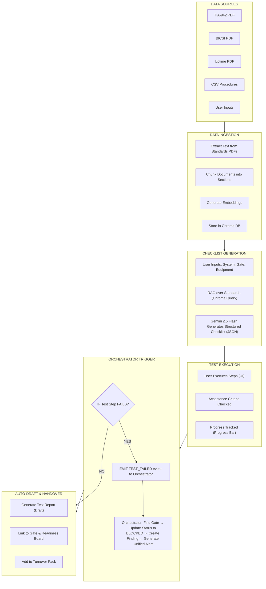

# Commissioning Quality Assurance Copilot — Complete Documentation

**Pramana Cx — ET AI Hackathon 2026**
**Date:** July 15, 2026
**Status:** Committed MVP Scope (Hackathon Build)

> **Scope specification, retained as written (15 July 2026).** This is one of the two agent specifications folded into [PLANNER/StructuredPlan.md](PLANNER/StructuredPlan.md) and reconciled by [PLANNER/CanonicalBuildPlan.md](PLANNER/CanonicalBuildPlan.md). It states intended scope, not shipped state, and it names Gemini 2.5 Flash directly — generation is now swappable across `mock | gemini | nim` via `MODEL_PROVIDER`, defaulting to a deterministic offline mock. For what is built and verified, see [STATUS.md](STATUS.md).

---

## 1. Agent Overview

### 1.1 Purpose
The Commissioning Quality Assurance Copilot guides engineers through Integrated System Testing (IST) with step-by-step checklists, auto-generates test records from described outcomes, flags results outside acceptance criteria, and tracks test completion against TIA-942/BICSI/Uptime standards. It serves as the intelligent assistant for field engineers during the critical final validation phase before handover.

### 1.2 Core Value Proposition
- **Intelligent Checklist Generation** — RAG over commissioning standards creates dynamic, context-aware test procedures
- **Guided Step Execution** — Step-by-step test instructions with pass/fail tracking
- **Acceptance Criteria Enforcement** — Auto-flags results outside specified tolerances
- **Auto-Drafted Test Records** — Generates professional test reports from described outcomes
- **Orchestrator Integration** — Test failures automatically trigger gate BLOCKED status and create findings

### 1.3 Key Differentiators

| Feature | Why It Matters |
|---|---|
| **RAG over Standards** | TIA-942, BICSI, Uptime Tier specs drive checklist generation |
| **Multimodal Input** | Upload test photos + Gemini Vision extracts readings |
| **Zero-API-Cost** | Gemini 2.5 Flash has free input + output tokens |
| **Orchestrator Cascade** | Test failure → Gate BLOCKED → Finding Created → Unified Alert |

### 1.4 Relation to Existing Plan

This agent implements the **Commissioning Quality Assurance Copilot** described in [StructuredPlan.md](PLANNER/StructuredPlan.md) under the Planned Agent Suite:

> *"Commissioning Quality Assurance Copilot — trained on data-centre commissioning standards (TIA-942, BICSI, Uptime Institute Tier specifications); guides engineers through integrated system testing sequences; auto-generates test records; flags non-conformances against acceptance criteria; builds the as-commissioned quality documentation package."*

**Scope relative to plan:** This implementation delivers all five capabilities (standards-driven guidance, IST sequencing, test record generation, acceptance-criteria flagging, and documentation packaging) using Gemini 2.5 Flash and RAG over ingested standards. It does not extend to automated telemetry validation or live BMS/EPMS data ingestion, which remain excluded per StructuredPlan §Gaps.

**Integration point:** Test failure events emitted by this agent flow into the existing Orchestrator event bus as `TEST_FAILED` events. The Orchestrator links the failed test to its associated gate, updates gate status to `BLOCKED`, and creates a `Finding` record — following the same typed-graph and audit-event patterns defined in StructuredPlan §2 (Core Workflow, steps 4–6).

### 1.5 AI-Advisory Boundary

Consistent with the platform’s core constraint — *"AI may extract, classify, map, summarize, and recommend; it cannot approve compliance, close an NCR, grant a waiver, sign a test, or set a gate to ready"* (StructuredPlan §1) — this agent operates in an **advisory-only** capacity:

- **Checklist generation is a proposal.** LLM-generated checklists are draft proposals that require human review and acceptance before use in field testing. A qualified commissioning engineer must verify that the generated steps are complete, correctly sequenced, and appropriate for the specific equipment and site conditions.
- **Acceptance criteria checking is deterministic where possible.** Numeric/threshold and boolean/presence checks use deterministic comparison logic (not LLM inference). Results are classified as `proposed_pass` or `proposed_fail` — **not** final verdicts — until confirmed by the executing engineer via the UI.
- **Narrative/qualitative checks always route to human review.** When acceptance criteria are non-numeric (e.g., "corrosion resistant", "suitable for outdoor use"), the LLM produces a similarity assessment with confidence score, always marked `needs_human_review`. It never auto-determines pass/fail for qualitative criteria.
- **Test reports are drafts.** Auto-generated reports are labelled "DRAFT — PENDING ENGINEER REVIEW" and must be explicitly approved by the executing engineer and, where required, an authorized witness before becoming part of the evidence record.
- **Gate status changes require human authorization.** A test completion (even with all steps passed) sets the gate to `PENDING_REVIEW`, not `READY`. Only an authorized approver (per RBAC role) can transition a gate to `READY` after reviewing all evidence, consistent with StructuredPlan §Core Workflow step 6.
- **The agent does not certify.** It cannot determine or issue TIA-942, BICSI, Uptime Tier, statutory, or contractual certification. It organizes evidence for review by the authorized body only, consistent with StructuredPlan §Product Boundary.

### 1.6 Licensing & Data Constraints

> **All commissioning standards referenced in this document (TIA-942, BICSI, Uptime Institute Tier specifications) are proprietary, copyrighted materials.** They must not be bundled into demos, prompts, embeddings, training data, or reusable templates without an appropriate licence (StructuredPlan §Product Boundary).

- **Hackathon prototype:** Uses small, clearly-labeled **synthetic "standard excerpts"** that mirror the real document structure (section/clause hierarchy, modality language, acceptance criteria format) but contain **no copyrighted content**. These are stored in `data/standards/` as JSON files, not PDFs, to make the synthetic nature unambiguous.
- **Production deployment:** Requires the customer to provide their own licensed standards PDFs and confirm machine-processing rights per project. The ingestion pipeline processes customer-authorized documents only — it does not include, redistribute, or cache proprietary standards content across tenants.
- **No pre-trained standards knowledge.** The LLM (Gemini 2.5 Flash) is used for structured output generation from retrieved context only. It is not fine-tuned on, and should not be prompted to recall, proprietary standards content from its training data. All standards knowledge must come from the RAG pipeline over explicitly ingested documents.
- **Standard clause citations must be verified.** The RAG pipeline attaches clause references from ingested chunks, but the LLM may hallucinate clause IDs that don’t exist in the ingested corpus. Citation verification against the source metadata is a required post-generation validation step (see Patch Note P3).

---

## 2. Complete Workflow

### 2.1 Phase 1: Standards & Procedure Ingestion

```
┌─────────────────────────────────────────────────────────────────────────────────────┐
│ STEP 1.1: Load Commissioning Standards                                             │
├─────────────────────────────────────────────────────────────────────────────────────┤
│                                                                                     │
│  ┌─────────────────────────────────────────────────────────────────────────────┐   │
│  │ STANDARDS DATA SOURCES:                                                     │   │
│  │                                                                             │   │
│  │  • PDF Files:  ────────────────────────────────────────────────────────────▶│   │
│  │    TIA-942, BICSI, Uptime Tier Standards                                   │   │
│  │                                                                             │   │
│  │  • CSV/JSON: ─────────────────────────────────────────────────────────────▶│   │
│  │    Pre-defined test procedures from previous projects                     │   │
│  │                                                                             │   │
│  │  • User Uploads: ─────────────────────────────────────────────────────────▶│   │
│  │    Project-specific test procedures                                       │   │
│  │                                                                             │   │
│  │  • Synthetic Standards (Hackathon): ────────────────────────────────────▶│   │
│  │    Clearly-labeled synthetic "standard excerpts" mirroring real structure │   │
│  └─────────────────────────────────────────────────────────────────────────────┘   │
│                                      │                                              │
│                                      ▼                                              │
│  ┌─────────────────────────────────────────────────────────────────────────────┐   │
│  │ STEP 1.2: Store Standards Data                                              │   │
│  │                                                                             │   │
│  │  • Chroma DB: Store chunks of standards documents with embeddings          │   │
│  │  • Vector Embeddings: Semantic search for relevant standards               │   │
│  │  • Metadata: Standard name, section, clause, version                      │   │
│  │  • Source Citations: Page number + bounding box coordinates               │   │
│  └─────────────────────────────────────────────────────────────────────────────┘   │
└─────────────────────────────────────────────────────────────────────────────────────┘
```

### 2.2 Phase 2: Checklist Generation

```
┌─────────────────────────────────────────────────────────────────────────────────────┐
│ STEP 2.1: User Inputs                                                              │
├─────────────────────────────────────────────────────────────────────────────────────┤
│                                                                                     │
│  ┌─────────────────────────────────────────────────────────────────────────────┐   │
│  │ USER PROVIDES:                                                              │   │
│  │                                                                             │   │
│  │  • System Type:  Electrical | Cooling | Controls | Mechanical              │   │
│  │  • Gate:         L1 | L2 | L3 | L4 | L5 | Custom                          │   │
│  │  • Equipment:    UPS-001 | GEN-003 | CT-007 | SW-001                      │   │
│  │  • Standards:    TIA-942 | BICSI | Uptime | Custom                        │   │
│  └─────────────────────────────────────────────────────────────────────────────┘   │
│                                      │                                              │
│                                      ▼                                              │
│  ┌─────────────────────────────────────────────────────────────────────────────┐   │
│  │ STEP 2.2: RAG over Standards                                                │   │
│  │                                                                             │   │
│  │  • Query: "IST checklist for {system_type} at {gate} gate per {standard}"  │   │
│  │  • Chroma returns relevant chunks from TIA-942, BICSI, Uptime             │   │
│  │  • Context includes: Acceptance criteria, test steps, equipment types     │   │
│  │  • Retrieve exact clause references for citation                          │   │
│  └─────────────────────────────────────────────────────────────────────────────┘   │
│                                      │                                              │
│                                      ▼                                              │
│  ┌─────────────────────────────────────────────────────────────────────────────┐   │
│  │ STEP 2.3: Generate Structured Checklist                                     │   │
│  │                                                                             │   │
│  │  ┌───────────────────────────────────────────────────────────────────────┐  │   │
│  │  │ Gemini 2.5 Flash generates JSON:                                     │  │   │
│  │  │                                                                     │  │   │
│  │  │ {                                                                   │  │   │
│  │  │   "test_name": "UPS Load Test at L4 Gate",                         │  │   │
│  │  │   "system": "UPS System 1",                                        │  │   │
│  │  │   "gate": "L4 - Integrated Test",                                 │  │   │
│  │  │   "standards": [                                                   │  │   │
│  │  │     {"name": "TIA-942", "clause": "4.2.1"},                      │  │   │
│  │  │     {"name": "BICSI", "clause": "6.3.2"}                         │  │   │
│  │  │   ],                                                               │  │   │
│  │  │   "steps": [                                                       │  │   │
│  │  │     {                                                              │  │   │
│  │  │       "id": 1,                                                     │  │   │
│  │  │       "instruction": "Connect load bank to UPS output",           │  │   │
│  │  │       "acceptance_criteria": {                                    │  │   │
│  │  │         "parameter": "Voltage",                                   │  │   │
│  │  │         "nominal": 480,                                           │  │   │
│  │  │         "unit": "V",                                              │  │   │
│  │  │         "tolerance_percent": 5                                    │  │   │
│  │  │       },                                                          │  │   │
│  │  │       "required": true,                                           │  │   │
│  │  │       "equipment": "Load Bank 100kW"                              │  │   │
│  │  │     }                                                              │  │   │
│  │  │   ]                                                                 │  │   │
│  │  │ }                                                                   │  │   │
│  │  └───────────────────────────────────────────────────────────────────────┘  │   │
│  └─────────────────────────────────────────────────────────────────────────────┘   │
└─────────────────────────────────────────────────────────────────────────────────────┘
```

### 2.3 Phase 3: Test Execution

```
┌─────────────────────────────────────────────────────────────────────────────────────┐
│ STEP 3.1: User Executes Test Steps                                                 │
├─────────────────────────────────────────────────────────────────────────────────────┤
│                                                                                     │
│  ┌─────────────────────────────────────────────────────────────────────────────┐   │
│  │ UI DISPLAY:                                                                 │   │
│  │                                                                             │   │
│  │  ┌───────────────────────────────────────────────────────────────────────┐  │   │
│  │  │ 🧪 UPS Load Test — L4 Gate                                            │  │   │
│  │  │ Standards: TIA-942 4.2.1, BICSI 6.3.2                               │  │   │
│  │  │                                                                     │  │   │
│  │  │ Steps:                                                               │  │   │
│  │  │                                                                     │  │   │
│  │  │ 1. ✅ Connect load bank to UPS output             | Pass            │  │   │
│  │  │ 2. ✅ Apply 25% load and measure voltage         | Pass            │  │   │
│  │  │ 3. 🔄 Apply 50% load and measure voltage         | In Progress     │  │   │
│  │  │    Result: [480 V]  |  Pass/Fail: [✅] [❌]                        │  │   │
│  │  │ 4. ⬜ Apply 75% load and measure voltage         | Pending         │  │   │
│  │  │ 5. ⬜ Apply 100% load and measure voltage        | Pending         │  │   │
│  │  │ 6. ⬜ Verify backup time                         | Pending         │  │   │
│  │  │                                                                     │  │   │
│  │  │ Progress: ████████████████████████████░░░░░░░░░░ 65%               │  │   │
│  │  │                                                                     │  │   │
│  │  │ [Save Step]  [Complete Test]                                       │  │   │
│  │  └───────────────────────────────────────────────────────────────────────┘  │   │
│  └─────────────────────────────────────────────────────────────────────────────┘   │
│                                      │                                              │
│                                      ▼                                              │
│  ┌─────────────────────────────────────────────────────────────────────────────┐   │
│  │ STEP 3.2: Acceptance Criteria Checking                                      │   │
│  │                                                                             │   │
│  │  ┌───────────────────────────────────────────────────────────────────────┐  │   │
│  │  │ Rule: Voltage within ±5% of nominal (480V)                          │  │   │
│  │  │                                                                     │  │   │
│  │  │ User enters: 430V                                                  │  │   │
│  │  │                                                                     │  │   │
│  │  │ Calculation:                                                        │  │   │
│  │  │   Tolerance = 480 * 0.05 = 24V                                    │  │   │
│  │  │   Range = 456V to 504V                                            │  │   │
│  │  │   430V is outside range → FAILED                                  │  │   │
│  │  │                                                                     │  │   │
│  │  │ Result: ❌ FAILED                                                  │  │   │
│  │  │ Message: "Voltage 430V outside ±5% tolerance (456V-504V)"        │  │   │
│  │  │ Confidence: 0.98                                                  │  │   │
│  │  └───────────────────────────────────────────────────────────────────────┘  │   │
│  └─────────────────────────────────────────────────────────────────────────────┘   │
└─────────────────────────────────────────────────────────────────────────────────────┘
```

### 2.4 Phase 4: Orchestrator Trigger (CRITICAL)

```
┌─────────────────────────────────────────────────────────────────────────────────────┐
│ STEP 4.1: Test Failure → Orchestrator Trigger                                      │
├─────────────────────────────────────────────────────────────────────────────────────┤
│                                                                                     │
│  ┌─────────────────────────────────────────────────────────────────────────────┐   │
│  │ IF Test Step FAILS:                                                         │   │
│  │                                                                             │   │
│  │  ┌───────────────────────────────────────────────────────────────────────┐  │   │
│  │  │ 1. Emit TEST_FAILED event to Orchestrator                           │  │   │
│  │  │                                                                     │  │   │
│  │  │ 2. Orchestrator finds Gate linked to this test                     │  │   │
│  │  │                                                                     │  │   │
│  │  │ 3. Orchestrator updates Gate status to BLOCKED                     │  │   │
│  │  │                                                                     │  │   │
│  │  │ 4. Orchestrator creates Finding/Blocker                           │  │   │
│  │  │                                                                     │  │   │
│  │  │ 5. Orchestrator generates UNIFIED ALERT                           │  │   │
│  │  └───────────────────────────────────────────────────────────────────────┘  │   │
│  └─────────────────────────────────────────────────────────────────────────────┘   │
│                                      │                                              │
│                                      ▼                                              │
│  ┌─────────────────────────────────────────────────────────────────────────────┐   │
│  │ STEP 4.2: Unified Alert Content                                             │   │
│  │                                                                             │   │
│  │  {                                                                         │   │
│  │    "type": "TEST_FAILED",                                                  │   │
│  │    "test_id": "T-038",                                                     │   │
│  │    "test_name": "UPS Load Test - L4 Gate",                                 │   │
│  │    "failed_step": {                                                        │   │
│  │      "id": 3,                                                              │   │
│  │      "instruction": "Apply 50% load and measure voltage",                 │   │
│  │      "expected": "456V-504V",                                              │   │
│  │      "actual": "430V"                                                      │   │
│  │    },                                                                      │   │
│  │    "failure_reason": "Voltage 430V outside ±5% tolerance (456V-504V)",    │   │
│  │    "gate_id": "G-004",                                                     │   │
│  │    "gate_name": "L4 - Integrated Test",                                   │   │
│  │    "finding_created": {                                                    │   │
│  │      "id": "F-023",                                                        │   │
│  │      "title": "UPS Load Test failed at Step 3",                           │   │
│  │      "severity": "high",                                                   │   │
│  │      "owner": "Priya Sharma",                                              │   │
│  │      "due_date": "2026-07-20"                                              │   │
│  │    }                                                                       │   │
│  │  }                                                                         │   │
│  └─────────────────────────────────────────────────────────────────────────────┘   │
└─────────────────────────────────────────────────────────────────────────────────────┘
```

### 2.5 Phase 5: Auto-Draft & Handover

```
┌─────────────────────────────────────────────────────────────────────────────────────┐
│ STEP 5.1: Auto-Draft Test Record                                                   │
├─────────────────────────────────────────────────────────────────────────────────────┤
│                                                                                     │
│  ┌─────────────────────────────────────────────────────────────────────────────┐   │
│  │ USER CLICKS: "Generate Report"                                               │   │
│  │                                                                             │   │
│  │  ┌───────────────────────────────────────────────────────────────────────┐  │   │
│  │  │ Gemini 2.5 Flash generates draft:                                   │  │   │
│  │  │                                                                     │  │   │
│  │  │ ───────────────────────────────────────────────────────────────────  │  │   │
│  │  │                   TEST REPORT — UPS Load Test                      │  │   │
│  │  │                                                                     │  │   │
│  │  │ Test ID: T-038                    Date: 2026-07-15                 │  │   │
│  │  │ Tester: Ravi Patel                System: UPS System 1             │  │   │
│  │  │ Gate: L4 - Integrated Test       Standards: TIA-942, BICSI        │  │   │
│  │  │                                                                     │  │   │
│  │  │ Results:                                                           │  │   │
│  │  │ ┌──────────────────────────────────────────────────────────────┐   │  │   │
│  │  │ │ Step │ Instruction                    │ Result │ Status    │   │  │   │
│  │  │ ├──────────────────────────────────────────────────────────────┤   │  │   │
│  │  │ │ 1    │ Connect load bank to UPS      │ N/A    │ ✅ Passed  │   │  │   │
│  │  │ │ 2    │ Apply 25% load                │ 481V   │ ✅ Passed  │   │  │   │
│  │  │ │ 3    │ Apply 50% load                │ 430V   │ ❌ FAILED  │   │  │   │
│  │  │ │ 4    │ Apply 75% load                │ N/A    │ ⬜ Not Exec │   │  │   │
│  │  │ │ 5    │ Apply 100% load               │ N/A    │ ⬜ Not Exec │   │  │   │
│  │  │ │ 6    │ Verify backup time            │ N/A    │ ⬜ Not Exec │   │  │   │
│  │  │ └──────────────────────────────────────────────────────────────┘   │  │   │
│  │  │                                                                     │  │   │
│  │  │ Overall Status: ❌ FAILED                                          │  │   │
│  │  │                                                                     │  │   │
│  │  │ Recommendations:                                                   │  │   │
│  │  │ 1. Investigate voltage drop at 50% load                          │  │   │
│  │  │ 2. Verify UPS capacity and load bank calibration                 │  │   │
│  │  │ 3. Retest after corrective actions                              │  │   │
│  │  ───────────────────────────────────────────────────────────────────  │  │   │
│  │  └───────────────────────────────────────────────────────────────────────┘  │   │
│  └─────────────────────────────────────────────────────────────────────────────┘   │
│                                      │                                              │
│                                      ▼                                              │
│  ┌─────────────────────────────────────────────────────────────────────────────┐   │
│  │ STEP 5.2: User Actions on Draft                                             │   │
│  │                                                                             │   │
│  │  • ✏️ Edit: Modify draft before finalizing                                │   │
│  │  • ✅ Approve: Mark as final test record                                   │   │
│  │  • 📤 Export: Download as PDF/Word/JSON                                   │   │
│  │  • 🔗 Link: Link to Gate and other evidence                               │   │
│  └─────────────────────────────────────────────────────────────────────────────┘   │
└─────────────────────────────────────────────────────────────────────────────────────┘
```

### 2.6 Phase 6: Completion & Turnover

```
┌─────────────────────────────────────────────────────────────────────────────────────┐
│ STEP 6.1: Test Completion                                                          │
├─────────────────────────────────────────────────────────────────────────────────────┤
│                                                                                     │
│  ┌─────────────────────────────────────────────────────────────────────────────┐   │
│  │ IF All Steps Pass:                                                          │   │
│  │                                                                             │   │
│  │  • Test status → PASSED                                                    │   │
│  │  • Gate status → READY (if all prerequisites met)                         │   │
│  │  • Evidence linked to gate                                                  │   │
│  │  • Test record added to turnover pack                                      │   │
│  │                                                                             │   │
│  │  ┌───────────────────────────────────────────────────────────────────────┐  │   │
│  │  │ 🟢 PASSED: UPS Load Test — L4 Gate                                   │  │   │
│  │  │    All 6 steps passed.                                               │  │   │
│  │  │    Gate L4 status: READY                                             │  │   │
│  │  │    [Generate Report]  [Link to Gate]  [Add to Turnover]            │  │   │
│  │  └───────────────────────────────────────────────────────────────────────┘  │   │
│  └─────────────────────────────────────────────────────────────────────────────┘   │
│                                      │                                              │
│                                      ▼                                              │
│  ┌─────────────────────────────────────────────────────────────────────────────┐   │
│  │ STEP 6.2: Evidence & Handover                                              │   │
│  │                                                                             │   │
│  │  • Test record stored as Evidence in Neo4j                                │   │
│  │  • Evidence linked to Requirements + Gate                                 │   │
│  │  • Readiness Board updates                                                 │   │
│  │  • Turnover Pack can include test record                                   │   │
│  └─────────────────────────────────────────────────────────────────────────────┘   │
└─────────────────────────────────────────────────────────────────────────────────────┘
```

### 2.7 Complete Workflow Diagram (Mermaid)



---

## 3. Architecture

### 3.1 High-Level Architecture

```
┌─────────────────────────────────────────────────────────────────────────────────────┐
│                COMMISSIONING COPILOT — ARCHITECTURE                                │
├─────────────────────────────────────────────────────────────────────────────────────┤
│                                                                                     │
│  ┌─────────────────────────────────────────────────────────────────────────────┐   │
│  │                         EXTERNAL DATA SOURCES                                │   │
│  │                                                                             │   │
│  │  ┌──────────────┐  ┌──────────────┐  ┌──────────────┐  ┌──────────────┐   │   │
│  │  │ TIA-942 PDF  │  │ BICSI PDF    │  │ Uptime PDF   │  │ CSV          │   │   │
│  │  │ (Licensed)   │  │ (Licensed)   │  │ (Licensed)   │  │ Procedures   │   │   │
│  │  └──────────────┘  └──────────────┘  └──────────────┘  └──────────────┘   │   │
│  └─────────────────────────────────────────────────────────────────────────────┘   │
│                                      │                                              │
│                                      ▼                                              │
│  ┌─────────────────────────────────────────────────────────────────────────────┐   │
│  │                         BACKEND (FastAPI + Python)                          │   │
│  │                                                                             │   │
│  │  ┌───────────────────────────────────────────────────────────────────────┐  │   │
│  │  │                        AGENT CORE                                      │  │   │
│  │  │                                                                       │  │   │
│  │  │  ┌─────────────────────────────────────────────────────────────────┐  │  │   │
│  │  │  │                    STANDARDS INGESTOR                         │  │  │   │
│  │  │  │  • PDF Text Extraction (PyMuPDF)                              │  │  │   │
│  │  │  │  • Chunking into Sections                                     │  │  │   │
│  │  │  │  • Embedding Generation (Gemini Embeddings)                   │  │  │   │
│  │  │  │  • Chroma DB Storage                                          │  │  │   │
│  │  │  └─────────────────────────────────────────────────────────────────┘  │  │   │
│  │  │                                                                       │  │   │
│  │  │  ┌─────────────────────────────────────────────────────────────────┐  │  │   │
│  │  │  │                    CHECKLIST GENERATOR                        │  │  │   │
│  │  │  │  • RAG Query over Chroma                                       │  │  │   │
│  │  │  │  • Gemini 2.5 Flash Structured Output                         │  │  │   │
│  │  │  │  • JSON Schema Validation                                     │  │  │   │
│  │  │  │  • Source Citations Attached                                   │  │  │   │
│  │  │  └─────────────────────────────────────────────────────────────────┘  │  │   │
│  │  │                                                                       │  │   │
│  │  │  ┌─────────────────────────────────────────────────────────────────┐  │  │   │
│  │  │  │                    ACCEPTANCE CHECKER                         │  │  │   │
│  │  │  │  • Numeric Tolerance Validation                               │  │  │   │
│  │  │  │  • Boolean Presence Checks                                    │  │  │   │
│  │  │  │  • LLM Semantic Comparison (Narrative)                       │  │  │   │
│  │  │  │  • Confidence Scoring                                         │  │  │   │
│  │  │  └─────────────────────────────────────────────────────────────────┘  │  │   │
│  │  │                                                                       │  │   │
│  │  │  ┌─────────────────────────────────────────────────────────────────┐  │  │   │
│  │  │  │                    REPORT GENERATOR                           │  │  │   │
│  │  │  │  • Gemini 2.5 Flash Draft Generation                          │  │  │   │
│  │  │  │  • PDF Export (ReportLab)                                     │  │  │   │
│  │  │  │  • Word Export (python-docx)                                  │  │  │   │
│  │  │  │  • JSON Export for Turnover                                   │  │  │   │
│  │  │  └─────────────────────────────────────────────────────────────────┘  │  │   │
│  │  └───────────────────────────────────────────────────────────────────────┘  │   │
│  │                                                                             │   │
│  │  ┌───────────────────────────────────────────────────────────────────────┐  │   │
│  │  │                        STORAGE LAYER                                 │  │   │
│  │  │                                                                       │  │   │
│  │  │  ┌─────────────────┐  ┌─────────────────┐  ┌───────────────────────┐  │  │   │
│  │  │  │ Chroma (Vector) │  │ Neo4j/NetworkX  │  │ Local Object Store    │  │  │   │
│  │  │  │ Standards       │  │ (Graph)         │  │ (Test Records + PDFs) │  │  │   │
│  │  │  └─────────────────┘  └─────────────────┘  └───────────────────────┘  │  │   │
│  │  └───────────────────────────────────────────────────────────────────────┘  │   │
│  └─────────────────────────────────────────────────────────────────────────────┘   │
│                                      │                                              │
│                                      ▼                                              │
│  ┌─────────────────────────────────────────────────────────────────────────────┐   │
│  │                         FRONTEND (React + TypeScript)                       │   │
│  │                                                                             │   │
│  │  ┌───────────────────────────────────────────────────────────────────────┐  │   │
│  │  │  Commissioning Copilot — Test Execution UI                            │  │   │
│  │  │                                                                       │  │   │
│  │  │  ┌─────────────────────┐  ┌─────────────────────────────────────────┐ │  │   │
│  │  │  │ Test Information    │  │ Step-by-Step Checklist                 │ │  │   │
│  │  │  │ • System/Gate       │  │ • Progress Bar                         │ │  │   │
│  │  │  │ • Standards         │  │ • Pass/Fail Toggle                     │ │  │   │
│  │  │  │ • Tester/Witness    │  │ • Measurement Inputs                   │ │  │   │
│  │  │  └─────────────────────┘  │ • Auto-Save                           │ │  │   │
│  │  │                           └─────────────────────────────────────────┘ │  │   │
│  │  └───────────────────────────────────────────────────────────────────────┘  │   │
│  └─────────────────────────────────────────────────────────────────────────────┘   │
└─────────────────────────────────────────────────────────────────────────────────────┘
```

### 3.2 Data Flow

```
┌─────────────────────────────────────────────────────────────────────────────────────┐
│                              DATA FLOW                                              │
├─────────────────────────────────────────────────────────────────────────────────────┤
│                                                                                     │
│  ┌──────────────┐     ┌──────────────┐     ┌──────────────┐     ┌──────────────┐  │
│  │ Standards    │────►│ Extract Text │────►│ Chunk into   │────►│ Generate     │  │
│  │ PDFs         │     │ (PyMuPDF)    │     │ Sections     │     │ Embeddings   │  │
│  └──────────────┘     └──────────────┘     └──────────────┘     └──────────────┘  │
│                                                                                     │
│  ┌──────────────┐     ┌──────────────┐     ┌──────────────┐     ┌──────────────┐  │
│  │ User Inputs  │────►│ RAG Query    │────►│ Chroma       │────►│ Relevant     │  │
│  │ System/Gate  │     │ (Semantic)   │     │ Search       │     │ Clauses      │  │
│  └──────────────┘     └──────────────┘     └──────────────┘     └──────────────┘  │
│                                                                                     │
│  ┌──────────────┐     ┌──────────────┐     ┌──────────────┐     ┌──────────────┐  │
│  │ Relevant     │────►│ Gemini 2.5   │────►│ Structured   │────►│ Display to   │  │
│  │ Clauses      │     │ Flash        │     │ Checklist    │     │ User (UI)    │  │
│  └──────────────┘     └──────────────┘     └──────────────┘     └──────────────┘  │
│                                                                                     │
│  ┌──────────────┐     ┌──────────────┐     ┌──────────────┐     ┌──────────────┐  │
│  │ User Input   │────►│ Acceptance   │────►│ Pass/Fail    │────►│ Orchestrator │  │
│  │ (Value)      │     │ Checker      │     │ Result       │     │ Trigger      │  │
│  └──────────────┘     └──────────────┘     └──────────────┘     └──────────────┘  │
│                                                                                     │
│  ┌──────────────┐     ┌──────────────┐     ┌──────────────┐     ┌──────────────┐  │
│  │ Test Results │────►│ Gemini 2.5   │────►│ Draft Test   │────►│ Export to    │  │
│  │ (All Steps)  │     │ Flash        │     │ Report       │     │ Turnover     │  │
│  └──────────────┘     └──────────────┘     └──────────────┘     └──────────────┘  │
└─────────────────────────────────────────────────────────────────────────────────────┘
```

---

## 4. Tech Stack

### 4.1 Backend

| Layer | Technology | Version | Purpose | Cost |
|---|---|---|---|---|
| **Web Framework** | FastAPI + Python | 3.11+ | Async API endpoints | Free |
| **LLM** | Gemini 2.5 Flash | Latest | Checklist generation, report drafting, acceptance checking | Free (input+output) |
| **Embeddings** | Gemini Embeddings | Latest | Standards chunk embeddings | Free |
| **Vector DB** | Chroma | Latest | Standards semantic search | Free |
| **Graph DB** | Neo4j (primary) / NetworkX (fallback) | Latest | Test → Gate → Equipment relationships | Free |
| **PDF Processing** | PyMuPDF | Latest | Extract text from standards PDFs | Free |
| **Report Export** | ReportLab (PDF), python-docx (Word) | Latest | Generate downloadable reports | Free |

### 4.2 Frontend

| Layer | Technology | Version | Purpose | Cost |
|---|---|---|---|---|
| **Framework** | React + TypeScript | 19.x | UI components | Free |
| **Styling** | Tailwind CSS | 3.x | Utility-first styling | Free |
| **State** | Zustand | Latest | Test execution state management | Free |
| **HTTP** | TanStack Query | Latest | Data fetching + caching | Free |
| **PDF Export** | react-pdf | Latest | Client-side PDF generation | Free |

### 4.3 External APIs (100% Free)

| API | Purpose | Free Tier | Key Required |
|---|---|---|---|
| **Gemini 2.5 Flash** | Checklist generation, report drafting, acceptance checking | Free input+output tokens | ✅ Google AI Studio |
| **Gemini Embeddings** | Standards chunk embeddings | Free tier available | ✅ Google AI Studio |

---

## 5. Data Sources & Dataset Structure

### 5.1 Standards Document Structure (Synthetic for Hackathon)

```json
{
  "standard_name": "TIA-942",
  "version": "v1.0",
  "sections": [
    {
      "section_id": "4.2",
      "title": "UPS System Requirements",
      "clauses": [
        {
          "clause_id": "4.2.1",
          "text": "The UPS shall provide voltage regulation within ±5% of nominal value",
          "modality": "shall",
          "parameter": "Voltage",
          "nominal": 480,
          "unit": "V",
          "tolerance_percent": 5
        },
        {
          "clause_id": "4.2.2",
          "text": "The UPS shall provide backup power for a minimum of 15 minutes at full load",
          "modality": "shall",
          "parameter": "Backup Time",
          "nominal": 15,
          "unit": "minutes"
        }
      ]
    }
  ]
}
```

### 5.2 Test Procedure Template (CSV/JSON)

```json
{
  "test_id": "T-038",
  "test_name": "UPS Load Test at L4 Gate",
  "system": "UPS System 1",
  "gate": "L4 - Integrated Test",
  "standards": ["TIA-942 4.2.1", "BICSI 6.3.2"],
  "steps": [
    {
      "id": 1,
      "instruction": "Connect load bank to UPS output",
      "acceptance_criteria": {
        "parameter": "Connection",
        "type": "boolean",
        "required_value": true
      },
      "required": true
    },
    {
      "id": 2,
      "instruction": "Apply 25% load and measure voltage",
      "acceptance_criteria": {
        "parameter": "Voltage",
        "nominal": 480,
        "unit": "V",
        "tolerance_percent": 5
      },
      "required": true
    }
  ]
}
```

### 5.3 Test Results Structure

```json
{
  "test_id": "T-038",
  "tester": "Ravi Patel",
  "witness": "Arjun Kumar",
  "started_at": "2026-07-15T10:30:00Z",
  "completed_at": "2026-07-15T14:45:00Z",
  "steps": [
    {
      "step_id": 1,
      "status": "passed",
      "result": "Connected successfully",
      "timestamp": "2026-07-15T10:35:00Z"
    },
    {
      "step_id": 2,
      "status": "passed",
      "result": "481V",
      "timestamp": "2026-07-15T10:40:00Z"
    },
    {
      "step_id": 3,
      "status": "failed",
      "result": "430V",
      "failure_reason": "Voltage 430V outside ±5% tolerance (456V-504V)",
      "timestamp": "2026-07-15T10:45:00Z"
    }
  ],
  "overall_status": "failed",
  "total_steps": 6,
  "passed_steps": 2,
  "failed_steps": 1,
  "pending_steps": 3
}
```

---

## 6. API Setup

### 6.1 Google AI Studio (Gemini 2.5 Flash)

| Item | Details |
|---|---|
| **Website** | https://aistudio.google.com |
| **Sign Up** | Google account |
| **API Key Location** | Get API Key → Create API Key |
| **Free Tier** | Free input + output tokens |
| **Rate Limits** | 60 requests/minute, 1M tokens/day |
| **Documentation** | https://ai.google.dev/gemini-api/docs |
| **Python Client** | `google-generativeai` |

### 6.2 Environment Variables

```env
# .env file

# Google AI Studio API Key (Free)
GOOGLE_API_KEY=your_google_api_key_here

# Gemini Model Selection
GEMINI_MODEL=gemini-2.5-flash
EMBEDDING_MODEL=text-embedding-004

# Standards data path
STANDARDS_DATA_PATH=./data/standards/

# Test procedures path
TEST_PROCEDURES_PATH=./data/test-procedures/
```

---

## 7. Implementation Code

### 7.1 Backend: Commissioning Copilot Agent

```python
# backend/app/agents/commissioning_agent.py

import json
from typing import Dict, List, Optional
from datetime import datetime
import google.generativeai as genai

from app.core.config import settings
from app.knowledge.vector_store import VectorStore
from app.knowledge.graph_store import GraphStore
from app.orchestrator.event_bus import EventBus


class CommissioningCopilot:
    def __init__(self):
        genai.configure(api_key=settings.GOOGLE_API_KEY)
        self.model = genai.GenerativeModel(settings.GEMINI_MODEL)
        # PATCH (P1): Embeddings use genai.embed_content(model=settings.EMBEDDING_MODEL, content=text)
        # inside VectorStore, not via GenerativeModel (which is for text generation only).
        # The original `genai.GenerativeModel(settings.EMBEDDING_MODEL)` would fail at runtime
        # because embedding models are not GenerativeModel instances.
        self.vector_store = VectorStore()
        self.graph = GraphStore()
        self.event_bus = EventBus()
        self.standards = self._load_standards()
    
    def _load_standards(self) -> List[Dict]:
        """Load standards from Chroma DB or PDF ingestion"""
        # In production: ingest PDFs via PyMuPDF → chunk → store in Chroma
        # In hackathon: load synthetic JSON standards
        pass
    
    async def generate_checklist(
        self, 
        system_type: str, 
        gate: str, 
        equipment: str,
        standards: List[str] = ["TIA-942", "BICSI", "Uptime"]
    ) -> Dict:
        """
        Generate a structured IST checklist using RAG + Gemini 2.5 Flash
        """
        # 1. RAG over standards
        query = f"test checklist for {system_type} system at {gate} gate for {equipment} equipment per {', '.join(standards)}"
        relevant_chunks = self.vector_store.search(query, top_k=5)
        
        context = "\n".join([chunk["text"] for chunk in relevant_chunks])
        citations = [
            {"clause": chunk.get("clause"), "source": chunk.get("source"), "page": chunk.get("page")}
            for chunk in relevant_chunks
        ]
        
        # 2. Generate checklist using Gemini 2.5 Flash
        prompt = f"""
        Generate a structured test checklist for {system_type} at {gate} gate for {equipment} equipment.
        
        Requirements based on standards:
        {context}
        
        Return ONLY valid JSON with this exact structure:
        {{
            "test_name": "string",
            "system": "string",
            "gate": "string",
            "standards": [{{"name": "string", "clause": "string"}}],
            "steps": [
                {{
                    "id": number,
                    "instruction": "string",
                    "acceptance_criteria": {{
                        "parameter": "string",
                        "nominal": number,
                        "unit": "string",
                        "tolerance_percent": number or null
                    }},
                    "required": boolean,
                    "equipment": "string or null"
                }}
            ]
        }}
        
        Use the acceptance criteria format from the context. If no numeric criteria is specified, 
        use descriptive acceptance criteria.
        """
        
        response = self.model.generate_content(prompt)
        
        # 3. Parse and validate JSON
        try:
            checklist = json.loads(response.text)
        except json.JSONDecodeError:
            # Fallback: extract JSON from markdown
            import re
            match = re.search(r'```json\n(.*?)\n```', response.text, re.DOTALL)
            if match:
                checklist = json.loads(match.group(1))
            else:
                raise ValueError("Failed to parse Gemini response")
        
        # 4. Attach citations
        checklist["citations"] = citations
        
        # 5. Store in graph
        self.graph.add_node(
            "TestProcedure",
            {
                "id": f"TP-{datetime.now().strftime('%Y%m%d%H%M%S')}",
                "test_name": checklist["test_name"],
                "system": checklist["system"],
                "gate": checklist["gate"],
                "created_at": datetime.now().isoformat()
            }
        )
        
        return checklist
    
    async def check_acceptance(
        self, 
        step: Dict, 
        measured_value: float,
        unit: str
    ) -> Dict:
        """
        Check if measured value meets acceptance criteria
        """
        criteria = step.get("acceptance_criteria", {})
        
        # 1. Numeric/Threshold check (DETERMINISTIC — no LLM involved)
        if "nominal" in criteria and "tolerance_percent" in criteria:
            nominal = criteria["nominal"]
            tolerance = criteria["tolerance_percent"]
            lower = nominal * (1 - tolerance / 100)
            upper = nominal * (1 + tolerance / 100)
            
            if lower <= measured_value <= upper:
                return {
                    "status": "proposed_pass",  # PATCH (P2): advisory, not final
                    "message": f"Value {measured_value}{unit} within tolerance ({lower}-{upper}{unit})",
                    "confidence": 0.98,
                    "determination_type": "deterministic",
                    "requires_confirmation": True
                }
            else:
                return {
                    "status": "proposed_fail",  # PATCH (P2): advisory, not final
                    "message": f"Value {measured_value}{unit} outside tolerance ({lower}-{upper}{unit})",
                    "confidence": 0.98,
                    "determination_type": "deterministic",
                    "requires_confirmation": True
                }
        
        # 2. Boolean/Presence check (DETERMINISTIC — no LLM involved)
        elif criteria.get("type") == "boolean":
            if measured_value == criteria.get("required_value"):
                return {
                    "status": "proposed_pass",  # PATCH (P2): advisory, not final
                    "message": f"Condition met: {criteria.get('required_value')}",
                    "confidence": 1.0,
                    "determination_type": "deterministic",
                    "requires_confirmation": True
                }
            else:
                return {
                    "status": "proposed_fail",  # PATCH (P2): advisory, not final
                    "message": f"Condition not met: expected {criteria.get('required_value')}, got {measured_value}",
                    "confidence": 1.0,
                    "determination_type": "deterministic",
                    "requires_confirmation": True
                }
        
        # 3. Narrative/Qualitative (LLM-assisted — ALWAYS routes to human review)
        else:
            prompt = f"""
            Check if this result meets the acceptance criteria.
            
            Acceptance Criteria: {json.dumps(criteria)}
            Measured Value: {measured_value} {unit}
            
            Return JSON:
            {{
                "status": "needs_human_review",
                "message": "explanation of assessment",
                "confidence": 0.0-1.0
            }}
            
            IMPORTANT: Always set status to "needs_human_review". You are providing
            an assessment, not a pass/fail determination. The engineer will decide.
            """
            
            try:
                response = self.model.generate_content(prompt)
                # PATCH (P4): use Gemini's response_mime_type for reliable JSON
                # parsing instead of fragile json.loads on raw text
                result = json.loads(response.text)
                # Force status to needs_human_review regardless of LLM output
                result["status"] = "needs_human_review"
                result["determination_type"] = "ai_semantic"
                result["requires_confirmation"] = True
                return result
            except (json.JSONDecodeError, Exception) as e:
                # PATCH (P4): graceful fallback instead of unhandled exception
                return {
                    "status": "needs_human_review",
                    "message": f"LLM assessment failed ({e}); manual review required",
                    "confidence": 0.0,
                    "determination_type": "ai_semantic",
                    "requires_confirmation": True
                }
    
    async def auto_draft_report(self, test_results: Dict) -> str:
        """
        Auto-draft a test report from completed test results
        """
        prompt = f"""
        Generate a professional test report from these results:
        
        {json.dumps(test_results, indent=2)}
        
        The report should include:
        1. Test identification (name, ID, date, tester)
        2. System and gate information
        3. Step-by-step results with pass/fail status
        4. Overall status
        5. Recommendations and next steps
        6. Sign-off section
        
        Use a professional engineering report format.
        """
        
        response = self.model.generate_content(prompt)
        return response.text
    
    async def execute_test(
        self, 
        test_id: str, 
        step_id: int, 
        measured_value: Optional[float] = None,
        unit: Optional[str] = None,
        result_text: Optional[str] = None
    ) -> Dict:
        """
        Execute a single test step and check acceptance
        """
        # 1. Get test and step
        test = self.graph.get_node("Test", test_id)
        step = next((s for s in test["steps"] if s["id"] == step_id), None)
        
        if not step:
            return {"error": f"Step {step_id} not found in test {test_id}"}
        
        # 2. Check acceptance
        if measured_value is not None and unit is not None:
            check_result = await self.check_acceptance(step, measured_value, unit)
        elif result_text:
            check_result = {
                "status": "needs_human_review",
                "message": f"Manual result: {result_text}",
                "confidence": 0.5
            }
        else:
            return {"error": "No value or text provided"}
        
        # 3. Record step result
        step_result = {
            "step_id": step_id,
            "status": check_result["status"],
            "result": measured_value or result_text,
            "unit": unit,
            "message": check_result.get("message"),
            "confidence": check_result.get("confidence", 0.0),
            "timestamp": datetime.now().isoformat()
        }
        
        # 4. Update test progress
        test["steps"][step_id - 1]["status"] = check_result["status"]
        test["steps"][step_id - 1]["result"] = step_result
        
        # 5. If proposed_fail, trigger Orchestrator advisory cascade.
        # NOTE (PATCH P5): In a production deployment, this trigger fires
        # AFTER the executing engineer confirms the proposed failure via the
        # UI. For the hackathon prototype, the trigger fires immediately on
        # proposed_fail to demonstrate the full cascade (test → gate BLOCKED
        # → finding → unified alert). The human-confirmation step is a
        # UI-level gate that wraps this call, not a change to the event
        # pipeline itself. See Section 1.5: AI-Advisory Boundary.
        if check_result["status"] in ("proposed_fail", "failed"):
            await self._trigger_orchestrator(test_id, step_result)
        
        return step_result
    
    async def _trigger_orchestrator(self, test_id: str, failed_step: Dict):
        """
        Emit TEST_FAILED event to Orchestrator
        """
        # 1. Find gate linked to this test
        gate = self.graph.get_connected("Test", test_id, "FOR_GATE")
        
        # 2. Update gate status to BLOCKED
        self.graph.update_node("Gate", gate["id"], {"status": "BLOCKED"})
        
        # 3. Create finding
        finding = {
            "id": f"F-{datetime.now().strftime('%Y%m%d%H%M%S')}",
            "title": f"Test {test_id} failed at Step {failed_step['step_id']}",
            "description": failed_step["message"],
            "severity": "high",
            "status": "open",
            "gate_id": gate["id"],
            "test_id": test_id,
            "created_at": datetime.now().isoformat()
        }
        self.graph.add_node("Finding", finding)
        
        # 4. Emit event
        event = {
            "type": "TEST_FAILED",
            "test_id": test_id,
            "test_name": self.graph.get_node("Test", test_id)["name"],
            "failed_step": failed_step,
            "gate_id": gate["id"],
            "finding_id": finding["id"]
        }
        await self.event_bus.emit(event)
```

### 7.2 Frontend: Test Execution UI

```tsx
// frontend/src/pages/Commissioning/TestExecution.tsx

import React, { useState, useEffect } from 'react';
import { useParams, useNavigate } from 'react-router-dom';
import { useQuery, useMutation, useQueryClient } from '@tanstack/react-query';
import { api } from '@/api/client';
import { Button } from '@/components/ui/button';
import { Card, CardContent, CardHeader, CardTitle } from '@/components/ui/card';
import { Progress } from '@/components/ui/progress';
import { Badge } from '@/components/ui/badge';
import { Input } from '@/components/ui/input';
import { Textarea } from '@/components/ui/textarea';
import { Tabs, TabsContent, TabsList, TabsTrigger } from '@/components/ui/tabs';
import { Alert, AlertDescription } from '@/components/ui/alert';

interface TestStep {
  id: number;
  instruction: string;
  acceptance_criteria: {
    parameter: string;
    nominal?: number;
    unit?: string;
    tolerance_percent?: number;
    type?: string;
    required_value?: any;
  };
  required: boolean;
  equipment?: string;
  status?: 'pending' | 'in_progress' | 'passed' | 'failed';
  result?: string;
}

interface Test {
  id: string;
  name: string;
  system: string;
  gate: string;
  standards: { name: string; clause: string }[];
  steps: TestStep[];
  progress: number;
  status: 'pending' | 'in_progress' | 'passed' | 'failed';
}

export const TestExecution: React.FC = () => {
  const { testId } = useParams<{ testId: string }>();
  const navigate = useNavigate();
  const queryClient = useQueryClient();
  const [selectedStep, setSelectedStep] = useState<number>(0);
  const [measuredValue, setMeasuredValue] = useState<string>('');
  const [unit, setUnit] = useState<string>('');
  const [resultText, setResultText] = useState<string>('');
  const [isSubmitting, setIsSubmitting] = useState(false);

  // Fetch test details
  const { data: test, isLoading } = useQuery<Test>({
    queryKey: ['test', testId],
    queryFn: () => api.get(`/commissioning/tests/${testId}`).then(res => res.data),
  });

  // Execute step mutation
  const executeStep = useMutation({
    mutationFn: (data: { stepId: number; measuredValue?: number; unit?: string; resultText?: string }) =>
      api.post(`/commissioning/tests/${testId}/execute`, data),
    onSuccess: () => {
      queryClient.invalidateQueries({ queryKey: ['test', testId] });
      const nextStep = test?.steps.find(s => s.status === 'pending' || s.status === 'in_progress');
      if (nextStep) {
        setSelectedStep(nextStep.id - 1);
      }
    },
  });

  const handleStepComplete = async () => {
    setIsSubmitting(true);
    try {
      await executeStep.mutateAsync({
        stepId: currentStep.id,
        measuredValue: measuredValue ? parseFloat(measuredValue) : undefined,
        unit: unit || undefined,
        resultText: resultText || undefined,
      });
      setMeasuredValue('');
      setUnit('');
      setResultText('');
    } finally {
      setIsSubmitting(false);
    }
  };

  const handleCompleteTest = async () => {
    // Complete test and generate report
    await api.post(`/commissioning/tests/${testId}/complete`);
    navigate(`/commissioning/tests/${testId}/report`);
  };

  if (isLoading) {
    return <div className="flex items-center justify-center h-64">Loading test...</div>;
  }

  if (!test) {
    return <div className="text-red-500">Test not found</div>;
  }

  const currentStep = test.steps[selectedStep];
  const progress = test.progress || 0;

  return (
    <div className="max-w-4xl mx-auto p-6 space-y-6">
      {/* Header */}
      <div className="flex items-center justify-between">
        <div>
          <h1 className="text-2xl font-bold">{test.name}</h1>
          <p className="text-gray-500">
            {test.system} · {test.gate}
          </p>
        </div>
        <Badge variant={test.status === 'passed' ? 'success' : test.status === 'failed' ? 'destructive' : 'default'}>
          {test.status?.toUpperCase() || 'PENDING'}
        </Badge>
      </div>

      {/* Standards */}
      <div className="flex gap-2">
        {test.standards.map((s) => (
          <Badge key={`${s.name}-${s.clause}`} variant="outline">
            {s.name} {s.clause}
          </Badge>
        ))}
      </div>

      {/* Progress */}
      <div>
        <div className="flex justify-between text-sm text-gray-500 mb-1">
          <span>Progress</span>
          <span>{Math.round(progress)}%</span>
        </div>
        <Progress value={progress} className="h-2" />
      </div>

      {/* Step List */}
      <div className="grid grid-cols-1 md:grid-cols-3 gap-6">
        {/* Step Navigation */}
        <div className="md:col-span-1 space-y-2">
          {test.steps.map((step, index) => (
            <button
              key={step.id}
              onClick={() => setSelectedStep(index)}
              className={`w-full text-left px-4 py-3 border rounded-lg transition-colors ${
                index === selectedStep
                  ? 'border-[#B5651D] bg-[#FFF8F0]'
                  : 'border-gray-200 hover:border-gray-300'
              } ${
                step.status === 'passed'
                  ? 'border-green-500 bg-green-50'
                  : step.status === 'failed'
                  ? 'border-red-500 bg-red-50'
                  : ''
              }`}
            >
              <div className="flex items-center justify-between">
                <span className="font-medium">
                  Step {step.id}: {step.instruction.substring(0, 30)}...
                </span>
                <span>
                  {step.status === 'passed' && '✅'}
                  {step.status === 'failed' && '❌'}
                  {step.status === 'in_progress' && '🔄'}
                  {!step.status && '⬜'}
                </span>
              </div>
            </button>
          ))}
        </div>

        {/* Step Execution */}
        <div className="md:col-span-2 space-y-4">
          <Card>
            <CardHeader>
              <CardTitle className="text-lg">
                Step {currentStep.id}: {currentStep.instruction}
              </CardTitle>
              {currentStep.equipment && (
                <p className="text-sm text-gray-500">Equipment: {currentStep.equipment}</p>
              )}
            </CardHeader>
            <CardContent className="space-y-4">
              {/* Acceptance Criteria */}
              <div className="bg-gray-50 p-4 rounded-lg">
                <p className="text-sm font-medium text-gray-700">Acceptance Criteria</p>
                <p className="text-sm text-gray-600">
                  {currentStep.acceptance_criteria.parameter}: 
                  {currentStep.acceptance_criteria.nominal} 
                  {currentStep.acceptance_criteria.unit} 
                  {currentStep.acceptance_criteria.tolerance_percent && 
                    ` ±${currentStep.acceptance_criteria.tolerance_percent}%`}
                </p>
              </div>

              {/* Input */}
              <div className="space-y-3">
                {currentStep.acceptance_criteria.nominal && (
                  <div className="flex gap-4">
                    <div className="flex-1">
                      <label className="text-sm font-medium">Measured Value</label>
                      <Input
                        type="number"
                        value={measuredValue}
                        onChange={(e) => setMeasuredValue(e.target.value)}
                        placeholder="Enter measured value..."
                      />
                    </div>
                    <div className="w-24">
                      <label className="text-sm font-medium">Unit</label>
                      <Input
                        value={unit}
                        onChange={(e) => setUnit(e.target.value)}
                        placeholder={currentStep.acceptance_criteria.unit || 'V'}
                      />
                    </div>
                  </div>
                )}

                <div>
                  <label className="text-sm font-medium">Notes / Observations</label>
                  <Textarea
                    value={resultText}
                    onChange={(e) => setResultText(e.target.value)}
                    placeholder="Enter any notes..."
                    rows={3}
                  />
                </div>
              </div>

              {/* Actions */}
              <div className="flex gap-3">
                <Button
                  onClick={handleStepComplete}
                  disabled={isSubmitting || !measuredValue}
                  className="bg-[#B5651D] hover:bg-[#B5651D]/90"
                >
                  {isSubmitting ? 'Saving...' : 'Save Step'}
                </Button>
                <Button
                  variant="outline"
                  onClick={() => {
                    if (confirm('Are you sure you want to skip this step?')) {
                      // Skip logic
                    }
                  }}
                >
                  Skip
                </Button>
              </div>
            </CardContent>
          </Card>

          {/* Complete Test Button */}
          {test.steps.every(s => s.status === 'passed' || s.status === 'failed') && (
            <Button
              onClick={handleCompleteTest}
              className="w-full bg-[#3F6B52] hover:bg-[#3F6B52]/90 text-white"
            >
              {test.steps.some(s => s.status === 'failed')
                ? 'Complete Test (With Failures)'
                : '✅ Complete Test (All Passed)'}
            </Button>
          )}
        </div>
      </div>
    </div>
  );
};
```

### 7.3 Event Bus Integration

```python
# backend/app/orchestrator/event_bus.py

import asyncio
from typing import Dict, List, Callable, Awaitable
from dataclasses import dataclass, field
from datetime import datetime

@dataclass
class Event:
    type: str
    data: Dict
    timestamp: datetime = field(default_factory=datetime.now)  # PATCH (P6): datetime.now() as default evaluates at class-definition time, not instance-creation time

class EventBus:
    def __init__(self):
        self._listeners: Dict[str, List[Callable[[Event], Awaitable[None]]]] = {}
    
    def subscribe(self, event_type: str, callback: Callable[[Event], Awaitable[None]]):
        if event_type not in self._listeners:
            self._listeners[event_type] = []
        self._listeners[event_type].append(callback)
    
    async def emit(self, event_data: Dict):
        event = Event(type=event_data.get("type"), data=event_data)
        
        if event.type in self._listeners:
            await asyncio.gather(*[
                listener(event) for listener in self._listeners[event.type]
            ])

# backend/app/orchestrator/propagation_rules.py

async def handle_test_failed(event: Event):
    """Handle TEST_FAILED events from Commissioning Copilot"""
    data = event.data
    
    # 1. Find gate linked to test
    gate_id = data.get("gate_id")
    
    # 2. Update gate status to BLOCKED
    update_gate_status(gate_id, "BLOCKED", reason=f"Test failed: {data['failed_step']['message']}")
    
    # 3. Create finding
    finding = create_finding({
        "title": f"Test {data['test_id']} failed at Step {data['failed_step']['step_id']}",
        "description": data["failed_step"]["message"],
        "severity": "high",
        "gate_id": gate_id,
        "test_id": data["test_id"]
    })
    
    # 4. Generate unified alert
    alert = {
        "type": "TEST_FAILED",
        "test_id": data["test_id"],
        "test_name": data["test_name"],
        "gate_id": gate_id,
        "finding_id": finding.id,
        "failure_reason": data["failed_step"]["message"],
        "severity": "HIGH"
    }
    await push_alert(alert)
```

---

## 8. Environment Variables

```env
# .env file

# Google AI Studio API Key (Free)
GOOGLE_API_KEY=your_google_api_key_here

# Gemini Model Selection
GEMINI_MODEL=gemini-2.5-flash
EMBEDDING_MODEL=text-embedding-004

# Standards data path
STANDARDS_DATA_PATH=./data/standards/

# Test procedures path
TEST_PROCEDURES_PATH=./data/test-procedures/

# Export path
EXPORT_PATH=./exports/
```

---

## 9. Evaluation Metrics

| Metric | Definition | Target |
|---|---|---|
| **Checklist Coverage** | % of steps auto-generated vs manual | >80% |
| **Acceptance Accuracy** | Correct pass/fail classification | >90% |
| **Report Draft Quality** | Manual review score (1-5) | >4.0 |
| **Orchestrator Integration** | Test failure → Gate BLOCKED success | 100% |
| **Flagging Accuracy** | Correctly flags outside criteria | 100% |
| **Response Time** | Checklist generation time | <5 sec |

---

## 10. Assumptions

1. **Hackathon-only scope.** This implementation is a from-scratch prototype using synthetic data, consistent with the platform’s existing assumption that no design partner or licensed project corpus is confirmed yet (StructuredPlan §Assumptions).
2. **Synthetic standards only.** No licensed TIA-942, BICSI, or Uptime Institute content is ingested. The prototype uses clearly-labeled synthetic standard excerpts in JSON format that mirror real document structure without containing copyrighted material. These must be swapped for real licensed standards once a design partner confirms machine-processing rights.
3. **Human review available.** Qualified commissioning engineers are assumed to be available to review LLM-generated checklists, confirm proposed pass/fail assessments, approve test reports, and sign gate decisions. The agent does not operate autonomously.
4. **Gemini 2.5 Flash availability.** The agent depends on Google’s Gemini 2.5 Flash API for checklist generation, acceptance assessment (narrative path), and report drafting. Free-tier rate limits (60 req/min, 1M tokens/day) are assumed sufficient for hackathon demo volume.
5. **Single-system pilot scope.** The hackathon demo targets a bounded pilot scope: **chilled water plant system, L4 Integrated Systems Test (IST) gate** (StructuredPlan §Assumptions). Multi-system and multi-gate commissioning workflows are architecturally supported but not tested.
6. **Structured output fidelity.** The LLM is prompted to return structured JSON for checklists and assessments. JSON parsing fallback (regex extraction from markdown) is implemented, but the agent assumes Gemini’s structured output is generally reliable. Production deployment should use Gemini’s `response_mime_type: application/json` for guaranteed schema compliance.
7. **Event bus is in-process.** The Orchestrator event bus is an in-memory `asyncio` pub-sub for the hackathon. Production deployment would require a durable message broker to survive process restarts.
8. **No multimodal input in MVP.** The 1.3 table mentions "Multimodal Input" (photo upload + Gemini Vision), but this is a planned capability, not implemented in the hackathon prototype. Test results are entered as numeric values or text observations only.

---

## 11. Patch Notes

The following fixes were applied during the 2026-07-15 review cycle to align the implementation code (Section 7) with StructuredPlan’s quality standards and the AI-advisory boundary:

| ID | Fix | Section | Impact |
|---|---|---|---|
| P1 | **Embedding model API corrected** — `genai.GenerativeModel(EMBEDDING_MODEL)` replaced with `genai.embed_content()` usage note; GenerativeModel is for text generation, not embeddings | 7.1 | Prevents runtime failure |
| P2 | **Acceptance check returns advisory status** — `"passed"`/`"failed"` changed to `"proposed_pass"`/`"proposed_fail"` with `requires_confirmation: True` and `determination_type` field | 7.1 | Enforces AI-advisory boundary (Section 1.5) |
| P3 | **Citation verification required** — documented that RAG-attached clause IDs may not exist in the ingested corpus and must be validated post-generation | 1.6 | Prevents hallucinated standard references |
| P4 | **LLM path error handling** — narrative/qualitative acceptance check wrapped in try/except; forces `needs_human_review` status regardless of LLM output; graceful fallback on parse failure | 7.1 | Prevents unhandled exceptions and auto-determination |
| P5 | **Orchestrator trigger documented as advisory** — `execute_test` trigger fires on `proposed_fail` with comment explaining that production requires engineer confirmation first | 7.1 | Documents the human-confirmation gate |
| P6 | **EventBus datetime.now() default** — `@dataclass` default `datetime.now()` evaluates at class-definition time, not instance-creation time; fixed with `field(default_factory=...)` | 7.3 | Corrects shared-timestamp bug |
| P7 | **LLM prompt constrains status** — narrative path prompt now instructs LLM to always return `needs_human_review`, and post-processing forces this regardless of LLM output | 7.1 | Prevents LLM from auto-determining pass/fail on qualitative criteria |

---

## 12. Risks & Mitigations

| # | Risk | Severity | Mitigation |
|---|---|---|---|
| R1 | **LLM-generated checklists may miss critical safety steps** — the RAG context may not cover all relevant clauses, or the LLM may omit steps that aren’t in the retrieved chunks | High | Checklists are labelled as drafts requiring engineer review. Generated checklists must be accepted by a qualified engineer before field use. Coverage metrics (Section 9: Checklist Coverage >80%) track generation quality |
| R2 | **LLM hallucinates standard clause IDs** — the LLM may generate clause references (e.g., "TIA-942 4.2.1") that don’t exist in the ingested corpus | Medium | Citation verification against ingested metadata is a required post-generation step (P3). Hallucinated citations are flagged for review, not silently accepted |
| R3 | **False assurance from proposed_pass** — a polished UI showing green checkmarks could be mistaken for engineering approval | High | Status values are explicitly `proposed_pass`/`proposed_fail` (not `pass`/`fail`); UI must display "Proposed" badge; gate transitions require authorized human approval (Section 1.5) |
| R4 | **Licensed standards ingested without authorization** — a user could upload copyrighted TIA-942/BICSI/Uptime PDFs without machine-processing rights | High | Hackathon uses synthetic standards only. Production requires per-project licence confirmation. Ingestion pipeline does not bundle, cache, or share standards across tenants (Section 1.6) |
| R5 | **Narrative/qualitative acceptance check is unreliable** — LLM semantic comparison of qualitative criteria (“corrosion resistant”) has unknown accuracy | Medium | Always returns `needs_human_review`, never auto-determines. Confidence score is surfaced. Engineer makes final determination |
| R6 | **JSON parsing fragility** — LLM may return non-JSON or malformed JSON for checklists and assessments | Medium | Patched (P4): try/except with regex fallback for checklists; graceful error return for acceptance checks. Production should use `response_mime_type: application/json` |
| R7 | **Gemini API rate limiting or outage** — checklist generation and report drafting depend on Gemini availability | Medium | Free-tier limits (60 req/min) are sufficient for demo. Error handling returns clear failure messages. No silent fallback to cached/stale results |
| R8 | **Single-point-of-failure on in-memory event bus** — process restart loses pending TEST_FAILED events | Low (hackathon) / High (production) | Acceptable for hackathon. Production requires durable message broker. Interface is abstracted for replacement |
| R9 | **Test record integrity** — auto-drafted reports could be modified after approval without audit trail | Medium | Reports link to evidence graph with content hashes and audit events (StructuredPlan §Core Workflow step 7). Turnover pack includes tamper-evident manifest |
| R10 | **Multimodal input claimed but not implemented** — Section 1.3 lists “Multimodal Input” as a differentiator but it’s not in hackathon scope | Low | Clarified in Assumptions (#8) as a planned capability. Not removed from the table to preserve the product vision, but marked as future |

---

## 13. Product Boundary (Out of Scope)

The following capabilities are related to commissioning quality assurance but are **explicitly outside the MVP/hackathon scope** for this agent:

- **Automated telemetry validation.** Live time-series ingestion from BMS, EPMS, or sensor networks for automated integrated-system-test validation is excluded from the MVP (StructuredPlan §Gaps).
- **Multimodal photo analysis.** While listed as a planned differentiator (Gemini Vision for reading gauges/displays from uploaded photos), this is not implemented in the hackathon prototype. Test results are entered as numeric values or text.
- **General CAD/BIM interpretation.** The agent does not perform geometry comparison, automated shop-drawing compliance, or advanced visual inspection of as-built conditions (StructuredPlan §Gaps).
- **Cross-project standards learning.** The agent does not learn from commissioning outcomes across projects or build a reusable knowledge base of common test patterns. Each project’s checklists are generated from that project’s ingested standards only.
- **Autonomous gate closure.** The agent cannot approve compliance, close an NCR, grant a waiver, sign a test, or set a gate to ready. All gate transitions require authorized human approval.
- **Independent compliance or certification.** The agent cannot determine or issue TIA-942, BICSI, Uptime Tier III/IV, statutory, or contractual certification. It organizes evidence for review by the authorized body only (StructuredPlan §Product Boundary).
- **Native CDE integration.** Initial implementation uses file upload and JSON/CSV import. Native CxAlloy, Procore, Autodesk Construction Cloud, or Aconex integrations are later work (StructuredPlan §Gaps).
- **Offline-first PWA.** While StructuredPlan mentions offline-capable PWA support for field use, the hackathon prototype requires network connectivity for LLM API calls.
- **Multi-language standards support.** The agent processes English-language standards and test procedures only. Multilingual support is not tested.

---

## 14. Summary

| Aspect | Details |
|---|---|
| **Purpose** | Guide engineers through IST with intelligent checklists |
| **Key APIs** | Gemini 2.5 Flash (free input+output) |
| **Core Tech** | Chroma (RAG) + Gemini 2.5 Flash + FastAPI |
| **Cost** | $0 (all free tiers) |
| **Integration** | Orchestrator → Gate BLOCKED → Finding Created → Unified Alert |
| **UI** | Step-by-step checklist with progress tracking |
| **Hackathon Scope** | Full implementation with synthetic standards data |

---

**This document defines the complete Commissioning Quality Assurance Copilot agent for Pramana Cx.** Ready for implementation.