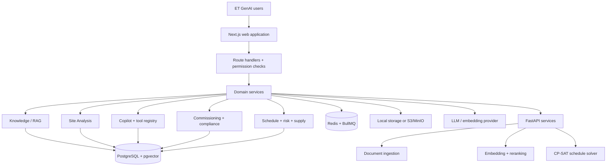
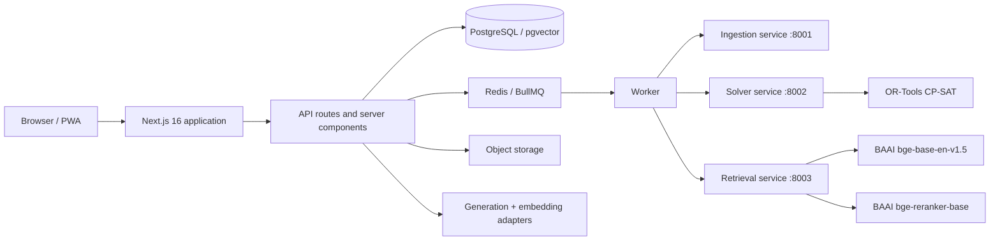
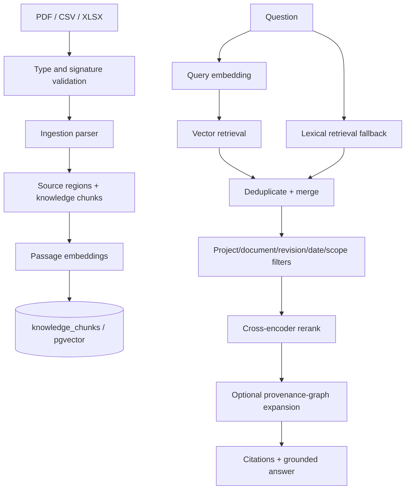
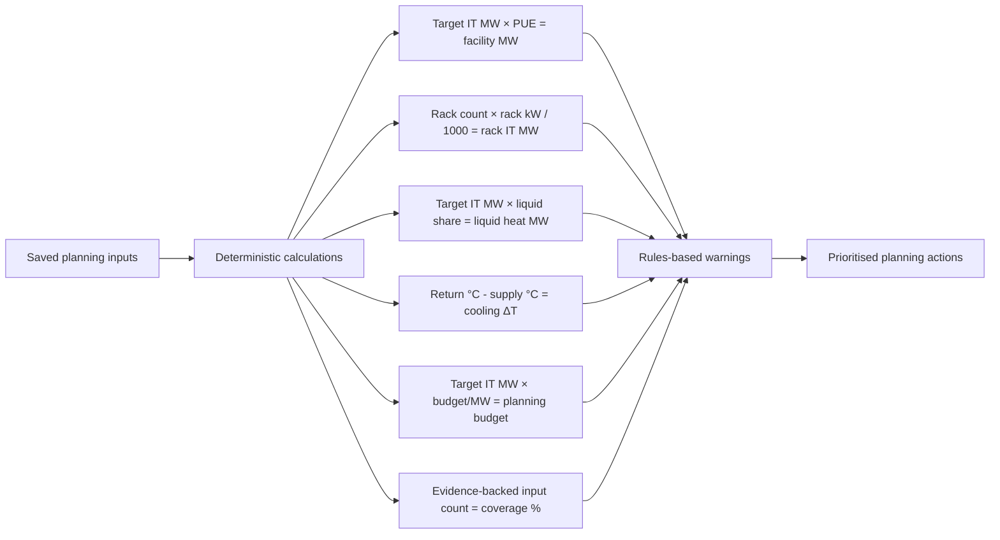
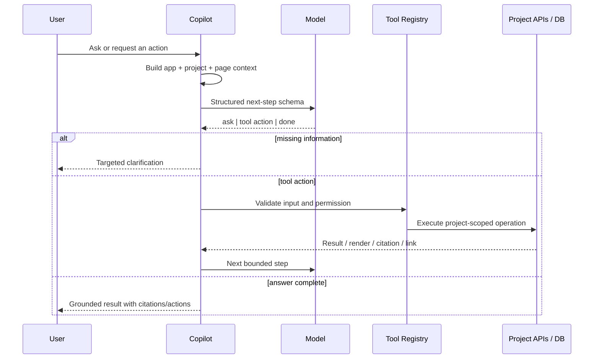
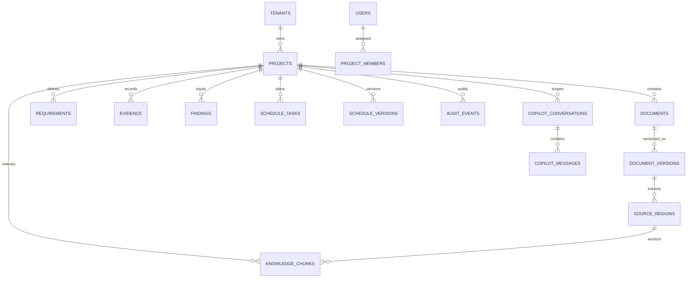
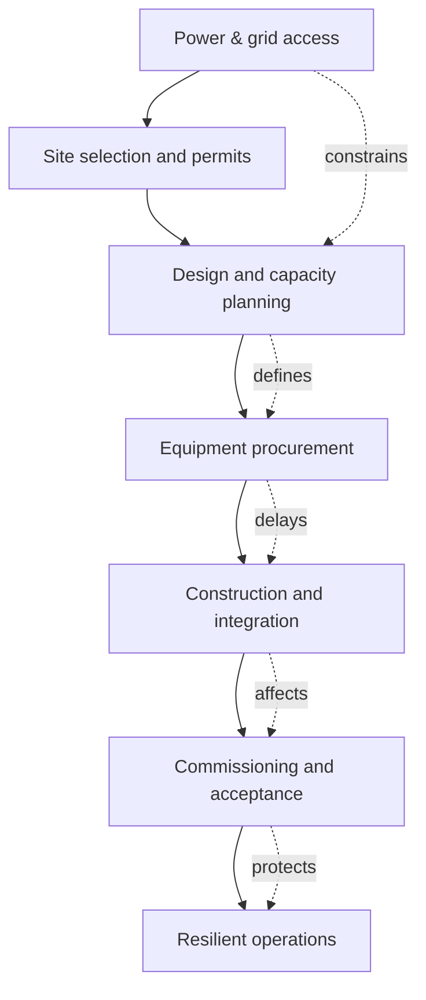

# ET GenAI — Technical & Product Reference

> **Code-grounded reference.** This is an implementation map of ET GenAI, written from the running codebase—not from product-planning documents. Every capability below is either linked to source code or explicitly marked as configured/optional.

| Identity | Code evidence |
|---|---|
| Product name for presentation | **ET GenAI** |
| Implemented application identity | `pramana-cx` in [`package.json`](package.json) and [`wrangler.jsonc`](wrangler.jsonc) |
| Product domain | Data-centre / EPC planning, commissioning, compliance, supply-chain, and project-control intelligence |
| UI runtime | Next.js 16 + React 19 |
| Primary data boundary | Tenant → project → project member role |

## 1. What ET GenAI is

ET GenAI is a **project-scoped AI operating layer for data-centre EPC delivery**. It converts planning inputs, controlled documents, schedules, field/commissioning records, shipment signals, and project data into traceable recommendations and workflow actions.

It is deliberately built so that AI output is normally **advisory**, **citation-bound**, and **reviewable**. For example, a site-analysis finalisation creates proposed requirements/tasks; commissioning reports remain labelled *DRAFT — PENDING ENGINEER REVIEW*; and compliance results distinguish deterministic flags from engineering judgement.



## 2. Product surface

| Product area | What it does in the code | Primary implementation |
|---|---|---|
| Site Analysis | Captures feasibility/planning inputs and derives deterministic capacity, cooling, budget, and evidence-coverage metrics | [`src/lib/site-analysis/interpretation.ts`](src/lib/site-analysis/interpretation.ts) |
| Planning handoff | Finalised site inputs become versioned planning-basis evidence, proposed requirements, tasks, systems/assets, and checklists | [`src/lib/site-analysis/finalize.ts`](src/lib/site-analysis/finalize.ts) |
| Knowledge workspace | Ingests project documents, chunks them, embeds them, retrieves cited evidence, reranks results, and can add graph context | [`src/lib/knowledge/`](src/lib/knowledge/) |
| ET Copilot | Uses structured model steps to select only relevant project tools, execute them, and return links/citations/actions | [`src/lib/copilot/`](src/lib/copilot/) |
| Commissioning (Cx) | Drafts cited checklists and reports from controlled source regions; a human must still review/approve | [`src/lib/cx/generation.ts`](src/lib/cx/generation.ts) |
| Compliance | Compares requirements to target text across numeric, boolean, categorical, and narrative modalities | [`src/lib/compliance/`](src/lib/compliance/) |
| Schedule | Sends constrained tasks/resources/dependencies to a CP-SAT service and versions results | [`src/lib/schedule/solver.ts`](src/lib/schedule/solver.ts), [`services/solver/app/main.py`](services/solver/app/main.py) |
| Predictive risk | Polls signal clients for accepted scheduled tasks, materialises material risks, generates mitigations, and emits schedule events | [`src/lib/predictive-risk/engine.ts`](src/lib/predictive-risk/engine.ts) |
| Supply / shipment visibility | Tracks shipment planning, routes, AIS/weather sources, task mapping, and alerts | [`src/lib/supply/`](src/lib/supply/), [`src/lib/shipment-planning.ts`](src/lib/shipment-planning.ts) |
| Digital rack model | Maintains racks, clusters, GPU profiles, equipment, ports, links, and export artifacts | [`src/lib/rack-model/`](src/lib/rack-model/), [`src/lib/db/schema.ts`](src/lib/db/schema.ts) |

## 3. Technical architecture

### 3.1 Application and infrastructure

| Layer | Technology actually used | Notes |
|---|---|---|
| Web application | Next.js `16.0.0`, React `19.0.0`, TypeScript | `src/app/` contains the route/page surface. |
| ORM and database | Drizzle ORM + PostgreSQL (`postgres` driver) | PostgreSQL is explicitly the authoritative application database in [`src/lib/db/client.ts`](src/lib/db/client.ts). |
| Vector storage | `pgvector` via Drizzle `vector` column | `knowledge_chunks` is indexed for vector search in [`src/lib/db/schema.ts`](src/lib/db/schema.ts). |
| Queueing | Redis + BullMQ | Durable DB records are created before queue submission; queue defaults to 3 attempts and exponential backoff ([`src/lib/jobs/queue.ts`](src/lib/jobs/queue.ts)). |
| Object storage | Local filesystem or S3-compatible storage | Production Compose uses MinIO; `OBJECT_STORAGE_DRIVER` selects `local` or `s3`. |
| AI services | Ollama by default; Gemini, NVIDIA NIM, Groq, and Cerebras selectable | Provider adapter lives in [`src/lib/model/provider.ts`](src/lib/model/provider.ts). |
| Retrieval service | FastAPI + `sentence-transformers` | BGE embedding and cross-encoder reranking service: [`services/retrieval/app/main.py`](services/retrieval/app/main.py). |
| Ingestion service | FastAPI | Parses PDF, CSV, and XLSX: [`services/ingestion/app/main.py`](services/ingestion/app/main.py). |
| Optimisation service | FastAPI + OR-Tools CP-SAT | Schedule solver: [`services/solver/app/main.py`](services/solver/app/main.py). |
| Cloud deployment target | OpenNext on Cloudflare, R2 incremental cache | [`open-next.config.ts`](open-next.config.ts), [`wrangler.jsonc`](wrangler.jsonc). |



### 3.2 Local production-shaped deployment

The codebase supplies a fail-closed production `docker-compose.yml`. Its services are `postgres`, `redis`, `minio`, `ingestion`, `solver`, `retrieval`, `ollama`, `ollama-models`, `core-api`, and `worker`. `core-api` waits for database, Redis, ingestion, solver, and retrieval health checks; the worker waits for the core API and retrieval service. See [`docker-compose.yml`](docker-compose.yml).

The container image is Node 22 Alpine; it installs dependencies, builds with `npm run build`, and exposes port `4173` ([`Dockerfile`](Dockerfile)).

## 4. AI model layer

### 4.1 Generation and embeddings

| Concern | Implementation |
|---|---|
| Default generation provider | Ollama (`MODEL_PROVIDER=ollama`) |
| Default generation model | `gemma4:e2b` |
| Default local embedding model | `nomic-embed-text:latest` |
| Supported generation providers | `mock`, `ollama`, `gemini`, `nim`, `groq`, `cerebras` |
| Supported embedding providers | `mock`, `ollama`, `gemini`, `service`, `pinecone` |
| Required vector size | **768 dimensions** (`EMBEDDING_DIMENSIONS = 768`) |
| Default model timeout | 45,000 ms |
| Default maximum prompt | 60,000 characters |
| Default output cap / context | 512 output tokens / 8,192 context tokens |
| Copilot step limits | 1,024 output tokens / 16,384 context tokens |

All provider settings are schema-validated in [`src/lib/env.ts`](src/lib/env.ts). The model adapter:

- asks providers for **structured JSON** validated with Zod;
- strips code fences/prose before JSON parsing;
- performs one repair retry only for invalid model output;
- bounds prompt length and end-to-end request deadlines;
- can rate-limit against a configured per-minute token budget; and
- persists provider/model/token-usage fields for copilot messages.

This is in [`src/lib/model/provider.ts`](src/lib/model/provider.ts), particularly `requestStructuredJson`, `getGenerationProvider`, `getEmbeddingProvider`, and `generationProviderHealth`.

### 4.2 Claim discipline

| Safe statement | Why it is technically accurate |
|---|---|
| “ET GenAI supports local and hosted model providers.” | Provider adapters and env schema implement the choice. |
| “ET GenAI produces validated structured outputs.” | Every generation request supplies a Zod schema and parses structured JSON. |
| “ET GenAI uses a 768-dimensional retrieval space.” | Code constant and BGE retrieval-service configuration both specify 768. |
| “ET GenAI can run fully locally with Ollama.” | Default provider/config and Compose service implement this. |
| “ET GenAI is a human-in-the-loop engineering platform.” | Draft/proposed states, approval paths, and source-citation controls are implemented. |
| **Do not say:** “The model is always correct.” | The code explicitly handles retries, unavailable providers, human review, and advisory output. |

## 5. RAG / knowledge system

### 5.1 End-to-end flow



### 5.2 Ingestion

`services/ingestion/app/main.py` accepts PDF, CSV, and XLSX only. For browser upload it:

1. resolves the type from content type or extension;
2. verifies PDF magic bytes (`%PDF-`) and XLSX ZIP signature (`PK\x03\x04`);
3. limits files to **100 MB**;
4. parses the file into chunks; and
5. returns chunks to the application pipeline.

The core document pipeline and worker use project-scoped source records, versions, source regions, and `knowledge_chunks`. The central retrieval data structure is `SemanticCitation` in [`src/lib/knowledge/query.ts`](src/lib/knowledge/query.ts).

### 5.3 Retrieval behaviour

| Stage | Code behaviour | Why it matters |
|---|---|---|
| Semantic search | Embeds the query and retrieves nearest project-scoped vectors | Retrieves meaning, not only literal words. |
| Lexical fallback | Token overlap search is retained as a resilience fallback | Search remains useful if embeddings are missing/unavailable. |
| Interactive catch-up | At most **64** stale/unembedded project chunks are embedded during a query | Avoids an unbounded reindex on an interactive request. |
| Filters before ranking | Project, document type/id, revision, date range, system, asset, and gate filters enter the SQL query | Prevents top results from being selected before scope is applied. |
| Reranking | Uses a configured threshold; service implementation uses BGE cross-encoder | Improves relevance of the first-stage candidate set. |
| Graph expansion | Adds evidence/requirement-related context from the provenance graph | Makes a citation explainable within project entities. |

The retrieval service uses `BAAI/bge-base-en-v1.5` and `BAAI/bge-reranker-base` ([`services/retrieval/app/main.py`](services/retrieval/app/main.py)). It prefixes **queries**, but not passages, with BGE’s search instruction and normalises embeddings. This query/passage asymmetry is intentional.

### 5.4 Grounded answer contract

`answerKnowledgeQuery` in [`src/lib/knowledge/pipeline.ts`](src/lib/knowledge/pipeline.ts) synthesises claims from citations. Claims are filtered so a result cannot present an unsupported citation as grounded evidence. ET GenAI should therefore answer technical questions with the cited document/version/source region where available—not merely with model prose.

## 6. Site Analysis: feasibility intelligence

### 6.1 Input model

The Site Analysis UI is a structured planning intake; it is **not** a certified engineering design. The page makes this explicit in [`src/app/site-analysis/page.tsx`](src/app/site-analysis/page.tsx), while the question schema is defined in [`src/lib/site-analysis/questions.ts`](src/lib/site-analysis/questions.ts).

The technical sections include:

| Planning dimension | ET GenAI captures / derives |
|---|---|
| Racks | Target IT MW, rack count, rack kW, density, calculated rack IT MW |
| Campus / site fit | Site/campus inputs, regional and physical planning basis |
| Power | PUE target, utility MW, facility MW, utility headroom |
| Availability | Resilience planning basis |
| Cooling | Architecture, liquid-heat share, coolant supply/return, ΔT |
| Building systems | Supporting infrastructure decisions |
| Network / controls | Network and controls/security planning boundaries |
| Logistics | Delivery and supply assumptions |
| Schedule | RFS date, long-lead items, source references |
| Commercial | Budget per MW and total planning budget |

### 6.2 Deterministic calculations and warnings



Implemented rules in [`src/lib/site-analysis/interpretation.ts`](src/lib/site-analysis/interpretation.ts) include:

- utility capacity below calculated facility demand → **critical**;
- rack plan differs from target IT capacity by more than **10%** → **warning**;
- air-cooled chiller with more than **50%** liquid heat share → **warning**;
- missing RFS date or long-lead basis → **warning**;
- missing budget, PUE, or water basis → **info**;
- return coolant temperature less than/equal to supply → **critical**.

The engine calculates the following `PlanningMetrics`: target IT MW, rack IT MW, facility MW, utility MW/headroom, PUE, liquid heat MW/share, cooling ΔT, planning budget, budget per MW, evidence coverage, and completed-section coverage.

### 6.3 Finalisation creates traceable project work

Finalising Site Analysis does more than export a form. [`src/lib/site-analysis/finalize.ts`](src/lib/site-analysis/finalize.ts) generates a versioned Markdown planning-basis document, stores it, creates a source region, proposes requirements, and creates/updates planning handoff tasks. For answered technical sections it also creates systems/assets/checklists that remain **proposed** and require review before execution.

## 7. Copilot: action-capable project intelligence

The ET Copilot is not a free-form chatbot. [`src/lib/copilot/loop.ts`](src/lib/copilot/loop.ts) runs bounded structured steps: **ask**, **act**, or **done**. It requires read tools for project-status questions, refuses to guess IDs/dates/owners, limits tool selection to relevant tools, and stores user/assistant/tool messages in the database.



### 7.1 Copilot tool groups

| Group | Examples of capability | Registry source |
|---|---|---|
| Read project | Project, readiness, findings, project facts | `registry/read-project.ts` |
| Read schedule | Versions, tasks, risks | `registry/read-schedule.ts` |
| Read supply | Shipments and supply/risk state | `registry/read-supply.ts` |
| Read Cx/compliance | Checklists, tests, compliance data | `registry/read-cx-compliance.ts` |
| Write findings/records | Create/edit controlled project records | `registry/write-findings.ts`, `write-records.ts` |
| Write uploads | Route an upload to source/Cx/field capture | `registry/write-uploads.ts` |
| Write schedule/supply | Schedule baseline and supply operations | `registry/write-schedule.ts`, `write-supply.ts` |
| Write Cx/compliance/site analysis | Create controlled workflow requests | corresponding `write-*.ts` modules |
| Exports | Project/report export operations | `registry/write-exports.ts` |

The full registry is assembled only once in [`src/lib/copilot/registry/index.ts`](src/lib/copilot/registry/index.ts). Its tool catalogue is filtered for the user’s task context to control prompt size.

## 8. Engineering-control capabilities

### 8.1 Commissioning and compliance

| Capability | Actual implementation guarantee |
|---|---|
| Checklist drafting | Generates structured steps only from supplied controlled source regions. |
| Citation validation | Rejects generated citations not present in the allowed selected regions. |
| Step modalities | `numeric`, `boolean`, or `narrative`; numeric/boolean inputs require the appropriate expected values. |
| Reports | Generated report is explicitly `DRAFT — PENDING ENGINEER REVIEW`. |
| Compliance verdicts | `conforms`, `deterministic_flag`, `possible_mismatch`, `needs_engineering_judgment`, `equivalent_by_precedent`. |
| Evaluation metrics | Accuracy, precision, recall, F1, TP/FP/FN/TN, split by modality. |
| Production accuracy claim | Permitted only when the labelled golden set is `expert_reviewed`. |

Evidence: [`src/lib/cx/generation.ts`](src/lib/cx/generation.ts), [`src/lib/compliance/evaluate.ts`](src/lib/compliance/evaluate.ts).

### 8.2 Schedule optimisation

The solver accepts tasks (duration, earliest/deadline/fixed offsets), dependencies, resources/capacities, demands, and optional start hints. It encodes precedence and cumulative capacity constraints in CP-SAT, minimises deadline tardiness before makespan, returns assignments/critical tasks/bottlenecks/deadline breaches, and is bounded to a 20-second search in the Python service.

The TypeScript client additionally uses `SOLVER_TIMEOUT_MS`, retries with exponential backoff up to `SOLVER_MAX_ATTEMPTS`, and returns an explicit unavailable outcome rather than hanging ([`src/lib/schedule/solver.ts`](src/lib/schedule/solver.ts)).

### 8.3 Predictive risk and supply intelligence

`pollProjectRisks` only evaluates **accepted** tasks from the latest immutable schedule version. A risk becomes material when its probability and delay exceed configured thresholds and the task is critical or would breach its deadline. Material changes are hashed to avoid duplicate events, receive mitigation options, emit a `predicted_risk_delay` schedule event, and are audit logged. See [`src/lib/predictive-risk/engine.ts`](src/lib/predictive-risk/engine.ts).

This is a strong demo phrase:

> “ET GenAI converts external risk signals into reviewable schedule impacts and mitigation options; it does not silently reschedule a project.”

## 9. Data model and traceability



| Entity group | Tables in `src/lib/db/schema.ts` | Why it exists |
|---|---|---|
| Access / tenancy | `tenants`, `users`, `auth_sessions`, `projects`, `project_members` | Enforces a project as the main access boundary. |
| Source control | `storage_objects`, `documents`, `document_versions`, `source_regions` | Stores object identity, SHA-256, version status, and extracted regions. |
| Knowledge and graph | `knowledge_chunks`, `requirements`, `evidence`, `evidence_claims`, `evidence_claim_links`, `edges` | Connects retrieved content to project facts and their relationships. |
| Site / technical model | `site_analyses`, `site_analysis_snapshots`, `systems`, `assets`, rack-model tables | Persists planning basis and equipment/system context. |
| Delivery control | `gates`, `findings`, `decisions`, schedule tables, shipments, alerts | Manages work, readiness, delivery, and decisions. |
| Cx / compliance | `cx_checklists`, `cx_checklist_steps`, `cx_clause_citations`, `cx_test_records`, `cx_step_results`, compliance tables | Keeps generated material connected to controlled clauses and reviews. |
| AI operations | `copilot_conversations`, `copilot_messages`, `copilot_attachments`, `copilot_memories` | Preserves conversation/tool history and scoped memory. |
| Operational integrity | `durable_jobs`, `idempotency_records`, `audit_events` | Supports replay-safe background work and a tamper-evident event chain. |

## 10. Security, governance, and failure behaviour

| Control | Code behaviour |
|---|---|
| Authentication | Development, credentials, or Clerk modes; session cookie has configurable TTL. |
| MFA | TOTP data fields and authentication functions exist in `src/lib/auth/`. |
| Authorization | Project member roles: admin, commissioning manager, reviewer, field engineer, approver, viewer, scheduler. |
| Scope | Database model associates operational records with a project; retrieval requires a project ID. |
| Output control | Structured Zod schemas, bounded prompts, deadline, and one repair retry for malformed model JSON. |
| Provenance | Source regions, document versions, content hashes, evidence claims, and citations. |
| Audit integrity | SHA-256 linked audit events; verifier detects missing predecessors, forks, cycles, disconnected events, and invalid hashes. |
| Background work | Durable DB job record + idempotency key before BullMQ execution. |
| Infrastructure | Production Compose sets `REQUIRE_PRODUCTION_CONFIG=true` and disables degraded infrastructure mode. |
| External data safety | Risk polling records `data_unavailable`; unavailable signals are not treated as a clean/negative risk. |

The audit verifier is [`src/lib/audit/verify-chain.ts`](src/lib/audit/verify-chain.ts). It is important to say **tamper-evident audit chain**, rather than “blockchain”: it is a SHA-256 hash-linked application audit log.

## 11. Technical glossary

| Term | Meaning in ET GenAI |
|---|---|
| **RAG** | Retrieval-Augmented Generation: answer with retrieved project evidence, rather than relying solely on model memory. |
| **Source region** | An extracted, addressable portion of a document that can anchor a citation. |
| **Knowledge chunk** | Retrieval unit with content, source association, hash, vector, and metadata. |
| **Embedding** | A 768-number semantic representation used for similarity retrieval. |
| **Reranking** | A cross-encoder rescores first-stage retrieval candidates for stronger relevance. |
| **pgvector** | PostgreSQL extension/data type used to store and search vectors. |
| **Hybrid retrieval** | Semantic vector search plus lexical fallback/merge. |
| **Graph expansion** | Adds related project-entity context to a retrieved citation. |
| **Structured output** | Model response must validate against a Zod schema, not just look like JSON. |
| **Model provider** | Generation backend selected by environment: Ollama, Gemini, NIM, Groq, Cerebras, or mock. |
| **Embedding provider** | Backend that turns queries/passages into vectors; independently configurable from generation. |
| **Grounded claim** | A synthesis claim permitted only if supported by the retrieved evidence/citations. |
| **Planning basis** | A user-confirmed planning input set; not a stamped engineering design or approval. |
| **PUE** | Power Usage Effectiveness; Site Analysis uses IT MW × PUE to estimate facility MW. |
| **Utility headroom** | Utility MW minus calculated facility MW. |
| **Liquid heat share** | Percentage of IT heat served by the liquid cooling path. |
| **Cx** | Commissioning: verification that installed systems meet controlled criteria. |
| **Controlled source** | Selected project document/version/region used as a defensible evidence basis. |
| **Proposed** | Machine- or workflow-created state awaiting human review/acceptance. |
| **Golden set** | Labelled compliance evaluation data used to calculate accuracy/precision/recall/F1. |
| **CP-SAT** | Constraint Programming SAT solver used for resource- and dependency-constrained schedule optimisation. |
| **Makespan** | Total completion time of the schedule; the solver minimises it after deadline tardiness. |
| **Material risk** | A signal crossing configured probability/delay thresholds and affecting a critical/deadline task. |
| **Idempotency key** | A unique key preventing a repeated command from creating duplicate durable work. |
| **BullMQ** | Redis-backed queue used for asynchronous worker jobs. |
| **Fail closed** | In production, missing required configuration/infrastructure causes failure rather than insecure fallback. |

## 12. Industry-wide greenfield data-centre problems

> **Scope:** The following are industry challenges, not findings about a specific ET GenAI project. Data points are externally sourced; the “ET GenAI contribution” column maps them to implemented capabilities in this repository.

### 12.1 Current industry signals

| Signal | Current data | Why it matters when building from scratch |
|---|---:|---|
| Data-centre electricity growth | **~17%** growth in 2025 | Grid capacity and power procurement are now design-critical, not late-stage utilities work. |
| Global electricity-demand growth | **3.6%** forecast for 2026; **3.8%** for 2027 | Competition for generation and transmission capacity raises connection, pricing, and schedule risk. |
| India electricity-demand growth | **6.4% average annual** growth forecast for 2026–2030 | In India, campus power strategy must account for rapidly growing regional demand. |
| Hiring difficulty | **46%** of operators report difficulty finding qualified candidates | Electrical, mechanical, Cx, controls, and operations capability can constrain delivery. |
| Staff retention difficulty | **37%** of operators report difficulty retaining staff | Knowledge loss and late-stage resourcing can increase commissioning and operating risk. |

Sources: [IEA Global Energy Review 2026](https://www.iea.org/reports/global-energy-review-2026/electricity-demand), [IEA Electricity 2026](https://www.iea.org/reports/electricity-2026/demand), and [Uptime Institute Global Data Center Survey 2025](https://datacenter.uptimeinstitute.com/rs/711-RIA-145/images/2025.Annual.Survey.Report.pdf?version=0).



### 12.2 The core problems ET GenAI should identify

| Problem | What goes wrong | Metrics to track | ET GenAI contribution |
|---|---|---|---|
| **Power availability and grid interconnection** | Utility capacity, substation delivery, transmission upgrades, tariff exposure, and backup-power strategy become critical-path risks. | Contracted MW; utility MW; facility MW; PUE; headroom MW; interconnection milestone variance. | Site Analysis calculates facility MW and utility headroom; schedule/risk modules make power dependencies visible. |
| **Site selection, permits, and community constraints** | Land, zoning, water, emissions/noise, flood/seismic exposure, fibre routes, and local approvals can invalidate an otherwise attractive site. | Permit lead time; approval status; water availability; fibre diversity; hazard score; land-to-RFS duration. | Structured Site Analysis stores the planning basis, assumptions, warnings, and source evidence. |
| **AI density and cooling design** | Conventional air cooling may not support high-density GPU racks; cooling topology, liquid loops, heat rejection, water, and redundancy need early decisions. | Rack kW; liquid-cooling share; coolant supply/return °C; cooling ΔT; PUE; WUE. | The Site Analysis model captures cooling architecture and calculates liquid heat and thermal consistency warnings. |
| **Capital cost and long-lead equipment** | Transformers, switchgear, generators, UPS, chillers, pumps, and controls can determine the actual completion date. | Lead-time days; procurement status; supplier OTIF; contingency; cost/MW; forecast-at-completion. | Shipment planning, external risk signals, alerts, and CP-SAT scheduling connect delivery delays to critical tasks. |
| **Design coordination and changing requirements** | Mechanical, electrical, civil, network, and technology designs can drift; revisions create hidden rework and wrong-field installation. | RFI count/age; design-revision count; clash count; change-impact count; requirement coverage. | Versioned documents, source regions, requirement/evidence graph, and scope-filtered RAG preserve traceability. |
| **Construction productivity and skilled labour** | Specialist labour, shift planning, testing access, safety, and multi-vendor coordination can reduce programme reliability. | Workforce fill rate; crew utilisation; task float; critical-path hours; rework rate; lost-time incidents. | Resource-constrained scheduling highlights bottlenecks; Copilot can retrieve and act on controlled work items. |
| **Commissioning and integrated testing** | A facility can be mechanically complete yet fail under load, failover, fire suppression, or integrated control testing. | Test pass rate; evidence completeness; open punch-list items; retest rate; gate readiness; failed proof records. | Cited checklists, test records, readiness computation, and proposed/accepted review states make acceptance auditable. |
| **Operational resilience and cyber-physical risk** | Single points of failure, poorly tested change procedures, OT/IT integration, and weak monitoring can cause high-impact outages. | Redundancy coverage; change-failure rate; incident MTTR; alarm-to-action time; patch compliance. | Audit chain, role-based controls, evidence model, and Copilot guardrails support controlled operations; they do not replace OT security controls. |
| **Sustainability and resource constraints** | Power scarcity, water stress, emissions, and heat-reuse obligations affect site viability and operating cost. | PUE; WUE; carbon intensity; renewable coverage; water withdrawal; heat-reuse potential. | Planning inputs/evidence can be centralised; additional external-data integrations are required for verified sustainability reporting. |
| **Data fragmentation and decision latency** | Drawings, RFIs, test records, vendor data, schedules, and emails live in separate places, so teams make decisions from incomplete context. | Search time; document freshness; citation coverage; unresolved decision age; data-completeness percentage. | Ingestion + RAG + provenance graph creates a project-scoped, cited decision layer. |

### 12.3 Data points that work on an impact slide

Use the following as **industry context**, with citations—not as ET GenAI performance claims:

| Number | Slide statement |
|---:|---|
| **17%** | Data-centre electricity use grew by about 17% in 2025. |
| **3.6%** | Global electricity demand is forecast to grow 3.6% in 2026. |
| **6.4%** | India’s electricity demand is forecast to grow 6.4% annually on average from 2026–2030. |
| **46%** | Operators reporting difficulty finding qualified candidates for vacant roles. |
| **37%** | Operators reporting difficulty retaining staff. |

### 12.4 Slide-ready problem statement

> **Building a data centre is no longer only a construction problem. It is a power, cooling, supply-chain, compliance, commissioning, and workforce-coordination problem—made harder by rapidly rising electricity demand and AI-driven rack density. ET GenAI creates one evidence-grounded control layer across those decisions.**

## 13. Questions you should be ready to answer

| Question | Short technical answer |
|---|---|
| “Is ET GenAI only a chatbot?” | No. The copilot is one interface over site analysis, RAG, Cx, compliance, schedule optimisation, predictive risk, shipment/supply, and controlled records. |
| “How do you prevent hallucinations?” | We constrain output to Zod schemas, ground knowledge answers in retrieved citations, validate checklist citations against allowed source regions, and keep material outputs proposed until human review. |
| “What models do you use?” | The default local configuration is Ollama with `gemma4:e2b` for generation and `nomic-embed-text:latest` for embeddings; the adapter also supports Gemini, NVIDIA NIM, Groq, Cerebras, Pinecone embeddings, and deterministic mock mode. |
| “How does your RAG work?” | We ingest PDF/CSV/XLSX, create source regions/chunks, generate 768-d embeddings, retrieve with semantic and lexical paths, apply project/scope filters, rerank, and return cited content. |
| “Can a model approve engineering work?” | No. The platform labels generated reports as pending engineer review, uses proposed/accepted states, and explicitly distinguishes engineering judgement from deterministic checks. |
| “What does Site Analysis calculate?” | Facility power, rack IT capacity, utility headroom, liquid heat, cooling ΔT, planning budget, evidence coverage, and consistency warnings from saved planning inputs. |
| “How does ET GenAI manage schedule risk?” | It polls configured signal clients, records unavailable data honestly, materialises only material risk changes, generates mitigations, and emits reviewable schedule events. |
| “What persists the data?” | PostgreSQL is the authoritative store. Object files are local/S3-compatible, queues use Redis/BullMQ, and knowledge vectors are stored alongside project metadata in PostgreSQL. |
| “Is it cloud-only?” | No. Local Docker Compose runs Postgres, Redis, MinIO, FastAPI services, Ollama, the app, and worker; Cloudflare/OpenNext is also configured as a deployment target. |

## 14. Verification and maintenance

Run commands from the repository root:

```bash
npm run typecheck
npm run lint
npm run verify:retrieval-service
npm run verify:knowledge-query-http
npm run verify:knowledge-rerank
npm run verify:knowledge-synthesis
npm run verify:compliance-golden
npm run verify:copilot
npm run verify:all
```

The available verification scripts are the source of truth in [`package.json`](package.json). Validate a claim with its corresponding script before presenting it as a measured result.

## 15. Presentation-safe terminology

| Use this | Avoid this |
|---|---|
| “AI-assisted, evidence-grounded project intelligence” | “Fully autonomous engineering” |
| “Human-reviewed, citation-bound recommendations” | “Guaranteed correct outputs” |
| “Predictive risk signals and mitigation options” | “Automatic project decisions” |
| “Planning metrics and consistency checks” | “Certified engineering design” |
| “Tamper-evident audit trail” | “Blockchain” |
| “Local or provider-selectable model runtime” | “One proprietary model” |

---

## Source inventory used for this reference

This document intentionally bases its statements on source/configuration, chiefly:

- [`package.json`](package.json)
- [`docker-compose.yml`](docker-compose.yml)
- [`wrangler.jsonc`](wrangler.jsonc)
- [`src/lib/env.ts`](src/lib/env.ts)
- [`src/lib/db/schema.ts`](src/lib/db/schema.ts)
- [`src/lib/model/provider.ts`](src/lib/model/provider.ts)
- [`src/lib/knowledge/`](src/lib/knowledge/)
- [`services/ingestion/app/main.py`](services/ingestion/app/main.py)
- [`services/retrieval/app/main.py`](services/retrieval/app/main.py)
- [`services/solver/app/main.py`](services/solver/app/main.py)
- [`src/lib/site-analysis/`](src/lib/site-analysis/)
- [`src/lib/copilot/`](src/lib/copilot/)
- [`src/lib/cx/generation.ts`](src/lib/cx/generation.ts)
- [`src/lib/compliance/evaluate.ts`](src/lib/compliance/evaluate.ts)
- [`src/lib/predictive-risk/engine.ts`](src/lib/predictive-risk/engine.ts)
- [`src/lib/audit/verify-chain.ts`](src/lib/audit/verify-chain.ts)
