# Pramana Cx Application Flow

## Primary User Flows

### Flow: Create Project and Configure Access
**Entry point:** Project List
1. The administrator opens `Create Project` and enters project name, code, timezone, and retention policy.
2. The app validates required fields and checks the project code for duplicates.
3. The administrator creates the project and lands on `Project Settings`.
4. The administrator invites members and assigns project roles.
5. The app records membership changes and shows the `Project Dashboard`.
**Exit point:** Project Dashboard with configured members.

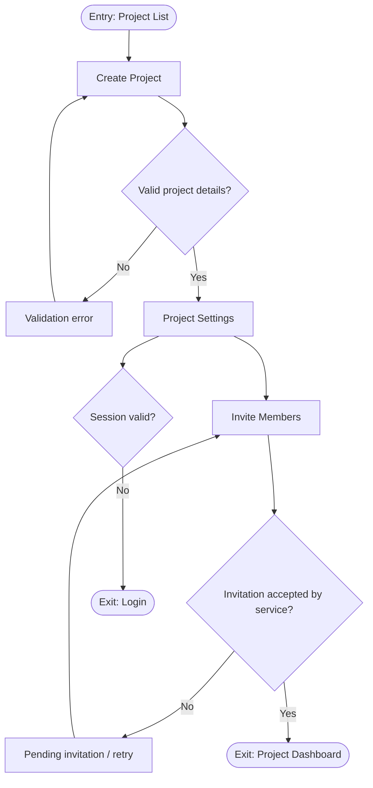

### Flow: Ingest and Review Requirements
**Entry point:** Project Dashboard
1. A reviewer opens `Source Library` and selects `Upload Source`.
2. The app validates file type, size, project membership, and revision metadata.
3. The upload enters `Processing Status` while the source is stored and extracted.
4. The reviewer opens `Requirement Review Queue` and selects a proposal.
5. The reviewer accepts, edits, or rejects the proposal with its source citation visible.
6. Accepted requirements appear in `Requirement Detail` and can be related to systems, assets, gates, and evidence.
**Exit point:** Accepted requirement available to the readiness engine, or rejected proposal retained for audit.

### Flow: Review Gate Readiness and Resolve Blockers
**Entry point:** Project Dashboard
1. The commissioning manager opens `Readiness Board` and selects a system and gate.
2. The app loads the current rules version and displays `READY`, `BLOCKED`, `IN_REVIEW`, or `UNKNOWN`.
3. The manager opens a blocker to view `Evidence Detail`, source citations, related assets, and owner.
4. The manager creates or updates an action in `Finding Detail` and assigns an owner and due date.
5. The owner uploads evidence or records a test result through `Field Capture` or `Test Run Detail`.
6. The readiness engine recalculates after processing and shows the changed blocker set.
7. The manager may also open the gate's linked `Schedule & Critical Path Board` context panel to see whether a feeding critical-path task is delayed; this is informational only and never changes the readiness state shown in step 2.
**Exit point:** The gate is ready for approval, or remains visibly blocked with assigned actions.

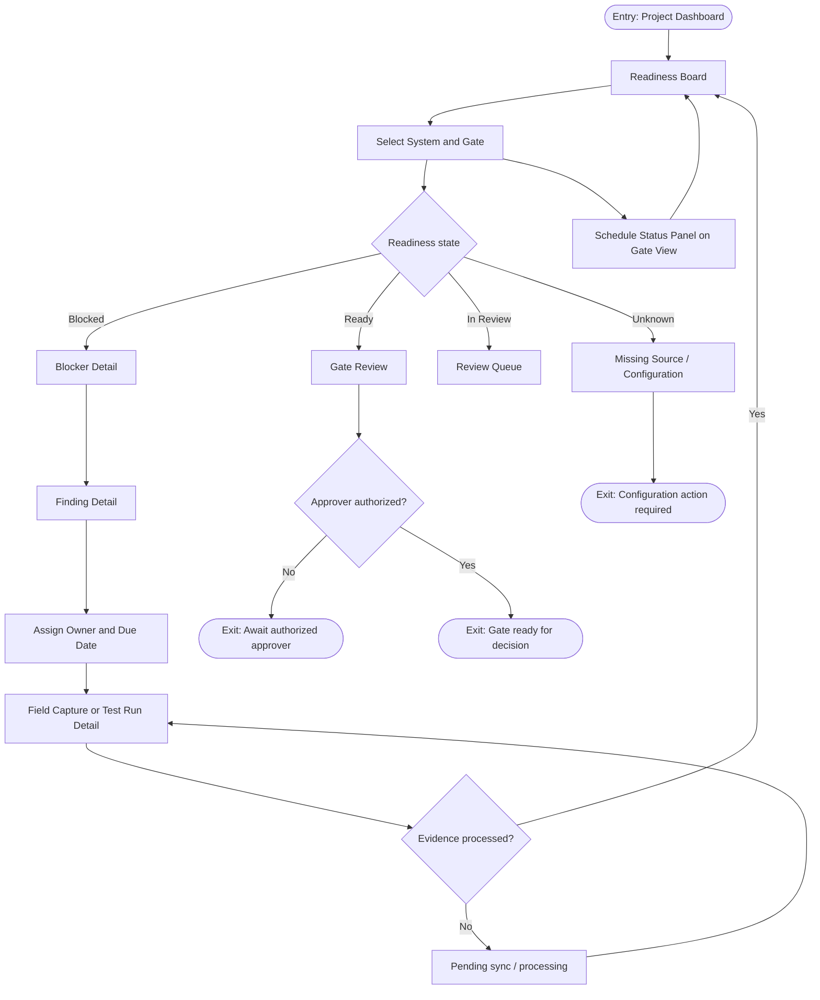

### Flow: Approve or Reject a Gate
**Entry point:** Gate Review
1. The approver opens `Gate Review` and verifies the readiness explanation and evidence baseline.
2. The app checks the approver's project role and TOTP-enabled session.
3. The approver selects approve, reject, or waive and enters a reason.
4. The app stores the evidence baseline, rule version, actor, and decision timestamp.
5. The app updates the gate status and sends the user to `Decision History`.
**Exit point:** Recorded decision with an immutable audit event.

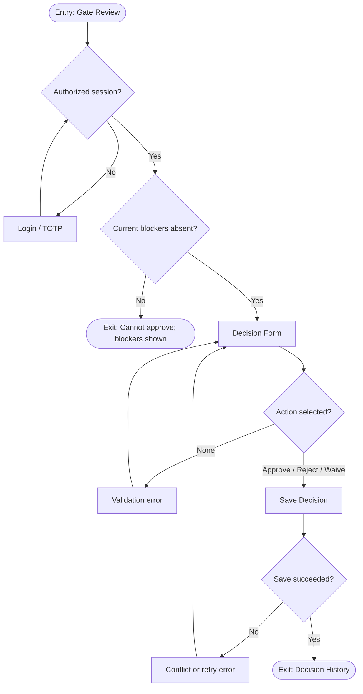

### Flow: Capture Evidence Offline and Sync
**Entry point:** Field Capture
1. The field engineer opens `Field Capture` and selects an asset or gate.
2. The engineer records a photo, observation, measurement, or test result.
3. The app validates required fields and stores the item as `Pending Sync` when offline.
4. When connectivity returns, the app uploads the item and shows `Processing`.
5. The server validates the source and assigns `Accepted`, `Rejected`, or `Needs Review`.
**Exit point:** Evidence is visible with an explicit server-confirmed state.

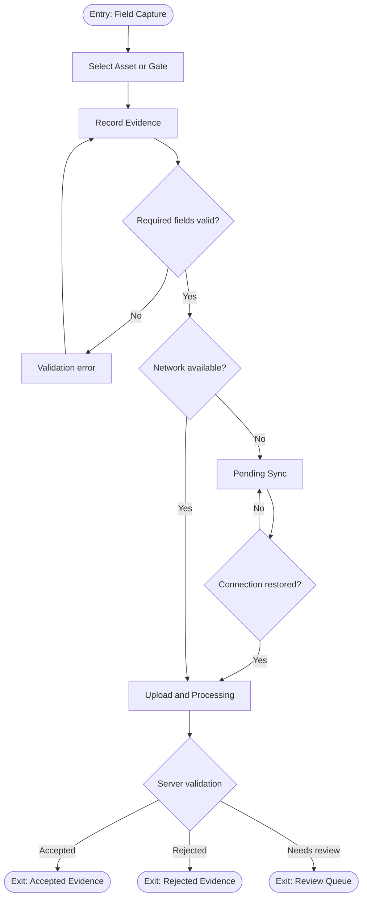

### Flow: Export Turnover Evidence Pack
**Entry point:** Project Dashboard
1. The operations-readiness lead opens `Exports` and selects a system and gate.
2. The app previews included accepted evidence, decisions, audit history, and source references.
3. The user requests an export and the app creates an `Export Job`.
4. The exporter builds the pack and hash manifest from a versioned evidence baseline.
5. The user downloads the pack through a short-lived signed URL or retries a failed job.
**Exit point:** Downloadable pack with manifest hash and verification metadata.

### Flow: Generate Baseline Schedule (US-09)
**Entry point:** Project Dashboard
1. The project scheduler opens `Schedule Baseline Setup` and selects `Upload Schedule Source`.
2. The scheduler uploads vendor contracts, mobilization timelines, purchase orders, and government approval documents.
3. The app validates file type, size, and project membership, then queues an extraction job shown as `Extraction Processing Status`.
4. The extraction job proposes task records (name, duration, dependencies, vendor, lead time, resource requirement, deadline type) and resource-capacity records (crew/equipment counts), each with confidence and a source-region citation.
5. The scheduler opens `Task Record Review Queue`; ambiguous or missing fields are flagged and cannot be auto-accepted.
6. The scheduler accepts, edits, or rejects each proposed record in `Task Record Detail`.
7. Once the scheduler confirms the accepted record set is a complete DAG, the app runs `Dependency Graph Validation`; a detected cycle blocks solving with a clear error.
8. The scheduler triggers `Baseline Solve Job`; the CP-SAT solver computes a feasible schedule respecting precedence, single-mode durations, resource capacity, and deadlines.
9. The app stores the result as immutable `Schedule Version v1` and opens the `Schedule & Critical Path Board` with the critical path highlighted.
**Exit point:** Baseline schedule version v1 available on the Schedule & Critical Path Board, cross-linked into the typed-edges graph.

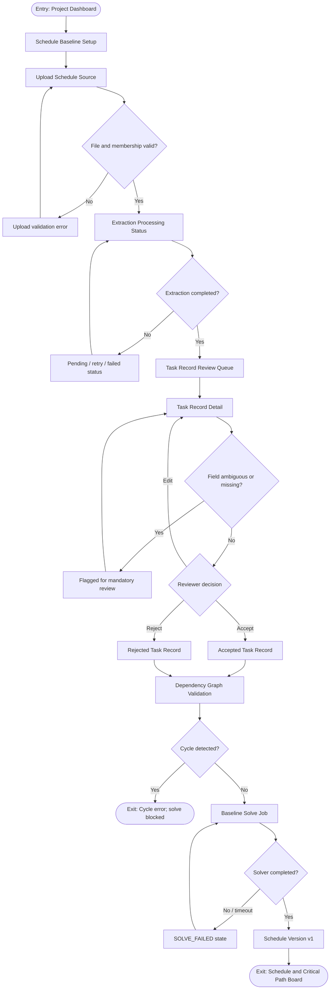

### Flow: Review Proposed Task and Resource Records
**Entry point:** Task Record Review Queue
1. The reviewer opens `Task Record Review Queue` and filters by document, vendor, or confidence level.
2. The reviewer selects a proposed record and opens `Task Record Detail`, viewing the extracted fields, confidence score, and exact source-region citation.
3. Fields the extractor marked ambiguous or missing are visually flagged and block a one-click accept.
4. The reviewer accepts the record as-is, edits a field before accepting, or rejects it with a reason.
5. The app records the reviewer's decision, actor, and timestamp for audit.
**Exit point:** Accepted record available to the baseline or re-solve pipeline; rejected record retained for audit and excluded from solving.

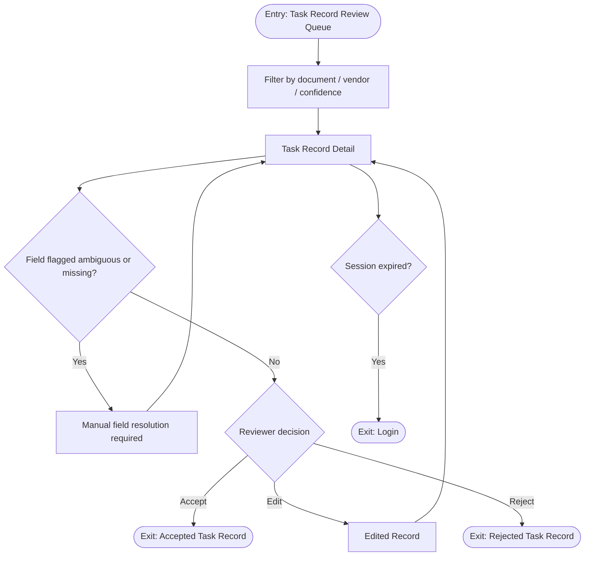

### Flow: Event-Triggered Rescheduling (US-10)
**Entry point:** Schedule & Critical Path Board
1. A user or integration opens `Event Log / Trigger Entry` and logs a shipment delay, approval granted/rejected, or weather-delay event against a task.
2. The app validates the event against the current schedule version and referenced task.
3. The `Delta Detector` evaluates whether the event affects the critical path or a downstream dependency.
4. If it does not, the app updates only the task's actual status/date and returns to the `Schedule & Critical Path Board`; no new schedule version is created.
5. If it does, the app triggers a `Re-solve Job`; the CP-SAT solver is warm-started with completed tasks held fixed.
6. On success, the app stores a new immutable `Schedule Version vN` and updates the `Schedule & Critical Path Board`.
7. If the deadline is infeasible, the solver still returns a complete schedule and the board shows the minimum overrun and bottleneck constraint explicitly.
8. The app generates a `Re-solve Explainer` describing the triggering event, shifted tasks, and net deadline impact.
**Exit point:** Updated schedule version (or unchanged status-only update) visible on the Schedule & Critical Path Board, with an explainer available for any re-solve.

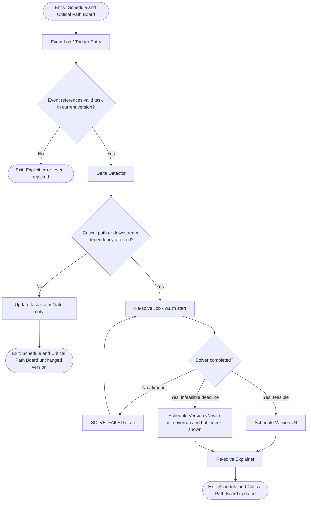

### Flow: View Schedule History and Explainer (US-11)
**Entry point:** Schedule & Critical Path Board
1. The owner's representative opens `Schedule Version History` from the Schedule & Critical Path Board.
2. The user browses prior `Schedule Version` entries, each timestamped and immutable.
3. The user selects a version to open its `Re-solve Explainer`, showing the triggering event, tasks whose dates shifted, and the net deadline impact, clearly labelled as AI-generated.
4. The user may optionally compare two versions in a `Schedule Version Diff` view.
**Exit point:** User understands what changed and why, without any schedule date being altered by the explanation.

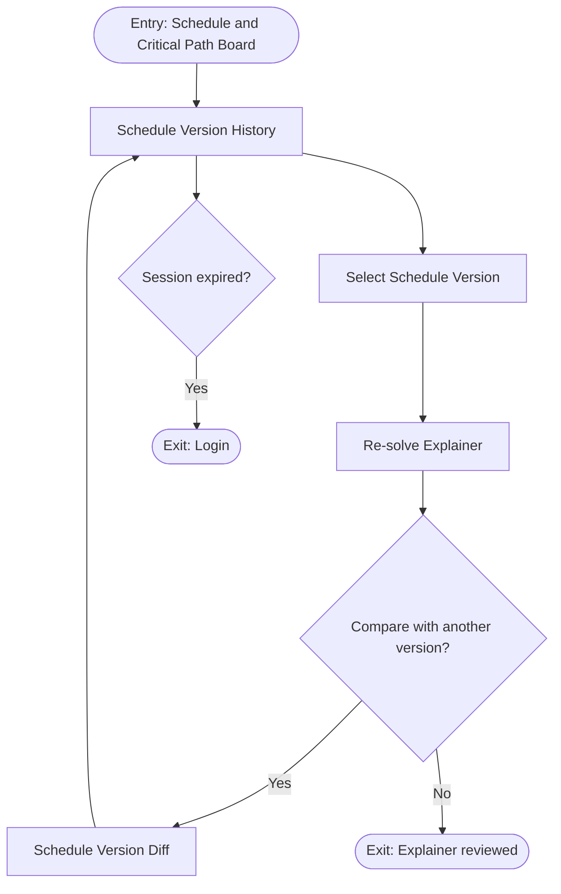

### Flow: Generate and Review IST Checklist (US-13)
**Entry point:** Project Dashboard
1. The commissioning engineer opens `IST Checklist Workspace` and selects a system, gate, equipment, and standard set.
2. The app confirms the chosen standards and test procedures are ingested into the RAG store with clause/section metadata and source citations before any generation runs.
3. The Commissioning QA Copilot RAG-generates a `Draft Checklist` of structured steps, acceptance criteria, and cited clauses.
4. The app verifies every LLM-generated clause citation against ingested-corpus metadata; a clause ID with no match is flagged as a possible hallucination rather than shown as verified.
5. A malformed or schema-invalid checklist is rejected with a clear error and routed for retry or human review instead of being partially rendered.
6. The engineer reviews the draft in `Checklist Review`, then accepts, edits, or rejects steps at the draft-acceptance gate; the draft is never treated as authoritative until accepted.
**Exit point:** An accepted checklist ready for test execution, or a rejected/retry draft retained for review.

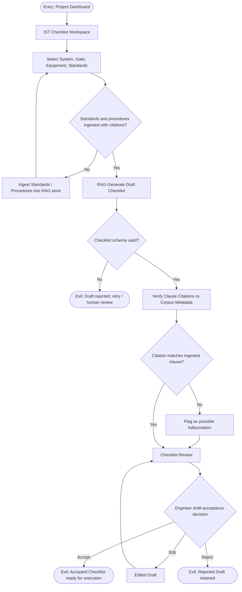

### Flow: Execute Test and Handle Failure (US-14–US-18)
**Entry point:** Accepted Checklist
1. The commissioning engineer opens `Test Execution` for the accepted checklist and runs each step, entering per-step field readings.
2. The app records who entered each reading and when, and persists step state so execution can be resumed without loss.
3. For each step, a deterministic acceptance check classifies numeric/threshold and boolean/presence steps as `proposed_pass` or `proposed_fail`; narrative/qualitative steps are always routed to `needs_human_review` and never auto-determined.
4. On a `proposed_fail`, a `TEST_FAILED` event emits, the affected gate goes `BLOCKED`, a `findings` (NCR) record is created via the existing typed-graph + audit-event pattern, and a `Command Center` alert is raised.
5. The engineer generates a `Draft Test Report` labelled "DRAFT — PENDING ENGINEER REVIEW".
6. The engineer edits and approves the report; export is possible only after approval.
7. When all steps pass, on approval the gate transitions to `PENDING_REVIEW` — never `READY`; only an authorized approver transitions it further.
8. The approved test record is linked as `evidence` to its gate and added to the turnover pack.
**Exit point:** An approved test record in the evidence graph and turnover pack, with the gate at `PENDING_REVIEW`, or a `BLOCKED` gate with an open finding on failure.

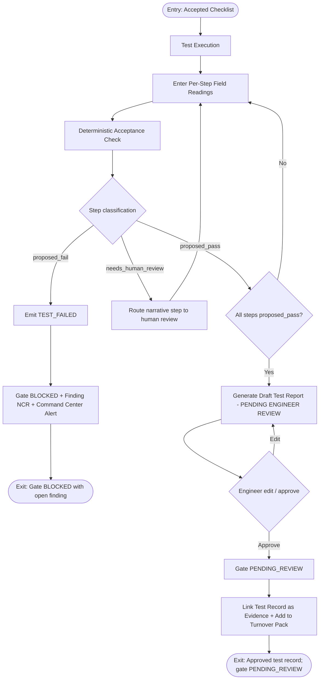

### Flow: Track Shipments and Handle Delay (US-19–US-23)
**Entry point:** Project Dashboard
1. The MEP package manager opens the `Supply Chain Map` and its `Shipment Navigator`; shipments render on a Leaflet map with red/amber/green status alongside a navigator table.
2. The manager clicks a navigator row to zoom the map to that shipment's origin→destination route.
3. The app polls (~30s) the live AIS vessel position, falling back to great-circle interpolation when AIS is unavailable, with each position transparently labelled live or simulated.
4. The app computes a deterministic weather-adjusted ETA (an additive delay-factor multiplier on remaining transit duration, using weather at origin, current position, and destination) and classifies status against the required-on-site date minus a configurable buffer (🟢 on-time / 🟡 at-risk / 🔴 delayed).
5. On a status change into at-risk/delayed, `SHIPMENT_DELAYED` emits into the existing `schedule_events` → delta-detector → CP-SAT re-solve pipeline and raises a `Command Center` alert, deduplicated against the last-notified status so the ~30s poll cannot spam repeat emits.
6. On a return to on-time, `SHIPMENT_RECOVERED` emits to clear the stale alert rather than leaving a delayed status latched.
**Exit point:** Shipments visible with live, deterministically-classified status; material status changes fed once into the schedule pipeline and surfaced in the Command Center.

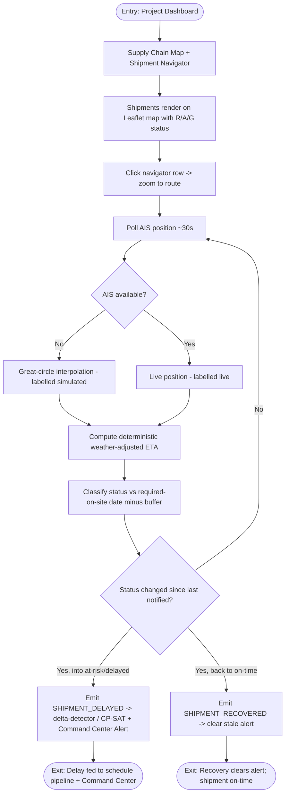

## Edge Cases in Flow

- Any authenticated screen redirects to `Login` after session expiry and returns the user to the original route after reauthentication.
- A `403` response shows an access-denied state and does not reveal whether an inaccessible record exists.
- Network failures preserve unsent field evidence locally as `Pending Sync`; authoritative readiness never changes from a local-only capture.
- Concurrent edits show a conflict state and require reload before a review or decision can be saved.
- Empty projects show setup tasks and `UNKNOWN` readiness, never `READY`.
- Failed jobs expose a retry action and job identifier; retries are idempotent.

### Schedule Module Edge Cases

- Unauthenticated or unauthorized access to `Schedule Baseline Setup`, `Task Record Review Queue`, `Schedule & Critical Path Board`, `Event Log / Trigger Entry`, or `Re-solve Explainer` redirects to `Login` or shows an access-denied state without revealing record existence.
- A network failure, validation error, or API timeout during upload, extraction, or event logging shows a retryable error and preserves the prior valid state; retries are idempotent.
- A solver timeout on either the baseline solve or a re-solve enters an explicit `SOLVE_FAILED` state with a retry action and job identifier; the prior schedule version remains untouched until a retry succeeds.
- Session expiry mid-flow (e.g., mid-review in the `Task Record Review Queue` or mid-event-entry) redirects to `Login` and returns the user to the same screen and unsaved-safe state after reauthentication.
- An infeasible deadline after a re-solve never fails silently: the solver returns a complete schedule with the minimum unavoidable overrun and the bottleneck constraint identified, surfaced directly on the `Schedule & Critical Path Board` and in the `Re-solve Explainer`.
- An ambiguous or missing extracted field (task or resource-capacity) is flagged in the `Task Record Review Queue` and blocks one-click auto-accept; the reviewer must resolve or explicitly reject it.
- A dependency cycle detected among accepted task records blocks the CP-SAT solve at `Dependency Graph Validation` with a clear, human-actionable error rather than silently dropping an edge.
- Two events logged concurrently against the same task are serialized through the delta-detector/solve pipeline; the second event's re-solve runs against the already-updated schedule state rather than racing the first.
- An event reported against a task that no longer exists in the current schedule version is rejected with an explicit error and never silently ignored or misapplied.
- A Gemini API extraction or explanation failure/timeout leaves the prior schedule version and status untouched and surfaces a retryable error rather than a partially-applied schedule.
- Schedule delay or critical-path status shown in the `Schedule Status Panel` on the gate view never alters the deterministic `READY`/`BLOCKED`/`IN_REVIEW`/`UNKNOWN` computation.

### Commissioning QA Copilot Edge Cases

- Unauthenticated or unauthorized access to `IST Checklist Workspace`, `Test Execution`, or the `Command Center` redirects to `Login` or shows an access-denied state without revealing record existence.
- No checklist is generated until the selected standards and procedures are ingested into the RAG store with clause/section metadata and source citations.
- The LLM returns a malformed or schema-invalid checklist JSON: the draft is rejected with a clear error and routed for retry/human review rather than partially rendered as a valid checklist.
- The LLM cites a clause ID absent from the ingested-corpus metadata (hallucinated citation): the citation is flagged as unverifiable and never shown as verified.
- A narrative/qualitative acceptance criterion is never auto-passed or auto-failed; it is always routed to `needs_human_review`.
- A generated draft checklist is advisory only and never treated as an accepted or authoritative test procedure until an engineer accepts it at the draft-acceptance gate.
- A `proposed_fail` never silently passes: it emits `TEST_FAILED`, raises the finding, sets the gate `BLOCKED`, and surfaces a `Command Center` alert as one atomic outcome recorded in the audit trail.
- Test-step state and readings persist so an interrupted execution can be resumed without loss; the executing engineer and timestamp are recorded per reading.
- A completed all-pass test sets the gate to `PENDING_REVIEW`, never `READY`; only an authorized approver transitions it further, preserving the AI-advisory boundary.
- The draft test report is exportable only after engineer approval; the "DRAFT — PENDING ENGINEER REVIEW" label persists until approval.

### Supply Chain Agent Edge Cases

- Unauthenticated or unauthorized access to the `Supply Chain Map`, `Shipment Navigator`, or `Command Center` redirects to `Login` or shows an access-denied state without revealing record existence.
- AIS is unavailable: the shipment position falls back to great-circle interpolation and is transparently labelled simulated rather than live.
- The Open-Meteo weather service is unavailable: the deterministic delay factor defaults to 0 (no weather adjustment) rather than blocking or guessing an ETA.
- Delay detection, ETA, and R/A/G status are deterministic threshold math, never LLM output; ETAs are labelled estimates, never guaranteed delivery dates.
- Duplicate or stale `SHIPMENT_DELAYED` emissions from the ~30s poll are suppressed by deduplication against the last-notified status; only a genuine status change emits an event.
- A shipment that returns to on-time emits `SHIPMENT_RECOVERED` to clear the stale `Command Center` alert rather than leaving a delayed status latched.
- The agent surfaces risk only: emitting `SHIPMENT_DELAYED`/`SHIPMENT_RECOVERED` never itself reschedules, changes a gate status, selects a vendor, or modifies a PO; the schedule effect is produced only by the downstream delta-detector → CP-SAT re-solve.
- Port congestion is a manual boolean flag, not a live feed; planned transit duration defaults to a configurable placeholder when absent.

## Navigation Map

- `Login`
- `Project List`
  - `Create Project`
  - `Project Dashboard`
    - `Project Settings`
    - `Source Library`
      - `Upload Source`
      - `Processing Status`
      - `Requirement Review Queue`
        - `Requirement Detail`
    - `Readiness Board`
      - `Gate Review`
        - `Schedule Status Panel` (linked schedule/critical-path context, read-only)
      - `Blocker Detail`
        - `Finding Detail`
      - `Evidence Detail`
      - `Test Run Detail`
    - `Field Capture`
    - `Schedule Baseline Setup`
      - `Upload Schedule Source`
      - `Extraction Processing Status`
      - `Task Record Review Queue`
        - `Task Record Detail`
      - `Dependency Graph Validation`
      - `Baseline Solve Job`
    - `Schedule & Critical Path Board`
      - `Event Log / Trigger Entry`
      - `Re-solve Job Status`
      - `Schedule Version History`
        - `Re-solve Explainer`
        - `Schedule Version Diff`
    - `IST Checklist Workspace` (Commissioning QA Copilot)
      - `Checklist Review` (draft-acceptance gate)
      - `Test Execution`
        - `Draft Test Report` ("DRAFT — PENDING ENGINEER REVIEW")
    - `Supply Chain Map`
      - `Shipment Navigator` (click-to-zoom table)
    - `Command Center` (unified alerts: TEST_FAILED, SHIPMENT_DELAYED / SHIPMENT_RECOVERED, cross-linked to the affected gate/finding/schedule impact)
    - `Exports`
      - `Export Preview`
      - `Export Job`
      - `Manifest Verification`
    - `Decision History`
