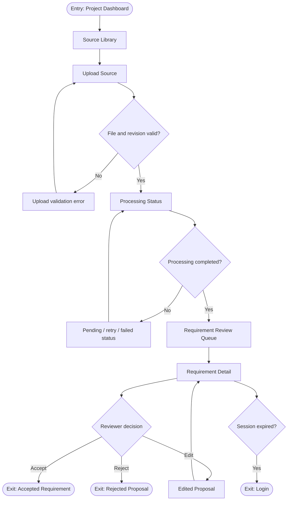
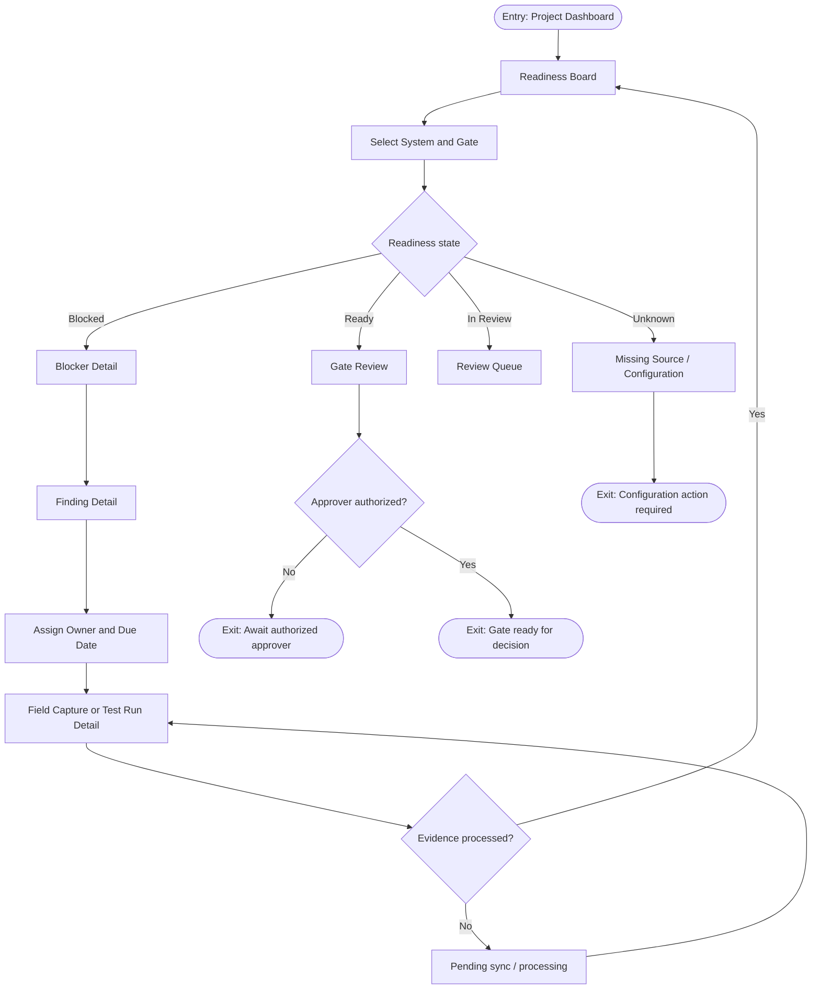
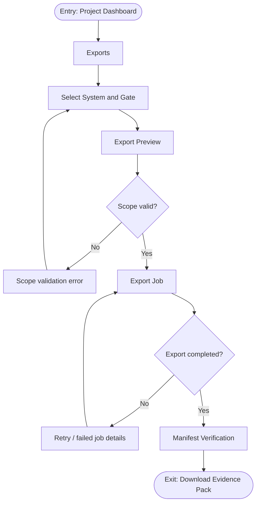

# Pramana Cx Application Flow

## Primary User Flows

### Flow: Create Project and Configure Access
**Entry point:** Project List
1. The administrator opens `Create Project` and enters project name, code, timezone, and retention policy.
2. The app validates required fields and checks the project code for duplicates.
3. The administrator creates the project and lands on `Project Settings`.
4. The administrator invites members and assigns project roles.
5. The app records membership changes and shows the `Project Dashboard`.
**Exit point:** Project Dashboard with configured members.

### Flow: Ingest and Review Requirements
**Entry point:** Project Dashboard
1. A reviewer opens `Source Library` and selects `Upload Source`.
2. The app validates file type, size, project membership, and revision metadata.
3. The upload enters `Processing Status` while the source is stored and extracted.
4. The reviewer opens `Requirement Review Queue` and selects a proposal.
5. The reviewer accepts, edits, or rejects the proposal with its source citation visible.
6. Accepted requirements appear in `Requirement Detail` and can be related to systems, assets, gates, and evidence.
**Exit point:** Accepted requirement available to the readiness engine, or rejected proposal retained for audit.

### Flow: Review Gate Readiness and Resolve Blockers
**Entry point:** Project Dashboard
1. The commissioning manager opens `Readiness Board` and selects a system and gate.
2. The app loads the current rules version and displays `READY`, `BLOCKED`, `IN_REVIEW`, or `UNKNOWN`.
3. The manager opens a blocker to view `Evidence Detail`, source citations, related assets, and owner.
4. The manager creates or updates an action in `Finding Detail` and assigns an owner and due date.
5. The owner uploads evidence or records a test result through `Field Capture` or `Test Run Detail`.
6. The readiness engine recalculates after processing and shows the changed blocker set.
**Exit point:** The gate is ready for approval, or remains visibly blocked with assigned actions.

### Flow: Approve or Reject a Gate
**Entry point:** Gate Review
1. The approver opens `Gate Review` and verifies the readiness explanation and evidence baseline.
2. The app checks the approver's project role and TOTP-enabled session.
3. The approver selects approve, reject, or waive and enters a reason.
4. The app stores the evidence baseline, rule version, actor, and decision timestamp.
5. The app updates the gate status and sends the user to `Decision History`.
**Exit point:** Recorded decision with an immutable audit event.

### Flow: Capture Evidence Offline and Sync
**Entry point:** Field Capture
1. The field engineer opens `Field Capture` and selects an asset or gate.
2. The engineer records a photo, observation, measurement, or test result.
3. The app validates required fields and stores the item as `Pending Sync` when offline.
4. When connectivity returns, the app uploads the item and shows `Processing`.
5. The server validates the source and assigns `Accepted`, `Rejected`, or `Needs Review`.
**Exit point:** Evidence is visible with an explicit server-confirmed state.

### Flow: Export Turnover Evidence Pack
**Entry point:** Project Dashboard
1. The operations-readiness lead opens `Exports` and selects a system and gate.
2. The app previews included accepted evidence, decisions, audit history, and source references.
3. The user requests an export and the app creates an `Export Job`.
4. The exporter builds the pack and hash manifest from a versioned evidence baseline.
5. The user downloads the pack through a short-lived signed URL or retries a failed job.
**Exit point:** Downloadable pack with manifest hash and verification metadata.

## Edge Cases in Flow

- Any authenticated screen redirects to `Login` after session expiry and returns the user to the original route after reauthentication.
- A `403` response shows an access-denied state and does not reveal whether an inaccessible record exists.
- Network failures preserve unsent field evidence locally as `Pending Sync`; authoritative readiness never changes from a local-only capture.
- Concurrent edits show a conflict state and require reload before a review or decision can be saved.
- Empty projects show setup tasks and `UNKNOWN` readiness, never `READY`.
- Failed jobs expose a retry action and job identifier; retries are idempotent.

## Navigation Map

- `Login`
- `Project List`
  - `Create Project`
  - `Project Dashboard`
    - `Project Settings`
    - `Source Library`
      - `Upload Source`
      - `Processing Status`
      - `Requirement Review Queue`
        - `Requirement Detail`
    - `Readiness Board`
      - `Gate Review`
      - `Blocker Detail`
        - `Finding Detail`
      - `Evidence Detail`
      - `Test Run Detail`
    - `Field Capture`
    - `Exports`
      - `Export Preview`
      - `Export Job`
      - `Manifest Verification`
    - `Decision History`
