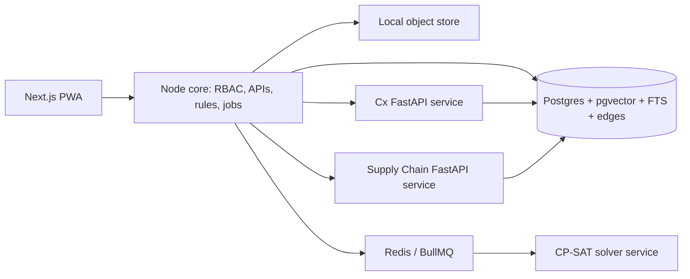

# Pramana Cx — Canonical Build Plan and Schema

**Status:** Approved implementation baseline
**Purpose:** This is the single build contract for the hackathon prototype. It reconciles the product blueprint, the PlanBoard documents, and the Commissioning QA Copilot and Supply Chain Visibility & Risk Agent specifications. If an earlier document conflicts with this one, this document governs. `TRD.md` and `Schema.md` remain the detailed API and column references where they do not conflict.

## Product We Will Build

Pramana Cx is a project-scoped, audit-first commissioning control room for data-centre EPC projects. For one pilot project, one system, and one commissioning gate, it must show what is required, what proves it, what is missing/failed/stale, who owns the next action, and whether the gate can be approved. Every claim must resolve to a source region, content hash, and audit history.

The hackathon scenario is a **chilled-water plant at the L4 Integrated Systems Test gate**, using synthetic, clearly-labelled project records and standards excerpts. It is a responsive web application with an offline evidence-capture queue; AI-dependent tasks require connectivity.

## Non-Negotiable Rules

- Postgres, the local object store, and the append-only `audit_events` chain are the only durable sources of truth.
- AI may extract, retrieve, classify, summarize, draft, and suggest. It must not approve requirements, set a gate to ready/approved, close a finding, grant a waiver, sign a test, choose a vendor, change a PO, or set schedule dates.
- Only accepted requirements and accepted evidence affect deterministic readiness.
- Only CP-SAT computes schedule dates, critical path, and feasibility. Models may extract task/resource proposals and explain a completed solve, never alter it.
- Every agent result is tenant- and project-scoped, source-cited, auditable, and subject to configured human authority.
- The demo uses only synthetic standards excerpts. Proprietary or customer documents require explicit machine-processing rights.

## Resolved Contradictions

| Topic | Final decision |
|---|---|
| Cloudflare blueprint vs. local plans | Build locally: Next.js/Node, Postgres, MinIO/filesystem object storage, Redis/BullMQ, Docker. Cloudflare is a later deployment option, not an MVP dependency. |
| Core platform vs. Bhavik agent stores | Postgres, object storage, and `edges` are authoritative. Chroma and Neo4j/NetworkX in the Cx and Supply Chain services are working stores only and never drive readiness, findings, gates, or schedules. |
| Model-provider rule vs. direct Gemini | The core, schedule, compliance, risk, and knowledge modules use `ModelProvider`. Direct Gemini is isolated to the two committed Python services; it must not leak into the core. |
| All-pass Cx test status | An approved all-pass report creates evidence and sets the gate to `in_review` (UI: **Pending review**), never `ready`. Only the authorized TOTP approver records `approved`. |
| Failed Cx test | A deterministic `proposed_fail` creates a blocking finding and changes the gate to `blocked` as a safety control. The engineer reviews/corrects it; this is not AI certification. |
| Cx report/evidence storage | Reports are immutable object-store artifacts. On engineer approval, they materialize shared `evidence` and typed `edges`; they are never stored only in Neo4j. |
| Supply Chain scope | Track critical, single-leg shipments only. Maritime legs can use AIS; air/rail/road or absent AIS uses clearly-labelled simulated/manual location. ETA and R/A/G are deterministic estimates, never guarantees. |
| Predictive risk | The limited periodic risk engine is in scope. It detects material risks and proposes mitigations; it never reschedules itself. |
| RFI/knowledge | In scope only when project-scoped, metadata-filtered, and cited. No cross-project retrieval, uncited answers, full GraphRAG, or contractual auto-answering. |
| Offline PWA | Field capture queues offline. Checklist generation, AI drafting, AIS/weather, and approvals require online services. |

## Canonical Architecture

- **Web/core:** Next.js 16, React 19, TypeScript, Tailwind, Radix, Better Auth, TOTP, Drizzle.
- **Core data:** local Postgres with pgvector/full-text search; local MinIO/S3-compatible or filesystem-backed object store; Redis/BullMQ jobs.
- **Solver:** internal, stateless Python OR-Tools CP-SAT service.
- **Cx service:** Python/FastAPI, Chroma, NetworkX/Neo4j working graph, Gemini, PyMuPDF, ReportLab/python-docx. It persists accepted results through the core.
- **Supply Chain service:** Python/FastAPI, AIS/WebSocket, weather client, TurfPy, Leaflet map. It persists shipments/events through the core.
- **Native core agents:** compliance, predictive-risk, and knowledge/RFI use the core stack and its `ModelProvider`.

## Canonical Schema

| Group | Tables | Rule |
|---|---|---|
| Tenant and authority | `tenants`, `users`, `projects`, `project_members` | All reads/writes carry tenant/project predicates; roles include admin, commissioning manager, reviewer, field engineer, approver, viewer, scheduler. |
| Controlled sources | `documents`, `document_versions`, `source_regions` | Originals are immutable and hashed; regions retain page/bounding-box/text/hash citations. |
| Commissioning graph | `systems`, `assets`, `gates`, `requirements`, `evidence`, `findings`, `edges`, `decisions`, `audit_events` | Typed relationships include `REQUIRES`, `PROVES`, `AFFECTS`, `PRECEDES`, `SUPERSEDES`, `TRACKS`; every material mutation is audited. |
| Controlled tests | `test_procedures`, `test_steps`, `test_runs` | Human-authored procedure path converging on shared evidence/findings/gates. |
| Schedule | `schedule_tasks`, `resources`, `schedule_versions`, `scheduled_tasks`, `schedule_events` | Tasks/resources require review; schedule versions are append-only and hash-linked. |
| Cx Copilot | `cx_checklists`, `cx_checklist_steps`, `cx_clause_citations`, `cx_test_records`, `cx_step_results` | Draft lifecycle; only engineer-approved reports materialize shared evidence; every clause citation is verified. |
| Supply chain | `shipments` | Shipment-to-asset uses `TRACKS`, shipment-to-task uses `AFFECTS`, and transition dedup state is persisted. |
| Other agents | `compliance_checks`, `schedule_risks`, `risk_signal_readings`, `knowledge_chunks`, `alerts` | Derived/advisory records cross-link to sources, findings, events, tasks, gates, and audit history. |

### State rules

- Requirements: `proposed → accepted | edited | rejected`; only accepted records influence readiness or compliance.
- Evidence: `pending → accepted | failed | rejected`; accepted evidence can become `stale` after a source/asset/test change.
- Gates: `not_started`, `in_review`, `ready`, `blocked`, `approved`. Cx all-pass maps to `in_review`; a deterministic Cx failure maps to `blocked`; only an approver can set `approved`.
- Cx steps: numeric/boolean yields `proposed_pass` or `proposed_fail`; narrative/qualitative always yields `needs_human_review`; reports remain `draft` until approved.
- Schedule tasks/resources require human acceptance; versions are immutable and store feasible result or explicit overrun/bottleneck.
- Shipment events emit only on genuine status change. Recovery clears the active delay alert while retaining history.
- Risks are unique by `(project, task, risk_type)`, re-emitted only on material change, and self-resolve to `resolved`.

### Integrity rules

- Every requirement, compliance flag, checklist citation, RFI claim, schedule proposal, and agent finding resolves to source region, document version, and content hash.
- Gate decisions store their reviewed evidence baseline. Upstream changes stale the baseline rather than overwrite it.
- No agent-local Chroma/Neo4j data is authoritative.
- Shipment/risk fan-out stores one event per affected task; alert dedup is by subject/state transition, never by poll iteration.

## Complete Feature Backlog and Implementation Steps

### Foundation and evidence control plane

1. **Project setup, RBAC, and approval authority**
   - Build tenant/project/member models, project creation, role assignment, sessions, and TOTP approval actions.
   - Enforce tenant/project predicates and audit role changes.
   - Configure pilot system, gate, document precedence, retention, and synthetic imports.

2. **Source Library and versioned ingestion**
   - Accept PDF, CSV, XLSX, image, and email-export files; validate, hash, store, and detect duplicates/revisions.
   - Extract text/tables/page regions asynchronously and show retryable job status.
   - Deliver cited source viewer and archive-with-history behavior.

3. **Requirement extraction and review queue**
   - Generate schema-validated requirement proposals with modality, value, unit, tolerance, confidence, and exact citation.
   - Implement accept/edit/reject/duplicate/assignment workflow; reject invalid units or uncited output.
   - Allow only accepted requirements into graph and readiness processing.

4. **System, asset, gate, and evidence graph**
   - Import/manage systems, asset tags, gates, procedures, and typed edges.
   - Capture evidence with owner, timestamp, hash, validity, and citation.
   - Display connected requirement, asset, evidence, test, finding, and decision context.

5. **Deterministic readiness and blocker actions**
   - Implement missing/failed/stale/unapproved evidence, prerequisite, and blocking-finding rules.
   - Show `UNKNOWN`, `BLOCKED`, `IN_REVIEW`, `READY`, and `APPROVED` with exact reason and owner.
   - Build findings/actions, assignments, due dates, comments, resolution review, and notification hooks.

6. **Change blast radius and stale evidence**
   - Diff source revision regions/clauses/tables and traverse `SUPERSEDES`/`AFFECTS` edges.
   - Mark impacted evidence/decisions stale without overwriting history.
   - Provide re-review and reassessment workflows.

7. **Field capture and offline queue**
   - Deliver responsive PWA capture for photos, measurements, comments, and readings.
   - Persist offline writes with pending/sync/failure states and idempotent reconciliation.
   - Add QR/deep links; queued evidence is never shown as accepted.

8. **Gate decision and turnover export**
   - Require approver role/TOTP and store approve/reject/waive reason plus evidence baseline.
   - Generate immutable evidence packs with sources, hashes, rule/model versions, audit history, and manifest verification.
   - Support preview, download, retention, and audit logs.

### Schedule management

9. **Schedule source ingestion and task/resource proposals**
   - Ingest contracts, timelines, POs, and approvals through shared sources.
   - Use `GeminiModelProvider` to propose tasks, duration, dependencies, vendor/lead time, deadlines, and resource capacity with citations.
   - Route missing/ambiguous fields to mandatory review; create validated `PRECEDES` edges.

10. **Schedule review and baseline CP-SAT solve**
   - Build task/resource accept/edit/reject queues; only accepted rows are solvable.
   - Detect cycles, call CP-SAT with capacities/deadlines/fixed work, and report explicit infeasibility/bottleneck.
   - Persist immutable baseline, dates, critical path, and audit history.

11. **Event-driven re-solve, history, and explanation**
   - Accept approved/shipment/weather/risk events through one endpoint and serialize concurrent task events.
   - Run delta detection before warm-start re-solve; unaffected events update status only.
   - Persist version diff/history and generate an AI-labelled explanation after the deterministic version is saved.

12. **Predictive Schedule Risk Engine**
   - Poll swappable procurement, lead-time, workforce, and weather clients; record data-unavailable readings explicitly.
   - Evaluate materiality against the current schedule, persist deduplicated risks, and propose mitigations.
   - Emit `predicted_risk_delay` only on material change; never call the solver or change dates itself.

### Commissioning QA Copilot

13. **Standards/procedure ingestion and draft checklists**
   - Ingest synthetic standards/procedures via shared sources and index the agent working store.
   - Generate schema-validated draft checklist for system/gate/equipment; reject malformed drafts.
   - Verify each cited clause against corpus metadata; require engineer checklist acceptance.

14. **Guided IST execution and deterministic acceptance**
   - Build resumable step UI for numeric/text readings and progress.
   - Apply deterministic numeric/threshold and boolean/presence rules; label verdicts `proposed_*`.
   - Force narrative criteria to `needs_human_review`; create blocking failure only for deterministic `proposed_fail`.

15. **Draft report, evidence linkage, and handover**
   - Generate editable **DRAFT — PENDING ENGINEER REVIEW** reports.
   - On engineer approval, store immutable artifact, create shared evidence/`PROVES`/`AFFECTS` edges, and move gate to `in_review`.
   - Allow export and turnover inclusion only after approval.

### Supply Chain Visibility and Risk

16. **Shipment registry, map, and navigator**
   - Create single-leg records with equipment, coordinates, MMSI, planned ETA, required-on-site date, and manual port-congestion flag.
   - Render Leaflet/OSM map, antimeridian-safe great-circle route, origin/destination/current marker, and clickable navigator table.
   - Clearly label all positions live AIS or simulated and include OSM attribution.

17. **ETA/status computation and schedule-event fan-out**
   - Poll AIS/weather behind swappable clients; degrade to simulated position and zero weather factor with explicit reason on outages.
   - Compute ETA/R-A-G deterministically against buffer/required-on-site date and label it an estimate.
   - Emit delayed/recovered events once per genuine transition, fan out to affected tasks, and clear recovery alerts.

### Other agents and product surfaces

18. **Specification and Quality Compliance**
   - Compare submittal/PO/shop-drawing text callouts against accepted requirements with exact clause-vs-line citations.
   - Deterministically flag numeric/categorical/boolean deviations; route qualitative comparison to human review only.
   - Ground equivalence in cited standard or approved-equal precedent, otherwise downgrade to engineering judgment; create proposed findings only.

19. **Project Knowledge, similar RFIs, and graph/timeline**
   - Create per-document-type pgvector/FTS chunks with tenant/project/system/asset/gate/date/revision metadata.
   - Apply deterministic metadata filters before vector search, traverse existing `edges`, and drop uncitable claims.
   - Provide cited Q&A, project-scoped similar-RFI suggestions, and live graph/timeline from `edges`/`audit_events`.

20. **Command Center**
   - Consume `TEST_FAILED`, `SHIPMENT_DELAYED`, `SHIPMENT_RECOVERED`, and `predicted_risk_delay` into `alerts`.
   - Cross-link alert to finding/gate/task/schedule impact; deduplicate transitions and retain cleared history.
   - Keep it read-only: it never changes readiness, a finding, or a schedule.

### Differentiators, after the core loop

21. **Evidence entropy / weak-evidence score**
   - Define deterministic signals: evidence over-reuse, unsigned/stale records, missing calibration, circular edges, low-confidence extraction, overloaded approver.
   - Compute transparent drill-down score; keep advisory and separate from readiness until validated.

22. **Teach-Back Mode**
   - Capture reviewer rationale when correcting an AI proposal/disposition.
   - Store it as project-scoped, cited precedent with reviewer attribution.
   - Surface it as advice for similar future review; never auto-apply it.

### Supporting UX, operations, and quality features

23. **Project dashboard, navigation, search, and notifications**
   - Build Overview cards for gate readiness, urgent blockers, stale evidence, pending reviews, schedule risk, and active alerts.
   - Provide project switcher, global exact/semantic search, context drawer, source/evidence deep links, keyboard help, and a visible online/offline/sync state.
   - Add notification inbox for assignments, overdue actions, failed jobs, review requests, and approval requests; realtime updates must refresh views without bypassing authorization.

24. **Purpose-built workflow screens and safe UI states**
   - Deliver Sources, Requirements, Systems, Readiness, Actions, Field Capture, Changes, Turnover, Audit/Settings, Schedule, Cx, Shipment, Compliance, Knowledge, and Command Center screens.
   - Implement loading, empty, filtered-empty, error/retry, access-denied, offline, conflict, superseded/stale, and unknown states on every stateful workflow.
   - Never style unknown/missing data as success; show the missing source, rule, mapping, or authority and the next valid action.

25. **Security, observability, and evaluation harness**
   - Apply signed object access, secure sessions, rate limits, MIME/magic-byte validation, sanitized rendered text, audit-chain verification, and no-secrets/no-raw-customer-fixture rules.
   - Instrument jobs, solver calls, agent calls, retries, and event chains with structured logs/traces; separate operational telemetry from the product audit trail.
   - Build golden sets and automated unit/contract/browser/accessibility tests for citations, extraction/unit validation, readiness, solver feasibility, Cx deterministic verdicts, event dedup, tenancy, and offline sync.

## Delivery Sequence and Exit Criteria

1. **Foundation:** features 1–3, audit chain, storage, RBAC, citations, synthetic golden data.
2. **Tracer loop:** features 4–5 for requirement → evidence → readiness, and features 9–10 for accepted tasks → baseline solve → version.
3. **Core pilot loop:** features 6–8 and 11; revision → stale evidence → blocker/action → decision → verified turnover pack.
4. **Agent loop:** features 13–20; Cx checklist/failure/report, shipment transition/re-solve, then compliance/risk/knowledge/alerts.
5. **Hardening:** authorization, audit verifier, citation/schema validation, event-dedup golden tests, solver failures, offline sync, accessibility, scans, and scripted demo seed.

The pilot is complete only when the demo shows an initially unknown gate; cited requirement acceptance; a deterministic blocker; Cx step execution; a shipment/risk schedule impact; a revision that stales evidence; authorized approval; and a verified turnover manifest.

## Deferred / Not in This Build

- Multi-system/multi-gate rollout, multi-mode scheduling, trained duration/portfolio forecasting, and autonomous mitigation selection.
- Multi-leg/multi-tier supply chain, live port congestion, route optimization, alternative sourcing, customs/cost analytics, and native ERP/P6/CDE write-back.
- Live BMS/EPMS telemetry, multimodal photo analysis, CAD/BIM geometry comparison, multilingual standards, and cross-project standards learning.
- Cross-project RFI retrieval, uncited chatbot answers, full GraphRAG, model fine-tuning, blockchain notarization, WhatsApp capture, and native mobile apps.

## Documents Reviewed

`README.md`, `docs/PRODUCT_BLUEPRINT.md`, all `PLANNER/*.md` planning documents, `Commissioning_Quality_Assurance_Copilot.md`, and `Supply_Chain_Visibility_Risk_Agent.md`.
