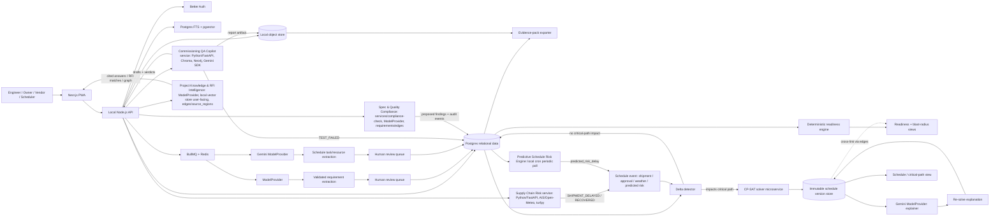

# Pramana Cx Technical Requirements Document

The MVP is a project-scoped commissioning evidence system with two integrated modules: (1) an **evidence control plane** that ingests authorized source files, creates human-reviewed structured requirements, relates them to systems, assets, gates, tests, evidence, findings, and decisions, computes deterministic readiness, and exports a verifiable turnover pack; and (2) a **Proactive Schedule Management module** that extracts task/resource-capacity records from vendor contracts, timelines, POs, and government approval documents, builds and deterministically re-optimizes a baseline schedule via a CP-SAT solver, and generates human-readable explanations of each re-solve. Both modules share the same tenant/project isolation, typed-edges provenance graph, RBAC, and AI-advisory-only boundary: AI proposes and explains; only deterministic engines (the readiness rules module, the CP-SAT solver) and authorized humans set state. Two additional domain agents — a **Commissioning Quality Assurance Copilot** and a **Supply Chain Visibility & Risk Agent** — are integrated in this document as separate Python agent-services that respect the same AI-advisory-only boundary while adopting a distinct local Python tech stack (see "Agent-services integration approach" and the dedicated agent sections below). Three further domain agents — a **Specification & Quality Compliance Agent**, a **Predictive Schedule Risk Engine**, and a **Project Knowledge & RFI Intelligence Agent** — complete the five-agent suite; unlike the two Python agents, these three run natively on the committed local stack (the `ModelProvider` interface, Postgres + the `edges`/`source_regions` typed graph, pgvector, Postgres full-text search, and the local cron/job scheduler), extending rather than diverging from it, and each remains advisory-only under the same review/audit/citation rules.

## Tech Stack

| Layer | Choice | Rationale |
|---|---|---|
| Web | Next.js 16.x, React 19.x, TypeScript, Tailwind CSS, Radix primitives | Supports a responsive dashboard and PWA — including the readiness board and schedule/Gantt/critical-path views — from one typed codebase. |
| Runtime/API | Local Node.js server running Next.js (self-hosted, `next start` / Node process on localhost) | Provides the API and web delivery from a self-hosted Node process on localhost, for both evidence and schedule endpoints. |
| Relational store | Local Postgres with Drizzle ORM | Supports normalized project data, foreign keys, migrations, and bounded graph traversals, extended with schedule tables (`schedule_tasks`, `schedule_versions`, `resources`, `schedule_events`). |
| Object store | Local object storage — MinIO (S3-compatible) or filesystem-backed storage on disk | Stores originals (including vendor contracts/timelines/POs/approval docs), page renders, exports, and manifests via S3-compatible local object storage. |
| Search | Postgres full-text search (tsvector) plus pgvector | Combines exact model/part/clause search with project-scoped semantic retrieval; the pgvector store serves internal task-to-system/asset and clause/precedent matching during extraction/classification, and is additionally **user-facing** for the Project Knowledge & RFI Intelligence Agent's scoped semantic search (mandatory-first metadata-filtered to the tenant/project/system/asset/gate/doc_type/date/revision subset, never a global query). |
| Jobs | BullMQ on local Redis | Provides retryable ingestion, fan-out, and human-review checkpoints; orchestrates the schedule pipeline (extraction → review → solve → explain) and the event → delta-detector → re-solve pipeline, with each external solver call as a discrete, retryable job. A scheduled local cron/job trigger also drives the Predictive Schedule Risk Engine's periodic poll. |
| Auth | Better Auth with project-scoped RBAC and TOTP, running in the local Node server | Keeps authorization decisions inside the application boundary; unchanged and reused as-is for the schedule module (no new auth mechanism introduced — same roles, e.g. project scheduler/planner, gain scoped permissions on schedule endpoints). |
| AI (evidence extraction) | A configurable model provider behind an internal `ModelProvider` interface; BYOK and private adapters | Allows evaluation and model replacement without coupling readiness logic to one provider. |
| AI (schedule extraction/explanation) | Gemini API, accessed only through a second concrete `ModelProvider` adapter (`GeminiModelProvider`) | Per PRD/StructuredPlan assumption, schedule extraction and explanation use Gemini rather than the default provider/Claude. Implementing it as another `ModelProvider` adapter — rather than calling the Gemini SDK from the schedule services directly — preserves the existing "no direct vendor SDK calls outside a provider adapter" rule; it is a second provider implementation, not an exception to it. |
| **Schedule solver** | **CP-SAT (Google OR-Tools) run in a dedicated solver microservice**, invoked from a local job step over an internal HTTP API | See justification below. |
| PDF/tabular processing | PDF.js and SheetJS community | Supports source rendering and controlled spreadsheet imports for both requirement documents and vendor contracts/timelines/POs. |
| Observability | OpenTelemetry, structured audit logs, Sentry for UI errors | Separates operational diagnostics from product audit evidence; extended to trace solver latency and re-solve trigger chains. |
| Testing | Vitest, Playwright, MSW, axe-core, API contract tests | Covers deterministic rules (readiness engine and CP-SAT wrapper), browser workflows, mocked providers (including a mocked solver service and mocked Gemini adapter), and accessibility. |
| CI/security | GitHub Actions, CodeQL, Dependabot, Trivy, Gitleaks | Adds repeatable quality and secret/container scanning gates; Trivy also scans the solver microservice's container image. |
| **Commissioning QA Copilot agent-service** | **Python/FastAPI service** — Chroma (standards/procedure RAG), Neo4j/NetworkX (internal test↔gate↔equipment working graph), Gemini 2.5 Flash + Gemini embeddings via direct SDK, PyMuPDF, ReportLab/python-docx for report export; React 19 + Tailwind/Zustand/TanStack Query step-execution UI | Adopted as this agent's committed stack per user direction — a distinct local Python stack alongside the platform's Node/`ModelProvider` stack, not a divergence from any Cloudflare baseline. Integrated as a separate agent-service invoked by / integrated with the local Node core — the same reconciliation pattern as the CP-SAT solver microservice, not an exception. See "Agent-services integration approach — committed local architecture" below. |
| **Supply Chain Visibility & Risk agent-service** | **Python/FastAPI service** — `websockets` (aisstream.io AIS), `httpx` (Open-Meteo weather), `turfpy` (great-circle interpolation), Chroma, Neo4j/NetworkX, in-process `asyncio` event bus; React 19 + Leaflet/React-Leaflet, Tailwind/Zustand/TanStack Query UI, OpenStreetMap tiles (ODbL, attributed) | The same committed local architecture; a second separate Python agent-service integrated with the local Node core, emitting `schedule_events` into the existing delta-detector → CP-SAT re-solve pipeline. See "Agent-services integration approach — committed local architecture" below. |
| **Specification & Quality Compliance agent-service** | **`services/compliance-check` on the committed local stack** — Node/TypeScript, the existing `ModelProvider` adapter, Postgres `requirements`/`findings`/`edges`, pgvector + Postgres full-text search for standards-clause/approved-equal-precedent retrieval, and tool-callable `lookup_standard_clause`/`check_precedent`/`compare_spec_values` | **No stack override.** It extends, not duplicates, the existing requirement-extraction/evidence-graph pipeline — adding a comparison step (submittal/PO/shop-drawing text callout vs. accepted `requirement`) and shop drawings as an ingested text-callout `doc_type` — and reuses the platform's `ModelProvider`/`requirements`/`edges` infrastructure rather than a parallel stack. |
| **Predictive Schedule Risk Engine** | **A single local cron/job periodic-poll worker on the committed stack** — reads the latest `schedule_versions`/critical path, polls external procurement/lead-time/workforce/weather-forecast feeds, and emits `predicted_risk_delay` `schedule_events` | **Single periodic-poll agent, not a multi-agent system, and no stack override.** Native to the local stack; it is a new *producer* of an existing event type into the delta-detector → CP-SAT re-solve pipeline and introduces no new downstream solver logic. |
| **Project Knowledge & RFI Intelligence agent-service** | **Local retrieval service on the committed stack** — the existing `ModelProvider` for synthesis, **the local vector store (pgvector, now user-facing)** for scoped semantic search, Postgres `edges`/`source_regions` typed-graph traversal, Postgres full-text search, and per-doc-type indexes | **No stack override.** A user-facing RAG answer/graph surface scoped by a mandatory-first deterministic metadata filter; it reuses the existing typed graph for structural traversal (not full GraphRAG) and the existing `edges` + `audit_events` tables for the graph/timeline page (no parallel datastore). |

### Solver integration approach — justification

CP-SAT (Google OR-Tools) is a mature, well-maintained, and correct constraint solver; per the Library-First Rule, we use it rather than hand-rolling a scheduling heuristic. The open question is *how* to invoke a C++-based solver from a local Node.js/Next.js stack that is otherwise JS/WASM-only.

**Chosen approach: a dedicated solver microservice**, packaged as a small containerized HTTP service (Python, using the official `ortools` package's `CpSolver`), running as a separate local process (in Docker for the hackathon; on a container platform such as Cloud Run/Fly.io for a pilot). A local job step calls this service with the task DAG, resource capacities, and deadline constraints as JSON, and receives back the solved schedule (or an infeasibility/bottleneck report) as JSON. The job step wraps the call with a timeout and retry, per the NFRs below.

**Rejected alternative: compiling OR-Tools/CP-SAT to WASM and running it inside the Node process.** This was rejected because:
- There is no official OR-Tools WASM build; community attempts are experimental and unmaintained, so adopting one would violate the Library-First Rule's intent (introducing custom build/maintenance risk instead of using a well-maintained library as-is).
- A WASM build would need to be single-threaded (a WASM context here cannot spawn native threads), which materially degrades CP-SAT's practical performance on anything beyond small toy DAGs.
- Bundling a full CP-SAT build into the web process would bloat it and, more importantly, a long solver run would block the Node event loop and couple solver runtime to the request-serving process — a re-solve on a large DAG could legitimately need more time than a web request should hold.
- A separate solver service keeps the Node/Next.js codebase in its existing, well-supported JS/TS toolchain and keeps the solver itself trivially upgradable to newer OR-Tools releases without a WASM recompilation step.

The tradeoff accepted is an additional deployable service and a network hop per solve; this is mitigated by treating every solver call as an idempotent, retryable job (consistent with the existing "durable jobs must be retryable and idempotent" constraint) and by keeping the solver service stateless (all state — the DAG, resource data, prior fixed/completed tasks — is passed in on each call; the service does not itself read Postgres or the object store).

### Agent-services integration approach — committed local architecture

The Commissioning Quality Assurance Copilot and the Supply Chain Visibility & Risk Agent are committed (per StructuredPlan's agent-suite sections and the PRD's US-13–US-23) to a **Python/FastAPI + Chroma + Neo4j/NetworkX + direct Gemini SDK + in-process `asyncio`** stack. Because the whole platform now runs locally (a Node core plus separate Python services), this is not a divergence from a Cloudflare-native baseline but simply the committed polyglot-local architecture for these two agents — a distinct local Python stack alongside the Node/`ModelProvider` stack the rest of the platform uses. This subsection reconciles it architecturally rather than hand-waving it as an exception — using the *same reconciliation pattern already applied to the CP-SAT solver microservice*: these are separate Python services invoked by / integrated with the local Node core, not code running inside the web process and not a second parallel product. (The other three agents — Specification & Quality Compliance, Predictive Schedule Risk Engine, Project Knowledge & RFI Intelligence — carry **no** such separate stack; they run natively on the committed stack and need no reconciliation beyond the ordinary review/audit/citation rules.)

**Integration boundary (how the Node core reaches the agent-services, and how their outputs land back in the platform's stores):**

- **Invocation.** Each agent-service exposes an internal HTTP API. The local Node API is the front door for all authenticated user traffic; it proxies agent-specific requests (checklist generation, step execution, report drafting; shipment registration, map/status reads) to the relevant agent-service over TLS on an internal network, passing only the project-scoped data a given operation needs — mirroring the solver microservice's "authenticated, internal-network requests, no public ingress, no tenant-identifying data beyond what the operation requires" rule. Where a task is long-running (standards ingestion, report drafting), the Node core drives it as a job with the same timeout/retry/idempotency wrapper used for solver calls.
- **Outputs landing back in the system of record.** The agent-services own their local working stores (Chroma for RAG vectors, Neo4j/NetworkX for their internal working graphs) but are **not** the authoritative store for any platform record. Their durable outputs are written back through the local Node core into the platform's systems of record:
  - **Findings, evidence, and audit events** produced by the Commissioning agent (a drafted test record on approval becoming `evidence`; a `TEST_FAILED` producing a `findings`/NCR row and a gate `BLOCKED` transition) are created as normal typed records in **Postgres**, linked through the existing **`edges`** table, and each state change produces an append-only, hash-chained **audit event** — identical to how requirement acceptance and gate decisions already write to the graph. The agent-service proposes; the Node review/decision APIs persist. The agent's own Neo4j/NetworkX graph is a working/derivation structure only, never the authoritative provenance graph.
  - **Report artifacts** (the drafted ReportLab/python-docx test report, and any exported package) are stored as immutable objects in the **local object store**, referenced by hash from the Postgres `evidence`/turnover-pack records, exactly like every other source object and export.
  - **`schedule_events`** emitted by the Supply Chain agent (`SHIPMENT_DELAYED`, `SHIPMENT_RECOVERED`) are ingested through the existing `POST /v1/projects/{id}/schedule/events` path: a delay lands as `schedule_events.event_type = 'shipment_delayed'` and a recovery lands as the distinct `schedule_events.event_type = 'shipment_recovered'` (an enum value Schema.md already defines), both flowing through the same unchanged event → delta-detector → CP-SAT re-solve pipeline. A recovery clears the stale alert and may trigger a re-solve to pull dates back in. No new downstream solver logic is introduced; the agent is simply another producer of existing event types.
  - **Citations/provenance.** Standards excerpts and shipment records the agents ingest are stored and cited through the same **`source_regions`** discipline as the rest of the platform, so every agent-surfaced claim resolves to a source region + content hash.
- **Net effect.** From the platform's point of view, the two agents are peers of the solver microservice: external, stateless-with-respect-to-authoritative-state Python services that the Node core calls and whose results it deterministically persists into Postgres/the object store/the typed graph under the existing review, audit, and citation rules.

**Consequences already flagged — hackathon-local-only vs. genuinely committed:**

| Consequence | Status |
|---|---|
| **Chroma alongside the platform vector store (pgvector)** (a second RAG store) | **Hackathon-local-only** as a *duplication*: the agents run their own Chroma locally because the whole hackathon build is localhost-only (per the existing Q12 assumption). A pilot/production reconciliation would decide whether the agents' RAG consolidates onto pgvector or whether Chroma is retained; that choice is deferred, not committed. |
| **Neo4j/NetworkX alongside Postgres** (a second graph store) | **Hackathon-local-only** as an authoritative store: Postgres + the `edges` table remain the single source of truth for provenance; Neo4j/NetworkX is the agents' *internal working graph* only. Whether a graph DB is retained in production is deferred. |
| **Direct Gemini SDK calls outside the `ModelProvider` boundary** | **Genuinely committed for these two agents** by explicit user override — this is the crux of the divergence. The schedule module's Gemini use remains behind `GeminiModelProvider`; these two agents deliberately do not. A future consolidation behind `ModelProvider` is possible but is not committed here. |
| **In-process `asyncio` event bus vs. the local job queue (BullMQ/Redis)** | **Hackathon-local-only.** The in-process bus is a demo-scoped transport; the platform's durable transport (BullMQ on local Redis) remains the production path, and the agents' emitted events reach the durable schedule pipeline through the Node `schedule/events` endpoint regardless. Durable, replayable orchestrator transport is explicitly not-yet-settled (see the orchestrator event contract below). |

This split is consistent with the existing localhost-only hackathon-build assumption: the *duplicated stores* (Chroma, Neo4j) and the *in-process bus* are local-demo conveniences that a pilot must reconcile, while the *direct-Gemini override* is the one genuinely-committed architectural divergence the user has accepted for these agents. The three native agents (Specification & Quality Compliance, Predictive Schedule Risk Engine, Project Knowledge & RFI Intelligence) do not participate in this split at all — they write directly to Postgres/the object store/pgvector/the typed graph through the committed stack.

### Orchestrator event contract (emerging design)

The full orchestrator agent remains **to be defined later** — its durable transport, routing rules, and replay/ordering semantics are explicitly **not-yet-settled** and are out of scope for this TRD. What *is* pinned down by the agent designs, and recorded here as emerging design, is the **event contract** the orchestrator must eventually carry. Four event types are defined:

| Event type | Emitted by | Emit condition | Payload (per StructuredPlan/PRD) |
|---|---|---|---|
| `TEST_FAILED` | Commissioning QA Copilot | A deterministic acceptance check classifies a step `proposed_fail` (numeric/threshold or boolean/presence). Narrative/qualitative steps route to `needs_human_review` and never emit this event. | Affected test/step, the accepted acceptance criterion and the recorded reading that failed it, affected `gate`, affected `asset`/equipment, source-region citation. Consumed to create a `findings` (NCR) record and set the gate `BLOCKED`. |
| `SHIPMENT_DELAYED` | Supply Chain Visibility & Risk Agent | A shipment's deterministic R/A/G status **changes** into at-risk (🟡) or delayed (🔴). | Affected equipment, old/new ETA, delay days, reason (weather factor / AIS lag / manual port-congestion flag), and affected schedule task(s). |
| `SHIPMENT_RECOVERED` | Supply Chain Visibility & Risk Agent | A previously at-risk/delayed shipment's status **changes** back to on-time (🟢). | Affected equipment, recovered ETA, and affected schedule task(s); clears the prior stale alert. |
| `predicted_risk_delay` | Predictive Schedule Risk Engine | A polled forward-risk signal (procurement status, equipment lead time, workforce availability, or weather forecast) crosses a configurable **materiality threshold** against the current critical path/downstream dependencies. Deduplicated by **task + risk-type**; re-emitted only on material change, never every poll cycle. | Affected task(s), estimated delay/probability, source signal, and one or more mitigation options (proposals only). Lands as `schedule_events.event_type = 'predicted_risk_delay'` and flows through the existing delta-detector → CP-SAT re-solve pipeline; the engine never reschedules or applies an option itself. |

**Dedup rule (shared).** Events are emitted on a **status/state CHANGE only**, never on every poll cycle. The Supply Chain agent polls AIS on a ~30s interval; each shipment's last-notified status is retained, and an emission fires only when the newly-computed status differs from the last-notified one. This prevents 30-second poll spam into the schedule pipeline (one `SHIPMENT_DELAYED` per transition into at-risk/delayed, one `SHIPMENT_RECOVERED` per transition back to on-time, zero duplicate emits within an unchanged-status window). The Predictive Schedule Risk Engine applies the *same intent* with a **task + risk-type** dedup key: it tracks what it has already flagged and re-emits `predicted_risk_delay` only on a material change (and updates its flagged-risk state when a risk self-resolves), so a risk crossing the threshold repeatedly across poll cycles without material change produces no duplicate emit. The Commissioning agent's `TEST_FAILED` is inherently edge-triggered (one per `proposed_fail` step verdict) and carries the same "state change, not re-assertion" intent.

**Fan-out rule (persistence of multi-task payloads).** The `SHIPMENT_DELAYED`/`SHIPMENT_RECOVERED`/`predicted_risk_delay` payload may reference multiple affected schedule task(s), but `schedule_events.schedule_task_id` is a single FK: a delay (or recovery, or predicted risk) affecting N schedule tasks persists as **N `schedule_events` rows — one per affected task** — with the affected tasks resolved via the shipment's/risk's `AFFECTS` edges. The status-change/material-change dedup rule applies **per shipment (or per task + risk-type)**, not per row: one genuine transition yields exactly one fan-out set of N rows, never N per poll cycle.

**Mapping into the existing schedule pipeline.** `SHIPMENT_DELAYED`, `SHIPMENT_RECOVERED`, and `predicted_risk_delay` all map onto the existing `schedule_events` record types: a delay lands as `event_type = 'shipment_delayed'`, a recovery as the distinct `event_type = 'shipment_recovered'`, and a predicted risk as `event_type = 'predicted_risk_delay'`. The producing agent posts the event through `POST /v1/projects/{id}/schedule/events`, the **delta detector** checks the affected task(s) against the current `schedule_version`'s critical path and downstream dependencies, and — only if the critical path or a downstream dependency is affected — a warm-started **CP-SAT re-solve** produces a new immutable `schedule_version`. Unaffected events update only the task's actual status/date with no new version. A recovery clears the prior stale alert and may itself trigger a re-solve to pull dates back in. A `predicted_risk_delay` carries mitigation options as *proposals only*: a human or the deterministic CP-SAT solver (given a selected option as a constraint change) executes the re-solve; the engine never reschedules or applies an option. This is the same delta-detector → re-solve pipeline already specified; the Supply Chain agent and the Predictive Schedule Risk Engine are new *producers* of existing/added event types, requiring no new downstream solver logic. `TEST_FAILED` does not enter the schedule pipeline; it enters the evidence-graph pipeline (findings + gate `BLOCKED`).

**Command Center (emerging, per PRD US-31).** StructuredPlan and PRD US-31 commit a unified "Command Center" alert surface that cross-links each triggering event to its downstream impact: a `TEST_FAILED` cross-links to the created `findings` (NCR) record and the gate it set to `BLOCKED`; a `SHIPMENT_DELAYED` or `predicted_risk_delay` cross-links to the affected schedule task(s) and, when a re-solve occurred, the resulting `schedule_version`. It reads from the existing `schedule_events`, `findings`, `edges`, and `audit_events` records the agents already write. Alerts are **deduplicated on status change** — an unchanged status across poll cycles produces zero new alerts and one status transition produces exactly one alert — and a `SHIPMENT_RECOVERED` event **clears the corresponding stale `SHIPMENT_DELAYED` alert** from the active view (the cleared alert remaining available in history) rather than leaving it latched. The Command Center is a read/cross-link surface only: it never itself changes gate readiness, closes a finding, or alters a schedule date. The *durable orchestrator that would route and replay these events centrally* remains the not-yet-settled piece.

## System Architecture Overview

> An architecture diagram will be generated separately via `/diagram`.

All tenant and project access passes through the Node API. AI jobs (the evidence model provider for evidence, Gemini for schedule) can only propose typed records; only the review API can transition a proposal to `ACCEPTED`. The readiness engine and the CP-SAT solver are the two deterministic engines in the system — neither calls a language model, and neither can be bypassed by one. The two integrated agent-services (Commissioning QA Copilot, Supply Chain Visibility & Risk) sit outside the Node process as separate Python services, reached through the Node API and landing their durable outputs (findings, evidence, report artifacts, `schedule_events`) back into Postgres/the object store/the typed graph under the same review, audit, and citation rules — the same integration posture as the CP-SAT solver microservice. The three native agents (Specification & Quality Compliance, Predictive Schedule Risk Engine, Project Knowledge & RFI Intelligence) run inside the committed local stack: the Specification agent is a `services/compliance-check` service proposing `findings` for human acceptance; the Predictive Schedule Risk Engine is a single local cron poll worker producing `predicted_risk_delay` `schedule_events`; and the RFI agent is a user-facing retrieval surface over the local vector store + the typed graph. All five agents remain advisory-only — none sets readiness, schedule dates, or gate state directly.

### Evidence control-plane flow (unchanged)

Upload → hash/version → extraction to `source_region`/requirement proposals → human review → typed graph edges → deterministic readiness engine → decisions/export. See "Functional Requirements — Evidence Graph and Readiness" below.

### Schedule module flow

1. **Extraction agent:** a background job (triggered by uploading a vendor contract, timeline, PO, or approval document to `POST /v1/projects/{id}/schedule/documents`) runs RAG over the document's `source_region`s via the Gemini `ModelProvider` adapter, proposing schema-validated `schedule_task` and `resource` records (name, duration, dependencies, vendor, lead time, resource requirement, hard/soft deadline type, crew/equipment counts). Any missing or ambiguous field is flagged `NEEDS_REVIEW` and is never silently defaulted.
2. **Human review:** a reviewer accepts, edits, or rejects each proposed task/resource record via `POST /v1/schedule/tasks/{id}/review` and `POST /v1/schedule/resources/{id}/review`. Only `ACCEPTED` records are eligible for solving.
3. **DAG assembly and cycle check:** accepted tasks and their dependency edges are assembled into a DAG (stored via the existing `edges` table with schedule-specific relationship types alongside `PRECEDES`/`REQUIRES`). A cycle is detected and blocks solving with an explicit, human-actionable error before any CP-SAT call is made.
4. **Baseline solve:** `POST /v1/projects/{id}/schedule/baseline` triggers a job that calls the CP-SAT solver microservice with the DAG, resource capacities, and deadline constraints. A feasible result (or an explicit infeasibility + bottleneck report) is stored as immutable `schedule_version` `v1`.
5. **Delta detector:** `schedule_event` records (shipment received/delayed, approval granted/rejected, weather delay, predicted risk delay) reported via `POST /v1/projects/{id}/schedule/events` are checked against the current critical path and downstream dependencies. If unaffected, only the task's actual status/date is updated (no new version). If affected, a job step calls the solver microservice warm-started from the current version with completed tasks fixed, producing a new immutable `schedule_version`.
6. **Explainer agent:** after any re-solve, a job step sends the before/after task-date diff to the Gemini `ModelProvider` explainer, which returns a human-readable summary (triggering event, shifted tasks, net deadline impact) stored against that schedule version. The explainer never alters any date — it only narrates the diff the solver already produced.
7. **Cross-linking, not readiness-folding:** schedule tasks reference `systems`/`assets`/`gates` via the existing `edges` table (e.g., a critical-path task `PRECEDES`/`AFFECTS` a gate). The gate view surfaces linked schedule/delay status as context; it never feeds the deterministic readiness computation.

### Commissioning QA Copilot flow

The Commissioning Quality Assurance Copilot is a separate Python/FastAPI agent-service that guides a data-centre commissioning engineer through IST execution for the bounded pilot (chilled water plant, L4 IST gate) and lands its durable outputs into the evidence graph. It **extends, not duplicates**, the existing evidence-graph pipeline: drafted test records become `evidence`, a `TEST_FAILED` creates a `findings`/NCR row and a gate `BLOCKED` transition through the existing typed-graph + audit-event pattern (Core Workflow steps 4–6), and requirement-modality tiering mirrors the platform's existing tiered evaluation.

1. **Standards + procedure ingestion (RAG-over-standards):** commissioning standards (synthetic, clearly-labelled excerpts — no licensed TIA-942/BICSI/Uptime text) and pre-defined/user-uploaded test procedures are ingested into the agent's **Chroma** RAG store with clause/section metadata and source citations. Embeddings use **Gemini embeddings** (direct SDK, per the accepted override); citations are carried as `source_regions` so every downstream clause reference resolves to a source region + content hash. Ingestion runs before any checklist generation (US-13 precondition).
2. **Draft checklist generation:** the engineer selects system + gate + equipment + standard set; the agent RAG-generates (Gemini 2.5 Flash) a **draft** structured checklist — steps, acceptance criteria, cited clauses — validated against a checklist JSON schema. A malformed/schema-invalid checklist is rejected with a clear error and routed for retry/human review rather than partially rendered. The draft is never treated as an accepted or authoritative test procedure until an engineer reviews it.
3. **Citation-verification post-step:** every LLM-generated clause citation is verified against ingested-corpus metadata **after generation**. A citation whose clause ID has no matching ingested clause is flagged as a possible hallucination and never shown as verified (US-13, Edge Cases). This is a deterministic post-generation check, not an LLM self-assessment.
4. **Guided step execution:** the engineer executes steps and enters per-step field readings; each reading records who entered it and when, and step state/readings persist and are resumable without loss (US-14). The React 19 step-execution UI (Tailwind/Zustand/TanStack Query) drives this surface.
5. **Deterministic acceptance-check engine vs. LLM narrative path:** each step is classified by modality —
   - **Numeric/threshold** and **boolean/presence** steps are classified `proposed_pass`/`proposed_fail` by **deterministic** value/unit/tolerance and presence/absence comparison against the acceptance criterion, with **no LLM involvement in the verdict** (US-15). This mirrors the Specification & Quality Compliance Agent's numeric/boolean evaluation tiers.
   - **Narrative/qualitative** steps ("corrosion resistant", "suitable for outdoor use") are **always** classified `needs_human_review` and never auto-determined; an LLM narrative comparison may surface a "possible mismatch" as a suggestion only, always routed to mandatory human review (US-15, Constraints). The LLM never judges conformance on qualitative criteria.
6. **`TEST_FAILED` → findings/gate-BLOCKED:** a `proposed_fail` emits a `TEST_FAILED` event (see orchestrator event contract). Consumed through the Node core, it creates a `findings` (NCR) record via the existing typed-graph + audit-event pattern and sets the affected gate `BLOCKED`, with the finding linked to the gate and the block recorded as an audit event (US-16).
7. **Report drafting:** the agent auto-drafts a test report (**ReportLab/python-docx**) labelled **"DRAFT — PENDING ENGINEER REVIEW"** for engineer edit/approve/export; export is possible only after approval (US-17). The rendered report artifact is stored as an immutable object in the local object store and referenced by hash from the Postgres evidence record.
8. **Evidence + turnover linkage, advisory boundary:** on approval, the test record is created as `evidence`, linked to its gate, and added to the turnover/evidence pack (US-18). **A completed all-pass test sets the gate to `PENDING_REVIEW`, never `READY`** — only an authorized approver transitions a gate further. The agent cannot certify, close an NCR, grant a waiver, or sign a test. Checklists, acceptance assessments, and reports are all proposals; deterministic acceptance verdicts and the human-review routing are the only mechanisms that set step state.

### Supply Chain Visibility & Risk flow

The Supply Chain Visibility & Risk Agent is a separate Python/FastAPI agent-service that performs **single-leg (origin→destination)** geospatial tracking of critical equipment shipments (UPS, generators, cooling towers, switchgear) and emits deduplicated delay/recovery events into the existing schedule pipeline. All delay/ETA/status math is **deterministic threshold math, never LLM output**; the agent surfaces risk only and does not reschedule, change gate status, select vendors, or modify POs. Its scope is single-leg only — no multi-tier/multi-leg suppliers, no live port-congestion feeds, no route optimization, and no procurement-alternative modelling.

1. **Shipment records:** each record links equipment, origin/destination coordinates, MMSI, planned ETA, and required-on-site date, ingested via CSV / manual UI / optional ERP (synthetic/anonymized only for the hackathon). Port congestion is a **manual boolean flag** (no free live feed); planned transit duration defaults to a configurable placeholder when absent.
2. **AIS ingestion with simulated fallback:** the agent polls live AIS vessel position from **aisstream.io** over a `websockets` connection (~30s). When AIS is unavailable, it falls back to a **great-circle interpolated** position via **`turfpy`**; every position is transparently labelled **live vs. simulated** (US-19, Edge Cases). AIS lag/unavailability degrades gracefully to the simulated track rather than blocking.
3. **Weather fetch with graceful degradation:** weather is fetched (**`httpx`** to **Open-Meteo**) at origin, current position, and destination. If Open-Meteo is unavailable, the deterministic delay factor **defaults to 0** (no weather adjustment) rather than blocking or guessing an ETA (US-20, Edge Cases).
4. **Deterministic delay-factor + status engine:** a **deterministic additive delay-factor heuristic** applies a multiplier to *remaining transit duration* (not a raw day-count) to compute a weather-adjusted ETA, labelled an estimate and never a guaranteed delivery date; no LLM produces the ETA value (US-20). Status is classified against required-on-site-date minus a configurable buffer: 🟢 on-time / 🟡 at-risk / 🔴 delayed (US-21). All of this is threshold math.
5. **Map + navigator UI:** shipments, routes, and weather render on a **Leaflet/React-Leaflet** map (OpenStreetMap tiles, ODbL, attributed) with a click-to-zoom navigator table (US-22).
6. **Event emission with dedup:** on a status **change** into at-risk/delayed, the agent emits `SHIPMENT_DELAYED` (affected equipment, old/new ETA, delay days, reason, affected tasks), **deduplicated against the last-notified status** to prevent 30s poll spam; a return to on-time emits `SHIPMENT_RECOVERED` to clear the stale alert (US-23, and the orchestrator event contract above). A delay lands as `schedule_events.event_type = 'shipment_delayed'` and a recovery lands as the distinct `event_type = 'shipment_recovered'`; both flow through the same existing event → delta-detector → CP-SAT re-solve pipeline with no new downstream solver logic, and a recovery may trigger a re-solve to pull dates back in. The Predictive Schedule Risk Engine may consume the same events as a polling signal source.

### Specification & Quality Compliance flow

The Specification & Quality Compliance Agent is a `services/compliance-check` service built on the committed local stack (Node/TypeScript, the existing `ModelProvider`, Postgres `requirements`/`findings`/`edges`, pgvector/Postgres full-text search) — it **extends, not duplicates**, the requirement-extraction and evidence-graph pipeline, adding a comparison step and shop-drawing text callouts as an ingested `doc_type`. It is advisory only: it proposes flags/findings; only human acceptance and the deterministic engines set state. The LLM never directly judges conformance.

1. **Ingestion:** submittals, POs, and shop-drawing text callouts uploaded via `POST /v1/projects/{id}/compliance/documents` are hashed, versioned into the local object store, and extracted to `source_region`s (text callouts / dimension labels only, via the existing OCR path — no geometry comparison). Synthetic, clearly-labelled standards excerpts and a synthetic approved-equal precedent log are ingested through the same pipeline for retrieval-grounding.
2. **Comparison job:** for a selected accepted `requirement` and a target submittal/PO/shop-drawing line, a `POST /v1/projects/{id}/compliance/checks` job routes evaluation by `requirements.modality`.
3. **Tiered evaluation:** **numeric/threshold**, **categorical/enum**, and **boolean/presence** checks run as deterministic value/unit/tolerance and presence/absence comparisons (auto-flaggable, no LLM verdict); **narrative/qualitative** comparisons produce an LLM "possible mismatch" suggestion routed to **mandatory human review**, never auto-flagged. Shop-drawing evaluation is limited to extracted text callouts, not geometry.
4. **Equivalence/substitution grounding:** when a submittal claims an alternative or superior spec, the agent must ground the claim via tool calls — `lookup_standard_clause(standard, clause_id)` (RAG over ingested standards), `check_precedent(project_id, material)` (query existing `edges`/`decisions` approved-equal history), and `compare_spec_values(a, b, tolerance)` (deterministic numeric compare) — **before** any flag is proposed. A groundedness gate downgrades ungrounded claims to "no precedent found, needs engineering judgment" (never auto-accepted, auto-rejected, or shown as a flag). When a client spec and a referenced standard conflict, both are surfaced with document hierarchy/date rather than one being silently chosen.
5. **Proposed finding:** a detected deviation auto-proposes a `findings` (NCR) record (owner, severity, due date) **pending human acceptance**, citing the exact requirement clause vs. the exact submittal/PO/drawing line with a confidence score, and writes an `audit_events` entry. No flag closes or accepts itself; acceptance/rejection is a human action through the review API, and the resulting finding enters the same typed-graph + audit-event pattern as every other finding.

### Predictive Schedule Risk Engine flow

The Predictive Schedule Risk Engine is a **single periodic-poll agent** (a local cron/job poll worker on the committed stack — **not** a multi-agent system) that detects forward schedule risk weeks ahead and emits `predicted_risk_delay` events with mitigation options. Only risk *detection* is predictive/advisory; the re-solve/execution path stays deterministic (CP-SAT). It is a separate agent from the reactive Schedule Manager because it has no discrete real-world trigger of its own — it runs on a poll/watch and *decides when* a risk becomes material, at which point it *becomes* the trigger.

1. **Poll:** on a scheduled interval it reads the latest `schedule_version`/critical path and polls external signals — procurement status, equipment lead times, workforce availability, and weather forecast. A signal unavailable during a cycle is recorded with an explicit **data-unavailable** state; the engine never fabricates a risk or silently drops monitoring.
2. **Risk evaluation:** each signal is evaluated against the current critical path and downstream dependencies; a risk is *material* only when it crosses a configurable materiality threshold.
3. **Flagged-risk state / dedup:** the engine tracks what it has already flagged by **task + risk-type** and re-emits only on material change, never every poll cycle — avoiding trigger spam into the Schedule Manager. A self-resolved risk (e.g., a lead time that recovers) updates its flagged state rather than latching a stale risk in the "Delays/Risks" view.
4. **Emit:** on a material risk it emits `schedule_events.event_type = 'predicted_risk_delay'` carrying affected task(s), estimated delay/probability, source signal, and ≥1 mitigation option, posted through `POST /v1/projects/{id}/schedule/events` into the existing delta-detector → CP-SAT re-solve pipeline (fan-out to N rows for N affected tasks, per the fan-out rule).
5. **Advisory boundary:** mitigation options are proposals only (structured/text); the engine never reschedules, selects, or applies an option, and never alters a date. A human or the deterministic CP-SAT solver (given a selected option as a constraint change) executes the re-solve.
6. **UI:** a dedicated **"Live Events"** and **"Delays/Risks"** surface shows real-time polled signals and flagged predicted risks, cross-linked to the schedule/critical-path view without itself altering any date.

### Project Knowledge & RFI Intelligence flow

The Project Knowledge & RFI Intelligence Agent is a local retrieval service that answers project NL questions with fully cited answers and surfaces previously resolved similar RFIs over the existing typed graph — **not full GraphRAG**. It makes **the local vector store user-facing** for scoped semantic search (superseding the prior internal-only posture), while the vector store still serves internal extraction/classification matching for both requirements and schedule tasks. Every claim cites `source_region_id`, `document_version`, and content hash; retrieval is never global; tenant isolation is enforced at every query.

1. **Query intake:** an NL query is classified for intent.
2. **Logical routing:** routed to a doc-type index (spec / submittal / test-record / RFI / change-order); no single mega-index.
3. **Mandatory-first deterministic metadata filter:** tenant/project/system/asset/gate/doc_type/date/revision predicates are applied **before** any vector search; the vector search is scoped to the filtered+routed subset only, **never globally**.
4. **Query decomposition:** compound queries are split into sub-queries before retrieval.
5. **Multi-representation retrieval:** a retrieval embedding (summary/chunk) is separate from the pointer to the full original doc + exact page/bbox (`source_regions`) used for citation.
6. **Graph traversal:** retrieved chunks' linked entities are expanded via the existing `edges` table (REQUIRES/PROVES/AFFECTS/SUPERSEDES) for context — no fresh embedding step and no parallel datastore.
7. **Similarity + synthesis:** vector-store similarity runs only within the filtered+routed subset; the `ModelProvider` synthesizes the answer from filtered, cited chunks only. Any claim that cannot be tied back to a `source_region_id` is **dropped** rather than shown uncited, and a filtered no-match returns an explicit no-results answer with zero uncited claims (never a hallucinated answer from outside scope).
8. **RFI similarity match:** a separate `doc_type = RFI`-scoped index surfaces prior resolved RFIs above a cosine-similarity threshold as advisory "previously resolved similar RFI" suggestions — **project-scoped, never cross-project**; below-threshold candidates are not surfaced. Suggestions cite their source RFI record and never auto-answer or close the current query.
9. **Interactive graph/timeline:** an interactive project graph/timeline page is backed by the existing append-only, hash-chained `edges` + `audit_events` tables (no parallel datastore): nodes are entities (event/doc/test/decision) and a click expands linked docs, vendor supply records, and audits via existing FK relations, reading live state via API.

### Functional Requirements

**Ingestion and Provenance** (shared by both modules)
- `POST /v1/projects/{project_id}/documents` (evidence) and `POST /v1/projects/{id}/schedule/documents` (schedule sources) both compute SHA-256, store the original in the local object store, create `document`/`document_version` records, and reject unsupported type/size before processing.
- Extraction creates `source_region` records with page number, optional bounding box, extracted text, and source hash — used as the citation both for requirement proposals and for schedule task/resource proposals.
- A document version identifies whether it is `DRAFT`, `APPROVED`, `SUPERSEDED`, or `REJECTED`.
- Commissioning standards excerpts and test procedures ingested by the Commissioning QA Copilot carry the same `source_regions` citation discipline (clause/section metadata + content hash), so every agent-surfaced clause reference resolves to a source region; shipment records ingested by the Supply Chain agent likewise carry their originating record reference. Submittals/POs/shop-drawing text callouts and synthetic standards/precedent records ingested by the Specification & Quality Compliance Agent are ingested through this same hash/version/`source_region` path.

**Requirement Review** (unchanged) — schema-validated proposals with source-region references, confidence, normalized value, unit, review state; only `ACCEPTED` requirements affect readiness.

**Evidence Graph** (unchanged) — systems, assets, gates, requirements, evidence, test procedures/steps/runs, findings, decisions, and typed edges are project-scoped; an edge must reference existing records in the same project and use an allowed relationship type; superseding evidence propagates `STALE`. Commissioning QA Copilot outputs enter this graph unchanged: a drafted test record becomes `evidence` on approval, a `TEST_FAILED` creates a `findings` row and a gate `BLOCKED` transition, all through the existing typed-edges + audit-event pattern; the agent's own Neo4j/NetworkX graph is an internal working structure, never the authoritative provenance graph. Specification & Quality Compliance findings and Project Knowledge & RFI graph/timeline reads use this same graph directly with no parallel datastore.

**Readiness** (unchanged) — the engine evaluates mandatory accepted requirements/evidence, predecessor gate approval, absence of open blocking findings, passed test runs, and approval signature, returning `READY`/`BLOCKED`/`IN_REVIEW`/`UNKNOWN` with categorized blockers. It has zero model-provider or network imports and never reads schedule state. A completed all-pass Commissioning test sets its gate to `PENDING_REVIEW`, never `READY`; the readiness engine is unaffected by agent output beyond the accepted evidence/finding records that pass through human acceptance.

**Schedule Extraction and Review**
- The extraction job emits schema-validated `schedule_task` and `resource` proposals with source-region references, confidence, and review state, identical in spirit to requirement proposals.
- The review API supports accept/edit/reject with actor and timestamp; only `ACCEPTED` tasks/resources are included in a solve.
- Numeric fields (duration, lead time, crew/equipment counts) pass schema/unit validation before acceptance; ambiguous or missing fields route to mandatory review and are never auto-accepted.

**Delta Detection and Solve**
- The delta detector reads the current `schedule_version`'s critical path and dependency structure to decide whether an incoming `schedule_event` requires a re-solve.
- Concurrent events against the same task are serialized; the second event's delta check and (if triggered) re-solve runs against the already-updated state.
- An event referencing a task absent from the current schedule version is rejected with an explicit error.
- The solver microservice call is idempotent per `(schedule_version_id, event_id)` so job retries cannot double-apply a re-solve.
- `SHIPMENT_DELAYED`/`SHIPMENT_RECOVERED` events emitted by the Supply Chain agent and `predicted_risk_delay` events emitted by the Predictive Schedule Risk Engine enter this same detector: a delay lands as `schedule_events.event_type = 'shipment_delayed'`, a recovery as `event_type = 'shipment_recovered'`, and a predicted risk as `event_type = 'predicted_risk_delay'`, all through the same event → delta-detector pipeline; a recovery clears the stale alert and may trigger a re-solve to pull dates back in. Because `schedule_events.schedule_task_id` is a single FK, a delay, recovery, or predicted risk affecting N schedule tasks persists as N `schedule_events` rows (one per affected task), resolved via the shipment's/risk's `AFFECTS` edges; the producing agent's status-change / task+risk-type dedup applies per subject, not per row, guaranteeing at most one fan-out set per genuine transition, so the detector is not driven by ~30s poll noise.

**Commissioning Acceptance Checks and Reporting**
- Each executed step is classified by modality: numeric/threshold and boolean/presence steps produce a `proposed_pass`/`proposed_fail` verdict by deterministic comparison only; narrative/qualitative steps are always `needs_human_review` and never auto-determined.
- Every LLM-generated clause citation is verified against ingested-corpus metadata post-generation; unverifiable citations are flagged, never shown as verified.
- A `proposed_fail` emits `TEST_FAILED`, which creates a `findings` (NCR) record and sets the affected gate `BLOCKED`, each recorded as an audit event.
- The drafted report is labelled "DRAFT — PENDING ENGINEER REVIEW"; edit/approve/export is engineer-driven and export is gated on approval. On approval the test record is created as `evidence`, linked to its gate, added to the turnover pack, and the all-pass gate state is `PENDING_REVIEW`, never `READY`.

**Supply Chain Tracking and Eventing**
- Live AIS position is polled and displayed; on AIS unavailability, a great-circle interpolated position is shown and labelled simulated rather than live.
- The weather-adjusted ETA is a deterministic additive delay-factor multiplier on remaining transit duration; on Open-Meteo unavailability the factor defaults to 0. The ETA is labelled an estimate, never a guaranteed delivery date, and no LLM produces it.
- Status is classified 🟢/🟡/🔴 deterministically against required-on-site-date minus a configurable buffer and never itself reschedules, changes gate status, selects vendors, or modifies POs.
- Delay/recovery events are emitted on status change only, deduplicated against the last-notified status, and posted through the existing schedule events endpoint.

**Specification & Quality Compliance**
- Submittals, POs, and shop-drawing text callouts are ingested as a `doc_type` through the existing hash/version/`source_region` path; only text callouts and dimension labels are extracted (no geometry comparison).
- Evaluation is routed by `requirements.modality`: numeric/threshold, categorical/enum, and boolean/presence checks are deterministic and auto-flaggable with no LLM verdict; narrative/qualitative comparisons are LLM "possible mismatch" suggestions routed to mandatory human review, never auto-flagged.
- Every equivalence/substitution claim is grounded via `lookup_standard_clause`/`check_precedent`/`compare_spec_values` before a flag is proposed; a groundedness gate downgrades ungrounded claims to "no precedent found, needs engineering judgment," and conflicting client-spec-vs-standard sources are surfaced with document hierarchy/date, never silently resolved.
- A proposed flag creates a `findings` (NCR) record (owner, severity, due date) pending human acceptance plus an `audit_events` entry, citing the exact requirement clause vs. the exact submittal/PO/drawing line with a confidence score; no flag closes or accepts itself.

**Predictive Schedule Risk Detection**
- The single periodic-poll engine evaluates procurement status, equipment lead times, workforce availability, and weather forecast against the current critical path and downstream dependencies; an unavailable signal is recorded as data-unavailable and never fabricated.
- A material risk emits `schedule_events.event_type = 'predicted_risk_delay'` carrying affected task(s), estimated delay/probability, source signal, and ≥1 mitigation option, deduplicated by task + risk-type and re-emitted only on material change.
- The event enters the same delta-detector → CP-SAT re-solve pipeline; mitigation options are proposals only — the engine never reschedules, selects, or applies one, and never alters a date. The re-solve is executed only by the deterministic CP-SAT solver or a human.

**Project Knowledge and RFI Retrieval**
- A mandatory-first deterministic metadata filter (tenant/project/system/asset/gate/doc_type/date/revision) is applied before any vector search; vector-store similarity is scoped to the filtered+routed subset and never runs globally.
- Every answer claim cites `source_region_id`, `document_version`, and content hash and links to the exact source region; uncitable claims are dropped and a filtered no-match returns an explicit no-results answer with zero uncited claims.
- Similar-RFI retrieval is scoped to a `doc_type = RFI` index and is project-scoped (never cross-project); suggestions are advisory, cite their source RFI record, and never auto-answer or close a query.
- The interactive graph/timeline reads the existing append-only, hash-chained `edges` + `audit_events` tables via API with no parallel datastore; nodes expand linked docs/supply records/audits via existing FK relations.

**Explainability**
- Every `schedule_version` beyond `v1` has an associated Gemini-generated explanation identifying the triggering event, shifted tasks, and net deadline impact, clearly labelled as AI-generated.
- Explainer failures/timeouts leave the prior schedule version and status untouched and surface a retryable error.

**Decisions and Export** (unchanged) — approval/rejection/waiver require the configured role and reason; export jobs produce a manifest of record identifiers, source hashes, audit-event hashes, and rule/model versions (extended to include the CP-SAT solver version and Gemini model version when a schedule snapshot is included in an export). Approved Commissioning test records included in a turnover pack contribute their evidence identifiers, report-artifact hash, and the agent's model version to the same manifest.

### Data Storage and Retrieval

- Postgres stores normalized entities and typed edges, extended with `schedule_tasks`, `schedule_versions`, `resources`, and `schedule_events`. Foreign keys, project identifiers, enum checks, and timestamps are enforced at the database layer for both evidence and schedule tables. Commissioning test records/findings/evidence and Supply Chain `schedule_events` land in these same Postgres tables through the Node core — the agents' Chroma/Neo4j stores hold only their local RAG vectors and internal working graphs, never authoritative platform state. The three native agents (Specification & Quality Compliance, Predictive Schedule Risk Engine, Project Knowledge & RFI Intelligence) read and write these same Postgres tables directly with no separate store: compliance findings land in `findings`/`edges`/`audit_events`, predicted risks in `schedule_events`, and the RFI graph/timeline reads `edges` + `audit_events`.
- The local object store holds immutable source objects (including vendor contracts/timelines/POs/approval docs, drafted/approved Commissioning test-report artifacts, and submittals/POs/shop-drawing sources ingested for compliance checks) and generated exports.
- Postgres full-text search indexes source text, normalized requirements, assets, findings, and schedule task names/vendors for exact/citation search. The vector store (pgvector) serves internal extraction/classification matching (requirement-to-system/asset and schedule-task mapping, and compliance clause/precedent matching) **and is additionally user-facing for the Project Knowledge & RFI Intelligence Agent's scoped semantic search** — that user-facing use is always applied *after* the mandatory-first deterministic metadata filter and is scoped to the filtered+routed subset, never a global query. The Commissioning agent's Chroma store remains a separate, agent-local RAG index over synthetic standards/procedures and does not replace or feed the platform's full-text/vector retrieval.
- Each `schedule_version` is stored as a complete, immutable snapshot (task dates, critical path, solver status) plus a pointer to its predecessor and triggering `schedule_event`, never as an in-place mutation of a shared "current schedule" row — mirroring the existing "no authoritative readiness value stored as an unversioned mutable flag" rule.
- Readiness continues to be calculated only from accepted evidence-side records and is never invalidated or recalculated by schedule-version changes.

### Security (carried forward, extended)

- Better Auth sessions use secure, HTTP-only cookies; TOTP is required for approver roles. No new auth mechanism is introduced for the schedule module or the agent-services — the same project-scoped RBAC roles (e.g., project scheduler/planner, commissioning engineer, QA/QC lead) gain scoped permissions, and the Node API remains the single authenticated front door that proxies to the agent-services and hosts the native agent endpoints.
- Every query, including schedule tables and the compliance/RFI/risk endpoints, includes tenant and project predicates; object URLs are short-lived signed URLs. The RFI agent's user-facing vector search enforces the mandatory metadata filter (tenant/project scoped) before any vector-store call, so semantic retrieval can never cross a tenant/project boundary.
- TLS is required for all network traffic, including calls from a job step to the solver microservice and from the Node API to the two Python agent-services; each agent-service accepts only authenticated, internal-network requests (no public ingress) and receives no tenant-identifying data beyond what its operation requires — the same posture as the solver microservice.
- Gemini prompt inputs (for schedule extraction/explanation, the Commissioning agent's checklist/report generation, the Specification agent's narrative-mismatch suggestions, and the RFI agent's answer synthesis) are project-scoped, redacted for configured personal data, and excluded from shared training, identical to the evidence-extraction path. The Commissioning agent's direct-Gemini calls (outside the `ModelProvider` boundary, per the accepted override) are still bound by these same project-scoping and no-shared-training rules; the native agents call Gemini only through the `ModelProvider` adapter.
- Audit events remain append-only and hash-chained; schedule version creation, task acceptance/rejection, event ingestion, Commissioning test acceptance/failure, gate `BLOCKED` transitions, and compliance-flag proposal/acceptance each produce an audit event.

## API Design

All endpoints require authentication unless stated otherwise. Error bodies use `{ "code": string, "message": string, "request_id": string }`.

### Evidence control plane (unchanged)

| Method | Path | Request | Response | Errors |
|---|---|---|---|---|
| `POST` | `/v1/projects` | `{name, code, timezone, retention_days}` | `201 {project}` | `400, 401, 409` |
| `GET` | `/v1/projects/{id}` | none | `200 {project, role}` | `401, 403, 404` |
| `POST` | `/v1/projects/{id}/documents` | multipart file plus `{document_type, revision}` | `202 {job_id, document_version_id}` | `400, 401, 403, 413, 415` |
| `GET` | `/v1/projects/{id}/requirements` | query filters and cursor | `200 {items, next_cursor}` | `401, 403, 404` |
| `POST` | `/v1/requirements/{id}/review` | `{action, normalized_value?, unit?, reason?}` | `200 {requirement}` | `400, 401, 403, 409` |
| `POST` | `/v1/projects/{id}/edges` | `{from_type, from_id, to_type, to_id, type}` | `201 {edge}` | `400, 401, 403, 409` |
| `GET` | `/v1/projects/{id}/gates/{gate_id}/readiness` | none | `200 {state, blockers, evaluated_at, rule_version}` | `401, 403, 404` |
| `POST` | `/v1/projects/{id}/issues` | `{title, severity, owner_id, due_at, ...}` | `201 {finding}` | `400, 401, 403` |
| `POST` | `/v1/gates/{id}/decisions` | `{action, reason, evidence_baseline}` | `201 {decision}` | `400, 401, 403, 409` |
| `POST` | `/v1/projects/{id}/exports` | `{gate_id, format}` | `202 {export_job_id}` | `400, 401, 403, 409` |
| `GET` | `/v1/exports/{id}` | none | `200 {status, download_url, manifest_hash}` | `401, 403, 404, 410` |

### Schedule management (new)

| Method | Path | Request | Response | Errors |
|---|---|---|---|---|
| `POST` | `/v1/projects/{id}/schedule/documents` | multipart file plus `{document_type: contract\|timeline\|po\|approval, revision}` | `202 {job_id, document_version_id}` | `400, 401, 403, 413, 415` |
| `GET` | `/v1/projects/{id}/schedule/tasks` | query filters (`review_state`, `vendor`, cursor) | `200 {items, next_cursor}` | `401, 403, 404` |
| `POST` | `/v1/schedule/tasks/{id}/review` | `{action: accept\|edit\|reject, duration?, dependencies?, vendor?, lead_time?, resource_requirement?, deadline_type?, reason?}` | `200 {task}` | `400, 401, 403, 409` |
| `GET` | `/v1/projects/{id}/schedule/resources` | query filters and cursor | `200 {items, next_cursor}` | `401, 403, 404` |
| `POST` | `/v1/schedule/resources/{id}/review` | `{action: accept\|edit\|reject, crew_count?, equipment_count?, reason?}` | `200 {resource}` | `400, 401, 403, 409` |
| `POST` | `/v1/projects/{id}/schedule/baseline` | `{}` (solves from currently accepted task DAG) | `202 {solve_job_id}` | `400, 401, 403, 409` (`409` on DAG cycle, with the offending edge identified) |
| `POST` | `/v1/projects/{id}/schedule/events` | `{task_id, event_type: shipment_received\|shipment_delayed\|shipment_recovered\|approval_granted\|approval_rejected\|weather_delay\|predicted_risk_delay, occurred_at, details}` | `202 {event_id, delta_check_job_id}` | `400, 401, 403, 404, 409` |
| `GET` | `/v1/projects/{id}/schedule/current` | none | `200 {version_id, tasks[], critical_path[], status, overrun_days?, bottleneck?, generated_at}` | `401, 403, 404` |
| `GET` | `/v1/projects/{id}/schedule/versions` | query filters and cursor | `200 {items: [{version_id, created_at, trigger_event_id, status}], next_cursor}` | `401, 403, 404` |
| `GET` | `/v1/schedule/versions/{id}` | none | `200 {version_id, tasks[], critical_path[], solver_version, status}` | `401, 403, 404` |
| `GET` | `/v1/schedule/versions/{id}/diff` | `?against={version_id}` | `200 {shifted_tasks[], added[], removed[], net_deadline_impact_days}` | `400, 401, 403, 404` |
| `GET` | `/v1/schedule/versions/{id}/explanation` | none | `200 {summary, triggering_event_id, model_version, generated_at}` | `401, 403, 404, 409` (`409` if explanation generation is still in progress) |

### Commissioning QA Copilot (new — proxied to the agent-service)

| Method | Path | Request | Response | Errors |
|---|---|---|---|---|
| `POST` | `/v1/projects/{id}/cx/standards` | multipart file plus `{standard_set, doc_type: standard\|procedure, revision}` | `202 {ingest_job_id, document_version_id}` | `400, 401, 403, 413, 415` |
| `POST` | `/v1/projects/{id}/cx/checklists` | `{system_id, gate_id, equipment_id, standard_set[]}` | `202 {checklist_job_id}` | `400, 401, 403, 409` (`409` on malformed/schema-invalid draft routed to review) |
| `GET` | `/v1/cx/checklists/{id}` | none | `200 {checklist_id, steps[], acceptance_criteria[], cited_clauses[], citation_verification[], status}` | `401, 403, 404` |
| `POST` | `/v1/cx/checklists/{id}/steps/{step_id}/reading` | `{readings, entered_by, entered_at}` | `200 {step, verdict: proposed_pass\|proposed_fail\|needs_human_review}` | `400, 401, 403, 409` |
| `POST` | `/v1/cx/checklists/{id}/report` | `{}` (drafts report from executed steps) | `202 {report_job_id}` | `400, 401, 403, 409` |
| `GET` | `/v1/cx/reports/{id}` | none | `200 {report_id, status: draft\|approved, artifact_url, label}` | `401, 403, 404` |
| `POST` | `/v1/cx/reports/{id}/approve` | `{reason}` | `200 {report, evidence_id, gate_state}` | `400, 401, 403, 409` |

### Supply Chain Visibility & Risk (new — proxied to the agent-service)

| Method | Path | Request | Response | Errors |
|---|---|---|---|---|
| `POST` | `/v1/projects/{id}/shipments` | `{equipment_id, origin, destination, mmsi, planned_eta, required_on_site, port_congested?}` | `201 {shipment}` | `400, 401, 403, 409` |
| `GET` | `/v1/projects/{id}/shipments` | query filters and cursor | `200 {items: [{shipment_id, position, position_source: live\|simulated, weather_adjusted_eta, status}], next_cursor}` | `401, 403, 404` |
| `GET` | `/v1/shipments/{id}` | none | `200 {shipment_id, position, position_source, route[], weather[], weather_adjusted_eta, status, last_notified_status}` | `401, 403, 404` |

### Specification & Quality Compliance (new — `services/compliance-check`)

| Method | Path | Request | Response | Errors |
|---|---|---|---|---|
| `POST` | `/v1/projects/{id}/compliance/documents` | multipart file plus `{doc_type: submittal\|po\|shop_drawing\|standard\|precedent, revision}` | `202 {job_id, document_version_id}` | `400, 401, 403, 413, 415` |
| `POST` | `/v1/projects/{id}/compliance/checks` | `{requirement_id, target_type: submittal\|po\|shop_drawing, target_id}` | `202 {check_job_id}` | `400, 401, 403, 409` |
| `GET` | `/v1/compliance/checks/{id}` | none | `200 {check_id, modality, verdict: deterministic_deviation\|possible_mismatch\|grounded_equivalent\|needs_engineering_judgment\|conform, cited_requirement_clause, cited_target_line, confidence, proposed_finding_id?}` | `401, 403, 404` |
| `POST` | `/v1/compliance/flags/{id}/review` | `{action: accept\|reject, reason}` | `200 {finding}` | `400, 401, 403, 409` |

### Predictive Schedule Risk Engine (new — periodic-poll worker; read surface)

| Method | Path | Request | Response | Errors |
|---|---|---|---|---|
| `GET` | `/v1/projects/{id}/schedule/risks` | query filters (`risk_type`, `task_id`, cursor) | `200 {items: [{risk_id, task_ids[], risk_type, estimated_delay_days, probability, source_signal, mitigation_options[], schedule_event_id, flagged_at, state}], next_cursor}` | `401, 403, 404` |
| `GET` | `/v1/projects/{id}/schedule/live-events` | query filters and cursor | `200 {items: [{signal_type, task_ids[], observed_at, value, data_available}], next_cursor}` | `401, 403, 404` |

The engine's *emission* itself reuses `POST /v1/projects/{id}/schedule/events` with `event_type: predicted_risk_delay`; these two read endpoints back the dedicated "Live Events" and "Delays/Risks" UI surface and never mutate schedule state.

### Project Knowledge & RFI Intelligence (new)

| Method | Path | Request | Response | Errors |
|---|---|---|---|---|
| `POST` | `/v1/projects/{id}/knowledge/queries` | `{query, doc_type_hint?}` | `200 {answer, claims: [{text, source_region_id, document_version, content_hash}], no_results?}` | `400, 401, 403, 404` |
| `GET` | `/v1/projects/{id}/knowledge/rfi-matches` | `?query=...` or `?rfi_id=...` | `200 {items: [{rfi_id, similarity, source_region_id, resolved_answer_ref}], next_cursor}` | `400, 401, 403, 404` |
| `GET` | `/v1/projects/{id}/graph` | query filters (`entity_type`, `since`, cursor) | `200 {nodes[], edges[], next_cursor}` | `401, 403, 404` |
| `GET` | `/v1/projects/{id}/graph/nodes/{node_id}` | none | `200 {node, linked_docs[], supply_records[], audit_events[]}` | `401, 403, 404` |

## Non-Functional Requirements

| Requirement | Target and verification |
|---|---|
| API latency | p95 <= 500 ms for authenticated project reads under 100 concurrent users, excluding ingestion, export, and schedule-solve jobs. |
| Readiness calculation | p95 <= 2 seconds for a gate with up to 10,000 related edges and 2,000 evidence records. |
| Availability | 99.5% monthly availability for the pilot API and web application, excluding planned maintenance. |
| Ingestion durability | A successfully acknowledged source upload (evidence or schedule document) is retrievable by hash after process restart or retry. |
| Citation integrity | 100% of accepted AI proposals and surfaced findings — including schedule task/resource proposals, Commissioning clause citations, Specification compliance-flag clause/line citations, and RFI answer claims — contain a resolvable source-region reference. |
| Authorization | Every project-scoped read and write, including schedule and agent endpoints, checks tenant and project membership before data access. |
| Auditability | Every approval, role change, evidence state change, readiness decision, schedule task/resource review, schedule version creation, Commissioning test acceptance/failure, gate `BLOCKED` transition, and compliance-flag proposal/acceptance produces an append-only audit event. |
| Accessibility | Core review, blocker, approval, schedule review/critical-path, Commissioning step-execution, compliance-flag review, and RFI query flows pass automated axe checks and keyboard navigation tests. |
| Recovery | Daily database backup/export and documented restore procedure achieve RPO <= 24 hours and RTO <= 8 hours for the pilot, covering schedule tables. |
| Data retention | Project data follows a configured retention period; deletion produces an auditable deletion event and removes source objects, including schedule documents and versions. |
| **Baseline solve latency** | p95 <= 60 seconds for a DAG of up to 500 tasks and 50 resource types; solver microservice call has an explicit request timeout (configurable default 90 seconds). |
| **Re-solve latency** | p95 <= 30 seconds for a warm-started re-solve (completed tasks fixed) on the same DAG size, measured from event ingestion to new schedule version being queryable. |
| **Solver timeout/fallback** | On solver-service timeout or error, the job retries with backoff (bounded attempts); on exhausted retries, the prior schedule version and task statuses remain unchanged, the event is marked `SOLVE_FAILED` for manual retry, and no partial/inconsistent schedule version is ever persisted. |
| **Explainer latency** | 100% of successful re-solves that affect the critical path produce a corresponding explanation within the same processing job (per PRD success metric); explainer failure never blocks or reverts the already-persisted schedule version. |
| **Schedule version audit** | Every `schedule_version` is immutable once written and hash-linked to its predecessor and triggering event, enabling full before/after reconstruction for audit; version records are never updated or deleted, only superseded by a new version. |
| **Infeasibility reporting** | 100% of solver invocations (golden-set tested) return either a feasible schedule or an explicit `{overrun_days, bottleneck_constraint}` report — zero silent failures or unexplained non-results. |
| **Commissioning acceptance determinism** | 100% of numeric/threshold and boolean/presence step verdicts are produced by deterministic comparison with zero LLM involvement; 100% of narrative/qualitative steps route to `needs_human_review`; every LLM-generated clause citation is verified against ingested-corpus metadata and unverifiable citations are flagged, never shown as verified. |
| **AIS lag / fallback** | On AIS unavailability or stale position, the shipment position degrades to great-circle interpolation, transparently labelled simulated (never presented as a live fix); AIS reconnection resumes live positions without losing the shipment record. |
| **Open-Meteo outage handling** | On Open-Meteo unavailability or timeout, the deterministic delay factor defaults to 0 (no weather adjustment) and the ETA is still returned as a labelled estimate — the agent never blocks or guesses an ETA on a weather-fetch failure. |
| **Shipment event dedup** | Golden-set tested: exactly one `SHIPMENT_DELAYED` per transition into at-risk/delayed, exactly one `SHIPMENT_RECOVERED` per return to on-time, and zero duplicate emits within an unchanged-status ~30s poll window. |
| **Compliance flag grounding/determinism** | 100% of proposed compliance flags cite an exact requirement clause and an exact submittal/PO/drawing line; 100% of numeric/enum/boolean deviations are produced by deterministic comparison (zero LLM verdict), 100% of narrative/qualitative comparisons are routed to human review (zero LLM auto-flagging), and 100% of equivalence/substitution claims are groundedness-gated — none reach a reviewer as a flag without a cited standard clause or approved-equal precedent; ungrounded claims are downgraded, not shown. Deterministic deviation detection meets `COMPLIANCE_DEVIATION_ACCURACY_TARGET` on the golden set. |
| **Predictive risk emission/dedup** | 100% of emitted `predicted_risk_delay` events carry affected task(s), estimated delay/probability, source signal, and ≥1 mitigation option; zero duplicate emits for an unchanged task + risk-type within a poll window; an unavailable signal yields an explicit data-unavailable state, never a fabricated risk; risk-detection lead time meets `RISK_LEAD_TIME_TARGET` on the golden set. The engine never mutates a schedule date directly. |
| **RFI retrieval citation integrity** | 100% of answer claims cite `source_region_id`, `document_version`, and content hash; zero answers produced from an unfiltered global vector search (the mandatory deterministic metadata filter is always applied first); a filtered no-match returns an explicit no-results answer with zero uncited claims; similar-RFI retrieval precision/recall meets `RFI_MATCH_ACCURACY_TARGET` on the golden set. |
| **Event-bus durability caveat** | The in-process `asyncio` event bus used by the Python agent-services is a hackathon-local demo transport with no durability/replay guarantee; durable delivery of agent-emitted events into the schedule pipeline is provided by posting through the Node `schedule/events` endpoint (backed by BullMQ/Redis), which remains the production path. The native agents (Compliance, Predictive Risk, RFI) already use the Node/job-queue path directly. A durable, replayable orchestrator transport is a not-yet-settled production requirement. |

## Third-Party Integrations

| Integration | Purpose | Failure behavior |
|---|---|---|
| Local object store (MinIO / filesystem) | Source and export storage (evidence and schedule documents, Commissioning report artifacts, compliance submittal/PO/drawing sources) | Upload remains pending and retries; readiness/solving does not advance without retrievable source evidence. |
| Model provider (BYOK / local) | Evidence extraction and classification proposals | Job enters `AI_REVIEW_REQUIRED` or `FAILED`; existing accepted data and readiness remain unchanged. |
| **Gemini API** | Schedule task/resource extraction and re-solve explanation (via `GeminiModelProvider`), the Specification agent's narrative-mismatch suggestions and the RFI agent's answer synthesis (via `ModelProvider`), and — via a direct SDK under the accepted agent-stack override — the Commissioning QA Copilot's checklist/report generation and Gemini embeddings. For the schedule module, chosen because the plan specifies Gemini rather than the default provider/Claude and because Gemini's long-context RAG handling suits multi-document contract/timeline extraction; using the `ModelProvider` abstraction avoids coupling logic to this one vendor. For the Commissioning agent, the direct-SDK use is a committed per-agent override (see Divergence). | Schedule extraction job enters `NEEDS_REVIEW` or `FAILED` on error/timeout; a failed explanation leaves the already-solved schedule version untouched. Commissioning checklist/report generation failures leave no accepted record — a malformed/schema-invalid draft is rejected and routed to human review, never partially rendered. A failed RFI synthesis returns an explicit error rather than an uncited answer; a failed compliance narrative suggestion simply routes to human review. |
| **CP-SAT (Google OR-Tools), run in a dedicated solver microservice** | Deterministic baseline and re-solve computation (precedence, resource-capacity, deadline constraints; deadline-overrun-first/idle-time-second objective) — chosen over a hand-written scheduling heuristic (Library-First Rule) and over a WASM-in-process build (see Tech Stack justification) for correctness, maintainability, and freedom from web-process CPU/size limits. | On timeout/error, the job retries with backoff; on exhausted retries, the event is marked `SOLVE_FAILED`, the prior schedule version is untouched, and the failure is surfaced for manual retry — never a silently approximated schedule. |
| **aisstream.io (AIS)** | Live AIS vessel position for single-leg shipment tracking (Supply Chain agent), free-tier/non-commercial for the hackathon; production requires a persistent single-socket AIS feed. | On unavailability/lag, position falls back to `turfpy` great-circle interpolation, labelled simulated; the shipment record and status math continue on the interpolated track. |
| **Open-Meteo (weather)** | Weather at origin, current position, and destination for the deterministic weather-adjusted ETA (Supply Chain agent), and weather forecast as one Predictive Schedule Risk Engine signal, free-tier/non-commercial; production requires licensed weather. | On outage/timeout, the Supply Chain delay factor defaults to 0 and the ETA is still returned as a labelled estimate; the Predictive engine marks the weather signal data-unavailable for that cycle and emits no risk from a missing signal. |
| **Predictive-risk external feeds** (procurement status, equipment lead times, workforce availability, weather forecast) | Polled signals for the Predictive Schedule Risk Engine's forward-risk detection (synthetic/API for the prototype) | On a feed's unavailability during a poll cycle, that signal is marked data-unavailable and skipped; the engine never fabricates a risk or drops monitoring, and no `predicted_risk_delay` is emitted from a missing signal. |
| Vector store (pgvector) | Semantic retrieval — internal extraction/classification matching (evidence, schedule, and compliance clause/precedent matching) **and user-facing scoped semantic search for the Project Knowledge & RFI Intelligence Agent** (always applied after the mandatory metadata filter, scoped to the filtered+routed subset, never global) | Falls back to full-text search; citations remain mandatory and the mandatory metadata filter still applies before any query. |
| Resend | Invitations and notifications | Queue retries; users can continue in-app and admins see delivery failure. |
| PostHog | Product usage analytics | Drop analytics event; never block product workflow. |
| Sentry / OpenTelemetry sink | Operational diagnostics, including solver and agent-service call tracing | Buffer or drop telemetry; audit events remain in the product store. |

## Technical Constraints

- Initial pilots use controlled file imports and exports rather than native project-system or scheduling-tool (P6, Procore, Aconex, etc.) synchronization; this applies equally to schedule source documents and to schedule outputs (no native write-back of computed dates).
- Durable jobs must be retryable and idempotent; duplicate delivery cannot duplicate authoritative evidence, requirement acceptances, schedule task/resource acceptances, schedule versions, event applications, Commissioning test/finding records, shipment delay/recovery events, predicted-risk events, or compliance findings.
- **Model output cannot mutate readiness, approval state, or schedule dates/critical path/feasibility directly.** Only the deterministic readiness rules engine computes gate readiness, and only the deterministic CP-SAT solver computes schedule dates, critical path, and feasibility. The Gemini-backed extraction and explainer agents are used only for (a) proposing schema-validated task/resource records for human review and (b) narrating the solver's before/after diff in natural language — never for setting or overriding a date. The Commissioning QA Copilot's acceptance verdicts (numeric/boolean) and the Supply Chain agent's ETA/status are likewise deterministic threshold math, never LLM output. The Specification & Quality Compliance Agent's deterministic tier checks (numeric/enum/boolean) are deterministic comparisons and its narrative tier is human-review-only; the Predictive Schedule Risk Engine's re-solve execution is the CP-SAT solver, not the engine; and the RFI agent synthesizes only from filtered, cited chunks and never sets any state.
- **Ambiguous or missing extraction fields must never be silently guessed or auto-accepted**, for requirement extraction, schedule task/resource-capacity extraction, Commissioning checklist generation, or compliance comparison; they are routed to a mandatory human review queue (narrative/qualitative acceptance and comparison steps always to `needs_human_review`), with zero silent auto-acceptance as a measured success metric.
- **Tenant/project isolation applies to all new schedule tables** (`schedule_tasks`, `schedule_versions`, `resources`, `schedule_events`) identically to existing tables — every read/write includes tenant and project predicates, and the solver microservice and the Python agent-services are stateless with respect to authoritative state and receive no tenant-identifying data beyond what a given operation requires. The RFI agent's user-facing vector search applies the tenant/project metadata filter before any vector-store call, so semantic retrieval is never cross-tenant/cross-project.
- Schedule entities are integrated into the existing typed-edges/provenance graph (via `edges` and `source_regions`), not built as a parallel disconnected data structure. Commissioning test records, findings, and evidence produced by the QA Copilot enter this same graph; compliance findings and the RFI graph/timeline likewise use `edges` + `audit_events` directly. The Python agents' Neo4j/NetworkX stores are internal working graphs, never the authoritative provenance graph.
- Schedule/critical-path status is a separate, cross-linked view (via typed edges such as `PRECEDES`/`AFFECTS` to a gate) and must never be folded into or alter the deterministic gate readiness computation.
- Multi-mode task scheduling (duration varying by resource level) is out of MVP scope; every task has one fixed duration, and resource-capacity constraints only cap concurrent crew/equipment usage.
- Weather-delay events are modeled only as a discrete task-level event type flowing through the event → delta-detector → re-solve pipeline, never as a labor-capacity or calendar adjustment. This is distinct from the Supply Chain agent's Open-Meteo weather use (which adjusts a shipment ETA) and the Predictive engine's weather-forecast signal (which is a forward-risk input), neither of which is a labor calendar.
- A cycle detected in the accepted task dependency DAG blocks the CP-SAT solve with an explicit, human-actionable error before any solver call is made.
- **All five domain agents are advisory only:** neither the Commissioning QA Copilot, the Supply Chain Visibility & Risk Agent, the Specification & Quality Compliance Agent, the Predictive Schedule Risk Engine, nor the Project Knowledge & RFI Intelligence Agent may certify, sign, close a gate, close an NCR/finding, grant a waiver, approve compliance, set gate readiness, select a vendor, modify a PO, or reschedule. Every agent output is a proposal pending human acceptance or deterministic execution. A completed all-pass Commissioning test sets its gate to `PENDING_REVIEW`, never `READY`; only an authorized approver transitions a gate.
- Specification & Quality Compliance Agent: the LLM must never directly judge conformance; only deterministic (numeric/categorical/boolean) or retrieval-grounded checks may produce a flag, narrative/qualitative comparisons are always routed to human review, and every equivalence/substitution claim must be grounded in a cited standard clause or approved-equal precedent before it is shown as a flag. Shop-drawing evaluation is limited to extracted text callouts, not geometry.
- Predictive Schedule Risk Engine: only risk *detection* is predictive/advisory; the engine must never reschedule, select, or apply a mitigation option. All schedule re-solving remains the deterministic CP-SAT solver's, triggered through the existing delta-detector → re-solve pipeline. Flagged risks must be deduplicated by task + risk-type and re-emitted only on material change. It is a single periodic-poll agent, not a multi-agent system.
- Project Knowledge & RFI Intelligence Agent: every answer claim must cite `source_region_id`, `document_version`, and content hash; a mandatory deterministic metadata filter (tenant/project/system/asset/gate/doc_type/date/revision) must be applied before any vector search, which is scoped to the filtered+routed subset and never global. Similar-RFI retrieval is project-scoped (never cross-project), and tenant isolation is enforced at every query. This is not full GraphRAG — the existing typed graph is reused for structural traversal.
- Standards and project content, and any vendor contract/timeline/PO/approval documents processed for scheduling or compliance, require customer authorization and appropriate licensing; no unlicensed TIA-942/BICSI/Uptime/client/vendor content in prompts, embeddings, templates, or demos. The Commissioning and Specification agents use only small, clearly-labelled **synthetic** standards excerpts (and, for compliance, a synthetic approved-equal precedent log), swappable for a licensed corpus later without architectural change; the Supply Chain agent uses only synthetic/anonymized shipment records.
- **Stack override (accepted, reconciled above):** the Commissioning QA Copilot and Supply Chain Visibility & Risk Agent adopt a Python/FastAPI + Chroma + Neo4j/NetworkX + direct Gemini SDK + in-process `asyncio` stack — a distinct local Python stack alongside the platform's committed Node/`ModelProvider` stack for these two agents per user direction (not a divergence from a Cloudflare baseline; the whole platform is local). Per the "Agent-services integration approach — committed local architecture" subsection, they are integrated as separate Python agent-services (the same pattern as the CP-SAT solver microservice), landing their durable outputs into Postgres/the object store/the typed graph through the Node core. Of the flagged consequences, the direct-Gemini-outside-`ModelProvider` divergence is genuinely committed for these agents; the duplicated stores (Chroma alongside pgvector, Neo4j alongside Postgres) and the in-process event bus are hackathon-local-only conveniences a pilot must reconcile. **The other three agents carry no such override** — they run natively on the committed local stack.
- **This build is a from-scratch prototype/MVP using synthetic/dummy commissioning and scheduling data**, with no confirmed design partner or licensed corpus at this stage, for all modules and all five agents.
- **The SaaS-versus-private/self-hosted deployment profile is not decided at this stage** and must not be hardcoded as an assumption in any module's implementation; for this prototype, "self-hosted" is defined as strict tenant/data isolation within the single local deployment rather than true customer-premises deployment, and the solver microservice's and Python agent-services' own deployment targets (local Docker for the hackathon; a container platform for a pilot) are likewise not a commitment to a final production topology.
- The full orchestrator agent (durable transport, routing rules, replay/ordering) is **not settled** in this document; only its event contract (`TEST_FAILED`, `SHIPMENT_DELAYED`, `SHIPMENT_RECOVERED`, `predicted_risk_delay` — payloads, emit conditions, status-change / task+risk-type dedup) and the Command Center cross-link/dedup/recovery-clear behavior are recorded as emerging design.
- Deferred sub-capabilities (out of scope for this TRD): trained statistical/ML duration forecasting beyond the Predictive Schedule Risk Engine's committed signal/threshold-based advisory detection, multi-tier/multi-leg supplier visibility, live port-congestion feeds, geospatial route optimization, procurement-alternative modelling, drawing/CAD geometry comparison, broad/unscoped RFI intelligence and cross-project similar-RFI retrieval and full GraphRAG beyond the committed project-scoped Project Knowledge & RFI Intelligence Agent, live BMS/EPMS telemetry, multimodal photo/Gemini-Vision analysis, cross-project standards learning, and independent certification.
