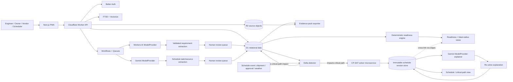

# Pramana Cx Technical Requirements Document

The MVP is a project-scoped commissioning evidence system with two integrated modules: (1) an **evidence control plane** that ingests authorized source files, creates human-reviewed structured requirements, relates them to systems, assets, gates, tests, evidence, findings, and decisions, computes deterministic readiness, and exports a verifiable turnover pack; and (2) a **Proactive Schedule Management module** that extracts task/resource-capacity records from vendor contracts, timelines, POs, and government approval documents, builds and deterministically re-optimizes a baseline schedule via a CP-SAT solver, and generates human-readable explanations of each re-solve. Both modules share the same tenant/project isolation, typed-edges provenance graph, RBAC, and AI-advisory-only boundary: AI proposes and explains; only deterministic engines (the readiness rules module, the CP-SAT solver) and authorized humans set state.

## Tech Stack

| Layer | Choice | Rationale |
|---|---|---|
| Web | Next.js 16.x, React 19.x, TypeScript, Tailwind CSS, Radix primitives | Supports a responsive dashboard and PWA — including the readiness board and schedule/Gantt/critical-path views — from one typed codebase. |
| Runtime/API | Cloudflare Workers with OpenNext | Provides the serverless API and edge delivery within the freemium operating model, for both evidence and schedule endpoints. |
| Relational store | Cloudflare D1 with Drizzle ORM | Supports normalized project data, foreign keys, migrations, and bounded graph traversals, extended with schedule tables (`schedule_tasks`, `schedule_versions`, `resources`, `schedule_events`). |
| Object store | Cloudflare R2 | Stores originals (including vendor contracts/timelines/POs/approval docs), page renders, exports, and manifests without application-server disk dependence. |
| Search | D1 FTS5 plus Cloudflare Vectorize | Combines exact model/part/clause search with project-scoped semantic retrieval; Vectorize also supports internal task-to-system/asset mapping during schedule extraction, never as user-facing semantic search. |
| Jobs | Cloudflare Workflows and Queues | Provides retryable ingestion, fan-out, and human-review checkpoints; orchestrates the schedule pipeline (extraction → review → solve → explain) and the event → delta-detector → re-solve pipeline, with each external solver call as a discrete, retryable Workflow step. |
| Auth | Better Auth with project-scoped RBAC and TOTP | Keeps authorization decisions inside the application boundary; unchanged and reused as-is for the schedule module (no new auth mechanism introduced — same roles, e.g. project scheduler/planner, gain scoped permissions on schedule endpoints). |
| AI (evidence extraction) | Workers AI behind an internal `ModelProvider` interface; BYOK and private adapters | Allows evaluation and model replacement without coupling readiness logic to one provider. |
| AI (schedule extraction/explanation) | Gemini API, accessed only through a second concrete `ModelProvider` adapter (`GeminiModelProvider`) | Per PRD/StructuredPlan assumption, schedule extraction and explanation use Gemini rather than Workers AI/Claude. Implementing it as another `ModelProvider` adapter — rather than calling the Gemini SDK from the schedule services directly — preserves the existing "no direct vendor SDK calls outside a provider adapter" rule; it is a second provider implementation, not an exception to it. |
| **Schedule solver** | **CP-SAT (Google OR-Tools) run in a dedicated solver microservice**, invoked from a Cloudflare Workflow step over an internal HTTP API | See justification below. |
| PDF/tabular processing | PDF.js and SheetJS community | Supports source rendering and controlled spreadsheet imports for both requirement documents and vendor contracts/timelines/POs. |
| Observability | OpenTelemetry, structured audit logs, Sentry for UI errors | Separates operational diagnostics from product audit evidence; extended to trace solver latency and re-solve trigger chains. |
| Testing | Vitest, Playwright, MSW, axe-core, API contract tests | Covers deterministic rules (readiness engine and CP-SAT wrapper), browser workflows, mocked providers (including a mocked solver service and mocked Gemini adapter), and accessibility. |
| CI/security | GitHub Actions, CodeQL, Dependabot, Trivy, Gitleaks | Adds repeatable quality and secret/container scanning gates; Trivy also scans the solver microservice's container image. |

### Solver integration approach — justification

CP-SAT (Google OR-Tools) is a mature, well-maintained, and correct constraint solver; per the Library-First Rule, we use it rather than hand-rolling a scheduling heuristic. The open question is *how* to invoke a C++-based solver from a Cloudflare Workers/OpenNext stack that is otherwise JS/WASM-only.

**Chosen approach: a dedicated solver microservice**, packaged as a small containerized HTTP service (Python, using the official `ortools` package's `CpSolver`), running outside the Workers isolate (locally in Docker for the hackathon; on a container platform such as Cloud Run/Fly.io for a pilot). A Cloudflare Workflow step calls this service with the task DAG, resource capacities, and deadline constraints as JSON, and receives back the solved schedule (or an infeasibility/bottleneck report) as JSON. The Workflow step wraps the call with a timeout and retry, per the NFRs below.

**Rejected alternative: compiling OR-Tools/CP-SAT to WASM and running it inside the Worker.** This was rejected because:
- There is no official OR-Tools WASM build; community attempts are experimental and unmaintained, so adopting one would violate the Library-First Rule's intent (introducing custom build/maintenance risk instead of using a well-maintained library as-is).
- A WASM build would need to be single-threaded (Workers isolates cannot spawn native threads), which materially degrades CP-SAT's practical performance on anything beyond small toy DAGs.
- The compiled binary size for a full CP-SAT build is far larger than fits comfortably within a Workers script's size and memory limits, and Workers CPU-time limits per invocation are a poor fit for solver runs whose duration is workload-dependent (a re-solve on a large DAG could legitimately need more CPU time than a single Workers request is allowed).
- A separate solver service keeps the Workers/OpenNext codebase in its existing, well-supported JS/TS toolchain and keeps the solver itself trivially upgradable to newer OR-Tools releases without a WASM recompilation step.

The tradeoff accepted is an additional deployable service and a network hop per solve; this is mitigated by treating every solver call as an idempotent, retryable Workflow step (consistent with the existing "durable jobs must be retryable and idempotent" constraint) and by keeping the solver service stateless (all state — the DAG, resource data, prior fixed/completed tasks — is passed in on each call; the service does not itself read D1 or R2).

## System Architecture Overview

> An architecture diagram will be generated separately via `/diagram`.

All tenant and project access passes through the Worker API. AI jobs (Workers AI for evidence, Gemini for schedule) can only propose typed records; only the review API can transition a proposal to `ACCEPTED`. The readiness engine and the CP-SAT solver are the two deterministic engines in the system — neither calls a language model, and neither can be bypassed by one.

### Evidence control-plane flow (unchanged)

Upload → hash/version → extraction to `source_region`/requirement proposals → human review → typed graph edges → deterministic readiness engine → decisions/export. See "Functional Requirements — Evidence Graph and Readiness" below.

### Schedule module flow

1. **Extraction agent:** a Workflow job (triggered by uploading a vendor contract, timeline, PO, or approval document to `POST /v1/projects/{id}/schedule/documents`) runs RAG over the document's `source_region`s via the Gemini `ModelProvider` adapter, proposing schema-validated `schedule_task` and `resource` records (name, duration, dependencies, vendor, lead time, resource requirement, hard/soft deadline type, crew/equipment counts). Any missing or ambiguous field is flagged `NEEDS_REVIEW` and is never silently defaulted.
2. **Human review:** a reviewer accepts, edits, or rejects each proposed task/resource record via `POST /v1/schedule/tasks/{id}/review` and `POST /v1/schedule/resources/{id}/review`. Only `ACCEPTED` records are eligible for solving.
3. **DAG assembly and cycle check:** accepted tasks and their dependency edges are assembled into a DAG (stored via the existing `edges` table with schedule-specific relationship types alongside `PRECEDES`/`REQUIRES`). A cycle is detected and blocks solving with an explicit, human-actionable error before any CP-SAT call is made.
4. **Baseline solve:** `POST /v1/projects/{id}/schedule/baseline` triggers a Workflow that calls the CP-SAT solver microservice with the DAG, resource capacities, and deadline constraints. A feasible result (or an explicit infeasibility + bottleneck report) is stored as immutable `schedule_version` `v1`.
5. **Delta detector:** `schedule_event` records (shipment received/delayed, approval granted/rejected, weather delay) reported via `POST /v1/projects/{id}/schedule/events` are checked against the current critical path and downstream dependencies. If unaffected, only the task's actual status/date is updated (no new version). If affected, a Workflow step calls the solver microservice warm-started from the current version with completed tasks fixed, producing a new immutable `schedule_version`.
6. **Explainer agent:** after any re-solve, a Workflow step sends the before/after task-date diff to the Gemini `ModelProvider` explainer, which returns a human-readable summary (triggering event, shifted tasks, net deadline impact) stored against that schedule version. The explainer never alters any date — it only narrates the diff the solver already produced.
7. **Cross-linking, not readiness-folding:** schedule tasks reference `systems`/`assets`/`gates` via the existing `edges` table (e.g., a critical-path task `PRECEDES`/`AFFECTS` a gate). The gate view surfaces linked schedule/delay status as context; it never feeds the deterministic readiness computation.

### Functional Requirements

**Ingestion and Provenance** (shared by both modules)
- `POST /v1/projects/{project_id}/documents` (evidence) and `POST /v1/projects/{id}/schedule/documents` (schedule sources) both compute SHA-256, store the original in R2, create `document`/`document_version` records, and reject unsupported type/size before processing.
- Extraction creates `source_region` records with page number, optional bounding box, extracted text, and source hash — used as the citation both for requirement proposals and for schedule task/resource proposals.
- A document version identifies whether it is `DRAFT`, `APPROVED`, `SUPERSEDED`, or `REJECTED`.

**Requirement Review** (unchanged) — schema-validated proposals with source-region references, confidence, normalized value, unit, review state; only `ACCEPTED` requirements affect readiness.

**Evidence Graph** (unchanged) — systems, assets, gates, requirements, evidence, test procedures/steps/runs, findings, decisions, and typed edges are project-scoped; an edge must reference existing records in the same project and use an allowed relationship type; superseding evidence propagates `STALE`.

**Readiness** (unchanged) — the engine evaluates mandatory accepted requirements/evidence, predecessor gate approval, absence of open blocking findings, passed test runs, and approval signature, returning `READY`/`BLOCKED`/`IN_REVIEW`/`UNKNOWN` with categorized blockers. It has zero model-provider or network imports and never reads schedule state.

**Schedule Extraction and Review**
- The extraction Workflow emits schema-validated `schedule_task` and `resource` proposals with source-region references, confidence, and review state, identical in spirit to requirement proposals.
- The review API supports accept/edit/reject with actor and timestamp; only `ACCEPTED` tasks/resources are included in a solve.
- Numeric fields (duration, lead time, crew/equipment counts) pass schema/unit validation before acceptance; ambiguous or missing fields route to mandatory review and are never auto-accepted.

**Delta Detection and Solve**
- The delta detector reads the current `schedule_version`'s critical path and dependency structure to decide whether an incoming `schedule_event` requires a re-solve.
- Concurrent events against the same task are serialized; the second event's delta check and (if triggered) re-solve runs against the already-updated state.
- An event referencing a task absent from the current schedule version is rejected with an explicit error.
- The solver microservice call is idempotent per `(schedule_version_id, event_id)` so Workflow retries cannot double-apply a re-solve.

**Explainability**
- Every `schedule_version` beyond `v1` has an associated Gemini-generated explanation identifying the triggering event, shifted tasks, and net deadline impact, clearly labelled as AI-generated.
- Explainer failures/timeouts leave the prior schedule version and status untouched and surface a retryable error.

**Decisions and Export** (unchanged) — approval/rejection/waiver require the configured role and reason; export jobs produce a manifest of record identifiers, source hashes, audit-event hashes, and rule/model versions (extended to include the CP-SAT solver version and Gemini model version when a schedule snapshot is included in an export).

### Data Storage and Retrieval

- D1 stores normalized entities and typed edges, extended with `schedule_tasks`, `schedule_versions`, `resources`, and `schedule_events`. Foreign keys, project identifiers, enum checks, and timestamps are enforced at the database layer for both evidence and schedule tables.
- R2 stores immutable source objects (including vendor contracts/timelines/POs/approval docs) and generated exports.
- FTS5 indexes source text, normalized requirements, assets, findings, and schedule task names/vendors for exact/citation search. Vectorize is used only internally (extraction/classification matching for both requirements and schedule tasks), never as user-facing semantic search.
- Each `schedule_version` is stored as a complete, immutable snapshot (task dates, critical path, solver status) plus a pointer to its predecessor and triggering `schedule_event`, never as an in-place mutation of a shared "current schedule" row — mirroring the existing "no authoritative readiness value stored as an unversioned mutable flag" rule.
- Readiness continues to be calculated only from accepted evidence-side records and is never invalidated or recalculated by schedule-version changes.

### Security (carried forward, extended)

- Better Auth sessions use secure, HTTP-only cookies; TOTP is required for approver roles. No new auth mechanism is introduced for the schedule module — the same project-scoped RBAC roles (e.g., project scheduler/planner) gain scoped permissions on schedule endpoints.
- Every query, including schedule tables, includes tenant and project predicates; object URLs are short-lived signed URLs.
- TLS is required for all network traffic, including calls from a Workflow step to the solver microservice; the solver service accepts only authenticated, internal-network requests (no public ingress) and receives no tenant-identifying data beyond what is required to solve (task IDs, durations, dependencies, capacities, deadlines).
- Gemini prompt inputs (for schedule extraction/explanation) are project-scoped, redacted for configured personal data, and excluded from shared training, identical to the Workers AI evidence-extraction path.
- Audit events remain append-only and hash-chained; schedule version creation, task acceptance/rejection, and event ingestion each produce an audit event.

## API Design

All endpoints require authentication unless stated otherwise. Error bodies use `{ "code": string, "message": string, "request_id": string }`.

### Evidence control plane (unchanged)

| Method | Path | Request | Response | Errors |
|---|---|---|---|---|
| `POST` | `/v1/projects` | `{name, code, timezone, retention_days}` | `201 {project}` | `400, 401, 409` |
| `GET` | `/v1/projects/{id}` | none | `200 {project, role}` | `401, 403, 404` |
| `POST` | `/v1/projects/{id}/documents` | multipart file plus `{document_type, revision}` | `202 {job_id, document_version_id}` | `400, 401, 403, 413, 415` |
| `GET` | `/v1/projects/{id}/requirements` | query filters and cursor | `200 {items, next_cursor}` | `401, 403, 404` |
| `POST` | `/v1/requirements/{id}/review` | `{action, normalized_value?, unit?, reason?}` | `200 {requirement}` | `400, 401, 403, 409` |
| `POST` | `/v1/projects/{id}/edges` | `{from_type, from_id, to_type, to_id, type}` | `201 {edge}` | `400, 401, 403, 409` |
| `GET` | `/v1/projects/{id}/gates/{gate_id}/readiness` | none | `200 {state, blockers, evaluated_at, rule_version}` | `401, 403, 404` |
| `POST` | `/v1/projects/{id}/issues` | `{title, severity, owner_id, due_at, ...}` | `201 {finding}` | `400, 401, 403` |
| `POST` | `/v1/gates/{id}/decisions` | `{action, reason, evidence_baseline}` | `201 {decision}` | `400, 401, 403, 409` |
| `POST` | `/v1/projects/{id}/exports` | `{gate_id, format}` | `202 {export_job_id}` | `400, 401, 403, 409` |
| `GET` | `/v1/exports/{id}` | none | `200 {status, download_url, manifest_hash}` | `401, 403, 404, 410` |

### Schedule management (new)

| Method | Path | Request | Response | Errors |
|---|---|---|---|---|
| `POST` | `/v1/projects/{id}/schedule/documents` | multipart file plus `{document_type: contract\|timeline\|po\|approval, revision}` | `202 {job_id, document_version_id}` | `400, 401, 403, 413, 415` |
| `GET` | `/v1/projects/{id}/schedule/tasks` | query filters (`review_state`, `vendor`, cursor) | `200 {items, next_cursor}` | `401, 403, 404` |
| `POST` | `/v1/schedule/tasks/{id}/review` | `{action: accept\|edit\|reject, duration?, dependencies?, vendor?, lead_time?, resource_requirement?, deadline_type?, reason?}` | `200 {task}` | `400, 401, 403, 409` |
| `GET` | `/v1/projects/{id}/schedule/resources` | query filters and cursor | `200 {items, next_cursor}` | `401, 403, 404` |
| `POST` | `/v1/schedule/resources/{id}/review` | `{action: accept\|edit\|reject, crew_count?, equipment_count?, reason?}` | `200 {resource}` | `400, 401, 403, 409` |
| `POST` | `/v1/projects/{id}/schedule/baseline` | `{}` (solves from currently accepted task DAG) | `202 {solve_job_id}` | `400, 401, 403, 409` (`409` on DAG cycle, with the offending edge identified) |
| `POST` | `/v1/projects/{id}/schedule/events` | `{task_id, event_type: shipment_received\|shipment_delayed\|approval_granted\|approval_rejected\|weather_delay, occurred_at, details}` | `202 {event_id, delta_check_job_id}` | `400, 401, 403, 404, 409` |
| `GET` | `/v1/projects/{id}/schedule/current` | none | `200 {version_id, tasks[], critical_path[], status, overrun_days?, bottleneck?, generated_at}` | `401, 403, 404` |
| `GET` | `/v1/projects/{id}/schedule/versions` | query filters and cursor | `200 {items: [{version_id, created_at, trigger_event_id, status}], next_cursor}` | `401, 403, 404` |
| `GET` | `/v1/schedule/versions/{id}` | none | `200 {version_id, tasks[], critical_path[], solver_version, status}` | `401, 403, 404` |
| `GET` | `/v1/schedule/versions/{id}/diff` | `?against={version_id}` | `200 {shifted_tasks[], added[], removed[], net_deadline_impact_days}` | `400, 401, 403, 404` |
| `GET` | `/v1/schedule/versions/{id}/explanation` | none | `200 {summary, triggering_event_id, model_version, generated_at}` | `401, 403, 404, 409` (`409` if explanation generation is still in progress) |

## Non-Functional Requirements

| Requirement | Target and verification |
|---|---|
| API latency | p95 <= 500 ms for authenticated project reads under 100 concurrent users, excluding ingestion, export, and schedule-solve jobs. |
| Readiness calculation | p95 <= 2 seconds for a gate with up to 10,000 related edges and 2,000 evidence records. |
| Availability | 99.5% monthly availability for the pilot API and web application, excluding planned maintenance. |
| Ingestion durability | A successfully acknowledged source upload (evidence or schedule document) is retrievable by hash after worker restart or retry. |
| Citation integrity | 100% of accepted AI proposals and surfaced findings — including schedule task/resource proposals — contain a resolvable source-region reference. |
| Authorization | Every project-scoped read and write, including schedule endpoints, checks tenant and project membership before data access. |
| Auditability | Every approval, role change, evidence state change, readiness decision, schedule task/resource review, and schedule version creation produces an append-only audit event. |
| Accessibility | Core review, blocker, approval, and schedule review/critical-path flows pass automated axe checks and keyboard navigation tests. |
| Recovery | Daily database backup/export and documented restore procedure achieve RPO <= 24 hours and RTO <= 8 hours for the pilot, covering schedule tables. |
| Data retention | Project data follows a configured retention period; deletion produces an auditable deletion event and removes source objects, including schedule documents and versions. |
| **Baseline solve latency** | p95 <= 60 seconds for a DAG of up to 500 tasks and 50 resource types; solver microservice call has an explicit request timeout (configurable default 90 seconds). |
| **Re-solve latency** | p95 <= 30 seconds for a warm-started re-solve (completed tasks fixed) on the same DAG size, measured from event ingestion to new schedule version being queryable. |
| **Solver timeout/fallback** | On solver-service timeout or error, the Workflow step retries with backoff (bounded attempts); on exhausted retries, the prior schedule version and task statuses remain unchanged, the event is marked `SOLVE_FAILED` for manual retry, and no partial/inconsistent schedule version is ever persisted. |
| **Explainer latency** | 100% of successful re-solves that affect the critical path produce a corresponding explanation within the same processing job (per PRD success metric); explainer failure never blocks or reverts the already-persisted schedule version. |
| **Schedule version audit** | Every `schedule_version` is immutable once written and hash-linked to its predecessor and triggering event, enabling full before/after reconstruction for audit; version records are never updated or deleted, only superseded by a new version. |
| **Infeasibility reporting** | 100% of solver invocations (golden-set tested) return either a feasible schedule or an explicit `{overrun_days, bottleneck_constraint}` report — zero silent failures or unexplained non-results. |

## Third-Party Integrations

| Integration | Purpose | Failure behavior |
|---|---|---|
| Cloudflare R2 | Source and export storage (evidence and schedule documents) | Upload remains pending and retries; readiness/solving does not advance without retrievable source evidence. |
| Workers AI / BYOK provider | Evidence extraction and classification proposals | Job enters `AI_REVIEW_REQUIRED` or `FAILED`; existing accepted data and readiness remain unchanged. |
| **Gemini API** | Schedule task/resource extraction and re-solve explanation, accessed only via a `GeminiModelProvider` adapter — chosen because the plan specifies Gemini rather than Workers AI/Claude for this module, and because Gemini's long-context RAG handling suits multi-document contract/timeline extraction; using the existing `ModelProvider` abstraction avoids coupling schedule logic to this one vendor. | Extraction job enters `NEEDS_REVIEW` or `FAILED` on error/timeout; a failed explanation leaves the already-solved schedule version and its status untouched and is retried independently, never blocking the solve. |
| **CP-SAT (Google OR-Tools), run in a dedicated solver microservice** | Deterministic baseline and re-solve computation (precedence, resource-capacity, deadline constraints; deadline-overrun-first/idle-time-second objective) — chosen over a hand-written scheduling heuristic (Library-First Rule) and over a WASM-in-Worker build (see Tech Stack justification) for correctness, maintainability, and freedom from Workers CPU/size limits. | On timeout/error, the Workflow step retries with backoff; on exhausted retries, the event is marked `SOLVE_FAILED`, the prior schedule version is untouched, and the failure is surfaced for manual retry — never a silently approximated schedule. |
| Vectorize | Semantic retrieval (internal use only, evidence and schedule matching) | Falls back to FTS5; citations remain mandatory. |
| Resend | Invitations and notifications | Queue retries; users can continue in-app and admins see delivery failure. |
| PostHog | Product usage analytics | Drop analytics event; never block product workflow. |
| Sentry / OpenTelemetry sink | Operational diagnostics, including solver call tracing | Buffer or drop telemetry; audit events remain in the product store. |

## Technical Constraints

- Initial pilots use controlled file imports and exports rather than native project-system or scheduling-tool (P6, Procore, Aconex, etc.) synchronization; this applies equally to schedule source documents and to schedule outputs (no native write-back of computed dates).
- Durable jobs must be retryable and idempotent; duplicate delivery cannot duplicate authoritative evidence, requirement acceptances, schedule task/resource acceptances, schedule versions, or event applications.
- **Model output cannot mutate readiness, approval state, or schedule dates/critical path/feasibility directly.** Only the deterministic readiness rules engine computes gate readiness, and only the deterministic CP-SAT solver computes schedule dates, critical path, and feasibility. The Gemini-backed extraction and explainer agents are used only for (a) proposing schema-validated task/resource records for human review and (b) narrating the solver's before/after diff in natural language — never for setting or overriding a date.
- **Ambiguous or missing extraction fields must never be silently guessed or auto-accepted**, for either requirement extraction or schedule task/resource-capacity extraction; they are routed to a mandatory human review queue, with zero silent auto-acceptance as a measured success metric.
- **Tenant/project isolation applies to all new schedule tables** (`schedule_tasks`, `schedule_versions`, `resources`, `schedule_events`) identically to existing tables — every read/write includes tenant and project predicates, and the solver microservice itself is stateless and receives no tenant-identifying data beyond what a given solve requires.
- Schedule entities are integrated into the existing typed-edges/provenance graph (via `edges` and `source_regions`), not built as a parallel disconnected data structure.
- Schedule/critical-path status is a separate, cross-linked view (via typed edges such as `PRECEDES`/`AFFECTS` to a gate) and must never be folded into or alter the deterministic gate readiness computation.
- Multi-mode task scheduling (duration varying by resource level) is out of MVP scope; every task has one fixed duration, and resource-capacity constraints only cap concurrent crew/equipment usage.
- Weather-delay events are modeled only as a discrete task-level event type flowing through the event → delta-detector → re-solve pipeline, never as a labor-capacity or calendar adjustment.
- A cycle detected in the accepted task dependency DAG blocks the CP-SAT solve with an explicit, human-actionable error before any solver call is made.
- Standards and project content, and any vendor contract/timeline/PO/approval documents processed for scheduling, require customer authorization and appropriate licensing; no unlicensed TIA-942/BICSI/Uptime/client/vendor content in prompts, embeddings, templates, or demos.
- **This build is a from-scratch prototype/MVP using synthetic/dummy commissioning and scheduling data**, with no confirmed design partner or licensed corpus at this stage, for both modules.
- **The SaaS-versus-private/self-hosted deployment profile is not decided at this stage** and must not be hardcoded as an assumption in either module's implementation; for this prototype, "self-hosted" is defined as strict tenant/data isolation within Cloudflare rather than true customer-premises deployment, and the solver microservice's own deployment target (local Docker for the hackathon; a container platform for a pilot) is likewise not a commitment to a final production topology.
- Predictive (ML/statistical) schedule forecasting, live supply-chain/port/geospatial tracking beyond reported events, drawing geometry comparison, broad RFI intelligence, live BMS/EPMS telemetry, and independent certification are not covered by this TRD.
