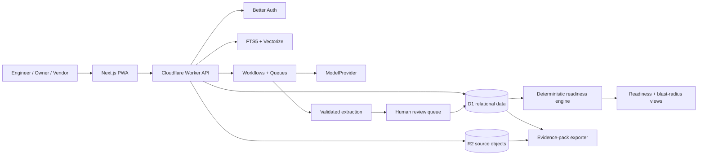

# Pramana Cx Technical Requirements Document

## Technical Scope

The MVP is a project-scoped commissioning evidence system. It ingests authorized source files, creates human-reviewed structured requirements, relates those requirements to systems, assets, gates, tests, evidence, findings, and decisions, computes deterministic readiness, and exports a verifiable turnover pack.

## Non-Functional Requirements

| Requirement | Target and verification |
|---|---|
| API latency | p95 <= 500 ms for authenticated project reads under 100 concurrent users, excluding ingestion and export jobs. |
| Readiness calculation | p95 <= 2 seconds for a gate with up to 10,000 related edges and 2,000 evidence records. |
| Availability | 99.5% monthly availability for the pilot API and web application, excluding planned maintenance. |
| Ingestion durability | A successfully acknowledged source upload is retrievable by hash after worker restart or retry. |
| Citation integrity | 100% of accepted AI proposals and surfaced findings contain a resolvable source-region reference. |
| Authorization | Every project-scoped read and write checks tenant and project membership before data access. |
| Auditability | Every approval, role change, evidence state change, and readiness decision produces an append-only audit event. |
| Accessibility | Core review, blocker, and approval flows pass automated axe checks and keyboard navigation tests. |
| Recovery | Daily database backup/export and documented restore procedure achieve RPO <= 24 hours and RTO <= 8 hours for the pilot. |
| Data retention | Project data follows a configured retention period; deletion produces an auditable deletion event and removes source objects. |

## Tech Stack

| Layer | Choice | Rationale |
|---|---|---|
| Web | Next.js 16.x, React 19.x, TypeScript, Tailwind CSS, Radix primitives | Supports a responsive dashboard and PWA from one typed codebase. |
| Runtime/API | Cloudflare Workers with OpenNext | Provides the serverless API and edge delivery within the freemium operating model. |
| Relational store | Cloudflare D1 with Drizzle ORM | Supports normalized project data, foreign keys, migrations, and bounded graph traversals. |
| Object store | Cloudflare R2 | Stores originals, page renders, exports, and manifests without application-server disk dependence. |
| Search | D1 FTS5 plus Cloudflare Vectorize | Combines exact model/part/clauses search with project-scoped semantic retrieval. |
| Jobs | Cloudflare Workflows and Queues | Provides retryable ingestion, fan-out, and human-review checkpoints. |
| Auth | Better Auth with project-scoped RBAC and TOTP | Keeps authorization decisions inside the application boundary. |
| AI | Workers AI behind an internal `ModelProvider` interface; BYOK and private adapters | Allows evaluation and model replacement without coupling readiness logic to one provider. |
| PDF/tabular processing | PDF.js and SheetJS community | Supports source rendering and controlled spreadsheet imports. |
| Observability | OpenTelemetry, structured audit logs, Sentry for UI errors | Separates operational diagnostics from product audit evidence. |
| Testing | Vitest, Playwright, MSW, axe-core, API contract tests | Covers deterministic rules, browser workflows, mocked providers, and accessibility. |
| CI/security | GitHub Actions, CodeQL, Dependabot, Trivy, Gitleaks | Adds repeatable quality and secret/container scanning gates. |

## System Architecture Overview

All tenant and project access passes through the Worker API. AI jobs can propose typed records, but only the review API can transition a proposal to `ACCEPTED`. The readiness engine reads accepted records and produces a state plus explainable blocker relationships. It does not call a language model.

## Functional Requirements

### Ingestion and Provenance

- `POST /v1/projects/{project_id}/documents` accepts PDF, CSV, XLSX, image, or email-export metadata and returns an upload job identifier.
- The upload service computes SHA-256, stores the original in R2, creates a `document` and `document_version`, and rejects unsupported type or size before processing.
- Extraction creates `source_region` records with page number, optional bounding box, extracted text, and source hash.
- A document version must identify whether it is `DRAFT`, `APPROVED`, `SUPERSEDED`, or `REJECTED`.

### Requirement Review

- The extraction worker emits schema-validated requirement proposals with source-region references, confidence, normalized value, unit, and review state.
- The review API supports accept, edit, and reject operations; all transitions include actor and timestamp.
- Only `ACCEPTED` requirements may be linked to readiness rules.
- Numeric values must pass unit and tolerance validation before acceptance.

### Evidence Graph

- Systems, assets, gates, requirements, evidence, test procedures, test steps, test runs, findings, decisions, and typed edges are project-scoped.
- An edge must reference existing records in the same project and use an allowed relationship type.
- Evidence must reference at least one source region, test result, or field capture and include a validity state.
- A superseding document or changed accepted requirement propagates `STALE` to affected evidence and records an `AFFECTS` edge.

### Readiness

For a selected gate, the engine evaluates:

1. All mandatory accepted requirements have accepted, non-stale evidence.
2. Required predecessor gates are approved.
3. No open blocking finding or NCR exists.
4. Every required test run passed under an authorized procedure.
5. The configured approval role has signed the current evidence baseline.

The API returns `READY`, `BLOCKED`, `IN_REVIEW`, or `UNKNOWN`, plus categorized blockers and source references. The UI must not collapse `UNKNOWN` into green.

### Decisions and Export

- Approval, rejection, and waiver actions require the configured role and a reason.
- The decision stores the evidence baseline and rule version used at decision time.
- Export jobs create a manifest of included record identifiers, source hashes, audit-event hashes, and rule/model versions.
- The manifest hash is stored with the export and is recomputed during verification.

## API Design

All endpoints require authentication unless stated otherwise. Error bodies use `{ "code": string, "message": string, "request_id": string }`.

| Method | Path | Request | Response | Errors |
|---|---|---|---|---|
| `POST` | `/v1/projects` | `{name, code, timezone, retention_days}` | `201 {project}` | `400, 401, 409` |
| `GET` | `/v1/projects/{id}` | none | `200 {project, role}` | `401, 403, 404` |
| `POST` | `/v1/projects/{id}/documents` | multipart file plus `{document_type, revision}` | `202 {job_id, document_version_id}` | `400, 401, 403, 413, 415` |
| `GET` | `/v1/projects/{id}/requirements` | query filters and cursor | `200 {items, next_cursor}` | `401, 403, 404` |
| `POST` | `/v1/requirements/{id}/review` | `{action, normalized_value?, unit?, reason?}` | `200 {requirement}` | `400, 401, 403, 409` |
| `POST` | `/v1/projects/{id}/edges` | `{from_type, from_id, to_type, to_id, type}` | `201 {edge}` | `400, 401, 403, 409` |
| `GET` | `/v1/projects/{id}/gates/{gate_id}/readiness` | none | `200 {state, blockers, evaluated_at, rule_version}` | `401, 403, 404` |
| `POST` | `/v1/projects/{id}/issues` | `{title, severity, owner_id, due_at, ...}` | `201 {finding}` | `400, 401, 403` |
| `POST` | `/v1/gates/{id}/decisions` | `{action, reason, evidence_baseline}` | `201 {decision}` | `400, 401, 403, 409` |
| `POST` | `/v1/projects/{id}/exports` | `{gate_id, format}` | `202 {export_job_id}` | `400, 401, 403, 409` |
| `GET` | `/v1/exports/{id}` | none | `200 {status, download_url, manifest_hash}` | `401, 403, 404, 410` |

## Data Storage and Retrieval

- D1 stores normalized entities and typed edges. Foreign keys, project identifiers, enum checks, and timestamps are enforced at the database layer.
- R2 stores immutable source objects and generated exports. Database records store object keys, hashes, media types, and lifecycle state.
- FTS5 indexes source text, normalized requirements, assets, and findings for exact identifiers, units, tags, and clause searches.
- Vectorize stores embeddings with a project namespace and metadata filter. A retrieval result is unusable without a matching source-region record.
- Readiness is calculated from current accepted records and may be cached only with a versioned input hash. Cached readiness is invalidated by evidence, requirement, finding, gate, or decision changes.
- No authoritative readiness value is stored as an unversioned mutable flag.

## Security

- Better Auth sessions use secure, HTTP-only cookies; TOTP is required for approver roles.
- Every query includes tenant and project predicates, and object URLs are short-lived signed URLs.
- TLS is required for all network traffic; D1 and R2 encryption-at-rest controls are enabled.
- Uploads are type-checked, size-limited, malware-scanned where the deployment profile supports it, and never executed.
- Prompt/model inputs are project-scoped, redacted for configured personal data, and excluded from shared training.
- Rate limits apply per user, project, and IP to authentication, upload, search, and AI-job endpoints.
- Audit events are append-only and hash-chained; normal users cannot edit or delete them.

## Third-Party Integrations and Failure Modes

| Integration | Purpose | Failure behavior |
|---|---|---|
| Cloudflare R2 | Source and export storage | Upload remains pending and retries; readiness does not advance without retrievable source evidence. |
| Workers AI / BYOK provider | Extraction and classification proposals | Job enters `AI_REVIEW_REQUIRED` or `FAILED`; existing accepted data and readiness remain unchanged. |
| Vectorize | Semantic retrieval | Fall back to FTS5; citations remain mandatory. |
| Resend | Invitations and notifications | Queue retries; users can continue in-app and admins see delivery failure. |
| PostHog | Product usage analytics | Drop analytics event; never block product workflow. |
| Sentry / OpenTelemetry sink | Operational diagnostics | Buffer or drop telemetry; audit events remain in the product store. |

## Technical Constraints and Non-Goals

- Initial pilots use controlled file imports and exports rather than native project-system synchronization.
- Durable jobs must be retryable and idempotent; duplicate delivery cannot duplicate authoritative evidence.
- Model output cannot mutate readiness or approval state directly.
- Standards and project content require customer authorization and appropriate licensing.
- Predictive schedule, live supply-chain, drawing geometry, broad RFI, telemetry, and certification functions are not covered by this TRD.
