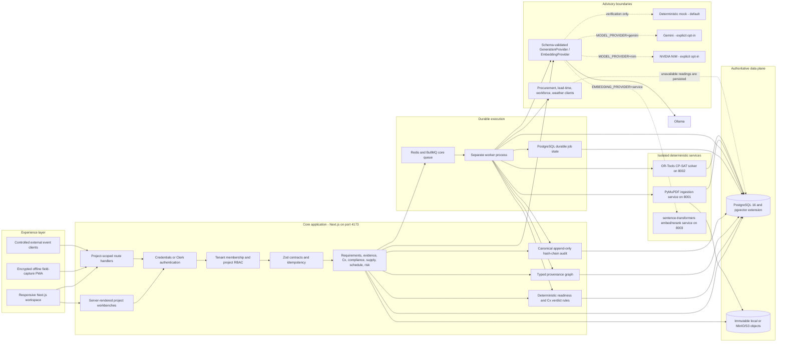
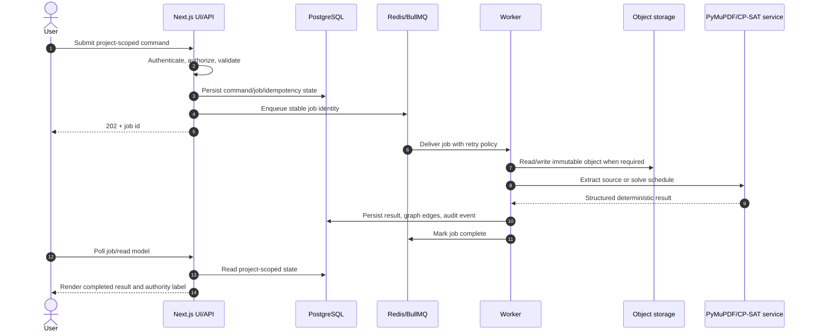
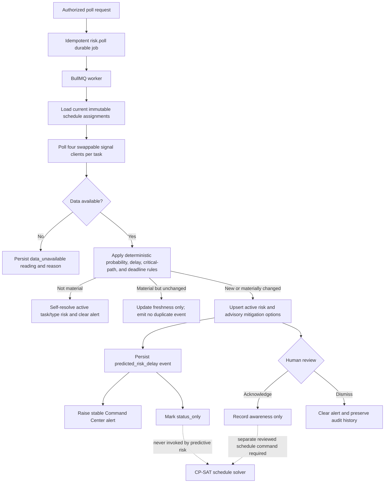
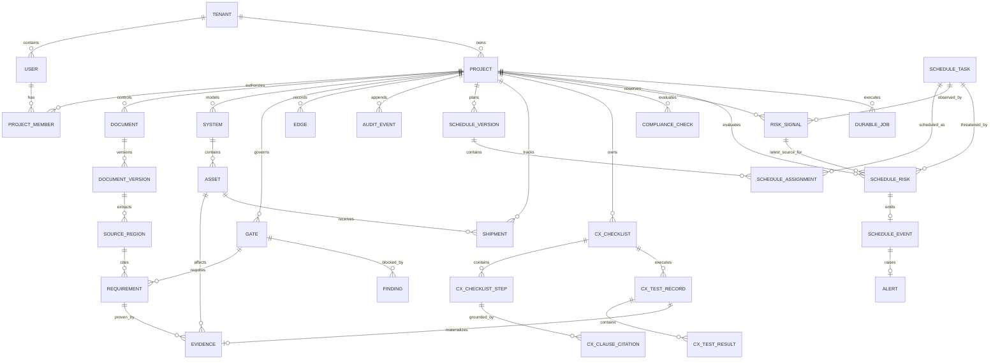

# Pramana Cx

Pramana Cx is an evidence control plane for mission-critical EPC commissioning. It connects controlled requirements to systems, assets, tests, measurements, findings, approvals, schedules, shipments, and immutable source evidence so that an authorized engineer can make a defensible gate decision.

The product is **advisory by design**. AI may extract, retrieve, rank, draft, and explain. Deterministic services calculate readiness, schedule feasibility, and test verdicts. Only an authorized human review can accept requirements, evidence, checklists, reports, precedents, or gate decisions.

## Why Pramana exists

Mission-critical EPC delivery usually fragments the source of truth across drawings, specifications, spreadsheets, email, field photographs, schedules, vendor packages, and commissioning reports. The operational problem is not a lack of dashboards; it is the absence of a defensible chain between **what was required, what was built, what was tested, who approved it, and what changed afterward**.

Pramana turns that chain into the product. Each useful statement remains connected to its project, immutable source revision, exact page/region, review state, affected system or asset, evidence, deterministic rule result, and audit event. This is why AI output is advisory and why accepted records—not chat text—drive readiness.

## Core USPs

| Capability | What it does | Why it matters |
| --- | --- | --- |
| Controlled-source RAG | Hashes PDF/CSV/XLSX sources, extracts exact regions, indexes project-scoped embeddings, reranks results, and returns citations | Answers and proposals remain inspectable instead of becoming uncited summaries |
| Human-authority workflow | Separates proposed, accepted, rejected, superseded, and approved states with RBAC and audit events | AI cannot silently change a contract, certify work, or approve a gate |
| Deterministic readiness | Recomputes proof coverage, stale/failed evidence, prerequisites, blockers, and accepted findings | A readiness score is explainable and reproducible |
| Compliance workbench | Relevance-gates semantic candidates, compares exact cited lines, detects authority conflicts, and records engineer disposition | Prevents unrelated clauses from becoming false compliance findings |
| Site-to-execution continuity | Carries confirmed Site Analysis decisions into systems/assets, requirements, commissioning scope, procurement and project summaries | Planning inputs produce governed downstream work instead of a dead-end form |
| RackDB-first digital rack model | Builds versioned rack geometry from project/site inputs, supports mixed GPU clusters, rack-unit equipment, wiring, manual racks, imports and controlled exports | Capacity, topology, power, heat and physical layout share one revisioned model |
| Evidence-to-turnover chain | Captures evidence, reviews proof, executes cited tests, resolves findings, approves gates, and generates hashed turnover packs | Handover can be verified independently from accepted records |
| Project-scoped intelligence | Uses local Ollama/Gemma or explicitly configured providers behind schema, timeout, provenance and citation guards | Sensitive project intelligence can remain local and bounded |

## End-to-end operating model

```text
Controlled documents / field evidence / site inputs
                │
                ▼
Immutable object + SHA-256 + exact source regions
                │
                ▼
Project-scoped chunks → embeddings → hybrid retrieval → reranking
                │                                      │
                │                                      └─ cited advisory summaries
                ▼
Human-reviewed requirements ──► systems / assets / gates
                │                         │
                ├─► compliance checks     ├─► digital rack model / GPU topology
                ├─► commissioning tests   ├─► schedule / shipment planning
                └─► evidence obligations  └─► financial and site scenarios
                              │
                              ▼
                 deterministic readiness rules
                              │
                              ▼
                  authorized gate decision
                              │
                              ▼
                hashed exports and turnover pack
```

### Authority boundaries

- PostgreSQL is authoritative for project records, review states, relationships, versions and audit history.
- Object storage is authoritative for uploaded and generated artifacts; SHA-256 identities bind database records to bytes.
- pgvector-backed knowledge chunks are retrieval indexes, never a replacement for the controlled source region.
- Deterministic rules own numeric/boolean verdicts, readiness and schedule calculations.
- AI can extract, rank, summarize and draft only. Its provider/model and citation provenance are recorded.
- A project-authorized person owns acceptance, compliance disposition, evidence approval, gate decisions and approved model revisions.

## Major product surfaces

| Surface | Inputs | Outputs and downstream effect |
| --- | --- | --- |
| Projects / Overview | Project membership and current project | Executive health, readiness, evidence, work and alerts |
| Site Analysis | Site, power, water, workload, rack, building, cooling, network, logistics, security, schedule and commercial decisions | Versioned analysis snapshots, constraints, planning insights and controlled downstream proposals |
| Documents / Knowledge | PDF, CSV and XLSX revisions | Exact source regions, embeddings, requirement proposals and cited answers |
| Requirements | Extracted or manually controlled statements | Accepted obligations used by evidence, compliance and readiness |
| Systems & Assets | Controlled hierarchy and tags | The physical/functional authority graph used by evidence and tests |
| Digital Rack Model | Site Analysis, user rack/GPU specifications, GLB/OBJ imports | RackDB-compatible revisions, mixed GPU clusters, ports/links, GLB/OBJ/PDF/YAML exports |
| Evidence / Capture | Documents, images, readings and field observations | Pending evidence records linked to systems/assets and accepted requirements |
| Readiness | Accepted requirements/evidence, gate prerequisites and findings | Explainable gate state and blockers |
| Commissioning Tests | Standards, systems, assets and accepted requirements | Cited checklists, deterministic readings, reviewed reports and findings |
| Compliance | Accepted requirements and approved target documents | Relevance-gated comparisons, authority conflicts, proposed findings and reviewed precedents |
| Schedule / Shipments | Accepted tasks, site/procurement decisions and logistics records | Versioned baseline, critical path, approved shipment plans, route/ETA status |
| Technology Draft Studio | Site/system needs, evidence and vendor fields | Controlled vendor package draft and reviewable PDF |
| Financial Modeler | Capacity, utilization, tariff, budget and scenario inputs | USD-authoritative economics with display currency conversion, NPV/IRR/payback and key drivers |
| Exports / Turnover | Current controlled project state | Branded PDF/CSV exports, watermarks, manifests and independently verifiable hashes |

## Digital rack and GPU architecture

The Digital Rack Model is a governed planning model, not a decorative 3D viewer. Generated revisions derive their basis from the current project and Site Analysis, while explicit user preferences can override rack count, envelope, power density, population and GPU cluster composition. A project may contain multiple GPU profiles (for example NVIDIA H100 and AMD MI300X), multiple clusters, and multiple racks per cluster. Equipment records retain rack-unit position, accelerator count, power, heat, cooling class and profile identity. Port and link records preserve fabric speed and topology so inter-rack wiring can be toggled and audited.

Users can also add a custom persisted rack to an editable generated revision, add non-overlapping equipment at exact U positions, or upload GLB/OBJ visual models. Generated and imported revisions remain distinguishable, versioned, reviewable and exportable; an approved revision is immutable until it is explicitly superseded or returned through review.

## Compliance and corpus mapping

Compliance discovery is deliberately narrower than general knowledge search. It searches only approved project target types (submittals, purchase orders, shop drawings and drawings), requires meaningful engineering-term overlap in addition to vector similarity, preserves document diversity, and excludes the requirement's own document. Numeric, boolean and categorical comparisons use deterministic normalization. Narrative or ambiguous cases remain `needs engineering judgment`. Source-authority conflicts are shown explicitly and cannot be silently resolved by ranking or AI.

To control and embed a local compliance corpus with the same ingestion path used by the UI:

```bash
npm run source:import -- \
  --file "/absolute/path/to/document.pdf" \
  --title "Controlled document title" \
  --revision "Rev 1" \
  --project "MDC-07" \
  --actor "project.admin@example.com" \
  --type "standard"
```

The command stores the immutable object, extracts source regions, creates/refreshes project-scoped knowledge chunks, embeds pending chunks with the configured embedding provider, and records an audit event. Standards become searchable evidence; accepted requirements and approved target documents still control whether a compliance comparison can be created.

**Where to go from here:**

- **[CAPABILITIES.md](CAPABILITIES.md)** — a one-page summary of what the application does, with a walkthrough user flow
- **[STATUS.md](STATUS.md)** — what's verified, what's a known gap, and the latest local verification result
- **[Technical Architecture (HTML)](docs/pramana-cx-technical-architecture.html)** — standalone end-to-end architecture, data, AI, security, operations, verification, and release specification
- **[Technical Architecture (A4 PDF)](output/pdf/pramana-cx-technical-architecture.pdf)** — print-verified A4 dossier with fixed borders, margins, page numbering, diagrams, and application screenshots
- **[Windows/Linux setup](docs/LOCAL_SETUP_WINDOWS_LINUX.md)** — Docker, Ollama, Clerk, database, worker, ports, and troubleshooting
- **[Errors and fixes](docs/ERRORS_AND_FIXES.md)** — the reported QA failures, root causes, implemented fixes, and verification
- **[Backend authority audit](docs/BACKEND_AUTHORITY_AUDIT.md)** — which controls persist to PostgreSQL and where those changes propagate
- **[PLANNER/](PLANNER)** — product intent ([PRD.md](PLANNER/PRD.md)), technical constraints ([TRD.md](PLANNER/TRD.md)), and the reconciled execution baseline ([CanonicalBuildPlan.md](PLANNER/CanonicalBuildPlan.md)); [Tracker.md](PLANNER/Tracker.md) records the state of every planning document

The chronological build record lives in git history. STATUS.md is the single source of truth for what is shipped and what is still open.

## About the application

Pramana Cx is not a general document chatbot. It is a governed commissioning workspace: controlled project sources become cited records, human-reviewed requirements, linked systems/assets/gates, reviewed evidence, deterministic readiness, and verifiable turnover artefacts. AI can help extract, retrieve, rank, draft, and explain, but it cannot approve compliance, close a finding, certify a facility, or decide a gate.

## Product tour

### 1. Project overview

<p align="center">
  
</p>

The commissioning control room brings readiness, evidence, actions, alerts, and delivery health into one project view.

### 2. Graph and timeline

<p align="center">
  
</p>

Explore the authority graph that connects project assets, gates, requirements, evidence, and the audit trail.

### 3. Readiness and decisions

<p align="center">
  
</p>

Make gate readiness transparent through accepted proof, missing evidence, prerequisites, blockers, and controlled decisions.

### 4. Schedule management

<p align="center">
  
</p>

Review deterministic project schedules, critical-path activities, task sequencing, and advisory planning insights.

### 5. Risk mitigation review

<p align="center">
  
</p>

Review actionable, advisory mitigation options for schedule, procurement, workforce, weather, and equipment risks.

### 6. Shipment navigator

<p align="center">
  
</p>

Track equipment movements with route monitoring, weather intelligence, ETA updates, and congestion context.

### 7. Commissioning tests

<p align="center">
  
</p>

Turn controlled standards into citation-verified commissioning checklists and governed test records.

### 8. Compliance workbench

<p align="center">
  
</p>

Surface structured compliance deviations while keeping final disposition under engineer review.

### 9. Controlled sources

<p align="center">
  
</p>

Manage immutable project documents with revision tracking and traceable extracted citation regions.

### 10. Command center

<p align="center">
  
</p>

Route operational alerts directly to the affected task, risk, gate, finding, or shipment alongside a live event feed.

### 11. Turnover

<p align="center">
  
</p>

Generate hash-verifiable handover packs from accepted evidence and approved commissioning gates.

## Current status

The reconciled application is a locally verified release candidate. The evidence-to-turnover, deterministic schedule, governed Cx, compliance, shipment, predictive-risk, and cited knowledge workflows have local verification coverage. Production rollout still requires the live-integration, observability, backup, and deployment controls listed in **What remains** and the release gate below.

| Area | State | What exists now |
| --- | --- | --- |
| Platform, tenancy, auth, RBAC | Verified | Project membership enforcement, credential sessions, optional Clerk adapter, TOTP, session revocation, rate limits, audit chain |
| Controlled sources and provenance | Verified | Hash-controlled PDF/CSV/XLSX storage, region citations, revision blast radius, semantic indexing |
| Evidence, readiness, gate approval | Verified | Pending-to-accepted evidence review, deterministic readiness, fresh-TOTP gate approval, immutable decision baseline |
| Turnover | Verified | Approved-gate-only manifests, canonical hashes, signed artefact URLs, independent verification |
| Scheduling and predictive risk | Verified core | Reviewed inputs, CP-SAT versions, bounded risk polling, advisory mitigations, explicit unavailable/synthetic provenance |
| Governed Cx and compliance | Verified | Cited checklists, deterministic readings, human-routed narrative review, proposed-only deviations, exact-citation precedents |
| Knowledge and RFI similarity | Verified | Project-scoped, citation-grounded hybrid retrieval with document filters, provider provenance, and model deadlines |
| Shipments and Command Center | Verified core | Asset-linked legs, route/position display, provenance notices, stable alerts and deep links |
| Production hardening | Release candidate | Builds, integrity checks, and local verification matrix pass; CI, accessibility, load, backups, observability, and live-provider acceptance remain deployment gates |

## How the application works

The normal project journey is intentionally governed rather than a single AI chat:

1. **Select a project:** project membership determines every record and action the user can see.
2. **Control sources:** upload a PDF, CSV, or XLSX in Sources, or a standard in Cx. The system validates its bytes, hashes the immutable object, extracts page or row/cell regions, and records exact citations.
3. **Review proposals:** AI may propose requirements, schedule inputs, or cited Cx steps. A reviewer must accept, edit, or reject each proposal before it gains authority.
4. **Model the facility:** create systems, assets, and approval gates, then connect records through typed provenance edges.
5. **Collect evidence:** capture online or offline field evidence. New evidence starts pending; an authorized reviewer decides whether it proves an accepted requirement.
6. **Execute commissioning:** run cited checklist steps. Numeric and boolean verdicts are deterministic; narrative observations stay routed to human judgment. An approved report becomes immutable evidence.
7. **Check compliance:** semantically discover candidate deviations, or compare an accepted requirement against an exact target citation directly. Deviations create only proposed findings until an engineer accepts the disposition.
8. **Plan and monitor:** review tasks/resources, validate dependencies, and create an immutable CP-SAT baseline. Risk polling records all four source outcomes and raises only new material advisory delays; it never changes schedule dates.
9. **Resolve work:** accepted failures and findings appear in Actions; stable alerts appear in Command Center. Owners move findings through assigned, in-progress, resolved, and reopened states.
10. **Decide readiness:** readiness recomputes from accepted proof, stale/failed evidence, predecessor gates, and open blockers. Approval requires permission, a substantive reason, and fresh TOTP in credentials mode.
11. **Generate turnover:** only an approved gate can produce a hashed turnover manifest and independently verifiable artifact.

The Graph and Changes surfaces are supporting views across this journey: Graph answers how records are connected; Changes shows what a controlled revision invalidated and why.

### Import and verify a controlled PDF from the terminal

The terminal path uses the same database, object storage, extraction, audit,
chunking, and embedding contracts as the Sources UI. The actor must already
have `source:upload` permission in the selected project.

```bash
npm run source:import -- \
  --file "/absolute/path/to/source.pdf" \
  --title "Controlled source title" \
  --revision "Rev A" \
  --project "MDC-07" \
  --actor "project.admin@example.com" \
  --type "standard"

npm run source:query -- \
  --document "Controlled source title" \
  --project "MDC-07"
```

Add one or more `--query "..."` arguments to test specific questions. Add
`--synthesize` to run the complete planner, retrieval, reranking, citation
guard, and grounded-answer pipeline for the first query.

## Application surfaces

- Overview and current-project selection
- Controlled Sources, exact source-region viewer, and revisions
- Requirements proposal and human review
- Systems, assets, and readiness gates
- Evidence capture/review and offline Field Capture
- Deterministic Readiness and authorized gate decisions
- Schedule inputs, review queue, solver versions, diffs, and explanations
- Live schedule signals, task risks, advisory mitigations, and risk review
- Findings/Actions lifecycle and typed Graph explorer
- Cx Standards, cited checklists, readings, reports, and approval
- Shipments and map visualization
- Compliance review queue with semantic scan and Knowledge search with cited synthesis
- Command Center alerts
- Turnover packs and independent verification
- Project/member/security Settings and Profile

## What remains before production deployment

The verified foundation is usable locally, but it must not be represented as a completed production service until these operational gates are satisfied:

1. **Live-provider acceptance:** run the release configuration against the chosen Ollama, Gemini, or NIM provider, with reachable endpoints, real credentials, bounded failure behaviour, and documented data-processing approval.
2. **Infrastructure validation:** rehearse an empty-database migration, S3/MinIO object lifecycle, Redis/worker recovery, TLS, secret rotation, and backup/restore in the target environment.
3. **Operational controls:** add CI enforcement, structured logs with correlation IDs, metrics, traces, queue monitoring, alerting, retention execution, and an incident/runbook process.
4. **Experience and scale gates:** complete accessibility/keyboard/contrast checks, representative-load testing, failure injection, and a pilot with controlled project data and named human approval authorities.
5. **Live operational data:** configure production AIS, weather, congestion, procurement, and location services only where their provenance, licensing, and failure states are acceptable; otherwise retain clear synthetic/unavailable labels.

These are explicit release prerequisites—not hidden failures in the local verification matrix.

## End-to-end system architecture



The Next.js process owns authentication, authorization, validation, and synchronous domain commands. Expensive or retryable work crosses the durable BullMQ boundary. PostgreSQL is the business authority; object storage contains immutable source/evidence/report/turnover bytes; the relational `edges` table supplies graph traversal without introducing a second operational database.

### Authority and evidence flow

```mermaid
flowchart LR
    Upload["Controlled source uploaded"] --> Hash["Magic-byte check + SHA-256 object"]
    Hash --> Extract["PyMuPDF page and region extraction"]
    Extract --> Proposal["AI proposal with exact region citations"]
    Proposal --> Review{Human review}
    Review -->|accept or edit| Accepted["Accepted requirement / checklist / task"]
    Review -->|reject| Rejected["Rejected proposal retained in audit history"]
    Accepted --> Execute["Field evidence, Cx reading, or schedule solve"]
    Execute --> Deterministic["Deterministic result calculation"]
    Deterministic --> Finding["Finding and event when failed"]
    Deterministic --> EvidenceReview{Evidence/report review}
    EvidenceReview -->|accept| Proof["Accepted evidence + PROVES edge"]
    EvidenceReview -->|reject| NoAuthority["No authority granted"]
    Proof --> Readiness["Readiness v2.1 recomputation"]
    Finding --> Readiness
    Readiness --> Gate{Authorized gate decision}
    Gate -->|READY + reason + fresh TOTP| Approved["Immutable approved decision baseline"]
    Gate -->|not ready| Blocked["Gate remains blocked or in review"]
    Approved --> Turnover["Hashed turnover manifest + signed artifact"]
    Revision["Controlled-source revision"] --> Blast["Region hash blast-radius analysis"]
    Blast --> Stale["Affected evidence becomes stale; gates reopen"]
    Stale --> Readiness
```



### Runtime request and job lifecycle



### Predictive-risk flow and solver safety boundary



Predictive risk can observe, explain, and propose. It cannot apply a mitigation, change a dependency/resource constraint, invoke a re-solve, or alter dates. A scheduler must make a separate reviewed schedule change before the deterministic solver can create another immutable version.

## Authoritative data model



Every authoritative record is tenant/project scoped. Cross-project IDs are rejected at the API boundary. `edges` hold traversable provenance, while normalized relational tables remain the authority for permissions and business state. Audit events are append-only and hash-linked per project.

## Technology and authority choices

- **Web/API:** Next.js 16, React 19, TypeScript, Zod
- **Database:** PostgreSQL 16 through Drizzle; pgvector image in the Compose topology
- **Graph:** typed relational `edges` table, avoiding a second operational database until traversal evidence proves it necessary
- **Jobs:** Redis and BullMQ with durable database job state and idempotency keys
- **Object storage:** one local/S3-compatible boundary; MinIO is the local production analogue
- **Document extraction:** lightweight PyMuPDF service accepting PDF, CSV, and XLSX, with page/bounding-box (or sheet/row/cell) and content-hash provenance
- **Scheduling:** isolated FastAPI OR-Tools CP-SAT service; infeasibility is returned, never hidden
- **AI:** a schema-validated provider boundary for structured generation and embeddings. The application default is local Ollama (`MODEL_PROVIDER=ollama`, `OLLAMA_MODEL=gemma4:e2b`; `EMBEDDING_PROVIDER=ollama`, `OLLAMA_EMBEDDING_MODEL=nomic-embed-text:latest`). Every real provider is bounded by prompt, response-token, context, and request-time limits. `mock` exists only for deterministic test runs and must never be selected by a deployment. Every AI-authored suggestion is labeled with provider/model provenance, lands in `reviewState: "proposed"`, and never auto-accepts authoritative changes.
- **Retrieval:** a third stateless FastAPI service (`services/retrieval`, port 8003) alongside ingestion and the solver, serving `BAAI/bge-base-en-v1.5` embeddings (768-dim, matching the existing `vector(768)` column with no migration) and `BAAI/bge-reranker-base` cross-encoder reranking; it holds no database credentials, and project scoping stays in SQL behind the existing permission checks. Every stored vector is tagged with the model that produced it, so a provider switch degrades to fewer results rather than silently corrupting cosine rankings across incompatible vector spaces
- **Authentication:** owned credentials/TOTP or Clerk adapter; all authorization remains in project memberships and server-side permissions
- **Design system:** IBM Plex Serif headings, Hanken Grotesk body, JetBrains Mono labels; primary `#2D463E`, secondary `#B5651D`, tertiary `#583935`, neutral `#FDFBF7`

## Local operation

### Developer laptop topology

The supported Windows/WSL2 and Linux workflow runs infrastructure in the
developer Compose file, with Ollama, Next.js, and the worker on the host:

```bash
npm ci
cp .env.example .env.local
docker compose -f docker-compose.dev.yml up -d --build postgres redis minio ingestion solver retrieval
ollama pull gemma4:e2b
ollama pull nomic-embed-text:latest
clerk auth login
clerk init --app app_3H8hkjTJXpa5w987cCoDFNSCmcU
npm run db:migrate
npm run db:seed
npm run dev:clerk
```

Run `npm run worker` in a second terminal, then open
[http://localhost:3000](http://localhost:3000). See the
[complete Windows/Linux setup](docs/LOCAL_SETUP_WINDOWS_LINUX.md) for
prerequisites, native PowerShell commands, Clerk project access, health checks,
containerized Ollama fallback, ports, and troubleshooting.

### Safe shutdown and cache cleanup

Stop the Next.js and worker terminals with `Ctrl+C`, then stop only this
project's development containers while preserving the database and object
volumes:

```bash
docker compose -f docker-compose.dev.yml stop
```

Stop the host Ollama process with the operating-system command documented in
the setup guide. To clear only the regenerable Next.js build cache:

```bash
rm -rf .next
```

Do not run Docker-wide prune commands or remove Ollama models as routine
cleanup: both are global, expensive, and may affect unrelated projects.
`docker compose ... down -v` is reserved for the explicit full-reset procedure.

`docker-compose.yml` is not the developer quick start. It is a fail-closed
deployment topology requiring `.env.compose.example`, managed secrets, an HTTPS
public URL, and approved image tags or digests.

### Ollama verification

```bash
npm run verify:ollama
```

`verify:ollama` is a real-provider smoke test: it requires an Ollama server,
verifies structured output plus 768-dimensional embeddings, and enforces the
configured deadline. It is distinct from the deterministic offline verification
matrix.

### Verification

```bash
npm run typecheck
npm run build
npm run verify:all
```

`verify:all` is the broad local matrix — migrations, type-check, production build, seeded prerequisites, isolated development and credentials runtimes, and every `verify:*` script (auth, evidence/turnover, schedule, Cx, compliance, predictive-risk, knowledge, model-provider, audit). It deliberately overrides providers to deterministic mock values so it can validate application contracts without a hosted model. This is not evidence that a real model, live AIS/weather, or production secrets work; run `verify:ollama` and the deployment checks below separately. Individual `npm run verify:<name>` scripts (see `package.json`) can run against a development server for faster iteration. See [STATUS.md](STATUS.md) for what the last full run actually covered.

The 21 July 2026 merge-readiness run also exercised the application in a real browser across every sidebar destination. The supplied TIA-942 PDF produced 26 controlled regions and 26 `nomic-embed-text` vectors; a live `gemma4:e2b` query returned only TIA-labelled citation links. Knowledge now supports an explicit Document filter and deterministic exact-title/standard-name routing, enforced in SQL before vector ranking. A migration backfills previously processed documents that had extraction regions but were missing semantic chunks. The complete post-fix `verify:all` run finished green; production dependency audit reports zero runtime advisories. See [STATUS.md](STATUS.md#what-changed-in-the-merge-readiness-pass-21-july-2026) for the complete change and residual-risk ledger.

The 28 July 2026 live-corpus run imported *Cisco Press — Data Center
Fundamentals* through `source:import`, producing 2,648 controlled regions and
2,648 `nomic-embed-text` vectors. Architecture, high-availability, and Fibre
Channel queries returned cited passages at approximately 73–87% cosine
similarity. Cross-encoder reranking correctly rejected unsupported power/cooling
and FM-200 negative controls. When Ollama emitted a fabricated citation UUID,
the deterministic guard dropped it and returned short, source-region-bound
extracts through the explicit retrieval fallback.

## Top 20 defects found across `Refinement` and `Updated-Refinement`

This is the consolidated error ledger from the branch audit, merge reconciliation, real-browser walkthrough, supplied-PDF test, and final release gate. “Resolved” means the merged branch contains a concrete guard plus a passing local verification; it does not replace the production prerequisites in the next section.

| # | Defect and user-visible impact | Where it came from | Resolution in the reconciled branch | Verification |
| ---: | --- | --- | --- | --- |
| 1 | **The apparent LLM could silently be hardcoded TypeScript.** Both branches defaulted to `MODEL_PROVIDER=mock`, allowing deterministic demo text to be mistaken for real intelligence. | Both branches | Local Ollama is now the default (`gemma4:e2b` for generation and `nomic-embed-text:latest` for embeddings). Mock is explicitly verification-only and production configuration rejects it. | Live Ollama structured-output and 768-dimensional embedding smoke test passed; provider identity is exposed by `/api/health`. |
| 2 | **AI calls bypassed the provider architecture.** Vision, synthesis, and embeddings in `Updated-Refinement` called Gemini directly, producing inconsistent configuration, retry, timeout, and provenance behavior. | Primarily `Updated-Refinement` | Vision, Cx, compliance, risk, and knowledge generation use the shared schema-validated provider boundary supporting Ollama, Gemini, and NIM. | TypeScript/build passed; provider-boundary, hosted-provider safety, and fail-closed scripts passed. |
| 3 | **Generation and embeddings could use contradictory providers.** `Refinement` could select Gemini generation while leaving mock embeddings; `Updated-Refinement` could call Gemini merely because a key existed even when mock mode was selected. | Both branches, in opposite directions | Generation and embedding providers are independent, explicit settings. Stored vectors carry an embedding-model tag, and mismatched spaces are excluded instead of incorrectly ranked. | Configuration-target, provider-resolution, embedding-backfill, and semantic-query tests passed. |
| 4 | **Model requests could run long enough to freeze or crash the frontend.** Long prompts, unconstrained output, and missing abort deadlines left buttons apparently stuck. | Both branches | Added bounded prompt/context sizes, output-token caps, server request deadlines, 45-second client aborts, disabled/busy controls, progress status, structured-output validation, and retry bounds. | Provider-safety tests passed; real TIA browser query displayed progress and completed without blocking navigation. |
| 5 | **Cross-feature links opened generic pages instead of the referenced record.** URLs such as `/readiness?gate=…`, `/schedule?task=…`, `/actions?finding=…`, and `/shipments?shipment=…` were produced but ignored by their destination pages. | Both branches | Destination pages consume and validate query IDs, focus the matching record, and degrade safely when a target is absent. | Deep-link contract test passed; browser traversal from Command Center opened the exact shipment/task/finding/gate context. |
| 6 | **React lists used non-unique names or duplicated IDs as keys.** This caused console errors for `L4 Integrated Systems Test` and `10000000-…0010`, with possible duplicated or omitted cards. | Branch data combined without deduplication | Readiness inputs are deduplicated by authoritative ID, proof lists use composite stable keys, and duplicate option labels are visibly disambiguated without changing identity. | Browser console/sidebar audit passed with no duplicate-key warning; integrity verification reports zero duplicate business keys. |
| 7 | **The database allowed duplicate systems, gates, graph edges, chunks, and alerts.** Repeated seeds or a mechanical merge could corrupt cross-feature counts and UI identity. | Conflicting branch schemas and seed histories | Added business-key unique indexes, exact-row deduplication, legacy-label reconciliation, stable demo IDs, and a relational integrity verifier for graph and project/tenant ownership. | Migrations, repeated seed, Drizzle check, and `verify:data-integrity` passed. |
| 8 | **The two branches had incompatible Drizzle migration histories.** Both introduced their own `0010/0011` sequences; a dry merge produced 19 conflicts and could drop or duplicate schema changes. | Branch merge boundary | Reconciled the final schema first, preserved snapshots deliberately, generated ordered migrations `0016–0019`, and recorded both source branches as parents of the audited merge commit. | `drizzle-kit check`, migration replay on the local database, production build, and the full matrix passed. |
| 9 | **A PDF could show “processed” while being absent from RAG.** The supplied TIA-942 file produced 26 source regions but zero `knowledge_chunks`, because indexing depended on a later proposal job that an older worker did not enqueue. | Extraction/proposal handoff inherited during reconciliation | Semantic indexing is now part of the extraction contract and is independent of proposal generation. Migration `0019` backfills every historical source region missing a chunk; the embedding worker then indexes it with the active provider. | TIA database check showed 26 regions, 26 chunks, and 26 Ollama embeddings; ingestion and knowledge-embedding tests passed. |
| 10 | **RAG attributed unrelated standards to an explicitly named document.** A TIA-942 question initially retrieved ASHRAE/NFPA seed text and presented it as a TIA answer. | Knowledge retrieval after combining branch datasets | Added explicit document selection, deterministic exact title/standard-name routing, document-ID SQL filtering before ranking, and document titles on citation chips. | Real browser query returned only TIA region links; identical-text cross-document exclusion regression passed. |
| 11 | **The LLM planner could silently narrow retrieval incorrectly.** For example, it inferred `standard` from a title even when the controlled document was stored as `procedure`, creating false no-results. | Plan-then-retrieve pipeline | Only explicit reviewer filters and deterministic title resolution may narrow authority-bearing metadata. The LLM may decompose a query but cannot choose system, asset, gate, revision, type, or document scope. The original user query is always retained. | Automatic-title and explicit-document regression tests passed in the knowledge metadata suite. |
| 12 | **Knowledge fallback concatenated retrieved text and could masquerade as synthesis.** When Gemini was missing or errored, `Updated-Refinement` returned raw concatenated passages without one consistent grounding contract. | `Updated-Refinement` knowledge path | Retained structured synthesis behind the central provider, requires at least one cited claim, rejects fabricated/out-of-scope region IDs in code, and returns an explicit no-results state rather than inventing an answer. | Groundedness unit test and knowledge synthesis/RFI end-to-end chain passed. |
| 13 | **Cx records could combine a gate, system, or asset from different scopes.** That could generate a plausible checklist for an impossible project relationship. | API validation gap exposed by merged fixtures | Cx creation now verifies that the selected gate and asset both belong to the chosen project/system and rejects cross-scope combinations with `422`. | Governed Cx HTTP suite includes and passes an invalid cross-system fixture. |
| 14 | **Raw hashes, JSON payloads, excessive precision, and repeated placeholder characters leaked into the UI.** Examples included long `cccc…` hashes and internal `{"gateId":…}` blobs. | Demo/presentation code across both branches | Added centralized presentation helpers, concise identifiers, human labels, bounded numeric formatting, meaningful empty states, and kept raw provenance behind contextual links instead of primary content. | Every sidebar destination and the supplied screenshots’ affected surfaces were rechecked in the browser. |
| 15 | **Long operations had inconsistent button state and no reusable progress feedback.** Clicking another action could visually replace or obscure the active operation. | Forms across sources, Cx, compliance, knowledge, shipment, and review flows | Added per-operation busy state, `aria-busy`/status feedback, disabled conflicting controls, progress indicators, success/error messages, and operation-specific timeouts without locking the page. | Browser PDF/RAG flow plus Cx, ingestion, compliance, offline, and timeout suites passed. |
| 16 | **The interface was crowded, repetitive, and difficult to traverse.** Large whitespace blocks coexisted with dense forms, weak hierarchy, and little feature-to-feature guidance. | Both branch UIs | Consolidated navigation into task-oriented groups, added responsive/mobile navigation, consistent feature shells, semantic status colours, clearer typography, compact cards/tables, and contextual Overview/cross-feature actions. | Browser traversal covered Overview plus every Control, Deliver, Investigate, Settings, and Profile destination without an error boundary. |
| 17 | **Shipment maps could show a base map without the route or animated position.** Records with unknown coordinates also looked like a rendering failure rather than incomplete data. | Shipment functionality imported from `Updated-Refinement` | Routes and markers derive from saved origin/current/destination coordinates, fit bounds on selection, support sea/air/land rendering and antimeridian splits, and show an explicit no-coordinate notice. | Browser screenshot confirmed the route overlay and position marker; shipment deep-link and polling suites passed. |
| 18 | **Land and fallback routing could be misleading.** A public HTTP OSRM call could fail silently and fall back to a straight line or inappropriate sea route, presenting an estimate as fact. | `Updated-Refinement` routing implementation | Uses HTTPS endpoints with deadlines/status checks, mode-specific routing, explicit provenance/notices, safe great-circle fallback only where appropriate, and never labels a fallback as a verified road route. Public geocoding is opt-in. | Deep-link/geocoder safety, shipment route assessment, and browser map checks passed. |
| 19 | **Synthetic AIS, weather, risk, and model output could look operational and mutate alert flow.** Users could mistake simulated estimates for live evidence. | Both branches’ local defaults | Every observation carries live/synthetic/unavailable provenance; live clients fail closed; status text names simulated positions and synthetic forecasts; authoritative review/readiness remains deterministic and human-governed. | Live-provider failure tests and the AIS → weather → alert → deep-link → risk composite test passed. |
| 20 | **There was no trustworthy release gate.** The branches mostly relied on bespoke partial scripts, had no cross-feature integrity audit, reported dependency advisories, and could appear deployable after only a build. | Both branches and merge process | `verify:all` now covers migrations, build, auth/MFA, tenancy, uploads, Cx, compliance, schedule/recovery, shipments, risk, RAG, deep links, MinIO, rate limits, offline sync, and audit-chain integrity. Runtime PostCSS was patched; deployment blockers are documented rather than hidden. | Final uninterrupted matrix ended with `All local verification suites passed`; `npm audit --omit=dev` reports zero vulnerabilities. Four moderate development-only Drizzle CLI advisories remain explicitly documented. |

The reconciled merge commit is `32e18a2`. It has `Refinement` and `Updated-Refinement` as its two parents and contains 23,804 insertions versus 476 deletions, so the branch integration did not remove either application wholesale. The detailed shipped-state and remaining-risk ledger is maintained in [STATUS.md](STATUS.md).

## Deployment release gate

Do not deploy with Compose or `.env.example` defaults. Before a production rollout, create a secret-managed environment file and verify every item below:

1. `AUTH_MODE` is `credentials` or `clerk` (never `development`), and `AUTH_ENCRYPTION_KEY`, Clerk keys where applicable, session-cookie configuration, and `APP_BASE_URL` are production values.
2. `MODEL_PROVIDER` and `EMBEDDING_PROVIDER` are real providers—not `mock`—and their selected endpoints/models are reachable from both the web and worker containers. For Ollama, configure a network-reachable `OLLAMA_BASE_URL`; do not use host loopback from a container.
3. PostgreSQL has the `vector` extension available before `npm run db:migrate`. Migration success must be checked against the actual deployment database, not merely generated SQL.
4. Redis, object storage, ingestion, solver, retrieval (if selected), and model-provider health checks are green. Set `INFRA_ALLOW_DEGRADED=false`.
5. Live risk/AIS/weather integrations are configured and a controlled end-to-end poll records real provenance. Synthetic data must be disabled or visibly labelled outside demo/test environments.
6. Run `npm run typecheck`, `npm run build`, `npm run verify:deep-links`, the applicable integration matrix, and `npm run verify:ollama` (or an equivalent real Gemini/NIM smoke test) using the release configuration.

Public OpenStreetMap lookup in the shipment form is opt-in. Operators should use the local location catalog for sensitive sites; enabling the checkbox sends the entered query to the public Nominatim service, with a 2.5-second cancellation deadline.

## Configuration requiring manual credentials

The example file is for local development. Production-like integrations require secret-managed values outside the repository:

- Clerk publishable/secret keys only if `AUTH_MODE=clerk` is selected
- a strong `AUTH_ENCRYPTION_KEY` when owned credentials/TOTP are used
- an Ollama endpoint plus `gemma4:e2b` and `nomic-embed-text:latest` when `MODEL_PROVIDER=ollama` and `EMBEDDING_PROVIDER=ollama` are selected; use a network address reachable from containers
- Gemini API key only if `MODEL_PROVIDER=gemini` is selected; an NVIDIA `NIM_API_KEY` only if `MODEL_PROVIDER=nim` is selected (hosted by default at `NIM_BASE_URL`, or point it at a self-hosted NIM endpoint)
- no credential is required for `EMBEDDING_PROVIDER=service`, but the retrieval container must be healthy and its model assets available
- S3/MinIO endpoint, bucket, region, access key, and secret when `OBJECT_STORAGE_DRIVER=s3`
- procurement, equipment-lead-time, workforce, and weather endpoint URLs when `RISK_POLL_MODE=http`
- AIS and shipment congestion/weather credentials and a non-synthetic `RISK_POLL_MODE` when live shipment/risk data is required

Never commit `.env.local` or credentials.
