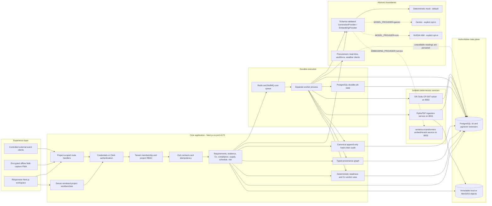
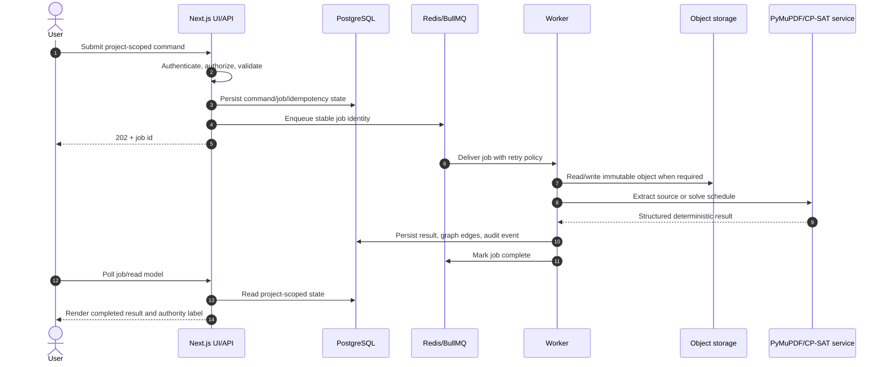
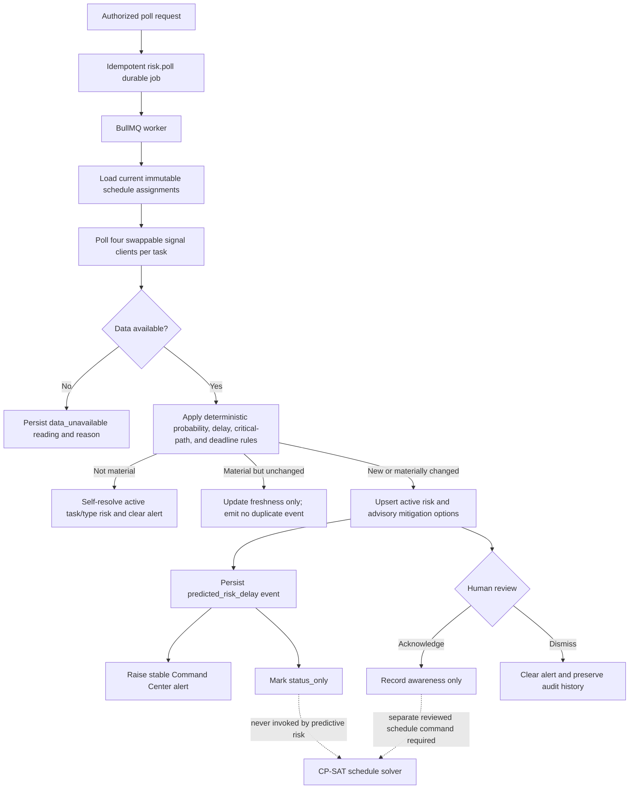
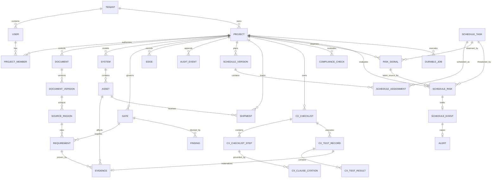

# Pramana Cx

Pramana Cx is an evidence control plane for mission-critical EPC commissioning. It connects controlled requirements to systems, assets, tests, measurements, findings, approvals, schedules, shipments, and immutable source evidence so that an authorized engineer can make a defensible gate decision.

The product is **advisory by design**. AI may extract, retrieve, rank, draft, and explain. Deterministic services calculate readiness, schedule feasibility, and test verdicts. Only an authorized human review can accept requirements, evidence, checklists, reports, precedents, or gate decisions.

This README is the global implementation map. Detailed planning remains in [PLANNER/CanonicalBuildPlan.md](PLANNER/CanonicalBuildPlan.md), product intent in [PLANNER/PRD.md](PLANNER/PRD.md), technical constraints in [PLANNER/TRD.md](PLANNER/TRD.md), the chronological build ledger in [what I have built.md](what%20I%20have%20built.md), and the completed remediation record for the retrieval-backed agents in [agentFixingPlan.md](agentFixingPlan.md).

## Current status

The Phase 0 platform, Phase 1 evidence-to-turnover tracer, and Phase 2 deterministic schedule tracer are implemented and locally verified. Governed Cx, compliance, and the predictive-risk pipeline are also verified end to end. The remaining Phase 3–4 depth is listed without treating planned work as shipped.

The three retrieval-backed agents (Specification & Quality Compliance, Predictive Schedule Risk, Project Knowledge & RFI) have completed the remediation sequenced in [agentFixingPlan.md](agentFixingPlan.md): semantic candidate discovery and an LLM-owned verdict for compliance, a lively synthetic signal formula with model-written mitigations for predictive risk, and a two-call plan-then-synthesize pipeline with code-enforced groundedness for knowledge. All three now run in TypeScript inside the core app, generation is swappable between a deterministic mock, Gemini, and NVIDIA NIM, and embeddings/reranking run through a third stateless Python service alongside ingestion and the solver.

| Area | State | What exists now |
| --- | --- | --- |
| Platform, tenancy, auth, RBAC | Verified | Project membership enforcement, credentials sessions, optional Clerk adapter, TOTP, session revocation, rate limits, audit chain |
| Controlled sources and provenance | Verified | Hash-controlled PDF storage, PyMuPDF extraction, page/bounding-box regions, exact citations, revision blast radius |
| Evidence, readiness, gate approval | Verified | Pending-to-accepted evidence review, deterministic readiness v2.1, fresh-TOTP gate approval, immutable decision baseline |
| Turnover | Verified | Approved-gate-only manifests, canonical hashes, signed artifact URLs, independent verification |
| Deterministic scheduling | Verified | Reviewed tasks/resources, dependency checks, CP-SAT solve, immutable versions, event-driven re-solve, warm starts |
| Systems, assets, findings, graph | Verified | Project-scoped CRUD, typed provenance edges, action lifecycle, graph explorer |
| Offline field capture | Built | IndexedDB queue, device encryption where available, idempotent sync, immutable object storage, PWA shell |
| Governed Cx workflow | Verified | Standard ingestion, cited checklist generation/review, deterministic readings, human-routed narrative steps, editable draft, approved immutable report |
| Shipments | Built | Asset-linked legs, estimate provenance, delayed/recovered events, graph-derived schedule mappings, map UI |
| Compliance | Verified | Metadata-filtered semantic candidate discovery across submittals/POs/shop-drawings/drawings, LLM-owned verdict with the deterministic comparator retained as mock-supplier and recorded cross-check, code-enforced grounding validation, unchanged exact-citation precedent semantics, AI-suggestion labeling, source-hierarchy conflict panel, scan-triggered review queue |
| Knowledge and RFI similarity | Verified | Metadata-filtered pgvector retrieval, cross-encoder reranking, deterministic graph-context expansion, a two-call plan-then-synthesize pipeline with a code-enforced groundedness filter (fabricated citations are dropped, never trusted from the model), citation-chip UI, explicit "no results in scope" state |
| Predictive risk | Verified | Swappable procurement/lead-time/workforce/weather clients, a lively hash-seeded synthetic formula that organically crosses materiality thresholds, LLM-generated mitigation proposals with a static fallback on any failure, durable polls, deterministic materiality, task/type deduplication, self-resolution, alerts, recurring BullMQ orchestration, project-scoped event validation, APIs, and schedule UI |
| Command Center | Partial | Stable event alerts and recovery clearing; richer grouping, ownership, and cross-links remain |
| Production hardening | Partial | Builds and focused integration tests pass; CI, accessibility, observability, load, and full Compose/MinIO tests remain |

### Latest local verification result

The complete local matrix passed against a newly built production artifact. It applies all migrations, starts isolated test runtimes, and removes its synthetic records after each tracer where safe to do so.

| Check | Result | Evidence covered |
| --- | --- | --- |
| Database and production artifact | Passed | All 13 migrations, TypeScript, and optimized Next.js production build |
| Foundation contracts | Passed | Redis rate limit, durable-job idempotency, encrypted TOTP, event validation, model boundary, signed object reads |
| Credentials and MFA | Passed | Registration, HttpOnly session, scoped profile, TOTP enrollment, MFA challenge, MFA login |
| Evidence to turnover | Passed | Pending evidence, accepted-only proof, deterministic readiness, fresh-TOTP decision, immutable pack, independent manifest verification |
| Deterministic schedule | Passed | Reviewed inputs, resource/dependency constraints, CP-SAT optimum, immutable versions, shipment-triggered warm-start re-solve |
| Governed Cx | Passed | Controlled standard extraction, cited checklist, readings, editable report, immutable approved evidence artifact |
| Governed compliance | Passed | Unit normalization, semantic candidate discovery, LLM-owned verdict with recorded deterministic cross-check, non-authoritative proposed finding, human blocker promotion, exact-citation precedent, cross-project rejection |
| Predictive risk | Passed | Four-source poll, lively synthetic signal formula, LLM-generated mitigations with static fallback, explicit unavailable state, materiality/deduplication, self-resolution, advisory alert, review, solver isolation |
| Knowledge and RFI | Passed | Metadata-filtered retrieval, reranking, graph-context expansion, plan-then-synthesize pipeline, code-enforced groundedness filter, RFI similarity |
| Model provider foundation | Passed | Mock/Gemini/NIM generation split, mock/service embedding split, JSON-repair retry |
| Retrieval service | Passed (skips offline) | Embed/rerank contract verified against the live container when `EMBEDDING_PROVIDER=service`; skips cleanly in the default offline matrix |
| Audit integrity | Passed | Canonical hash-chain verified with no forks and a single head |
| Browser acceptance | Passed | 19 desktop routes and 11 critical 390×844 mobile routes; no missing page, console warning/error, or document-level horizontal overflow |

Run the same matrix with `npm run verify:all`. The app currently runs locally at [http://localhost:4173](http://localhost:4173) when its supporting services are available.

## End-to-end system architecture



The Next.js process owns authentication, authorization, validation, and synchronous domain commands. Expensive or retryable work crosses the durable BullMQ boundary. PostgreSQL is the business authority; object storage contains immutable source/evidence/report/turnover bytes; the relational `edges` table supplies graph traversal without introducing a second operational database.

### Authority and evidence flow

```mermaid
flowchart LR
    Upload["Controlled source uploaded"] --> Hash["Magic-byte check + SHA-256 object"]
    Hash --> Extract["PyMuPDF page and region extraction"]
    Extract --> Proposal["AI proposal with exact region citations"]
    Proposal --> Review{Human review}
    Review -->|accept or edit| Accepted["Accepted requirement / checklist / task"]
    Review -->|reject| Rejected["Rejected proposal retained in audit history"]
    Accepted --> Execute["Field evidence, Cx reading, or schedule solve"]
    Execute --> Deterministic["Deterministic result calculation"]
    Deterministic --> Finding["Finding and event when failed"]
    Deterministic --> EvidenceReview{Evidence/report review}
    EvidenceReview -->|accept| Proof["Accepted evidence + PROVES edge"]
    EvidenceReview -->|reject| NoAuthority["No authority granted"]
    Proof --> Readiness["Readiness v2.1 recomputation"]
    Finding --> Readiness
    Readiness --> Gate{Authorized gate decision}
    Gate -->|READY + reason + fresh TOTP| Approved["Immutable approved decision baseline"]
    Gate -->|not ready| Blocked["Gate remains blocked or in review"]
    Approved --> Turnover["Hashed turnover manifest + signed artifact"]
    Revision["Controlled-source revision"] --> Blast["Region hash blast-radius analysis"]
    Blast --> Stale["Affected evidence becomes stale; gates reopen"]
    Stale --> Readiness
```



### Runtime request and job lifecycle



### Predictive-risk flow and solver safety boundary



Predictive risk can observe, explain, and propose. It cannot apply a mitigation, change a dependency/resource constraint, invoke a re-solve, or alter dates. A scheduler must make a separate reviewed schedule change before the deterministic solver can create another immutable version.

## How the application works

The normal project journey is intentionally governed rather than a single AI chat:

1. **Select a project:** project membership determines every record and action the user can see.
2. **Control sources:** upload a PDF in Sources or a standard in Cx. The system validates its bytes, hashes the immutable object, extracts page regions, and records exact citations.
3. **Review proposals:** AI may propose requirements, schedule inputs, or cited Cx steps. A reviewer must accept, edit, or reject each proposal before it gains authority.
4. **Model the facility:** create systems, assets, and approval gates, then connect records through typed provenance edges.
5. **Collect evidence:** capture online or offline field evidence. New evidence starts pending; an authorized reviewer decides whether it proves an accepted requirement.
6. **Execute commissioning:** run cited checklist steps. Numeric and boolean verdicts are deterministic; narrative observations stay routed to human judgment. An approved report becomes immutable evidence.
7. **Check compliance:** compare an accepted requirement with an exact target citation. Deterministic deviations create only proposed findings until an engineer accepts the disposition.
8. **Plan and monitor:** review tasks/resources, validate dependencies, and create an immutable CP-SAT baseline. Risk polling records all four source outcomes and raises only new material advisory delays; it never changes schedule dates.
9. **Resolve work:** accepted failures and findings appear in Actions; stable alerts appear in Command Center. Owners move findings through assigned, in-progress, resolved, and reopened states.
10. **Decide readiness:** readiness recomputes from accepted proof, stale/failed evidence, predecessor gates, and open blockers. Approval requires permission, a substantive reason, and fresh TOTP in credentials mode.
11. **Generate turnover:** only an approved gate can produce a hashed turnover manifest and independently verifiable artifact.

The Graph and Changes surfaces are supporting views across this journey: Graph answers how records are connected; Changes shows what a controlled revision invalidated and why.

## Authoritative data model



Every authoritative record is tenant/project scoped. Cross-project IDs are rejected at the API boundary. `edges` hold traversable provenance, while normalized relational tables remain the authority for permissions and business state. Audit events are append-only and hash-linked per project.

## Implemented application surfaces

- Overview and current-project selection
- Controlled Sources, exact source-region viewer, and revisions
- Requirements proposal and human review
- Systems, assets, and readiness gates
- Evidence capture/review and offline Field Capture
- Deterministic Readiness and authorized gate decisions
- Schedule inputs, review queue, solver versions, diffs, and explanations
- Live schedule signals, task risks, advisory mitigations, and risk review
- Findings/Actions lifecycle and typed Graph explorer
- Cx Standards, cited checklists, readings, reports, and approval
- Shipments and map visualization
- Initial Compliance and Knowledge workbenches
- Command Center alerts
- Turnover packs and independent verification
- Project/member/security Settings and Profile

## What remains

The verified foundation is usable locally. The following work is still required before representing the full Phase 0–4 product as complete or production-ready:

1. **Predictive-risk automation:** recurring orchestration is already shipped; what remains is long-running worker restart/recovery and configured external-provider acceptance. Predictive-risk signals are still synthetic-but-lively by default rather than sourced from real procurement/lead-time/workforce systems.
2. **Command Center:** add grouped active/resolved views, severity/owner filters, deep links to source entities, and consistent acknowledgement/recovery semantics.
3. **Ingestion coverage:** extend controlled ingestion beyond PDF to the required office/text formats while retaining immutable originals, extraction provenance, limits, and failure states.
4. **External integrations:** configure real risk-signal and AIS/weather/congestion providers while retaining explicit provenance, timeouts, unavailable states, and deterministic synthetic local behavior.
5. **Production validation:** run the complete Compose topology including pgvector and MinIO when Docker is available; validate the S3 driver, retries, recovery, backups, and migration-from-empty behavior. The `EMBEDDING_PROVIDER=service`/`MODEL_PROVIDER=gemini|nim` paths are covered by dedicated verify scripts but require the retrieval container and real API keys respectively to exercise beyond the offline mock-mode matrix.
6. **Quality gates:** turn the current local matrix into CI; add accessibility/axe checks, browser journeys, cross-tenant expansion, load tests, and failure injection.
7. **Operations:** add structured logs, correlation/job IDs, metrics, traces, queue dashboards, alerting, retention execution, secrets policy, backups, and deployment runbooks.

The items above are intentional gaps, not hidden failures in the passing local matrix. Real external credentials and Docker/MinIO availability are the remaining manual prerequisites for the corresponding production-path tests.

## Technology and authority choices

- **Web/API:** Next.js 16, React 19, TypeScript, Zod
- **Database:** PostgreSQL 16 through Drizzle; pgvector image in the Compose topology
- **Graph:** typed relational `edges` table, avoiding a second operational database until traversal evidence proves it necessary
- **Jobs:** Redis and BullMQ with durable database job state and idempotency keys
- **Object storage:** one local/S3-compatible boundary; MinIO is the local production analogue
- **Document extraction:** lightweight PyMuPDF service with page, bounding-box, and content-hash provenance
- **Scheduling:** isolated FastAPI OR-Tools CP-SAT service; infeasibility is returned, never hidden
- **AI:** a split, schema-validated provider boundary — `MODEL_PROVIDER` (`mock`/`gemini`/`nim`) for structured generation, `EMBEDDING_PROVIDER` (`mock`/`service`) for embeddings — with a JSON-repair retry shared by every real (non-mock) provider so one malformed response doesn't fail a job outright. The deterministic mock is the default and keeps the offline verification matrix green regardless of which hosted model is configured; every AI-authored suggestion is labeled with its source and model version in the audit trail and lands `reviewState: "proposed"`, never auto-accepted
- **Retrieval:** a third stateless FastAPI service (`services/retrieval`, port 8003) alongside ingestion and the solver, serving `BAAI/bge-base-en-v1.5` embeddings (768-dim, matching the existing `vector(768)` column with no migration) and `BAAI/bge-reranker-base` cross-encoder reranking; it holds no database credentials, and project scoping stays in SQL behind the existing permission checks. Every stored vector is tagged with the model that produced it, so a provider switch degrades to fewer results rather than silently corrupting cosine rankings across incompatible vector spaces
- **Authentication:** owned credentials/TOTP or Clerk adapter; all authorization remains in project memberships and server-side permissions
- **Design system:** IBM Plex Serif headings, Hanken Grotesk body, JetBrains Mono labels; primary `#2D463E`, secondary `#B5651D`, tertiary `#583935`, neutral `#FDFBF7`

## Local operation

### Complete Docker topology

Docker Desktop must be running before using Compose. If `docker.sock` is missing, start Docker Desktop and wait until `docker info` succeeds.

```bash
npm install
cp .env.example .env.local
docker info
docker compose up --build
```

The web application is configured for [http://localhost:4173](http://localhost:4173), not port 3000. Compose starts PostgreSQL/pgvector, Redis, MinIO, ingestion, solver, retrieval, core API, and worker. The retrieval container is only load-bearing when `EMBEDDING_PROVIDER=service`; it is probed for visibility but never forces the platform into a degraded state under the default `EMBEDDING_PROVIDER=mock`.

### Existing local-service fallback

The application can also run against separately started PostgreSQL, Redis, ingestion, and solver processes. After those dependencies are healthy:

```bash
npm run db:migrate
npm run db:seed
npm run system:start
```

`system:start` applies migrations, creates a production build, checks PostgreSQL, Redis, ingestion, and solver health, and then supervises the web process and BullMQ worker together on port 4173. Use `Ctrl+C` to stop both application processes cleanly.

### Verification

```bash
npm run typecheck
npm run build
npm run verify:phase0
npm run verify:credentials-http
npm run verify:evidence-turnover-http
npm run verify:schedule-http
npm run verify:cx-http
npm run verify:compliance-http
npm run verify:compliance-scan-http
npm run verify:compliance-llm-http
npm run verify:risk-http
npm run verify:risk-mitigations-http
npm run verify:knowledge-synthesis
npm run verify:model-provider
npm run verify:audit
npm run verify:all
```

`verify:all` is the authoritative local matrix. It applies migrations, type-checks, creates a production build, seeds prerequisites, launches isolated development and credentials runtimes, uses an isolated Redis queue prefix, and runs Phase 0, credentials/MFA, evidence/turnover, schedule, Cx, compliance (including semantic discovery and the LLM-owned verdict), predictive-risk (including the lively signal formula and mitigation generation), knowledge (including reranking, graph context, and synthesis), model-provider, and audit verification — all under the deterministic mock, so it runs offline with no containers or API keys. `verify:retrieval-service` skips cleanly under the default `EMBEDDING_PROVIDER=mock` and only exercises the real container when `EMBEDDING_PROVIDER=service` is set. Real Gemini/NIM generation, the retrieval container, and S3/MinIO paths require configured services/credentials and separate acceptance runs.

## Configuration requiring manual credentials

The default local stack uses development authentication, local object storage, and the deterministic mock model. Production-like integrations require values in `.env.local`:

- Clerk publishable/secret keys only if `AUTH_MODE=clerk` is selected
- a strong `AUTH_ENCRYPTION_KEY` when owned credentials/TOTP are used
- Gemini API key only if `MODEL_PROVIDER=gemini` is selected; an NVIDIA `NIM_API_KEY` only if `MODEL_PROVIDER=nim` is selected (hosted by default at `NIM_BASE_URL`, or point it at a self-hosted NIM endpoint)
- no credential is required for `EMBEDDING_PROVIDER=service` — the retrieval container serves open-weights models locally; only Docker is required
- S3/MinIO endpoint, bucket, region, access key, and secret when `OBJECT_STORAGE_DRIVER=s3`
- procurement, equipment-lead-time, workforce, and weather endpoint URLs when `RISK_POLL_MODE=http`
- AIS and shipment congestion/weather credentials when real shipment providers replace synthetic estimates

Never commit `.env.local` or credentials.

## Documentation precedence

When old documents conflict, implementation follows this order:

1. [PLANNER/Human.md](PLANNER/Human.md) for explicit human safety and authority constraints
2. [PLANNER/CanonicalBuildPlan.md](PLANNER/CanonicalBuildPlan.md) for the reconciled execution baseline
3. [PLANNER/PRD.md](PLANNER/PRD.md) for product behavior
4. [PLANNER/TRD.md](PLANNER/TRD.md) and [PLANNER/DesignDecisions.md](PLANNER/DesignDecisions.md) for technical constraints
5. Current migrations, tests, and this implementation ledger for actual shipped state

No AI-generated proposal may bypass human acceptance merely because an older planning document implies automation.
