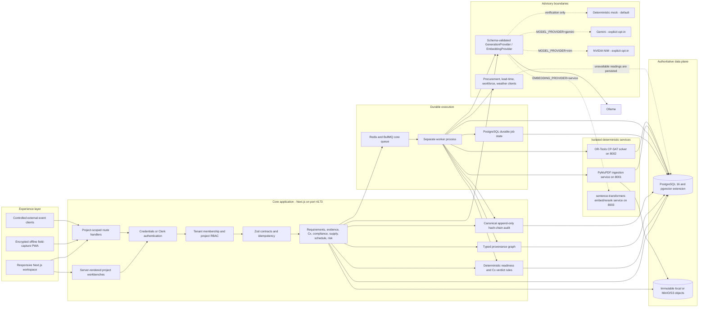
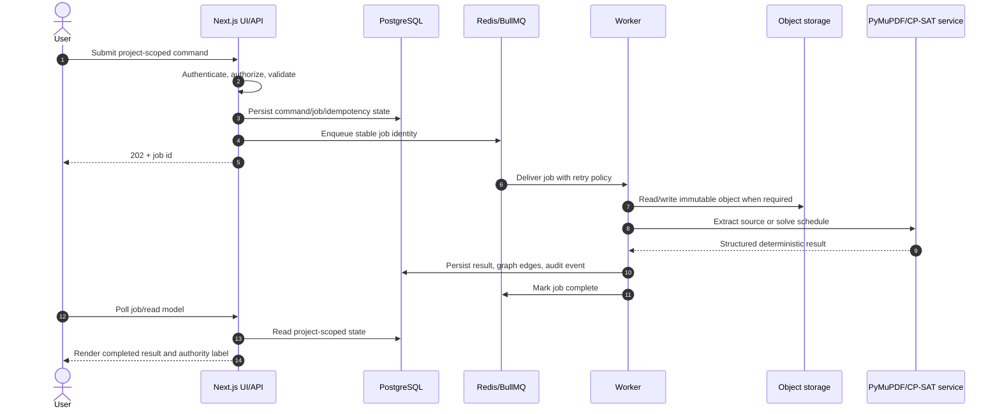
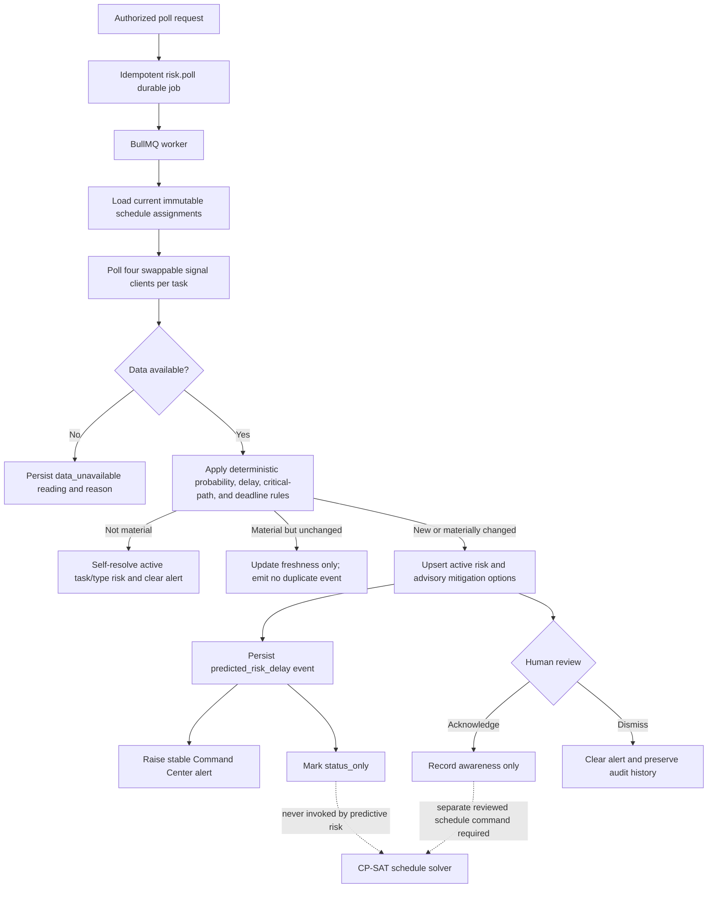
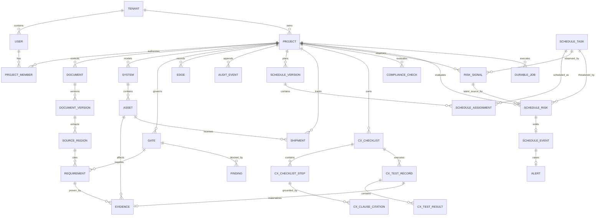

```mermaid
flowchart LR
    Upload["Controlled source uploaded"] --> Hash["Magic-byte check + SHA-256 object"]
    Hash --> Extract["PyMuPDF page and region extraction"]
    Extract --> Proposal["AI proposal with exact region citations"]
    Proposal --> Review{Human review}
    Review -->|accept or edit| Accepted["Accepted requirement / checklist / task"]
    Review -->|reject| Rejected["Rejected proposal retained in audit history"]
    Accepted --> Execute["Field evidence, Cx reading, or schedule solve"]
    Execute --> Deterministic["Deterministic result calculation"]
    Deterministic --> Finding["Finding and event when failed"]
    Deterministic --> EvidenceReview{Evidence/report review}
    EvidenceReview -->|accept| Proof["Accepted evidence + PROVES edge"]
    EvidenceReview -->|reject| NoAuthority["No authority granted"]
    Proof --> Readiness["Readiness v2.1 recomputation"]
    Finding --> Readiness
    Readiness --> Gate{Authorized gate decision}
    Gate -->|READY + reason + fresh TOTP| Approved["Immutable approved decision baseline"]
    Gate -->|not ready| Blocked["Gate remains blocked or in review"]
    Approved --> Turnover["Hashed turnover manifest + signed artifact"]
    Revision["Controlled-source revision"] --> Blast["Region hash blast-radius analysis"]
    Blast --> Stale["Affected evidence becomes stale; gates reopen"]
    Stale --> Readiness
```

# Pramana Cx

Pramana Cx is an evidence control plane for mission-critical EPC commissioning. It connects controlled requirements to systems, assets, tests, measurements, findings, approvals, schedules, shipments, and immutable source evidence so that an authorized engineer can make a defensible gate decision.

The product is **advisory by design**. AI may extract, retrieve, rank, draft, and explain. Deterministic services calculate readiness, schedule feasibility, and test verdicts. Only an authorized human review can accept requirements, evidence, checklists, reports, precedents, or gate decisions.

**Where to go from here:**

- **[CAPABILITIES.md](CAPABILITIES.md)** — a one-page summary of what the application does, with a walkthrough user flow
- **[STATUS.md](STATUS.md)** — what's verified, what's a known gap, and the latest local verification result
- **[local_dev_guide.md](local_dev_guide.md)** — prerequisites, environment keys, and how to bring the stack up
- **[PLANNER/](PLANNER)** — product intent ([PRD.md](PLANNER/PRD.md)), technical constraints ([TRD.md](PLANNER/TRD.md)), and the reconciled execution baseline ([CanonicalBuildPlan.md](PLANNER/CanonicalBuildPlan.md)); [Tracker.md](PLANNER/Tracker.md) records the state of every planning document

The chronological build record lives in git history. STATUS.md is the single source of truth for what is shipped and what is still open.

## How the application works

The normal project journey is intentionally governed rather than a single AI chat:

1. **Select a project:** project membership determines every record and action the user can see.
2. **Control sources:** upload a PDF, CSV, or XLSX in Sources, or a standard in Cx. The system validates its bytes, hashes the immutable object, extracts page or row/cell regions, and records exact citations.
3. **Review proposals:** AI may propose requirements, schedule inputs, or cited Cx steps. A reviewer must accept, edit, or reject each proposal before it gains authority.
4. **Model the facility:** create systems, assets, and approval gates, then connect records through typed provenance edges.
5. **Collect evidence:** capture online or offline field evidence. New evidence starts pending; an authorized reviewer decides whether it proves an accepted requirement.
6. **Execute commissioning:** run cited checklist steps. Numeric and boolean verdicts are deterministic; narrative observations stay routed to human judgment. An approved report becomes immutable evidence.
7. **Check compliance:** semantically discover candidate deviations, or compare an accepted requirement against an exact target citation directly. Deviations create only proposed findings until an engineer accepts the disposition.
8. **Plan and monitor:** review tasks/resources, validate dependencies, and create an immutable CP-SAT baseline. Risk polling records all four source outcomes and raises only new material advisory delays; it never changes schedule dates.
9. **Resolve work:** accepted failures and findings appear in Actions; stable alerts appear in Command Center. Owners move findings through assigned, in-progress, resolved, and reopened states.
10. **Decide readiness:** readiness recomputes from accepted proof, stale/failed evidence, predecessor gates, and open blockers. Approval requires permission, a substantive reason, and fresh TOTP in credentials mode.
11. **Generate turnover:** only an approved gate can produce a hashed turnover manifest and independently verifiable artifact.

The Graph and Changes surfaces are supporting views across this journey: Graph answers how records are connected; Changes shows what a controlled revision invalidated and why.

## Application surfaces

- Overview and current-project selection
- Controlled Sources, exact source-region viewer, and revisions
- Requirements proposal and human review
- Systems, assets, and readiness gates
- Evidence capture/review and offline Field Capture
- Deterministic Readiness and authorized gate decisions
- Schedule inputs, review queue, solver versions, diffs, and explanations
- Live schedule signals, task risks, advisory mitigations, and risk review
- Findings/Actions lifecycle and typed Graph explorer
- Cx Standards, cited checklists, readings, reports, and approval
- Shipments and map visualization
- Compliance review queue with semantic scan and Knowledge search with cited synthesis
- Command Center alerts
- Turnover packs and independent verification
- Project/member/security Settings and Profile

## End-to-end system architecture



The Next.js process owns authentication, authorization, validation, and synchronous domain commands. Expensive or retryable work crosses the durable BullMQ boundary. PostgreSQL is the business authority; object storage contains immutable source/evidence/report/turnover bytes; the relational `edges` table supplies graph traversal without introducing a second operational database.

<details>
<summary><strong>Authority and evidence flow</strong></summary>



</details>

<details>
<summary><strong>Runtime request and job lifecycle</strong></summary>



</details>

<details>
<summary><strong>Predictive-risk flow and solver safety boundary</strong></summary>



Predictive risk can observe, explain, and propose. It cannot apply a mitigation, change a dependency/resource constraint, invoke a re-solve, or alter dates. A scheduler must make a separate reviewed schedule change before the deterministic solver can create another immutable version.

</details>

<details>
<summary><strong>Authoritative data model</strong></summary>



Every authoritative record is tenant/project scoped. Cross-project IDs are rejected at the API boundary. `edges` hold traversable provenance, while normalized relational tables remain the authority for permissions and business state. Audit events are append-only and hash-linked per project.

</details>

## Technology and authority choices

- **Web/API:** Next.js 16, React 19, TypeScript, Zod
- **Database:** PostgreSQL 16 through Drizzle; pgvector image in the Compose topology
- **Graph:** typed relational `edges` table, avoiding a second operational database until traversal evidence proves it necessary
- **Jobs:** Redis and BullMQ with durable database job state and idempotency keys
- **Object storage:** one local/S3-compatible boundary; MinIO is the local production analogue
- **Document extraction:** lightweight PyMuPDF service accepting PDF, CSV, and XLSX, with page/bounding-box (or sheet/row/cell) and content-hash provenance
- **Scheduling:** isolated FastAPI OR-Tools CP-SAT service; infeasibility is returned, never hidden
- **AI:** a schema-validated provider boundary for structured generation and embeddings. The application default is local Ollama (`MODEL_PROVIDER=ollama`, `OLLAMA_MODEL=gemma4:e2b`; `EMBEDDING_PROVIDER=ollama`, `OLLAMA_EMBEDDING_MODEL=nomic-embed-text:latest`). Every real provider is bounded by prompt, response-token, context, and request-time limits. `mock` exists only for deterministic test runs and must never be selected by a deployment. Every AI-authored suggestion is labeled with provider/model provenance, lands in `reviewState: "proposed"`, and never auto-accepts authoritative changes.
- **Retrieval:** a third stateless FastAPI service (`services/retrieval`, port 8003) alongside ingestion and the solver, serving `BAAI/bge-base-en-v1.5` embeddings (768-dim, matching the existing `vector(768)` column with no migration) and `BAAI/bge-reranker-base` cross-encoder reranking; it holds no database credentials, and project scoping stays in SQL behind the existing permission checks. Every stored vector is tagged with the model that produced it, so a provider switch degrades to fewer results rather than silently corrupting cosine rankings across incompatible vector spaces
- **Authentication:** owned credentials/TOTP or Clerk adapter; all authorization remains in project memberships and server-side permissions
- **Design system:** IBM Plex Serif headings, Hanken Grotesk body, JetBrains Mono labels; primary `#2D463E`, secondary `#B5651D`, tertiary `#583935`, neutral `#FDFBF7`

## Local operation

### Local Docker topology

Docker Desktop must be running before using Compose. If `docker.sock` is missing, start Docker Desktop and wait until `docker info` succeeds.

```bash
npm install
cp .env.example .env.local
docker info
docker compose up --build
```

The web application is configured for [http://localhost:4173](http://localhost:4173), not port 3000. Compose starts PostgreSQL/pgvector, Redis, MinIO, ingestion, solver, retrieval, core API, and worker. It is a local topology, not an implicitly safe production profile.

For local Ollama, install the model on the machine or deploy an Ollama service reachable by the application; Docker containers cannot reach host-local `127.0.0.1:11434` by default.

```bash
ollama pull gemma4:e2b
ollama pull nomic-embed-text:latest
MODEL_PROVIDER=ollama EMBEDDING_PROVIDER=ollama npm run verify:ollama
```

`verify:ollama` is a real-provider smoke test: it requires an Ollama server, verifies structured output plus 768-dimensional embeddings, and enforces the configured deadline. It is distinct from the deterministic offline verification matrix.

### Existing local-service fallback

The application can also run against separately started PostgreSQL, Redis, ingestion, and solver processes. After those dependencies are healthy:

```bash
npm run db:migrate
npm run db:seed
npm run system:start
```

`system:start` applies migrations, creates a production build, checks PostgreSQL, Redis, ingestion, and solver health, and then supervises the web process and BullMQ worker together on port 4173. Use `Ctrl+C` to stop both application processes cleanly.

### Verification

```bash
npm run typecheck
npm run build
npm run verify:all
```

`verify:all` is the broad local matrix — migrations, type-check, production build, seeded prerequisites, isolated development and credentials runtimes, and every `verify:*` script (auth, evidence/turnover, schedule, Cx, compliance, predictive-risk, knowledge, model-provider, audit). It deliberately overrides providers to deterministic mock values so it can validate application contracts without a hosted model. This is not evidence that a real model, live AIS/weather, or production secrets work; run `verify:ollama` and the deployment checks below separately. Individual `npm run verify:<name>` scripts (see `package.json`) can run against a development server for faster iteration. See [STATUS.md](STATUS.md) for what the last full run actually covered.

The 21 July 2026 merge-readiness run also exercised the application in a real browser across every sidebar destination. The supplied TIA-942 PDF produced 26 controlled regions and 26 `nomic-embed-text` vectors; a live `gemma4:e2b` query returned only TIA-labelled citation links. Knowledge now supports an explicit Document filter and deterministic exact-title/standard-name routing, enforced in SQL before vector ranking. A migration backfills previously processed documents that had extraction regions but were missing semantic chunks. The complete post-fix `verify:all` run finished green; production dependency audit reports zero runtime advisories. See [STATUS.md](STATUS.md#what-changed-in-the-merge-readiness-pass-21-july-2026) for the complete change and residual-risk ledger.

## Deployment release gate

Do not deploy with Compose or `.env.example` defaults. Before a production rollout, create a secret-managed environment file and verify every item below:

1. `AUTH_MODE` is `credentials` or `clerk` (never `development`), and `AUTH_ENCRYPTION_KEY`, Clerk keys where applicable, session-cookie configuration, and `APP_BASE_URL` are production values.
2. `MODEL_PROVIDER` and `EMBEDDING_PROVIDER` are real providers—not `mock`—and their selected endpoints/models are reachable from both the web and worker containers. For Ollama, configure a network-reachable `OLLAMA_BASE_URL`; do not use host loopback from a container.
3. PostgreSQL has the `vector` extension available before `npm run db:migrate`. Migration success must be checked against the actual deployment database, not merely generated SQL.
4. Redis, object storage, ingestion, solver, retrieval (if selected), and model-provider health checks are green. Set `INFRA_ALLOW_DEGRADED=false`.
5. Live risk/AIS/weather integrations are configured and a controlled end-to-end poll records real provenance. Synthetic data must be disabled or visibly labelled outside demo/test environments.
6. Run `npm run typecheck`, `npm run build`, `npm run verify:deep-links`, the applicable integration matrix, and `npm run verify:ollama` (or an equivalent real Gemini/NIM smoke test) using the release configuration.

Public OpenStreetMap lookup in the shipment form is opt-in. Operators should use the local location catalog for sensitive sites; enabling the checkbox sends the entered query to the public Nominatim service, with a 2.5-second cancellation deadline.

## Configuration requiring manual credentials

The example file is for local development. Production-like integrations require secret-managed values outside the repository:

- Clerk publishable/secret keys only if `AUTH_MODE=clerk` is selected
- a strong `AUTH_ENCRYPTION_KEY` when owned credentials/TOTP are used
- an Ollama endpoint plus `gemma4:e2b` and `nomic-embed-text:latest` when `MODEL_PROVIDER=ollama` and `EMBEDDING_PROVIDER=ollama` are selected; use a network address reachable from containers
- Gemini API key only if `MODEL_PROVIDER=gemini` is selected; an NVIDIA `NIM_API_KEY` only if `MODEL_PROVIDER=nim` is selected (hosted by default at `NIM_BASE_URL`, or point it at a self-hosted NIM endpoint)
- no credential is required for `EMBEDDING_PROVIDER=service`, but the retrieval container must be healthy and its model assets available
- S3/MinIO endpoint, bucket, region, access key, and secret when `OBJECT_STORAGE_DRIVER=s3`
- procurement, equipment-lead-time, workforce, and weather endpoint URLs when `RISK_POLL_MODE=http`
- AIS and shipment congestion/weather credentials and a non-synthetic `RISK_POLL_MODE` when live shipment/risk data is required

Never commit `.env.local` or credentials.
