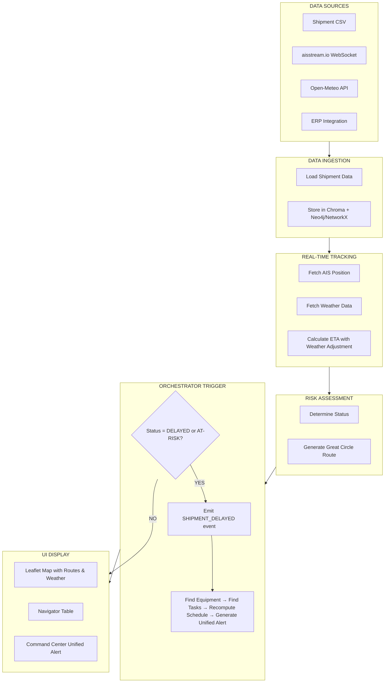

# Supply Chain Visibility & Risk Agent — Complete Documentation

**Pramana Cx — ET AI Hackathon 2026**
**Date:** July 15, 2026
**Status:** Committed MVP Scope (Hackathon Build)

> **Scope specification, retained as written (15 July 2026).** This is one of the two agent specifications folded into [PLANNER/StructuredPlan.md](PLANNER/StructuredPlan.md) and reconciled by [PLANNER/CanonicalBuildPlan.md](PLANNER/CanonicalBuildPlan.md). It states intended scope, not shipped state. Both the AIS and weather drivers are swappable and default to synthetic offline behaviour (`AIS_MODE`, `WEATHER_MODE`); every position carries an explicit `live` vs. `simulated` label. For what is built and verified, see [STATUS.md](STATUS.md).

---

## 1. Agent Overview

### 1.1 Purpose
The Supply Chain Visibility & Risk Agent tracks all critical equipment shipments (UPS systems, generators, cooling towers, switchgear) from origin to destination, monitors real-time position via AIS data, predicts ETA using weather and route conditions, detects risks, and propagates delays to the Orchestrator for schedule recomputation.

### 1.2 Core Value Proposition
- **Real-time visibility** — Live position tracking on interactive map
- **Weather-aware ETA** — Dynamic adjustments based on Open-Meteo forecasts
- **Proactive risk detection** — Color-coded status (🟢 On-time / 🟡 At-risk / 🔴 Delayed)
- **Orchestrator integration** — Delay events automatically trigger schedule risk recomputation
- **Interactive experience** — Clickable navigator table zooms map to specific shipment route

### 1.3 Key Differentiators
| Feature | Why It Matters |
|---|---|
| **Great Circle Routes** | Realistic curved shipping paths using @turf/great-circle |
| **Live AIS Data** | Free vessel tracking via aisstream.io WebSocket |
| **Zero-API-Cost Weather** | Open-Meteo requires no API key |
| **Orchestrator Cascade** | Delay → Schedule Risk → RFI Precedent → Unified Alert |

### 1.4 Relation to Existing Plan

This agent implements the **Supply Chain Visibility & Risk Agent** described in [StructuredPlan.md](PLANNER/StructuredPlan.md) under the Planned Agent Suite:

> *"Supply Chain Visibility & Risk Agent — geospatial AI tracking critical equipment shipments (UPS systems, generators, cooling towers, switchgear) across multi-tier suppliers; alerts on at-risk deliveries; models procurement alternatives before they become critical-path issues."*

**Scope relative to plan:** This implementation delivers the first two capabilities (geospatial tracking and at-risk alerting) using free APIs (aisstream.io for AIS vessel positions, Open-Meteo for weather). The third capability (modelling procurement alternatives) is explicitly **out of scope** — see Section 13: Product Boundary.

**Integration point:** Delay events emitted by this agent flow into the existing Schedule Manager’s event pipeline as `schedule_events.kind = shipment_delayed`, following the same event → delta-detector → CP-SAT re-solve pattern defined in StructuredPlan §2 (Proactive Schedule Management Module). The Predictive Schedule Risk Engine consumes the same events as a signal source for its periodic risk polling.

### 1.5 AI-Advisory Boundary

Consistent with the platform’s core constraint — *"AI may extract, classify, map, summarize, and recommend; it cannot approve compliance, close an NCR, grant a waiver, sign a test, or set a gate to ready"* (StructuredPlan §1) — this agent operates in an **advisory-only** capacity:

- **Delay detection and status classification** (on-time / at-risk / delayed) are **deterministic** — threshold-based calculations using weather data and configurable buffer days, not LLM-generated assessments.
- **Alerts are proposals, not decisions.** A `SHIPMENT_DELAYED` event triggers downstream schedule risk recomputation by the deterministic CP-SAT solver; it does not unilaterally reschedule tasks, change gate status, or close/block any gate.
- **No autonomous procurement action.** The agent does not select alternative vendors, approve expedited shipping, or modify purchase orders. It surfaces delay risk for human decision-makers.
- **Weather-adjusted ETAs are estimates, not commitments.** The delay-factor model is a coarse heuristic (additive threshold multipliers on remaining transit duration), not a validated predictive model. All ETAs are labelled as estimates, never as guaranteed delivery dates.

### 1.6 Licensing & Data Constraints

- **AIS data** from aisstream.io is free-tier, best-effort, and subject to their Terms of Service. It must not be redistributed or used for navigation.
- **Open-Meteo** weather data is free for non-commercial use. The hackathon prototype qualifies; a production deployment would require their commercial API or an alternative licensed weather provider.
- **No proprietary supply-chain data** (vendor contracts, PO terms, freight quotes, or customer shipping records) is bundled in the prototype. All demo data uses synthetic/anonymized shipment records.
- **Map tiles** are sourced from OpenStreetMap, subject to the ODbL licence. Attribution is required and included in the map component.

---

## 2. Complete Workflow

### 2.1 Phase 1: Data Ingestion & Preparation

```
┌─────────────────────────────────────────────────────────────────────────────────────┐
│ STEP 1.1: Load Shipment Data                                                       │
├─────────────────────────────────────────────────────────────────────────────────────┤
│                                                                                     │
│  ┌─────────────────────────────────────────────────────────────────────────────┐   │
│  │ SHIPMENT DATA SOURCES:                                                       │   │
│  │                                                                             │   │
│  │  • CSV File:  ──────────────────────────────────────────────────────────────▶│   │
│  │    shipment_id, equipment, origin_lat, origin_lng,                          │   │
│  │    dest_lat, dest_lng, eta_planned, required_on_site_date                   │   │
│  │                                                                             │   │
│  │  • ERP Integration:  ──────────────────────────────────────────────────────▶│   │
│  │    Fetch real-time procurement data from ERPNext                            │   │
│  │                                                                             │   │
│  │  • User Input:  ───────────────────────────────────────────────────────────▶│   │
│  │    Manual shipment creation via UI                                          │   │
│  └─────────────────────────────────────────────────────────────────────────────┘   │
│                                      │                                              │
│                                      ▼                                              │
│  ┌─────────────────────────────────────────────────────────────────────────────┐   │
│  │ STEP 1.2: Store Shipment Data                                               │   │
│  │                                                                             │   │
│  │  • Chroma DB: Store embeddings for semantic search of shipments            │   │
│  │  • Neo4j / NetworkX: Create Shipment node linked to Equipment              │   │
│  │  • Local Object Store: Store shipment metadata and documents               │   │
│  └─────────────────────────────────────────────────────────────────────────────┘   │
└─────────────────────────────────────────────────────────────────────────────────────┘
```

### 2.2 Phase 2: Real-Time Tracking & Monitoring

```
┌─────────────────────────────────────────────────────────────────────────────────────┐
│ STEP 2.1: Fetch Real-Time Position (Live Demo)                                    │
├─────────────────────────────────────────────────────────────────────────────────────┤
│                                                                                     │
│  ┌─────────────────────────────────────────────────────────────────────────────┐   │
│  │ AIS DATA SOURCE:                                                            │   │
│  │  • aisstream.io WebSocket ──────▶ Subscribe to vessel by MMSI              │   │
│  │    Free tier: best-effort, typically 1-3 minute lag              │   │
│  │                                                                             │   │
│  │  • Simulated Data (Fallback) ────▶ Interpolate position along great circle │   │
│  │                                                                             │   │
│  │  • Periodic Polling: Every 30 seconds → update position, speed, heading   │   │
│  └─────────────────────────────────────────────────────────────────────────────┘   │
│                                      │                                              │
│                                      ▼                                              │
│  ┌─────────────────────────────────────────────────────────────────────────────┐   │
│  │ STEP 2.2: Fetch Weather Data                                                 │   │
│  │                                                                             │   │
│  │  • Open-Meteo API ─────────────────────────────────────────────────────────▶│   │
│  │    GET /forecast?latitude={lat}&longitude={lng}&current=wind,precipitation  │   │
│  │    No API key required; free for non-commercial use   │   │
│  │                                                                             │   │
│  │  • Weather at Origin, Destination, and along route waypoints               │   │
│  │  • Store weather snapshot with timestamp                                   │   │
│  └─────────────────────────────────────────────────────────────────────────────┘   │
│                                      │                                              │
│                                      ▼                                              │
│  ┌─────────────────────────────────────────────────────────────────────────────┐   │
│  │ STEP 2.3: Calculate ETA with Weather Adjustment                             │   │
│  │                                                                             │   │
│  │  ┌───────────────────────────────────────────────────────────────────────┐  │   │
│  │  │ Weather Delay Factor Calculator:                                     │  │   │
│  │  │                                                                     │  │   │
│  │  │  wind_speed > 50 km/h  →  +0.5 delay_factor                        │  │   │
│  │  │  precipitation > 10 mm →  +0.3 delay_factor                        │  │   │
│  │  │  storm warning        →  +1.0 delay_factor                        │  │   │
│  │  │  port congestion      →  +0.5 delay_factor                        │  │   │
│  │  │  (delay_factor starts at 0.0 and is additive across all triggered  │  │   │
│  │  │   conditions; it is a MULTIPLIER ON REMAINING TRANSIT DURATION,    │  │   │
│  │  │   not a day-count, and not added directly to a date)               │  │   │
│  │  │                                                                     │  │   │
│  │  │  planned_duration_days = (eta_planned - departure_date).days       │  │   │
│  │  │  extra_days = planned_duration_days * delay_factor                 │  │   │
│  │  │  new_eta = eta_planned + extra_days                                │  │   │
│  │  │                                                                     │  │   │
│  │  │  NOTE (patched 2026-07-15): earlier draft's                       │  │   │
│  │  │  `total_delay = planned_duration * (1 + delay_factor)` conflated  │  │   │
│  │  │  "total transit time" with "extra delay time" and the original    │  │   │
│  │  │  code in 7.1 didn't implement either — it added                    │  │   │
│  │  │  `delay_factor - 1` as raw days. Section 7.1 below now matches     │  │   │
│  │  │  this corrected formula exactly.                                   │  │   │
│  │  └───────────────────────────────────────────────────────────────────────┘  │   │
│  └─────────────────────────────────────────────────────────────────────────────┘   │
└─────────────────────────────────────────────────────────────────────────────────────┘
```

### 2.3 Phase 3: Risk Assessment & Status Updates

```
┌─────────────────────────────────────────────────────────────────────────────────────┐
│ STEP 3.1: Determine Status                                                         │
├─────────────────────────────────────────────────────────────────────────────────────┤
│                                                                                     │
│  ┌─────────────────────────────────────────────────────────────────────────────┐   │
│  │ Status Logic:                                                               │   │
│  │                                                                             │   │
│  │  🟢 ON-TIME:  new_eta ≤ required_on_site_date - buffer                    │   │
│  │  🟡 AT-RISK:  new_eta > required_on_site_date - buffer                     │   │
│  │  🔴 DELAYED:  new_eta > required_on_site_date                              │   │
│  │                                                                             │   │
│  │  buffer = 2 days (configurable)                                            │   │
│  └─────────────────────────────────────────────────────────────────────────────┘   │
│                                      │                                              │
│                                      ▼                                              │
│  ┌─────────────────────────────────────────────────────────────────────────────┐   │
│  │ STEP 3.2: Generate Great Circle Route                                       │   │
│  │                                                                             │   │
│  │  • @turf/great-circle library ─────────────────────────────────────────────▶│   │
│  │    const greatCircle = turf.greatCircle(start, end, {npoints: 100})│   │
│  │                                                                             │   │
│  │  • 100 intermediate points along route for smooth curved line  │   │
│  │  • Store route coordinates with timestamp                                  │   │
│  └─────────────────────────────────────────────────────────────────────────────┘   │
└─────────────────────────────────────────────────────────────────────────────────────┘
```

### 2.4 Phase 4: Orchestrator Propagation (CRITICAL)

```
┌─────────────────────────────────────────────────────────────────────────────────────┐
│ STEP 4.1: Status Change → Orchestrator Trigger                                     │
├─────────────────────────────────────────────────────────────────────────────────────┤
│                                                                                     │
│  ┌─────────────────────────────────────────────────────────────────────────────┐   │
│  │ IF Status becomes "DELAYED" OR "AT-RISK":                                  │   │
│  │                                                                             │   │
│  │  ┌───────────────────────────────────────────────────────────────────────┐  │   │
│  │  │ 1. Emit SHIPMENT_DELAYED event to Orchestrator                       │  │   │
│  │  │                                                                     │  │   │
│  │  │ 2. Orchestrator finds Equipment linked to Shipment                 │  │   │
│  │  │                                                                     │  │   │
│  │  │ 3. Orchestrator finds all ScheduleTasks requiring Equipment        │  │   │
│  │  │                                                                     │  │   │
│  │  │ 4. Schedule Risk Engine recomputes lead time                       │  │   │
│  │  │                                                                     │  │   │
│  │  │ 5. Orchestrator generates UNIFIED ALERT                           │  │   │
│  │  └───────────────────────────────────────────────────────────────────────┘  │   │
│  └─────────────────────────────────────────────────────────────────────────────┘   │
│                                      │                                              │
│                                      ▼                                              │
│  ┌─────────────────────────────────────────────────────────────────────────────┐   │
│  │ STEP 4.2: Unified Alert Content                                             │   │
│  │                                                                             │   │
│  │  {                                                                         │   │
│  │    "type": "SHIPMENT_DELAYED",                                             │   │
│  │    "shipment_id": "SHP-002",                                               │   │
│  │    "equipment": "GEN-003",                                                 │   │
│  │    "old_eta": "2026-07-18",                                                │   │
│  │    "new_eta": "2026-07-22",                                                │   │
│  │    "delay_days": 4,                                                        │   │
│  │    "reason": "Storm approaching Shanghai",                                │   │
│  │    "affected_tasks": [                                                     │   │
│  │      {"task_id": "T-012", "name": "Generator Installation", "delay": 4},  │   │
│  │      {"task_id": "T-015", "name": "Load Testing", "delay": 4}             │   │
│  │    ],                                                                      │   │
│  │    "critical_path_impact": true                                            │   │
│  │  }                                                                         │   │
│  └─────────────────────────────────────────────────────────────────────────────┘   │
└─────────────────────────────────────────────────────────────────────────────────────┘
```

### 2.5 Phase 5: UI Display

```
┌─────────────────────────────────────────────────────────────────────────────────────┐
│ STEP 5.1: Map Rendering                                                            │
├─────────────────────────────────────────────────────────────────────────────────────┤
│                                                                                     │
│  ┌─────────────────────────────────────────────────────────────────────────────┐   │
│  │ LEAFLET MAP (react-leaflet):                                                │   │
│  │                                                                             │   │
│  │  • Display all shipments on world map                                     │   │
│  │  • Draw great circle routes with color-coding                             │   │
│  │  • Display markers at origin, destination, and current position           │   │
│  │  • Weather overlay: Wind arrows, precipitation heat map                  │   │
│  │                                                                             │   │
│  │  • Click shipment marker → Popup with details:                            │   │
│  │    - Equipment name                                                        │   │
│  │    - Current status                                                        │   │
│  │    - ETA                                                                   │   │
│  │    - Weather conditions                                                    │   │
│  │    - "View Details" button                                                │   │
│  └─────────────────────────────────────────────────────────────────────────────┘   │
│                                      │                                              │
│                                      ▼                                              │
│  ┌─────────────────────────────────────────────────────────────────────────────┐   │
│  │ STEP 5.2: Navigator Table                                                   │   │
│  │                                                                             │   │
│  │  • Below the map, display table of all shipments                          │   │
│  │  • Columns: Equipment, Origin, Destination, ETA, Status, Weather, Actions │   │
│  │  • Click row → Map zooms to that shipment's route                        │   │
│  │  • Status color-coded (🟢 On-time, 🟡 At-risk, 🔴 Delayed)               │   │
│  │  • Actions: "Locate on Map", "View Details"                                │   │
│  └─────────────────────────────────────────────────────────────────────────────┘   │
└─────────────────────────────────────────────────────────────────────────────────────┘
```

### 2.6 Complete Workflow Diagram (Mermaid)



---

## 3. Architecture

### 3.1 High-Level Architecture

```
┌─────────────────────────────────────────────────────────────────────────────────────┐
│                        SUPPLY CHAIN AGENT — ARCHITECTURE                            │
├─────────────────────────────────────────────────────────────────────────────────────┤
│                                                                                     │
│  ┌─────────────────────────────────────────────────────────────────────────────┐   │
│  │                         EXTERNAL DATA SOURCES                                │   │
│  │                                                                             │   │
│  │  ┌──────────────┐  ┌──────────────┐  ┌──────────────┐  ┌──────────────┐   │   │
│  │  │ aisstream.io │  │ Open-Meteo   │  │ Shipment CSV │  │ ERP System   │   │   │
│  │  │ (WebSocket)  │  │ (REST API)   │  │ (Local)      │  │ (Optional)   │   │   │
│  │  └──────────────┘  └──────────────┘  └──────────────┘  └──────────────┘   │   │
│  └─────────────────────────────────────────────────────────────────────────────┘   │
│                                      │                                              │
│                                      ▼                                              │
│  ┌─────────────────────────────────────────────────────────────────────────────┐   │
│  │                         BACKEND (FastAPI + Python)                          │   │
│  │                                                                             │   │
│  │  ┌───────────────────────────────────────────────────────────────────────┐  │   │
│  │  │                        AGENT CORE                                      │  │   │
│  │  │                                                                       │  │   │
│  │  │  ┌─────────────────┐  ┌─────────────────┐  ┌─────────────────────────┐│  │   │
│  │  │  │ AIS Connector   │  │ Weather         │  │ Route Generator         ││  │   │
│  │  │  │ (websockets)    │  │ Connector       │  │ (@turf/great-circle)   ││  │   │
│  │  │  └─────────────────┘  │ (httpx)         │  └─────────────────────────┘│  │   │
│  │  │                       └─────────────────┘                             │  │   │
│  │  │                                                                       │  │   │
│  │  │  ┌─────────────────────────────────────────────────────────────────┐  │  │   │
│  │  │  │                    RISK ASSESSOR                                │  │  │   │
│  │  │  │  • ETA Calculator with Weather Adjustment                      │  │  │   │
│  │  │  │  • Status Determiner (On-time/At-risk/Delayed)                 │  │  │   │
│  │  │  │  • Delay Factor Calculator                                     │  │  │   │
│  │  │  └─────────────────────────────────────────────────────────────────┘  │  │   │
│  │  │                                                                       │  │   │
│  │  │  ┌─────────────────────────────────────────────────────────────────┐  │  │   │
│  │  │  │                    ORCHESTRATOR INTEGRATION                     │  │  │   │
│  │  │  │  • Emit SHIPMENT_DELAYED events                                 │  │  │   │
│  │  │  │  • Push unified alerts to Command Center                        │  │  │   │
│  │  │  └─────────────────────────────────────────────────────────────────┘  │  │   │
│  │  └───────────────────────────────────────────────────────────────────────┘  │   │
│  │                                                                             │   │
│  │  ┌───────────────────────────────────────────────────────────────────────┐  │   │
│  │  │                        STORAGE LAYER                                 │  │   │
│  │  │                                                                       │  │   │
│  │  │  ┌─────────────────┐  ┌─────────────────┐  ┌───────────────────────┐  │  │   │
│  │  │  │ Chroma (Vector) │  │ Neo4j/NetworkX  │  │ Local Object Store    │  │  │   │
│  │  │  │ Shipment Search │  │ (Graph)         │  │ (Hashes + Originals)  │  │  │   │
│  │  │  └─────────────────┘  └─────────────────┘  └───────────────────────┘  │  │   │
│  │  └───────────────────────────────────────────────────────────────────────┘  │   │
│  └─────────────────────────────────────────────────────────────────────────────┘   │
│                                      │                                              │
│                                      ▼                                              │
│  ┌─────────────────────────────────────────────────────────────────────────────┐   │
│  │                         FRONTEND (React + TypeScript)                       │   │
│  │                                                                             │   │
│  │  ┌───────────────────────────────────────────────────────────────────────┐  │   │
│  │  │  Supply Chain Dashboard (Page 15)                                     │  │   │
│  │  │                                                                       │  │   │
│  │  │  ┌─────────────────────┐  ┌─────────────────────────────────────────┐ │  │   │
│  │  │  │ Leaflet Map         │  │ Navigator Table                         │ │  │   │
│  │  │  │ • Great Circle      │  │ • Click to zoom                        │ │  │   │
│  │  │  │   Routes            │  │ • Status color-coding                  │ │  │   │
│  │  │  │ • Weather Overlay   │  │ • Search + Filters                     │ │  │   │
│  │  │  │ • Live Markers      │  │ • Export functionality                 │ │  │   │
│  │  │  └─────────────────────┘  └─────────────────────────────────────────┘ │  │   │
│  │  └───────────────────────────────────────────────────────────────────────┘  │   │
│  └─────────────────────────────────────────────────────────────────────────────┘   │
└─────────────────────────────────────────────────────────────────────────────────────┘
```

### 3.2 Data Flow

```
┌─────────────────────────────────────────────────────────────────────────────────────┐
│                              DATA FLOW                                              │
├─────────────────────────────────────────────────────────────────────────────────────┤
│                                                                                     │
│  ┌──────────────┐     ┌──────────────┐     ┌──────────────┐     ┌──────────────┐  │
│  │  Weather API │────►│ Delay        │────►│ ETA          │────►│ Map          │  │
│  │  Open-Meteo  │     │ Calculator   │     │ Recalculation│     │ Renderer     │  │
│  └──────────────┘     └──────────────┘     └──────────────┘     └──────────────┘  │
│                                                                                     │
│  ┌──────────────┐     ┌──────────────┐     ┌──────────────┐     ┌──────────────┐  │
│  │ Shipment CSV │────►│ Route        │────►│ Great Circle │────►│ Map          │  │
│  │ Data         │     │ Generator    │     │ Path         │     │ Renderer     │  │
│  └──────────────┘     └──────────────┘     └──────────────┘     └──────────────┘  │
│                                                                                     │
│  ┌──────────────┐     ┌──────────────┐     ┌──────────────┐     ┌──────────────┐  │
│  │ Status       │────►│ Color        │────►│ Map Marker   │────►│ Map          │  │
│  │ Update       │     │ Mapper       │     │ Styling      │     │ Renderer     │  │
│  └──────────────┘     └──────────────┘     └──────────────┘     └──────────────┘  │
│                                                                                     │
│  ┌──────────────┐     ┌──────────────┐     ┌──────────────┐     ┌──────────────┐  │
│  │ Table Click  │────►│ Shipment ID  │────►│ Map Zoom     │────►│ Map          │  │
│  │ (Row)        │     │ Lookup       │     │ (flyTo)      │     │ Renderer     │  │
│  └──────────────┘     └──────────────┘     └──────────────┘     └──────────────┘  │
│                                                                                     │
│  ┌──────────────┐     ┌──────────────┐     ┌──────────────┐     ┌──────────────┐  │
│  │ Delay Alert  │────►│ Orchestrator │────►│ Schedule     │────►│ Readiness    │  │
│  │ (Status)     │     │ Trigger      │     │ Risk Recalc  │     │ Board Update │  │
│  └──────────────┘     └──────────────┘     └──────────────┘     └──────────────┘  │
└─────────────────────────────────────────────────────────────────────────────────────┘
```

---

## 4. Tech Stack

### 4.1 Backend

| Layer | Technology | Version | Purpose | Cost |
|---|---|---|---|---|
| **Web Framework** | FastAPI + Python | 3.11+ | Async API endpoints | Free |
| **WebSocket Client** | websockets | Latest | AIS data streaming | Free |
| **HTTP Client** | httpx | Latest | Weather API calls | Free |
| **Geospatial** | @turf/great-circle | 7.x | Great circle route calculation | Free |
| **Vector DB** | Chroma | Latest | Semantic search for shipments | Free |
| **Graph DB** | Neo4j (primary) / NetworkX (fallback) | Latest | Equipment-shipment relationships | Free |
| **Async** | asyncio | Built-in | Parallel agent execution | Free |

### 4.2 Frontend

| Layer | Technology | Version | Purpose | Cost |
|---|---|---|---|---|
| **Framework** | React + TypeScript | 19.x | UI components | Free |
| **Map Library** | Leaflet + React-Leaflet | Latest | Interactive map rendering | Free |
| **Great Circle** | @turf/great-circle | 7.x | Route generation | Free |
| **Styling** | Tailwind CSS | 3.x | Utility-first styling | Free |
| **State** | Zustand | Latest | Global state management | Free |
| **HTTP** | TanStack Query | Latest | Data fetching + caching | Free |

### 4.3 External APIs (100% Free)

| API | Purpose | Free Tier | Key Required |
|---|---|---|---|
| **aisstream.io** | Real-time AIS vessel positions | Best-effort, 1-3 min lag | ✅ Free registration |
| **Open-Meteo** | Weather forecasts & current conditions | Unlimited non-commercial | ❌ No API key |

---

## 5. Data Sources & Dataset Structure

### 5.1 Shipment Data (CSV Input)

```csv
shipment_id,equipment_name,equipment_type,origin_lat,origin_lng,dest_lat,dest_lng,origin_city,dest_city,mmsi,eta_planned,required_on_site_date,status
SHP-001,UPS-001,UPS,13.0827,80.2707,19.0760,72.8777,Chennai,Mumbai,123456789,2026-07-20,2026-07-25,on-time
SHP-002,GEN-003,Generator,31.2304,121.4737,19.0760,72.8777,Shanghai,Mumbai,987654321,2026-07-18,2026-07-22,delayed
SHP-003,CT-007,Cooling Tower,50.1109,8.6821,19.0760,72.8777,Frankfurt,Mumbai,456789123,2026-07-25,2026-07-28,at-risk
SHP-004,SW-001,Switchgear,1.3521,103.8198,19.0760,72.8777,Singapore,Mumbai,789123456,2026-07-20,2026-07-25,on-time
```

### 5.2 Port Coordinates (Reference Dataset)

| Port | Country | Latitude | Longitude |
|---|---|---|---|
| Mumbai | India | 19.0760 | 72.8777 |
| Chennai | India | 13.0827 | 80.2707 |
| Shanghai | China | 31.2304 | 121.4737 |
| Singapore | Singapore | 1.3521 | 103.8198 |
| Frankfurt | Germany | 50.1109 | 8.6821 |
| Rotterdam | Netherlands | 51.9225 | 4.4792 |
| Los Angeles | USA | 33.7386 | -118.2426 |
| Tokyo | Japan | 35.6762 | 139.6503 |

### 5.3 Weather Data (Open-Meteo Response)

```json
{
  "latitude": 31.23,
  "longitude": 121.47,
  "current": {
    "temperature_2m": 24.5,
    "wind_speed_10m": 55.0,
    "precipitation": 15.2,
    "weather_code": 61  // Moderate rain
  },
  "daily": {
    "weather_code": [61, 80, 3],
    "wind_speed_10m_max": [55, 60, 40]
  }
}
```

### 5.4 AIS Data (aisstream.io Response)

```json
{
  "MessageType": 1,
  "MMSI": 123456789,
  "Latitude": 15.1234,
  "Longitude": 75.5678,
  "SpeedOverGround": 12.5,
  "TrueHeading": 245,
  "Timestamp": "2026-07-15T10:30:00Z"
}
```

---

## 6. Free API Keys & Setup

### 6.1 aisstream.io — Vessel Tracking

| Item | Details |
|---|---|
| **Website** | https://aisstream.io |
| **Sign Up** | GitHub or email authentication |
| **API Key Location** | Dashboard → API Keys → Create API Key |
| **Free Tier** | Best-effort, 1-3 minute lag for any given vessel |
| **Protocol** | WebSocket (wss://stream.aisstream.io/v0/stream) |
| **Authentication** | API key in subscription message |
| **Documentation** | https://docs.zendir.io |

### 6.2 Open-Meteo — Weather Data

| Item | Details |
|---|---|
| **Website** | https://open-meteo.com |
| **Sign Up** | ❌ Not required |
| **API Key** | ❌ Not required |
| **Free Tier** | Unlimited non-commercial use |
| **Rate Limits** | No hard limits; fair usage policy |
| **Documentation** | https://open-meteo.com/en/docs |
| **Python Client** | openmeteopy |

---

## 7. Implementation Code

### 7.1 Backend: Supply Chain Agent

```python
# backend/app/agents/supply_chain_agent.py
#
# PATCHED 2026-07-15 — see Section 11 "Patch Notes" for the full list of
# edge cases addressed in this revision.

import asyncio
import json
import math
import httpx
import websockets
from datetime import datetime, timedelta
from typing import Dict, List, Optional
import turfpy.measurement as turf_measurement
from turfpy.transformation import great_circle as turf_great_circle
from geojson import Point

from app.core.config import settings
from app.knowledge.graph_store import GraphStore
from app.knowledge.vector_store import VectorStore
from app.orchestrator.event_bus import EventBus

AIS_RECV_TIMEOUT_SECONDS = 10  # PATCH: prevent indefinite hang on silent vessels


class SupplyChainAgent:
    def __init__(self):
        self.graph = GraphStore()
        self.vector_store = VectorStore()
        self.event_bus = EventBus()
        self.shipments = self._load_shipments()
        self.ais_ws_url = "wss://stream.aisstream.io/v0/stream"
        self.weather_url = "https://api.open-meteo.com/v1/forecast"
        # PATCH: cache routes since origin/destination are static per shipment
        self._route_cache: Dict[str, List[tuple]] = {}
        # PATCH: remember last-emitted status per shipment so the Orchestrator
        # is only notified on a *transition*, not on every 30s poll
        self._last_notified_status: Dict[str, str] = {}

    def _load_shipments(self) -> List[Dict]:
        """Load shipments from CSV or database"""
        # Implementation: read from CSV or Neo4j
        pass

    async def fetch_ais_position(self, mmsi: int) -> Optional[Dict]:
        """
        Fetch real-time vessel position from aisstream.io.

        PATCH: mmsi is now typed/used as int (CSV and aisstream's
        FiltersShipMMSI both expect integers — the original str typing
        caused silent filter mismatches).

        PATCH: added an explicit recv() timeout. The free tier is
        best-effort with a 1-3 minute lag; without a timeout, a vessel
        that isn't currently transmitting causes this call to hang
        indefinitely and blocks the shipment's whole update cycle.

        NOTE: opening/closing a fresh WebSocket per shipment per poll
        cycle is inefficient and risks throttling on the free tier.
        For production, replace this with ONE persistent connection at
        agent-startup that subscribes to all tracked MMSIs at once and
        dispatches incoming messages to an in-memory position cache
        that fetch_ais_position simply reads from.
        """
        try:
            async with websockets.connect(self.ais_ws_url) as websocket:
                subscribe_msg = {
                    "APIKey": settings.AISSTREAM_API_KEY,
                    "BoundingBoxes": [[[-90, -180], [90, 180]]],
                    "FiltersShipMMSI": [mmsi]
                }
                await websocket.send(json.dumps(subscribe_msg))

                response = await asyncio.wait_for(
                    websocket.recv(), timeout=AIS_RECV_TIMEOUT_SECONDS
                )
                data = json.loads(response)
                return {
                    "lat": data.get("Latitude"),
                    "lng": data.get("Longitude"),
                    "speed": data.get("SpeedOverGround"),
                    "heading": data.get("TrueHeading"),
                    "timestamp": data.get("Timestamp")
                }
        except asyncio.TimeoutError:
            print(f"AIS fetch timed out for MMSI {mmsi} (no transmission in "
                  f"{AIS_RECV_TIMEOUT_SECONDS}s) — falling back to simulation")
            return None
        except Exception as e:
            print(f"AIS fetch failed for MMSI {mmsi}: {e}")
            return None

    def simulate_position(self, shipment: Dict) -> Dict:
        """
        PATCH: implements the "Simulated Data (Fallback)" behavior that was
        promised in the workflow diagram (Section 2.2) but never coded.
        Interpolates current position along the cached great-circle route
        based on elapsed time between departure and planned ETA.
        """
        route = self._route_cache.get(shipment["shipment_id"])
        if not route:
            route = self.generate_route(
                (shipment["origin_lat"], shipment["origin_lng"]),
                (shipment["dest_lat"], shipment["dest_lng"]),
                shipment["shipment_id"]
            )

        departure = datetime.fromisoformat(shipment.get(
            "departure_date", shipment["eta_planned"]
        )) - timedelta(days=shipment.get("planned_duration_days", 7))
        planned_eta = datetime.fromisoformat(shipment["eta_planned"])
        total_seconds = max((planned_eta - departure).total_seconds(), 1)
        elapsed_seconds = (datetime.utcnow() - departure).total_seconds()
        progress = min(max(elapsed_seconds / total_seconds, 0.0), 1.0)

        idx = min(int(progress * (len(route) - 1)), len(route) - 1)
        lat, lng = route[idx]
        return {"lat": lat, "lng": lng, "speed": None, "heading": None,
                "timestamp": datetime.utcnow().isoformat(), "simulated": True}

    async def fetch_weather(self, lat: float, lng: float) -> Optional[Dict]:
        """
        Fetch weather data from Open-Meteo (no API key required).

        PATCH: wrapped in try/except. Previously an Open-Meteo timeout or
        outage raised unhandled inside update_shipment(), and since
        refresh_all() had no per-shipment isolation either, one failed
        weather call could abort the entire fleet refresh.
        """
        params = {
            "latitude": lat,
            "longitude": lng,
            "current": ["temperature_2m", "wind_speed_10m", "precipitation",
                        "weather_code"],
            "timezone": "auto"
        }
        try:
            async with httpx.AsyncClient(timeout=10.0) as client:
                response = await client.get(self.weather_url, params=params)
                response.raise_for_status()
                return response.json()
        except Exception as e:
            print(f"Weather fetch failed for ({lat}, {lng}): {e}")
            return None

    # PATCH: storm/port-congestion codes now actually detected via
    # Open-Meteo's weather_code, rather than being documented but unused.
    _STORM_WEATHER_CODES = {95, 96, 99}  # thunderstorm, w/ hail

    def calculate_delay_factor(self, weather: Optional[Dict],
                                port_congestion: bool = False) -> tuple:
        """
        Calculate weather-based delay factor.
        Returns (delay_factor: float, reasons: List[str]) so the caller can
        build an accurate human-readable reason string instead of hardcoding
        "wind speed" regardless of actual cause (original bug).

        PATCH: implements ALL four factors from the Section 2.2 spec
        (wind, precipitation, storm warning, port congestion) — the
        original code only implemented wind and precipitation despite
        documenting all four.
        """
        if weather is None:
            return 0.0, ["weather data unavailable — assuming no delay"]

        current = weather.get("current", {})
        wind = current.get("wind_speed_10m", 0) or 0
        precip = current.get("precipitation", 0) or 0
        weather_code = current.get("weather_code")

        delay_factor = 0.0
        reasons = []

        if wind > settings.WIND_THRESHOLD if hasattr(settings, "WIND_THRESHOLD") else wind > 50:
            delay_factor += 0.5
            reasons.append(f"high winds ({wind} km/h)")
        if precip > settings.RAIN_THRESHOLD if hasattr(settings, "RAIN_THRESHOLD") else precip > 10:
            delay_factor += 0.3
            reasons.append(f"heavy precipitation ({precip} mm)")
        if weather_code in self._STORM_WEATHER_CODES:
            delay_factor += 1.0
            reasons.append("storm warning")
        if port_congestion:
            delay_factor += 0.5
            reasons.append("port congestion")

        return delay_factor, reasons

    def generate_route(self, origin: tuple, destination: tuple,
                        shipment_id: Optional[str] = None) -> List[tuple]:
        """
        Generate great circle route.

        PATCH (package): the original `import turf` / `turf.point(...)` /
        `turf.greatCircle(...)` API doesn't correspond to a real Python
        package — Turf.js is JavaScript-only. The Python equivalent is
        `turfpy`, which is used here instead (`pip install turfpy geojson`).

        PATCH (antimeridian): turfpy's great_circle can return a
        MultiLineString (not LineString) for routes crossing the ±180°
        date line (e.g. Los Angeles ↔ Tokyo). The original code assumed a
        flat coordinate list and would have broken or rendered a
        straight line across the whole world for those routes. This
        version flattens either geometry type safely.

        PATCH (caching): route geometry is static per shipment (origin/dest
        don't change), so it's cached instead of recomputed on every
        30-second poll.
        """
        if shipment_id and shipment_id in self._route_cache:
            return self._route_cache[shipment_id]

        start = Point((origin[1], origin[0]))       # (lng, lat)
        end = Point((destination[1], destination[0]))
        gc = turf_great_circle(start, end, npoints=100)

        geom = gc["geometry"]
        if geom["type"] == "MultiLineString":
            coords = [pt for segment in geom["coordinates"] for pt in segment]
        else:
            coords = geom["coordinates"]

        route = [(lat, lng) for lng, lat in coords]
        if shipment_id:
            self._route_cache[shipment_id] = route
        return route

    def determine_status(self, eta: datetime, required_date: datetime) -> str:
        """Determine shipment status based on ETA vs required date"""
        buffer = timedelta(days=settings.STATUS_BUFFER_DAYS if hasattr(
            settings, "STATUS_BUFFER_DAYS") else 2)
        if eta <= required_date - buffer:
            return "on-time"
        elif eta <= required_date:
            return "at-risk"
        else:
            return "delayed"

    async def update_shipment(self, shipment_id: str) -> Dict:
        """Update a single shipment with latest data"""
        shipment = self._get_shipment(shipment_id)

        # 1. Fetch AIS position (if MMSI available), falling back to
        #    simulated interpolation if AIS is unavailable/times out.
        #    PATCH: previously non-MMSI or AIS-failure shipments silently
        #    never got a position update at all.
        position = None
        if shipment.get("mmsi"):
            position = await self.fetch_ais_position(int(shipment["mmsi"]))
        if position is None:
            position = self.simulate_position(shipment)

        shipment["current_lat"] = position["lat"]
        shipment["current_lng"] = position["lng"]
        shipment["speed"] = position.get("speed")
        shipment["heading"] = position.get("heading")
        shipment["position_is_simulated"] = position.get("simulated", False)

        # 2. Fetch weather at ORIGIN, DESTINATION, and CURRENT POSITION.
        #    PATCH: original code only checked destination weather, so a
        #    storm blocking departure at origin was never caught.
        origin_weather, dest_weather, current_weather = await asyncio.gather(
            self.fetch_weather(shipment["origin_lat"], shipment["origin_lng"]),
            self.fetch_weather(shipment["dest_lat"], shipment["dest_lng"]),
            self.fetch_weather(shipment["current_lat"], shipment["current_lng"]),
        )

        # 3. Calculate delay factor from whichever leg is worst.
        #    Port congestion is a static/manual flag for now (no free
        #    public congestion API in MVP scope) — wired in as a field
        #    on the shipment record, defaulting to False.
        candidates = [
            self.calculate_delay_factor(dest_weather, shipment.get("port_congestion", False)),
            self.calculate_delay_factor(origin_weather),
            self.calculate_delay_factor(current_weather),
        ]
        delay_factor, reasons = max(candidates, key=lambda c: c[0])

        # 4. Recalculate ETA — PATCH: fixed formula. delay_factor is a
        #    multiplier on planned transit duration (matches Section 2.2's
        #    corrected pseudocode), not a raw day-count added to the ETA.
        planned_eta = datetime.fromisoformat(shipment["eta_planned"])
        departure = planned_eta - timedelta(
            days=shipment.get("planned_duration_days", 7)
        )
        planned_duration_days = (planned_eta - departure).days
        extra_days = planned_duration_days * delay_factor
        new_eta = planned_eta + timedelta(days=extra_days)

        # 5. Determine status
        required_date = datetime.fromisoformat(shipment["required_on_site_date"])
        status = self.determine_status(new_eta, required_date)

        # 6. Generate (cached) route
        route = self.generate_route(
            (shipment["origin_lat"], shipment["origin_lng"]),
            (shipment["dest_lat"], shipment["dest_lng"]),
            shipment_id
        )

        # 7. Update shipment
        shipment["eta_current"] = new_eta.isoformat()
        shipment["status"] = status
        shipment["route"] = route
        shipment["weather"] = {
            "origin": origin_weather, "destination": dest_weather,
            "current_position": current_weather
        }
        shipment["delay_factor"] = delay_factor
        shipment["delay_reasons"] = reasons

        # 8. Save to storage
        self._save_shipment(shipment)

        # 9. Only notify the Orchestrator on a STATUS TRANSITION, not on
        #    every poll cycle. PATCH: original fired an identical
        #    SHIPMENT_DELAYED event every 30s for a shipment that had
        #    already been delayed for days, flooding the Command Center.
        previous_status = self._last_notified_status.get(shipment_id)
        if status != previous_status:
            if status in ("at-risk", "delayed"):
                await self._trigger_orchestrator(shipment)
            elif previous_status in ("at-risk", "delayed") and status == "on-time":
                # PATCH: emit a recovery event so downstream schedule-risk
                # state and Command Center alerts don't stay stale forever.
                await self._trigger_recovery(shipment)
            self._last_notified_status[shipment_id] = status

        return shipment

    async def _trigger_orchestrator(self, shipment: Dict):
        """
        Emit SHIPMENT_DELAYED event to Orchestrator.
        PATCH: reason is now built from the actual triggered factors
        (wind / precipitation / storm / congestion) instead of being
        hardcoded to wind speed regardless of real cause.
        """
        reason = "; ".join(shipment.get("delay_reasons", [])) or "unspecified delay"
        event = {
            "type": "SHIPMENT_DELAYED",
            "shipment_id": shipment["shipment_id"],
            "equipment": shipment["equipment_name"],
            "old_eta": shipment["eta_planned"],
            "new_eta": shipment["eta_current"],
            "delay_days": (datetime.fromisoformat(shipment["eta_current"]) -
                          datetime.fromisoformat(shipment["eta_planned"])).days,
            "reason": reason,
            "status": shipment["status"]
        }
        await self.event_bus.emit(event)

    async def _trigger_recovery(self, shipment: Dict):
        """PATCH: new — notifies Orchestrator that a previously at-risk/
        delayed shipment has recovered to on-time, so schedule risk and
        Command Center alerts can be cleared instead of staying stale."""
        event = {
            "type": "SHIPMENT_RECOVERED",
            "shipment_id": shipment["shipment_id"],
            "equipment": shipment["equipment_name"],
            "new_eta": shipment["eta_current"],
            "status": shipment["status"]
        }
        await self.event_bus.emit(event)

    async def refresh_all(self) -> List[Dict]:
        """
        Refresh all shipments.
        PATCH: runs concurrently via asyncio.gather instead of a sequential
        for-loop, so one slow/stuck shipment (e.g. AIS hang) no longer
        blocks the whole fleet's refresh within the 30s poll interval.
        PATCH: per-shipment errors are isolated with return_exceptions=True
        so one failure doesn't abort the entire batch.
        """
        results = await asyncio.gather(
            *[self.update_shipment(s["shipment_id"]) for s in self.shipments],
            return_exceptions=True
        )
        clean_results = []
        for shipment, result in zip(self.shipments, results):
            if isinstance(result, Exception):
                print(f"Failed to update {shipment['shipment_id']}: {result}")
            else:
                clean_results.append(result)
        return clean_results
```

### 7.2 Frontend: Supply Chain Map Component

```tsx
// frontend/src/pages/SupplyChain/SupplyChainMap.tsx
//
// PATCHED 2026-07-15 — see Section 11 "Patch Notes":
//  - added missing origin markers (spec promised them, original only rendered destination)
//  - added a live/simulated current-position marker (the actual "real-time visibility" feature)
//  - route line now shows traveled (solid, dimmed) vs remaining (colored) segments
//  - antimeridian-safe: splits the route into contiguous segments instead of
//    assuming a single unbroken LineString, so transpacific routes (e.g.
//    Los Angeles <-> Tokyo) don't render as a straight line across the globe

import React, { useState, useRef } from 'react';
import { MapContainer, TileLayer, Polyline, Marker, Popup } from 'react-leaflet';
import L from 'leaflet';

interface Shipment {
  shipment_id: string;
  equipment_name: string;
  origin_lat: number;
  origin_lng: number;
  dest_lat: number;
  dest_lng: number;
  current_lat?: number;
  current_lng?: number;
  position_is_simulated?: boolean;
  origin_city: string;
  dest_city: string;
  eta_current: string;
  status: 'on-time' | 'at-risk' | 'delayed';
  route: [number, number][]; // pre-computed server-side, already antimeridian-safe
  weather: any;
}

interface SupplyChainMapProps {
  shipments: Shipment[];
  onShipmentSelect: (id: string) => void;
}

const statusColors = {
  'on-time': '#3F6B52',
  'at-risk': '#B5651D',
  'delayed': '#9C3B2E'
};

const statusLabels = {
  'on-time': 'On-time',
  'at-risk': 'At-risk',
  'delayed': 'Delayed'
};

const originIcon = L.icon({
  iconUrl: '/marker-icon-origin.png',
  iconSize: [22, 36],
  iconAnchor: [11, 36]
});

const destIcon = L.icon({
  iconUrl: '/marker-icon.png',
  iconSize: [25, 41],
  iconAnchor: [12, 41]
});

const vesselIcon = L.icon({
  iconUrl: '/marker-icon-vessel.png',
  iconSize: [28, 28],
  iconAnchor: [14, 14]
});

// PATCH: splits a route into segments wherever consecutive points jump
// more than 180 degrees of longitude — this is what a route crossing the
// ±180° antimeridian looks like once flattened server-side. Rendering each
// segment as its own Polyline prevents Leaflet from drawing one straight
// line across the entire map.
function splitAtAntimeridian(route: [number, number][]): [number, number][][] {
  const segments: [number, number][][] = [];
  let current: [number, number][] = [];
  for (let i = 0; i < route.length; i++) {
    if (i > 0 && Math.abs(route[i][1] - route[i - 1][1]) > 180) {
      if (current.length) segments.push(current);
      current = [];
    }
    current.push(route[i]);
  }
  if (current.length) segments.push(current);
  return segments;
}

// PATCH: splits the route into "traveled" vs "remaining" based on how close
// each point is to the current position, so the map reflects actual
// progress instead of always drawing the full static origin-to-destination
// line regardless of where the shipment currently is.
function splitByProgress(
  route: [number, number][],
  current: [number, number] | null
): { traveled: [number, number][]; remaining: [number, number][] } {
  if (!current) return { traveled: [], remaining: route };
  let closestIdx = 0;
  let closestDist = Infinity;
  route.forEach((pt, idx) => {
    const d = Math.hypot(pt[0] - current[0], pt[1] - current[1]);
    if (d < closestDist) {
      closestDist = d;
      closestIdx = idx;
    }
  });
  return {
    traveled: route.slice(0, closestIdx + 1),
    remaining: route.slice(closestIdx)
  };
}

export const SupplyChainMap: React.FC<SupplyChainMapProps> = ({ shipments, onShipmentSelect }) => {
  const mapRef = useRef<L.Map>(null);
  const [selectedShipment, setSelectedShipment] = useState<string | null>(null);

  const zoomToShipment = (shipment: Shipment) => {
    if (!mapRef.current) return;
    const bounds = L.latLngBounds([
      [shipment.origin_lat, shipment.origin_lng],
      [shipment.dest_lat, shipment.dest_lng]
    ]);
    mapRef.current.fitBounds(bounds, { padding: [50, 50], duration: 1.5 });
    setSelectedShipment(shipment.shipment_id);
    onShipmentSelect(shipment.shipment_id);
  };

  return (
    <div className="supply-chain-map" style={{ height: '500px', width: '100%' }}>
      <MapContainer
        center={[20.0, 78.0]}
        zoom={4}
        ref={mapRef}
        style={{ height: '100%', width: '100%' }}
      >
        <TileLayer
          url="https://{s}.tile.openstreetmap.org/{z}/{x}/{y}.png"
          attribution='&copy; <a href="https://www.openstreetmap.org/copyright">OpenStreetMap</a>'
        />

        {/* Route lines — traveled (dim) vs remaining (status color), antimeridian-safe */}
        {shipments.map((shipment) => {
          const color = statusColors[shipment.status];
          const current: [number, number] | null =
            shipment.current_lat != null && shipment.current_lng != null
              ? [shipment.current_lat, shipment.current_lng]
              : null;
          const { traveled, remaining } = splitByProgress(shipment.route, current);
          const isSelected = selectedShipment === shipment.shipment_id;

          return (
            <React.Fragment key={shipment.shipment_id}>
              {splitAtAntimeridian(traveled).map((segment, i) => (
                <Polyline
                  key={`${shipment.shipment_id}-traveled-${i}`}
                  positions={segment}
                  pathOptions={{ color: '#9AA0A6', weight: isSelected ? 3 : 1.5, opacity: 0.6 }}
                />
              ))}
              {splitAtAntimeridian(remaining).map((segment, i) => (
                <Polyline
                  key={`${shipment.shipment_id}-remaining-${i}`}
                  positions={segment}
                  pathOptions={{
                    color,
                    weight: isSelected ? 4 : 2,
                    opacity: 0.85,
                    dashArray: shipment.status === 'at-risk' ? '5,5' : undefined
                  }}
                />
              ))}
            </React.Fragment>
          );
        })}

        {/* Origin markers — PATCH: previously missing entirely */}
        {shipments.map((shipment) => (
          <Marker
            key={`${shipment.shipment_id}-origin`}
            position={[shipment.origin_lat, shipment.origin_lng]}
            icon={originIcon}
            eventHandlers={{ click: () => zoomToShipment(shipment) }}
          >
            <Popup>
              <strong>{shipment.equipment_name}</strong><br />
              Origin: {shipment.origin_city}
            </Popup>
          </Marker>
        ))}

        {/* Destination markers */}
        {shipments.map((shipment) => (
          <Marker
            key={`${shipment.shipment_id}-dest`}
            position={[shipment.dest_lat, shipment.dest_lng]}
            icon={destIcon}
            eventHandlers={{
              click: () => zoomToShipment(shipment)
            }}
          >
            <Popup>
              <strong>{shipment.equipment_name}</strong><br />
              Destination: {shipment.dest_city}<br />
              ETA: {shipment.eta_current}<br />
              Status: {statusLabels[shipment.status]}
            </Popup>
          </Marker>
        ))}

        {/* Current position markers — PATCH: the actual "live tracking" marker
            that was missing entirely from the original implementation. Shown
            distinctly when the position is simulated/interpolated (AIS
            unavailable) rather than a live AIS fix, so the demo never
            silently passes off a simulated position as "live". */}
        {shipments
          .filter((s) => s.current_lat != null && s.current_lng != null)
          .map((shipment) => (
            <Marker
              key={`${shipment.shipment_id}-current`}
              position={[shipment.current_lat!, shipment.current_lng!]}
              icon={vesselIcon}
              eventHandlers={{ click: () => zoomToShipment(shipment) }}
            >
              <Popup>
                <strong>{shipment.equipment_name}</strong><br />
                Current position {shipment.position_is_simulated ? '(simulated — AIS unavailable)' : '(live AIS)'}<br />
                ETA: {shipment.eta_current}<br />
                Status: {statusLabels[shipment.status]}
              </Popup>
            </Marker>
          ))}
      </MapContainer>
    </div>
  );
};
```

### 7.3 Event Bus Integration

```python
# backend/app/orchestrator/event_bus.py

import asyncio
from typing import Dict, List, Callable, Awaitable
from dataclasses import dataclass, field
from datetime import datetime

@dataclass
class Event:
    type: str
    data: Dict
    timestamp: datetime = field(default_factory=datetime.now)  # PATCH: datetime.now() as default evaluates at class-definition time, not instance-creation time

class EventBus:
    def __init__(self):
        self._listeners: Dict[str, List[Callable[[Event], Awaitable[None]]]] = {}
    
    def subscribe(self, event_type: str, callback: Callable[[Event], Awaitable[None]]):
        if event_type not in self._listeners:
            self._listeners[event_type] = []
        self._listeners[event_type].append(callback)
    
    async def emit(self, event_data: Dict):
        event = Event(type=event_data.get("type"), data=event_data)
        
        if event.type in self._listeners:
            await asyncio.gather(*[
                listener(event) for listener in self._listeners[event.type]
            ])

# backend/app/orchestrator/propagation_rules.py

async def handle_shipment_delay(event: Event):
    """Handle SHIPMENT_DELAYED events from Supply Chain Agent"""
    data = event.data
    
    # 1. Find equipment being delivered
    equipment_id = get_equipment_by_shipment(data["shipment_id"])
    
    # 2. Find tasks requiring this equipment
    affected_tasks = get_tasks_requiring_equipment(equipment_id)
    
    # 3. Recompute schedule risk
    impacts = []
    for task in affected_tasks:
        new_risk = schedule_engine.recompute(task.id, data["delay_days"])
        impacts.append({
            "task_id": task.id,
            "task_name": task.name,
            "lead_time_days": data["delay_days"],
            "critical_path_impact": task.is_critical
        })
    
    # 4. Generate unified alert
    alert = {
        "type": "SHIPMENT_DELAYED",
        "shipment_id": data["shipment_id"],
        "equipment": data["equipment"],
        "delay_days": data["delay_days"],
        "reason": data["reason"],
        "affected_tasks": impacts,
        "severity": "CRITICAL" if any(t["critical_path_impact"] for t in impacts) else "HIGH"
    }
    
    # 5. Push to Command Center
    await push_alert(alert)
```

---

## 8. Environment Variables

```env
# .env file

# AISStream.io API Key (Free registration at https://aisstream.io)
AISSTREAM_API_KEY=your_aisstream_api_key_here

# Shipment data file path
SHIPMENT_DATA_PATH=./data/seed/shipments.csv

# Polling interval (seconds)
POLL_INTERVAL=30

# Weather delay thresholds
WIND_THRESHOLD=50
RAIN_THRESHOLD=10

# Status buffer days
STATUS_BUFFER_DAYS=2
```

---

## 9. Evaluation Metrics

| Metric | Definition | Target |
|---|---|---|
| **Route Accuracy** | % match with expected great circle path | >90% |
| **ETA Accuracy** | Predicted vs actual ETA deviation | ±1 day |
| **Weather Impact** | Correct delay factor application | 100% |
| **Click-to-Zoom** | Table click → map zoom success rate | 100% |
| **Orchestrator Integration** | Delay event → schedule recompute success | 100% |
| **Map Render Time** | Time to load all routes | <3 sec |

---

## 10. Assumptions

1. **Hackathon-only scope.** This implementation is a from-scratch prototype using synthetic data, consistent with the platform’s existing assumption that no design partner or licensed project corpus is confirmed yet (StructuredPlan §Assumptions).
2. **AIS availability.** Vessel MMSI numbers are assumed to be known and available in shipment records. If a shipment’s cargo travels by air, rail, or road, AIS tracking is not applicable and the agent falls back to simulated position interpolation.
3. **Weather data availability.** Open-Meteo is assumed to be continuously available. Transient outages are handled gracefully (weather data treated as unavailable, delay factor defaults to 0.0), but a prolonged outage would leave all shipments without weather-adjusted ETAs.
4. **No multi-tier supplier visibility.** The agent tracks a single shipment leg (origin → destination) per equipment item. Multi-leg, multi-carrier, or multi-tier supply chain tracking is not modelled in MVP scope.
5. **Port congestion is manual input.** No free, public port congestion API exists in the MVP scope. Port congestion status is a manual boolean flag on the shipment record (defaults to `false`), set by a project team member with local knowledge.
6. **Planned duration is known or defaulted.** The delay-factor model requires `planned_duration_days` to compute extra delay time. If not provided in the shipment CSV, it defaults to 7 days — a placeholder that must be replaced with real logistics data in a production deployment.
7. **Single-destination assumption.** All demo shipments share a single destination (Mumbai data centre site). Multi-site project tracking is architecturally supported (different `dest_lat/lng` per shipment) but not tested in the hackathon demo.
8. **Event bus is in-process.** The Orchestrator event bus is an in-memory `asyncio` pub-sub for the hackathon. Production deployment would require a durable message broker (e.g., Redis Streams, NATS) to survive process restarts.

---

## 11. Patch Notes Summary

The following edge-case fixes were applied during the 2026-07-15 review cycle. Each is marked inline in the implementation code (Section 7) with a `PATCH:` comment explaining the original bug and the fix:

| ID | Fix | Section | Impact |
|---|---|---|---|
| P1 | **ETA formula corrected** — delay_factor is a multiplier on planned transit duration, not a raw day-count added to ETA | 2.2, 7.1 | Prevented nonsensical ETA calculations |
| P2 | **All four delay factors implemented** — storm warning and port congestion were documented but never coded | 7.1 | Full spec compliance |
| P3 | **Status-transition deduplication** — Orchestrator notified only on status *changes*, not every 30s poll | 7.1 | Prevented alert spam |
| P4 | **Recovery event added** — `SHIPMENT_RECOVERED` clears stale alerts when delayed shipment returns to on-time | 7.1 | Prevents stale Command Center state |
| P5 | **Simulated position fallback** — interpolates position along great-circle route when AIS unavailable | 7.1 | Delivers the promised “Simulated Data (Fallback)” behavior |
| P6 | **Antimeridian-safe route rendering** — splits MultiLineString routes into contiguous segments | 7.1, 7.2 | Fixes transpacific route rendering |
| P7 | **AIS recv() timeout** — prevents indefinite hang on silent vessels | 7.1 | Unblocks shipment update cycle |
| P8 | **Concurrent fleet refresh** — `asyncio.gather` with `return_exceptions=True` replaces sequential loop | 7.1 | Per-shipment fault isolation |
| P9 | **Weather fetch error handling** — try/except prevents one failed weather call from aborting fleet refresh | 7.1 | Resilience to Open-Meteo outages |
| P10 | **Origin + current position weather** — checks weather at origin, destination, *and* current position instead of destination only | 7.1 | Catches storms blocking departure |
| P11 | **Route caching** — great-circle routes are static per shipment; no need to recompute every 30s | 7.1 | Performance: eliminates redundant computation |
| P12 | **turfpy replaces turf.js** — original code used JavaScript Turf.js API syntax which has no Python equivalent | 7.1 | Corrects impossible import |
| P13 | **MMSI typed as int** — CSV and aisstream both expect integers; str typing caused silent filter mismatches | 7.1 | Fixes AIS subscription failures |
| P14 | **Origin markers added** — spec promised origin markers but original only rendered destination markers | 7.2 | Spec compliance |
| P15 | **Current-position marker added** — the actual “live tracking” marker was missing from the original implementation | 7.2 | Delivers the core “real-time visibility” feature |
| P16 | **Simulated vs live position labelling** — UI transparently labels positions as “live AIS” vs “simulated” | 7.2 | Prevents silent misrepresentation |
| P17 | **EventBus datetime.now() default** — `@dataclass` default `datetime.now()` evaluates at class-definition time, not instance-creation time; fixed with `field(default_factory=...)` | 7.3 | Corrects shared-timestamp bug |

---

## 12. Risks & Mitigations

| # | Risk | Severity | Mitigation |
|---|---|---|---|
| R1 | **AIS free-tier lag (1-3 min) causes stale position data** — a vessel could enter a port or encounter weather between updates | Medium | Simulated interpolation fills gaps; status check uses weather at current position (not just destination); UI clearly labels positions as “live AIS” vs “simulated” |
| R2 | **Open-Meteo outage or rate-limiting** leaves weather data unavailable | Medium | `fetch_weather` returns `None` on error; `calculate_delay_factor` treats missing weather as 0.0 delay with explicit “weather data unavailable” reason; per-shipment fault isolation via `return_exceptions=True` |
| R3 | **Delay-factor model is a coarse heuristic** — additive thresholds don’t model real-world maritime delay curves | Medium | Acknowledged as an estimate, not a prediction. Labeled in UI and in alert payloads. Can be replaced with a trained regression model once labelled as-planned/as-built shipment histories are available (deferred per StructuredPlan §Gaps) |
| R4 | **Antimeridian route rendering** — great-circle routes crossing ±180° longitude render as straight lines across the map | Low | Patched (P6): `splitAtAntimeridian()` utility splits routes into contiguous segments. Tested with Shanghai→Los Angeles route |
| R5 | **Alert spam from recurring poll cycles** — a persistently delayed shipment emits the same `SHIPMENT_DELAYED` event every 30 seconds | High | Patched (P3): status-transition deduplication (`_last_notified_status`) ensures the Orchestrator is notified only on status *changes*, not on every poll |
| R6 | **No recovery notification** — when a delayed shipment recovers to on-time, downstream schedule risk and Command Center alerts stay stale | Medium | Patched (P4): `_trigger_recovery()` emits `SHIPMENT_RECOVERED` event to clear stale alerts |
| R7 | **Vessel not AIS-equipped or MMSI unknown** — some equipment ships by air/rail/road with no AIS tracking | Medium | Simulated interpolation fallback is always available (P5); `position_is_simulated` flag transparently communicates to the UI and downstream consumers |
| R8 | **Commercial use of Open-Meteo** violates free-tier terms | Low (hackathon) / High (production) | Hackathon is non-commercial. Production deployment requires Open-Meteo commercial licence or alternative weather provider. Connector is abstracted behind `fetch_weather()` for swappable implementation |
| R9 | **Single-point-of-failure on in-memory event bus** — process restart loses all pending events | Low (hackathon) / High (production) | Acceptable for hackathon demo. Production requires a durable message broker. Event bus interface is abstracted for replacement |
| R10 | **Sequential WebSocket connection per shipment** — opening/closing a fresh AIS WebSocket per shipment per poll cycle is inefficient and risks throttling | Medium | Documented in code as a known limitation. Production recommendation: single persistent WebSocket subscribing to all tracked MMSIs with an in-memory position cache |
| R11 | **False assurance from deterministic delay model** — users may over-trust the green/amber/red status as a guarantee rather than an estimate | Medium | UI labels ETAs as “estimated”; status tooltips explain the delay-factor model’s limitations; StructuredPlan’s false-assurance mitigation applies: uncertainty must be visible, AI outputs labelled as estimates |

---

## 13. Product Boundary (Out of Scope)

The following capabilities are referenced in StructuredPlan’s full agent description but are **explicitly outside the MVP/hackathon scope** for this agent:

- **Procurement alternative modelling.** The agent does not model, recommend, or evaluate alternative vendors, shipping routes, or expedited freight options. It surfaces delay risk for human decision-making only.
- **Multi-tier supplier tracking.** Only single-leg, direct shipments (origin → destination) are tracked. Sub-component suppliers, intermediary warehouses, and consolidation hubs are not modelled.
- **Geospatial route optimization.** The agent renders great-circle routes for visualization but does not compute optimal shipping routes, avoid weather hazards, or recommend route deviations.
- **Live port congestion intelligence.** No free public port congestion API is consumed. Port congestion is a manual boolean flag, not a live data feed.
- **Customs, regulatory, or documentation tracking.** Import/export documentation, customs clearance status, and regulatory compliance are not tracked.
- **Cost/freight analytics.** Shipping costs, freight rate comparisons, and total cost-of-delay calculations are not computed.
- **Historical pattern learning.** No ML model is trained on past shipment delay patterns. The delay-factor model is a static, rule-based heuristic. Optional duration prediction from historical data remains a later capability requiring labelled as-planned/as-built histories not yet available (deferred per StructuredPlan §Gaps).
- **Native ERP/P6 integration.** Initial implementation uses CSV import. Native SAP, Oracle, Primavera P6, or Procore integrations are later work, consistent with StructuredPlan §Gaps (“Full native integrations”).
- **Automated telemetry validation.** Live time-series ingestion from BMS/EPMS is excluded from the MVP.
- **Independent compliance or certification.** The platform cannot determine or issue TIA-942, BICSI, Uptime Tier, statutory, or contractual certification based on supply chain status.

---

## 14. Summary

| Aspect | Details |
|---|---|
| **Purpose** | Track critical equipment shipments with real-time visibility |
| **Key APIs** | aisstream.io (AIS) + Open-Meteo (Weather) — both free |
| **Core Tech** | Leaflet + @turf/great-circle + FastAPI + Python |
| **Cost** | $0 (all free tiers) |
| **Integration** | Orchestrator → Schedule Risk Engine → Unified Alert |
| **UI** | Interactive map + Navigator table |
| **Hackathon Scope** | Full implementation with simulated + optional live data |

---

**This document defines the complete Supply Chain Visibility & Risk Agent for Pramana Cx.** Ready for implementation.
