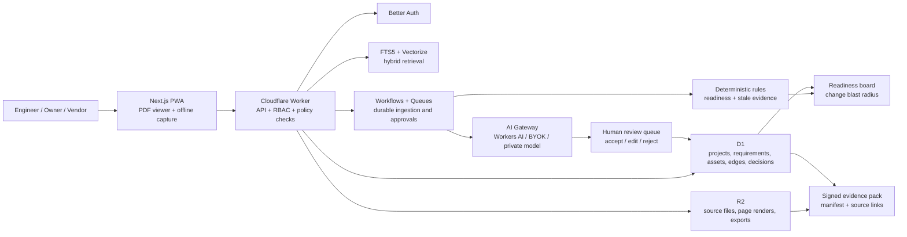

# Pramana Cx: Production Product Blueprint

**Tagline:** Every commissioning claim, proven.

**Decision date:** 13 July 2026

**Evidence window:** January-June 2026, with source checks through 13 July 2026

**Product scope:** Data-centre EPC quality, commissioning readiness, and turnover assurance

**Team assumption:** 1-3 product engineers, eight weeks to a pilot-ready release

## Executive Summary

Do not build a five-agent "EPC intelligence platform" in version one. Build **Pramana Cx**, a narrow commissioning-readiness product that converts project requirements, asset registers, submittals, checklists, test results, and issues into a traceable evidence graph. For every asset and commissioning gate, it answers three defensible questions: **what is required, what proves it, and what is still blocking acceptance?** Its first paid outcome is a continuously updated L3/L4/L5 readiness board and an audit-ready turnover pack, not another document chatbot.

This wedge is timely and commercially credible. JLL reported 1,123 MW of Indian capacity in H1 2025 and projected about 2,073 MW by end-2027; Deloitte's April 2026 outlook is more aggressive, projecting roughly 10 GW by 2030. Turner & Townsend separately reports that 94% of surveyed respondents see shortages of experienced data-centre construction teams. The market is expanding while the scarce expertise needed to verify delivery is not. Pramana Cx makes that expertise repeatable without pretending AI can certify a facility or replace the engineer of record.

The MVP can run at **$0 platform cost** within published Cloudflare free allowances, using a commercial-friendly open-source application stack and metered open models. Free users receive one genuinely useful pilot project; paid projects fund model usage and support. The durable moat is not an LLM or a vector database. It is the customer-validated requirement/evidence graph, the history of human decisions, repeatable test templates, and measured project outcomes.

## Research Findings

### Reality Check on the Challenge Brief

The opportunity is real, but two headline statistics in the challenge should not be repeated as facts:

- The cited "900 MW in 2024 to 2,700 MW by 2027" does not match the current JLL material located. [JLL's April 2025 release](https://www.jll.com/en-in/newsroom/indias-data-centre-capacity-to-reach-18-gw-by-2027) says India passed 1 GW in 2024 and projects 1.8 GW by 2027. [JLL's H1 2025 report](https://www.jll.com/en-in/insights/market-dynamics/india-data-centers) reports 1,123 MW and projects 2,073 MW by end-2027.
- The stated Turner & Townsend result that "67% of APAC projects overran by more than 10%" could not be substantiated in a primary source during this review. It is excluded from the product pitch. Turner & Townsend does support a different, useful claim: [94% of respondents reported a shortage of experienced teams](https://www.turnerandtownsend.com/insights/delivering-data-centres-in-an-ai-driven-world/).
- The upside case is stronger after 2027. [Deloitte's 2026 TMT outlook](https://www.deloitte.com/in/en/about/press-room/beyond-ai-hype-india-scales-compute-and-semiconductors-tmt-predictions-2026-pr.html) projects India growing from about 1.5 GW in 2025 to about 10 GW in 2030, with facility build costs of US$5.5-8.0 million per MW. [ICRA](https://www.icra.in/Research/ViewResearchReport/india-s-digital-backbone-to-strengthen-with-rs-90-000-crore-data-centre-impetus-during-fy2026-fy2028/6543) projects 2.4-2.5 GW by FY2028 and Rs. 90,000 crore of investment during FY2026-FY2028.
- Policy is a tailwind. India's [2026-27 budget announcement](https://www.pib.gov.in/PressNoteDetails.aspx?ModuleId=3&NoteId=157352&id=157352&lang=2&reg=48) includes a tax holiday through 2047 for eligible foreign cloud providers using India-based data-centre infrastructure.

**Conclusion:** use sourced ranges, not a single heroic forecast. The product thesis does not depend on the disputed numbers.

### Verified Hackathon and Launch Patterns

The request to review "all" global hackathon winners is not auditable: there is no complete registry, and several events in the supplied list have no authoritative winner or stack publication. The following representative, verifiable sample is sufficient to extract product patterns without manufacturing details.

Search coverage included official announcements, GitHub projects, Product Hunt launches, Hacker News results, Reddit practitioner threads, venture reports, company releases, and publicly indexed X results. Public X search did not produce sufficiently attributable EPC evidence, so no product claim depends on an X post. Company and investor claims are treated as directional until confirmed by customers or independent benchmarks.

| Evidence | What won or launched | Transferable lesson for Pramana Cx |
|---|---|---|
| [GitLab AI Hackathon, Apr 2026](https://about.gitlab.com/blog/gitlab-ai-hackathon-2026-meet-the-winners/) | LORE used eight routed agents, a knowledge graph, loop protection, a visual dashboard, carbon tracking, and 43 tests. Other winners emphasized explainable actions and human escalation. | Judges rewarded a finished workflow, visible reasoning, safeguards, and tests. The number of agents was not the moat. |
| [AI for Bharat winners, Jun 2026](https://yourstory.com/2026/06/crop-insurance-conversational-analytics-ai-for-bharat-hackathon) | BimaSathi used multilingual, low-friction insurance workflows; Content Room and SocraticDev targeted concrete user outcomes rather than generic chat. | Meet Indian users in their actual workflow; accessibility and operational specificity beat a broad assistant. |
| [Qdrant Vector Space 2026 winners](https://www.linkedin.com/posts/neilkanungo_for-the-moment-so-many-have-been-waiting-activity-7470988246500585472-6gYI) | Memory Atlas, Crowd Whisperer, and Synthara used vector state as a product mechanic, not merely as chat retrieval. | Retrieval should drive readiness, recommendations, and change impact, not exist as a chat demo. |
| [Agentic Document Extraction, Product Hunt Jun 2026](https://www.producthunt.com/products/agentic-document-extraction) | Source-cited JSON, field confidence, and bounding-box provenance. | Visual provenance and confidence are becoming table stakes in serious document AI. |
| [GitLab's runner-up DocSync](https://about.gitlab.com/blog/gitlab-ai-hackathon-2026-meet-the-winners/) | Detector, writer, and reviewer roles opened a change only when confidence was sufficient; otherwise they escalated. | Human escalation is a feature. High-stakes ambiguity must be represented, not hidden. |

Five patterns recur:

1. **Workflow beats chatbot.** Winning systems observe an event, do bounded work, and create a reviewable artifact.
2. **Proof beats fluency.** Citations, explanations, tests, confidence, and replayable traces matter more than polished prose.
3. **Structured memory beats chat history.** Graphs and typed state preserve relationships and decisions.
4. **Human authority remains explicit.** The strongest systems know when to stop and request judgment.
5. **Narrow distribution beats generic reach.** WhatsApp, code review, and existing operational interfaces reduce adoption friction.

### Technology Trends That Matter

- **Document parsing has become modular.** [Docling](https://github.com/docling-project/docling) is an active MIT-licensed parsing stack, while [PP-OCRv6](https://huggingface.co/blog/PaddlePaddle/pp-ocrv6) added compact 50-language OCR in June 2026. Use these in the self-hosted enterprise profile, not as mandatory SaaS infrastructure.
- **Layout is often more valuable than larger models.** The March 2026 [VAREX benchmark](https://arxiv.org/abs/2603.15118) found that layout-preserving text improved extraction by 3-18 percentage points and that small-model structured-output failures can dominate error rates. Preserve page coordinates and validate every model response against a schema.
- **Open OCR still degrades on photographed and non-Latin material.** [MDPBench](https://arxiv.org/abs/2603.28130) reports significant drops on photographed documents and non-Latin scripts. A phone photograph must never silently become authoritative evidence.
- **Durability is replacing agent theatre.** Cloudflare Workflows became a practical serverless durable execution option, while Temporal and DBOS integrations are maturing. For this product, typed deterministic workflows plus model calls are safer and cheaper than CrewAI-style autonomous collaboration.
- **Free infrastructure changed materially in Q1-Q2 2026.** [Cloudflare Queues joined the free plan](https://developers.cloudflare.com/changelog/post/2026-02-04-queues-free-plan/), Vectorize expanded to [10 million vectors per index](https://developers.cloudflare.com/changelog/post/2026-01-23-increased-index-capacity/), and Workflows now supports long-running, resumable pipelines.

### Market Needs and Competitive Gap

Capital confirms that this is an active category, but also warns against a broad pitch. In Q1-Q2 2026, drawing intelligence company [Primepoint announced a US$10 million seed round](https://www.globenewswire.com/news-release/2026/04/13/3272943/0/en/Primepoint-Closes-10M-Seed-Round-to-Advance-Intelligence-Platform-that-Reads-and-Understands-Construction-Drawings.html), [ProcurePro announced US$11 million](https://procurepro.co/news/capital-raise-2026) for construction procurement intelligence, [Foresight announced a US$25 million Series A](https://www.globenewswire.com/news-release/2026/03/18/3258175/0/en/foresight-raises-us25-million-to-close-the-execution-gap-in-the-global-infrastructure-supercycle.html) for infrastructure delivery, and [MeltPlan announced US$14 million](https://www.meltplan.com/blogs/we-raised-14-million-to-build-the-planning-engine-for-construction) for preconstruction decisions. The common asset is structured, proprietary workflow data, not access to a model. [a16z's 2026 industrial thesis](https://a16z.com/podcast/big-ideas-2026-physical-ai-and-the-industrial-stack/) reaches the same conclusion: physical-world products shift advantage toward reliability, end-to-end systems, and data.

The obvious features are already crowded:

| Category | Current products | What is already commoditizing | Remaining gap |
|---|---|---|---|
| Commissioning management | [CxAlloy](https://go.cxalloy.com/welcome), [Facility Grid](https://facilitygrid.com/commissioning-management/) | Checklists, assets, issues, status, turnover reports | Explainable cross-document readiness and change impact |
| AI submittal review | [Helonic](https://helonic.com/features/submittal-review), [PunchFlo](https://punchflo.com/), [BuildSync](https://buildsync.ai/), [SpecSure](https://specsure.build/) | Requirement extraction and pass/fail/attention matrices | Trace from procurement decision through asset, test, and final evidence |
| Schedule intelligence | [nPlan](https://www.nplan.io/) | Risk forecasts trained on 750,000 historical schedules | A greenfield startup cannot credibly reproduce this data moat |
| Project knowledge | RAG assistants and construction copilots | Cited answers across project documents | Answers do not prove gate readiness or assign evidence ownership |
| Drawing knowledge graphs | [Primepoint](https://primepoint.ai/) | Tag-level drawing intelligence, cross-document links, traceable findings | Avoid competing on broad drawing understanding in MVP |
| Broad project graphs | [LinesLogic](https://lineslogic.com/) | Claims document/model mapping, revisions, procurement, commissioning readiness, and cited answers | Direct overlap; Pramana must own test authority, signed gate evidence, and commissioning depth |
| Mission-critical AI | [Four Knots](https://fourknots.com/) and specialist services | Script assistance, conflict checking, readiness concepts | India-first, freemium, offline-capable, evidence acceptance workflow |

Community signal aligns with the competitive map. In a January 2026 [r/ConstructionManagers discussion](https://www.reddit.com/r/ConstructionManagers/comments/1q8kkk3/new_to_construction_why_are_submittals_such_a/), practitioners described submittals as project-specific, repetitive, interdependent, and painful. The important word is **interdependent**: another PDF summarizer does not solve the handoff from requirement to procurement to test to turnover.

### Standards and Legal Constraints

- TIA explicitly warns that online copies not acquired through TIA or its distributor violate copyright and may be inaccurate. Use only customer-licensed standards and never ship TIA-942 text in prompts, embeddings, demo data, or model training. See [TIA-942 certification guidance](https://tiaonline.org/products-and-services/tia942certification/).
- Uptime Institute's Tier Standard and certification are proprietary. Pramana Cx may manage customer-provided criteria and evidence; it must not claim to issue, predict, or substitute for [Uptime Tier Certification](https://uptimeinstitute.com/tier-certification).
- India's DPDP Rules were notified in November 2025, with obligations phased in. The official [MeitY rules page](https://www.meity.gov.in/documents/act-and-policies/digital-personal-data-protection-rules-2025-gDOxUjMtQWa) and [commencement notification](https://www.meity.gov.in/static/uploads/2025/11/c56ceae6c383460ca69577428d36828b.pdf) are the sources of truth. Build deletion, purpose limitation, breach workflow, retention controls, and processor contracts now; obtain legal review before launch.

## Concept Generation and Selection

Scores are out of 10; total is out of 70.

| Concept | Impact | Novelty | Feasibility | Monetization | Market | Defensibility | Surprise | Total |
|---|---:|---:|---:|---:|---:|---:|---:|---:|
| **Pramana Cx:** commissioning evidence graph and readiness gates | 9 | 7 | 8 | 9 | 8 | 9 | 9 | **59** |
| **SpecShield:** procurement deviation firewall for long-lead MEP equipment | 8 | 6 | 9 | 8 | 8 | 7 | 7 | **53** |
| **SiteSakhi:** multilingual offline field quality capture from voice, photo, and QR | 8 | 8 | 7 | 7 | 8 | 7 | 8 | **53** |

### Why Pramana Cx Wins

Pramana Cx owns the moment where schedule, quality, procurement, and documentation converge: the next commissioning gate. It can deliver value from one project's documents without a historical training corpus, its output is visibly auditable in a hackathon demo, and every approved mapping improves a project-specific data asset. Its novelty is not the graph itself; Primepoint and LinesLogic show that graphs are becoming competitive infrastructure. The wedge is controlled commissioning evidence, test authority, signed gate decisions, and India-ready delivery. SpecShield is a strong second module but enters a crowded submittal market. SiteSakhi is a useful acquisition surface but depends on field adoption before it proves ROI.

## Recommended Product Concept

### Product and Positioning

**Pramana Cx** is the evidence control plane for mission-critical commissioning.

It is not the system that certifies the facility. It is the system that shows the authorized engineer exactly why an asset or system is, or is not, ready for the next gate.

### Target Users

| Persona | Job to be done | Buying motive |
|---|---|---|
| Commissioning manager / CxA | Prove L3-L5 readiness and assemble accepted records | Fewer failed tests and less turnover chasing |
| Owner's representative | See whether claimed progress is evidence-backed | Protect go-live date and audit position |
| EPC / GC MEP package manager | Close missing submittals, inspections, and test prerequisites | Avoid blocked work fronts and rework |
| QA/QC lead | Enforce ITPs, NCR closure, and sign-off authority | Consistent quality trail across contractors |
| Operations readiness lead | Receive a usable asset/evidence handover | Faster transition from project to operations |

### Core User Journey

1. Create a project and upload the owner's requirements, approved specifications, asset register, responsibility matrix, test scripts, and current issue log.
2. The ingestion workflow preserves document versions, extracts source-located clauses and tables, and proposes typed requirements.
3. A commissioning engineer accepts, edits, or rejects proposed requirements. Accepted requirements become controlled project records.
4. The system maps requirements to systems, assets, commissioning gates, evidence types, responsible parties, and predecessor requirements.
5. New submittals, checklists, measurements, photos, and approvals attach as evidence. The rules engine computes readiness; AI only explains or proposes mappings.
6. A change to a specification, submittal, asset, or test result triggers a blast-radius view showing affected gates and previously accepted evidence.
7. The authorized reviewer signs the gate decision. Pramana Cx exports a hash-manifested turnover pack with every claim linked to source evidence and decision history.

### The MVP's One Thing

Given a system or commissioning gate, produce a **defensible readiness score with a complete list of missing, stale, failed, and unapproved evidence, each linked to its source and owner**.

### MVP Scope

**Must ship:**

- Project and role management with tenant isolation
- PDF, CSV, XLSX, image, and email-export ingestion
- Versioned documents with page/bounding-box citations and content hashes
- Requirement extraction with structured validation and human acceptance
- Asset/system/gate/evidence graph
- Readiness rules and red/amber/green board
- Change detection for revised documents and stale-evidence propagation
- Issues, assignments, due dates, comments, and approvals
- Evidence pack export with manifest and immutable audit events
- CSV templates for P6/MS Project milestones, asset registers, and issue logs
- Responsive PWA with offline evidence capture queue

**Wait for v2:**

- Native Primavera P6 XER write-back
- Procore and Autodesk Construction Cloud OAuth integrations
- BMS/EPMS live telemetry and automated time-series test validation
- Advanced drawing geometry comparison
- Portfolio schedule forecasting
- WhatsApp capture
- Fine-tuned models
- Blockchain notarization

## What We Are Actually Building

Pramana Cx is a **responsive web application and installable PWA**, not a chatbot and not a collection of disconnected AI agents. The main interface is a commissioning control room: a project dashboard, a source-document workspace, a human review queue, a system/gate readiness view, field evidence capture, change impact, and turnover export.

The first complete pilot supports one project, one electrical or cooling system, and one commissioning gate. A user must be able to move through this full loop without leaving the product:

1. Create a project and assign roles.
2. Upload specifications, an asset register, a test procedure, and an issue log.
3. Review AI-extracted requirement proposals against the exact source page.
4. Link accepted requirements to a system, assets, gate, tests, and required evidence.
5. Capture evidence, record test outcomes, and assign unresolved blockers.
6. See rules-based readiness and the reason for every red, amber, unknown, or ready state.
7. Upload a revised source and see which evidence and decisions became stale.
8. Record an authorized gate decision.
9. Generate and verify a turnover evidence pack.

### Frontend Information Architecture

The desktop layout uses a persistent left navigation rail, project switcher, page header, and contextual right-side detail drawer. On mobile, the rail becomes a bottom navigation plus a `More` sheet. Dense tables become filterable card lists; critical actions remain reachable with one thumb.

| Navigation item | What it opens | Primary users |
|---|---|---|
| **Overview** | Project health, gate readiness, urgent blockers, stale evidence, pending reviews | Everyone |
| **Sources** | Documents, versions, imports, processing status, and source viewer | Commissioning engineer, QA/QC |
| **Requirements** | AI proposal review queue and accepted requirement register | Reviewer, commissioning engineer |
| **Systems** | System, asset, and gate hierarchy | Cx manager, MEP manager |
| **Readiness** | Gate matrix, evidence coverage, blockers, and approval state | Cx manager, owner representative |
| **Actions** | Findings, NCR-like issues, assignments, comments, and due dates | QA/QC, MEP manager, field engineer |
| **Field Capture** | Offline-capable evidence and test-result capture | Field engineer |
| **Changes** | Revision comparison and downstream blast radius | Reviewer, QA/QC |
| **Turnover** | Evidence-pack preview, generation, download, and verification | Cx manager, operations readiness |
| **Audit & Settings** | Members, roles, gate rules, document precedence, audit trail, retention | Project admin, approver |

### Global Application Shell

Every authenticated screen contains:

- **Project switcher:** shows the active project and prevents cross-project actions.
- **Global search:** searches exact tags, clause numbers, assets, findings, and source text; results always show their project and source.
- **Sync indicator:** `Online`, `Offline`, `3 pending`, `Syncing`, or `Sync failed`.
- **Notifications button:** opens assignments, overdue actions, failed jobs, review requests, and approval requests.
- **Help / keyboard shortcuts button:** opens task-specific guidance without hiding the current record.
- **User menu:** profile, TOTP setup, organization switch, and sign out.
- **Context drawer:** opens the selected source, evidence, asset, finding, or audit history without losing table filters.

No global button can silently alter readiness. Every state-changing action shows the affected record, required authority, and resulting audit event.

### Screen 1: Sign In and Project Selection

**Purpose:** Authenticate the user and establish the tenant/project boundary before any data is loaded.

**Visible UI:** email magic-link form, TOTP challenge for approvers, recent projects, project role, last activity, and an empty state for first-time users.

**Buttons and actions:**

| Button | Result |
|---|---|
| `Send magic link` | Sends a single-use login link and shows delivery status. |
| `Verify code` | Completes TOTP verification for protected approval actions. |
| `Open project` | Loads the selected project's Overview page. |
| `Create project` | Opens the guided project setup flow for authorized users. |
| `Request access` | Sends a request to the project administrator; it does not grant access automatically. |

### Screen 2: Guided Project Setup

**Purpose:** Create the minimum controlled workspace needed for reliable readiness.

The setup is a five-step wizard:

1. **Project details:** name, code, timezone, location, and retention period.
2. **System and gate:** choose electrical/cooling, name the first system, and define L3/L4/L5 or a custom gate.
3. **Authority:** assign project administrator, requirement reviewer, evidence owners, and gate approver.
4. **Document precedence:** rank owner's requirements, approved specifications, submittals, procedures, and field records.
5. **Import data:** upload sources now or continue to an empty workspace.

**Buttons:** `Back`, `Save draft`, `Continue`, `Invite member`, `Remove member`, `Add precedence rule`, `Upload now`, and `Create project`.

`Create project` stays disabled until the project has a name, timezone, one system, one gate, and one project administrator. The UI lists missing setup items instead of failing after submission.

### Screen 3: Project Overview

**Purpose:** Tell the team what needs attention now, not just how many records exist.

**Top summary cards:**

- Gate readiness: `READY`, `BLOCKED`, `IN REVIEW`, or `UNKNOWN`.
- Evidence coverage: accepted mandatory evidence / total mandatory evidence.
- Open blockers: critical, high, overdue, and unassigned.
- Stale evidence: count created by document or asset revisions.
- Pending human reviews: requirements, evidence, and decision requests.
- Latest turnover pack: generated time, baseline hash, and verification state.

**Main panels:** gate readiness timeline, top blockers by owner, recent changes, processing jobs, and activity feed.

**Primary buttons:** `Upload sources`, `Import asset register`, `Review requirements`, `Open readiness board`, `Add evidence`, `Record test result`, `Create action`, and `Generate turnover pack`.

Each card is clickable and opens its filtered underlying records. There is no decorative AI score with no explanation.

### Screen 4: Sources and Imports

**Purpose:** Control every file and structured import that may support a readiness claim.

**Visible UI:** source table with title, type, revision, authority status, effective date, uploader, processing state, page count, hash, and superseded-by relationship. Filters cover source type, status, revision, processing failure, and date.

**Primary buttons:**

| Button | Result |
|---|---|
| `Upload sources` | Opens multi-file upload for PDF, XLSX, CSV, image, and email export. |
| `Import asset register` | Opens column mapping and row-validation preview before import. |
| `Import issue log` | Imports controlled actions/findings with an error report for invalid rows. |
| `Download CSV template` | Downloads the supported asset, milestone, or issue schema. |
| `Add revision` | Uploads a new version against an existing logical document. |
| `Compare revisions` | Opens changed pages, clauses, tables, and downstream impact. |
| `View source` | Opens the source viewer at page one. |
| `Retry processing` | Re-runs a failed idempotent ingestion job. |
| `Archive` | Removes a source from active lists but preserves its audit history. |

The upload drawer requires document type, revision, effective date, and authority state. A duplicate SHA-256 hash produces `Already uploaded` and links to the existing record instead of creating another source.

### Screen 5: Source Viewer

**Purpose:** Let a skeptical engineer verify every extracted claim against the original file.

**Layout:** document pages on the left; extracted regions, requirements, linked assets, and history on the right. Selecting a requirement scrolls to and highlights its exact page region. Tables retain row and column coordinates where extraction supports them.

**Buttons:** `Previous match`, `Next match`, `Zoom`, `Rotate`, `Open original`, `Copy citation`, `Create requirement`, `Report extraction issue`, and `View revision history`.

`Create requirement` pre-fills the highlighted source text but still requires a reviewer to define modality, value, unit, tolerance, and applicability before acceptance.

### Screen 6: Requirement Review Queue

**Purpose:** Convert AI extraction into controlled project requirements through explicit human judgment.

**Queue columns:** source, clause, proposed statement, system/asset match, confidence, value/unit validation, duplicate warning, reviewer, and age.

Selecting a row opens a split view with the source region, proposed structured fields, similar accepted requirements, and affected gate preview.

**Buttons and rules:**

| Button | Who can use it | Result |
|---|---|---|
| `Accept` | Reviewer | Makes the requirement eligible for readiness after required links are complete. |
| `Accept & next` | Reviewer | Saves and opens the next proposal without losing filters. |
| `Edit proposal` | Reviewer | Opens typed fields for statement, modality, value, unit, tolerance, and applicability. |
| `Reject` | Reviewer | Requires a reason and preserves the proposal for audit/evaluation. |
| `Mark duplicate` | Reviewer | Links the proposal to the controlled requirement it duplicates. |
| `Assign reviewer` | Commissioning manager | Changes ownership and due date. |
| `Open source` | Any project member | Opens the exact cited region. |
| `Bulk reject exact duplicates` | Reviewer | Acts only on hash/text-exact duplicates after confirmation. |

There is deliberately no `Accept all AI suggestions` button.

### Screen 7: Systems, Assets, and Gates

**Purpose:** Show the physical and commissioning hierarchy that evidence applies to.

**Layout:** expandable system tree on the left, asset/gate table in the centre, selected item detail drawer on the right. Asset rows show tag, type, vendor, serial, installation state, test state, evidence coverage, open findings, and gate impact.

**Buttons:** `Add system`, `Add asset`, `Import assets`, `Add custom gate`, `Link requirement`, `Attach evidence`, `Open QR label`, `Export filtered CSV`, and `View readiness`.

The `Open QR label` action creates a project-scoped deep link for field capture; scanning it never bypasses sign-in or project authorization.

### Screen 8: Readiness Board and Gate Detail

**Purpose:** Provide the product's core answer: what is required, what proves it, and what blocks acceptance.

**Readiness Board:** rows are systems/assets, columns are configured gates, and each cell displays one state:

- **Green / Ready:** every deterministic condition is satisfied for the current baseline.
- **Red / Blocked:** a failed test, blocking finding, or mandatory prerequisite prevents readiness.
- **Amber / In review:** required evidence exists but is pending authorized review or approval.
- **Grey / Unknown:** the source, mapping, precedence, or required evidence is incomplete.
- **Blue / Approved:** an authorized decision exists for the current evidence baseline.
- **Striped / Stale:** a later change invalidated evidence or a prior decision baseline.

Opening a cell shows sections for `Requirements`, `Evidence`, `Tests`, `Blockers`, `Prerequisite gates`, `Approvals`, and `History`. Each failed condition has an owner, source, due date, and next action.

**Buttons:** `View source`, `Add evidence`, `Record test result`, `Create blocker`, `Assign owner`, `Request review`, `Request gate approval`, `Compare baseline`, `Export gate report`, and `Refresh status`.

`Refresh status` reruns deterministic rules only. It cannot turn a missing human approval into green.

### Screen 9: Actions and Findings

**Purpose:** Turn readiness gaps into accountable work.

**Visible UI:** list/Kanban toggle; filters for severity, state, system, gate, owner, contractor, due date, and stale status. Finding detail includes description, linked requirements/evidence, source citations, comments, files, disposition history, and audit events.

**Buttons:** `Create action`, `Assign owner`, `Set due date`, `Add comment`, `Attach evidence`, `Link requirement`, `Mark ready for review`, `Accept resolution`, `Reject resolution`, and `Reopen`.

Only an authorized reviewer can use `Accept resolution`. The system does not expose an AI-driven `Close NCR` action.

### Screen 10: Field Capture and Test Run

**Purpose:** Capture usable evidence where the work happens, including with intermittent connectivity.

**Visible UI:** asset/gate selector, QR scan, evidence type, photo/file capture, measurement with unit, observation, test step list, instrument/calibration reference, timestamp, and sync state.

**Buttons:** `Scan QR`, `Take photo`, `Choose file`, `Add measurement`, `Save offline`, `Submit evidence`, `Start test`, `Save step`, `Mark step pass`, `Mark step fail`, `Add witness`, `Complete test`, and `Retry sync`.

Failed test steps require a note and may create a blocker. `Complete test` remains disabled until all mandatory steps have a result and the required witness/instrument fields are present. Offline records are labelled `Pending sync` and never count as accepted evidence until the server validates them.

### Screen 11: Change Blast Radius

**Purpose:** Show what a revision invalidates before the project relies on stale evidence.

**Layout:** old/new source comparison on the left and an impact tree on the right: changed clause -> requirement -> asset/system -> test/evidence -> gate -> decision. The screen distinguishes directly changed records from inferred downstream impact.

**Buttons:** `Open old source`, `Open new source`, `Accept change`, `Keep existing interpretation`, `Mark evidence stale`, `Request reassessment`, `Assign affected items`, and `Export impact report`.

`Keep existing interpretation` requires a reason and approval authority; it does not erase the changed source. A previous gate approval remains visible but is marked stale when its evidence baseline changes.

### Screen 12: Gate Approval

**Purpose:** Record the authorized engineering decision after the rules engine and human reviews are complete.

**Visible UI:** gate state, current evidence baseline hash, unresolved blockers, stale items, passed tests, prior decisions, approval authority, and mandatory reason field.

**Buttons:** `Approve gate`, `Reject gate`, `Record waiver`, `Return for rework`, `View evidence baseline`, and `Verify TOTP`.

`Approve gate` is disabled when deterministic blockers remain, the user lacks the approval role, TOTP is not verified, or the displayed baseline is no longer current. `Record waiver` requires a reason, scope, expiry/review condition, and linked authority; it does not edit the underlying failed requirement.

### Screen 13: Turnover Pack and Manifest Verification

**Purpose:** Produce a handover artifact whose contents and decisions can be checked independently.

**Pack preview:** project/system/gate scope, included documents and revisions, accepted requirements, evidence, tests, findings/dispositions, decisions, audit history, rule/model versions, and excluded/missing items.

**Buttons:** `Generate pack`, `Cancel job`, `Download PDF`, `Download evidence ZIP`, `Copy manifest hash`, `Verify manifest`, `Regenerate from latest baseline`, and `Share expiring link`.

Generation runs asynchronously. The UI displays `Queued`, `Collecting evidence`, `Building manifest`, `Rendering`, `Complete`, or `Failed`. A pack generated from an older baseline remains downloadable but is visibly labelled `Superseded`.

### Screen 14: Audit, Members, and Project Settings

**Purpose:** Make authority, configuration, and history inspectable.

**Tabs:** `Members & roles`, `Gate rules`, `Document precedence`, `Evidence types`, `Notifications`, `Retention`, `Integrations`, and `Audit log`.

**Buttons:** `Invite member`, `Change role`, `Revoke access`, `Require TOTP`, `Add readiness rule`, `Test rule`, `Publish rule version`, `Add precedence rule`, `Export audit log`, and `Request project deletion`.

Published readiness-rule versions are immutable. Editing creates a draft version; `Publish rule version` shows which gates will be recalculated and requires confirmation.

### Role Permissions Visible in the Frontend

| Role | Can do | Cannot do |
|---|---|---|
| Project administrator | Configure project, members, roles, rules, retention, and imports | Approve a gate unless separately assigned as approver |
| Commissioning manager | Manage systems/gates, assignments, reviews, and approval requests | Override deterministic blockers or sign without authority |
| Requirement reviewer | Accept/edit/reject requirement proposals and reassess changes | Approve a gate by virtue of review access alone |
| Field engineer | Capture evidence, execute assigned tests, comment on actions | Accept their own evidence or close findings |
| QA/QC lead | Create findings, review evidence, accept/reject resolutions | Alter original source files or erase audit history |
| Gate approver | Approve/reject/waive the current baseline after TOTP | Change evidence or source records during approval |
| Owner/operations viewer | Read readiness, sources, history, and packs | Modify controlled project records |

Disabled buttons show the missing permission or prerequisite on hover/tap. The UI does not merely hide authorization failures; the API independently enforces every permission.

### Required Frontend States

Every data screen ships with these states, not just the populated happy path:

- **Loading:** skeletons retain table/card shape; state-changing buttons stay disabled.
- **Empty:** explains what data is missing and provides the correct setup action.
- **Filtered empty:** shows active filters and a `Clear filters` button.
- **Error:** shows a request/job identifier and `Retry`; sensitive provider details remain hidden.
- **Offline:** shows cached read-only data, pending local writes, and the last successful sync time.
- **Conflict:** prevents overwrite and offers `Reload latest` plus a comparison of changed fields.
- **Access denied:** states the required role and offers `Request access` without revealing protected record data.
- **Superseded/stale:** keeps old records visible with a strong banner and link to the replacing version.
- **Unknown:** explicitly lists the missing source, mapping, rule, or authority; it is never styled as success.

### The Hackathon/Pilot Demo That Must Work

The polished demo uses a synthetic UPS commissioning package and takes five to seven minutes:

1. Open Overview and show the UPS L4 gate as `UNKNOWN` with three missing prerequisites.
2. Upload an approved specification, asset register, and test procedure.
3. Open one AI-proposed requirement, click `Open source`, then `Accept & next`.
4. Open the Readiness Board and show the gate move to `BLOCKED`, with one failed test and one missing witness signature.
5. Scan the UPS QR code in the mobile PWA, attach a photo/measurement, and complete the missing test step.
6. Upload a revised specification and show one previously accepted item become `STALE` in Change Blast Radius.
7. Resolve the reassessment, request approval, verify TOTP, and click `Approve gate`.
8. Generate the turnover pack, copy its manifest hash, and run `Verify manifest`.

If this complete path is not reliable, the MVP is not complete. Secondary analytics, chat, portfolio views, integrations, and visual polish do not compensate for a broken evidence-to-approval loop.

### Success Metrics

| Layer | Pilot acceptance threshold |
|---|---|
| Citation integrity | 100% of surfaced findings open the exact source page/region |
| Numerical extraction | >=98% exact match on the pilot's golden set of values and units |
| Requirement recall | >=90% on manually labelled clauses; unreviewed output never controls readiness |
| High-severity finding precision | >=90% on a blinded engineer-reviewed set |
| Operational outcome | >=60% less time to produce a weekly readiness report or evidence pack |
| Adoption | >=70% of assigned evidence tasks completed in-product during the pilot |
| Commercial | Two paid design partners or signed pilot-to-paid conversion criteria by week 8 |

## Complete Tech Stack

Pin exact patch versions in `pnpm-lock.yaml` at implementation kickoff and update through Renovate. These are the July 2026 major-version baselines, not an instruction to float production dependencies.

| Category | Recommendation | Why | Free starting allowance / trigger |
|---|---|---|---|
| Web application | Next.js 16.x, React 19.x, TypeScript, Tailwind CSS, Radix primitives | One TypeScript codebase, mature app patterns, strong PDF/dashboard ecosystem | Open source |
| Hosting and API | Cloudflare Workers via OpenNext; compatibility date pinned to deployment | Commercial use on free plan, edge delivery, no idle server | [100,000 requests/day; 10 ms CPU/invocation](https://developers.cloudflare.com/workers/platform/pricing/). Move to $5/month Paid before pilot SLA. |
| API gateway and rate limits | Worker middleware + Cloudflare WAF/rate limiting; OpenAPI-generated request validation | One authorization and tenancy boundary without a separate gateway bill | Included baseline controls; enterprise WAF features are paid |
| Relational data | Cloudflare D1 + Drizzle ORM; adjacency-list `edges` table | Scale-to-zero SQL, migrations in repo, enough graph traversal for MVP | [5M rows read/day, 100k written/day, 5 GB](https://developers.cloudflare.com/d1/platform/pricing/) |
| Cache | Browser cache + Cloudflare Cache API for immutable page renders; KV only for non-authoritative configuration | Reduces document and model traffic without introducing stale readiness state | Included within Workers plan limits |
| Object storage | Cloudflare R2 with signed upload/download routes | S3 API, no egress fee, lifecycle support | [10 GB-month, 1M writes, 10M reads](https://developers.cloudflare.com/r2/pricing/) |
| Vector retrieval | Cloudflare Vectorize, one multi-tenant index with project namespace; 768-dim embeddings | Keeps infrastructure small; metadata filters enforce project scope | [5M stored dimensions and 30M queried dimensions/month](https://developers.cloudflare.com/vectorize/platform/pricing/) |
| Lexical retrieval | D1 FTS5 index over normalized clauses, document chunks, assets, and issues | Exact tags, model numbers, clauses, and units often outperform semantic search | Included with D1 usage |
| Durable jobs | Cloudflare Workflows for ingestion and approval waits; Queues for fan-out | Retries, resumability, explicit human checkpoints, no agent framework | [3,000 workflow steps/day](https://developers.cloudflare.com/workflows/reference/pricing/); [10,000 queue operations/day](https://developers.cloudflare.com/changelog/post/2026-02-04-queues-free-plan/) |
| Authentication | Better Auth 1.7.x with D1, email magic links, organization roles, TOTP | Open source, first-class D1 support, avoids per-seat auth tax | Open source; email allowance below |
| Email | Resend | Simple transactional API and domain controls | [3,000 emails/month, max 100/day](https://resend.com/docs/knowledge-base/what-is-resend-pricing) |
| PDF/UI processing | PDF.js in browser; SheetJS community for tabular imports | Extract text and render page crops client-side, reducing server CPU and exposure | Open source |
| SaaS AI | Workers AI behind AI Gateway; Qwen3 embedding; low-cost text model for classification; pinned evaluated multimodal model only for hard pages | Serverless open models, usage visibility, provider abstraction | [10,000 neurons/day](https://developers.cloudflare.com/workers-ai/platform/pricing/). Free plan hard-stops; paid plan meters overage. |
| Self-hosted AI profile | Docling + PP-OCRv6; optional evaluated open VLM through vLLM | Required for private/VPC deployments and large batches | Software is open; customer supplies compute |
| Model portability | Internal `ModelProvider` interface with Workers AI, OpenAI-compatible, Gemini, and local adapters | Prevents model lock-in and permits customer BYOK | BYOK usage billed to customer |
| Observability | OpenTelemetry traces to Grafana Cloud or self-hosted stack; Sentry free plan for UI errors; structured audit logs in D1/R2 | Separate product audit evidence from operational telemetry | Start on free plans; retain an export path |
| Product analytics | PostHog with IP capture disabled and sensitive-field scrubbing | Feature adoption and funnel analysis without mixing customer content | Free allowance; self-host or disable for private tenants |
| Testing | Vitest, Playwright, MSW, axe-core, Schemathesis-style API contract tests | Fast unit tests plus real browser and accessibility coverage | Open source |
| CI/CD | GitHub Actions, CodeQL, Dependabot, Trivy, Gitleaks, Renovate | Security and release gates in the repo | Public repositories are effectively free; meter private-repo minutes |
| Payments | Razorpay Subscriptions for India; invoice-first enterprise sales | No fixed platform fee and familiar Indian methods | [No setup/AMC; transaction fee on success](https://razorpay.com/blog/razorpay-payment-gateway-pricing-explained/) |

### Why Not the Prompt's Suggested Stack

- **No LangGraph or CrewAI in MVP:** the workflow is known, high-stakes, and auditable. Normal typed code plus durable steps is easier to test and replay.
- **No Qdrant initially:** Vectorize plus FTS is enough for pilot scale and removes another service. Add Qdrant only for self-hosted enterprise deployments that require it.
- **No Neo4j initially:** the graph is mostly bounded traversals over project-scoped edges. D1 is adequate until measured query latency or edge volume proves otherwise.
- **No predictive schedule model:** without historical as-planned/as-built schedules, a "prediction" would be an LLM opinion. MVP exposes deterministic readiness risk and delayed prerequisites.
- **No single frontier-model dependency:** model versions change faster than EPC projects. Every model is behind an eval-gated provider interface.

## Architecture



### Canonical Data Model

| Entity | Critical fields |
|---|---|
| `project` | tenant, code, timezone, retention policy, current baseline |
| `document` / `document_version` | type, revision, status, file hash, supersedes, effective date |
| `source_region` | version, page, bounding box, extracted text, image crop hash |
| `requirement` | normalized statement, modality, value, unit, tolerance, source region, review state |
| `system` / `asset` | tag, type, parent system, vendor, serial, package, status |
| `gate` | L1-L5/custom stage, entry criteria, authorized approver |
| `evidence` | type, source, asset/system, captured by, timestamp, hash, validity window |
| `test_procedure` / `test_step` / `test_run` | prerequisites, acceptance rule, measurement, result, instrument calibration reference |
| `edge` | typed relationship such as `REQUIRES`, `PROVES`, `BLOCKS`, `SUPERSEDES`, `AFFECTS` |
| `finding` | severity, rule/model version, sources, confidence, disposition, reviewer |
| `decision` | approve/reject/waive, authority, reason, signature metadata, timestamp |
| `audit_event` | actor, action, object, before/after hashes, previous event hash |

### Readiness Computation

Readiness is rules-based, not generated text:

```text
READY when:
  all mandatory requirements have accepted evidence
  AND no evidence is stale or superseded
  AND all prerequisite gates are approved
  AND no open blocking finding or NCR exists
  AND every required test passed under an authorized test run
  AND the approving role has signed the gate decision
```

The model may propose requirement mappings, classify evidence, summarize blockers, and draft actions. It cannot change `READY`, approve a waiver, close an NCR, or sign a test.

### Ingestion and Retrieval Pipeline

1. Virus-scan metadata, validate MIME/magic bytes, hash the original, and store it immutably in R2.
2. Detect duplicates and revisions before spending AI tokens.
3. Extract embedded text and coordinates client-side or in a private parser; OCR only pages that lack usable text.
4. Segment by page, heading, table, and clause while retaining exact source regions.
5. Extract typed candidates with JSON Schema; reject invalid units, missing source regions, and unsupported values.
6. Embed normalized chunks and index exact terms in FTS5.
7. Send requirement candidates to human review. Only accepted records enter readiness rules.
8. On a revision, diff source regions and reprocess changed pages only; mark downstream evidence stale where affected.

## Differentiating Features

### 1. Evidence Graph

Every requirement links to the asset, test step, measurement, issue, approval, and source that proves it. A readiness number can be expanded into its full chain of evidence. Competitors commonly store documents or tasks; the defensible asset is the reviewed relationship graph and decision history.

**Freemium:** graph and one gate are free; multi-gate templates, API access, and portfolio reuse are paid.

### 2. Change Blast Radius

When revision C replaces revision B, Pramana Cx identifies which requirements changed and marks dependent submittals, tests, evidence, and approvals as potentially stale. The reviewer sees "this 800 kVA UPS change affects these six tests and two accepted gates," not a generic document diff.

**Freemium:** revision diff is free; cross-system impact rules and bulk reassessment are paid.

### 3. Evidence Entropy

A hidden-risk score flags systems whose apparent completion depends on weak evidence: one document supporting too many claims, circular evidence, unsigned records, outdated revisions, missing calibration, low-confidence extraction, or a single overloaded approver. This exposes false confidence before IST.

**Freemium:** basic completeness is free; portfolio benchmarks and configurable risk policies are paid.

### 4. Signed Turnover Manifest

Every export contains file hashes, record hashes, source locations, approval history, model/rule versions, and a Merkle root. Recipients can verify that the pack has not changed without adding a blockchain. This is useful for disputes, audits, and operations handover.

**Freemium:** watermarked manifest for a pilot; branded packs, API verification, and long-term retention are paid.

### 5. Teach-Back Mode

When a senior engineer changes an AI-proposed mapping or disposition, the system asks for a short reason and converts it into a project-scoped review rule or example. Junior engineers see precedent at the next similar decision. This turns scarce commissioning judgment into controlled organizational memory.

**Freemium:** capture decisions for one project; reusable organization libraries and analytics are paid.

### What Not to Build

- Do not market an autonomous certification agent or let AI approve compliance.
- Do not ingest pirated standards or imply endorsement by TIA, BICSI, or Uptime Institute.
- Do not build generic chat as the home screen; search is supporting infrastructure.
- Do not train a delay model without a labelled historical schedule corpus and a backtest.
- Do not start with shipment maps; geospatial visuals look impressive but do not solve commissioning evidence.
- Do not use blockchain for audit logs; content hashes and signed manifests are sufficient.
- Do not fine-tune a model before the review corrections provide a useful labelled dataset.
- Do not promise arbitrary CAD/BIM understanding in eight weeks.
- Do not force field teams into a new native app; ship an offline PWA and QR deep links first.
- Do not position a generic project knowledge graph as the differentiator; funded competitors already occupy it.

## Freemium Model and Unit Economics

### Plans

| Plan | Price | Included | Upgrade trigger |
|---|---:|---|---|
| Pilot | Rs. 0 | 1 project, 3 users, 250 pages/month, 250 assets, one active gate, 1 GB files, BYOK option | Team needs a real project, more evidence, or an unwatermarked export |
| Project | Rs. 19,900/project/month | 10 users, 5,000 pages/month, 5,000 assets, all gates, 20 GB, branded packs | More contractors, systems, integrations, or storage |
| Mission Critical | Rs. 59,900/project/month | 40 users, 25,000 assets, 100 GB, advanced policies, API, priority support | SSO, private deployment, portfolio governance |
| Enterprise | Rs. 12-40 lakh/year, scoped | SAML/SCIM, India/VPC/on-prem profile, custom retention, DPA/SLA, integrations, portfolio controls | Negotiated |

Pricing must be tested with buyers; it is a starting hypothesis, not market evidence. Avoid per-seat pricing for field contributors because it suppresses evidence capture. Charge for the active project, governed volume, integrations, and assurance level.

### Conversion Funnel

1. Offer a free "readiness diagnostic" on one system and one gate.
2. Show missing/stale evidence and export a watermarked report in the first session.
3. Convert when the team imports the full asset register or invites the fourth participant.
4. Expand from one electrical or cooling package to all L3-L5 systems.
5. Sell an organization template library and integrations after two successful projects.

### ARR Scenarios

| Scenario | Mix | Indicative ARR |
|---|---|---:|
| Design-partner year | 10 Project + 2 Mission Critical projects | Rs. 38.3 lakh |
| Repeatable India wedge | 40 Project + 10 Mission Critical projects | Rs. 1.67 crore |
| Portfolio foothold | 100 Project + 25 Mission Critical projects | Rs. 4.19 crore |

These are arithmetic scenarios, not a forecast. Do not present them as pipeline.

### Cost Controls

- Hash and deduplicate every page; process only changed pages on revision.
- Use embedded PDF text before OCR and layout-aware text before vision.
- Route exact rules first, small models second, expensive multimodal models only for uncertain pages.
- Cache extraction by content hash + schema version + model version.
- Store one vector per meaningful clause/table row, not arbitrary fixed-size chunks.
- Cap free usage hard; offer BYOK instead of subsidizing unbounded model calls.
- Move to Workers Paid at the first contractual pilot rather than designing around a 10 ms free CPU ceiling.

At MVP limits the platform can remain at $0 on a `workers.dev` domain. A commercial pilot should budget at least the $5 Workers Paid base, email/domain costs, model usage, and support. "Zero initial cost" is a launch tactic, not an enterprise architecture objective.

## Deployment and Operations

### Environments

| Environment | Purpose | Data |
|---|---|---|
| Local | Wrangler local services, mocked AI, synthetic documents | No customer data |
| Preview | Per-PR Worker and isolated D1/R2 fixtures | Synthetic/redacted only |
| Staging | Release candidate, migration rehearsal, golden-set evals | Licensed test corpus |
| Production | Multi-tenant service | Customer data under retention policy |

### CI/CD Pipeline

```text
Pull request
  -> format + lint + typecheck
  -> unit + policy + schema tests
  -> secret scan + dependency scan + CodeQL
  -> extraction golden-set evaluation and prompt-injection tests
  -> build OpenNext Worker
  -> deploy isolated preview
  -> Playwright smoke/accessibility tests
  -> reviewer approval
Merge to main
  -> backup + forward-only D1 migration on staging
  -> staging deploy + integration/eval suite
  -> signed release artifact
  -> production migration and canary deploy
  -> smoke tests + gradual traffic promotion
  -> automatic rollback of application version on health regression
```

Database migrations are forward-only. Destructive schema changes use expand/migrate/contract over at least two releases. D1 Time Travel provides [seven days on Free and 30 days on Paid](https://developers.cloudflare.com/d1/reference/time-travel/); schedule encrypted logical exports to R2 for longer retention and test restore quarterly.

### Production Readiness Gates

- SLOs defined: 99.9% paid API availability, p95 interactive API under 750 ms excluding AI jobs, and 99% ingestion completion within 10 minutes for supported documents.
- Central logs, traces, metrics, workflow failure alerts, AI cost/latency dashboards, and runbooks exist.
- Tenant isolation, object-level authorization, least-privilege service tokens, rate limits, and signed R2 URLs are tested.
- Originals and accepted evidence are immutable; replacements create new versions.
- Every model output records provider, model, prompt/schema version, sources, latency, cost, and reviewer outcome.
- Uploaded text is untrusted data. It cannot issue tool instructions, alter policy, approve records, or choose a tenant namespace.
- Golden-set evaluations gate model or prompt changes; no silent "latest model" aliases in production.
- Malware scanning, MIME validation, file limits, decompression-bomb defenses, and PII redaction are active.
- Backups, restore drills, incident response, breach notification, retention, deletion, and customer export procedures are tested.
- SBOM, dependency pinning, CodeQL, secret scanning, and image/container scanning are in CI.
- Accessibility reaches WCAG 2.2 AA for core workflows; field use is tested on low-end Android and intermittent networks.
- A lawyer reviews DPDP role allocation, DPA, privacy notice, retention schedule, standards licensing, liability language, and electronic-signature claims.

### Scaling Path

| Trigger | Change |
|---|---|
| First paid pilot | Workers Paid, custom domain, stronger alerting, 30-day workflow retention |
| >5 GB D1 or sustained scan-heavy queries | Optimize indexes; archive analytics to R2 SQL; evaluate managed PostgreSQL |
| >10 GB active files | R2 paid usage; lifecycle old renders and temporary page crops |
| >5M stored vector dimensions | Workers Paid Vectorize or customer-private vector store |
| Parsing exceeds edge CPU | Dedicated parser worker on a scale-to-zero container/job platform; keep originals in R2 |
| Enterprise residency/contract demand | India-region Postgres/S3-compatible storage, private model endpoint, SAML/SCIM, customer-managed keys |
| Graph traversals become a measured bottleneck | Introduce a graph read model; do not migrate pre-emptively |

## Eight-Week Build Plan

| Week | Milestone | Deliverables | Exit test |
|---:|---|---|---|
| 1 | Design partner and truth set | 8-10 interviews, two LOIs/pilot criteria, 50-page licensed/redacted corpus, schema, threat model, clickable flow | Two commissioning leads rank readiness evidence in their top three pains |
| 2 | Secure project foundation | Monorepo, auth/RBAC, tenant isolation, D1/R2, project setup, audit events, CI preview deploys | Cross-tenant security tests pass |
| 3 | Source-grounded ingestion | PDF/CSV/XLSX import, hashes, versions, page viewer, coordinates, workflow retries, FTS | 100% golden citations open correctly |
| 4 | Requirement control | Typed extraction, unit normalization, review queue, accepted requirement records, eval harness | Recall/precision baseline measured and published internally |
| 5 | Evidence graph | Assets, systems, gates, evidence, typed edges, readiness rules, blocker ownership | One real system computes readiness without model prose |
| 6 | Change impact and field capture | Revision diff, stale evidence, blast radius, responsive PWA, offline upload queue, QR deep links | Offline capture syncs without duplicate evidence |
| 7 | Turnover and hardening | Evidence manifest/export, approvals, notifications, rate limits, observability, backup/restore, prompt-injection suite | Engineer validates an exported gate pack end to end |
| 8 | Pilot and launch | Production deploy, onboarding, pricing gates, runbooks, demo dataset, ROI dashboard, pilot training | Two design partners complete agreed workflow; one paid conversion or written gap list |

### Team Allocation

- **Engineer 1:** product/full-stack, project controls, UI, integrations
- **Engineer 2:** ingestion, retrieval, extraction, evals, change detection
- **Engineer 3 or founder:** domain workflow, design-partner onboarding, QA, security/operations

If there is only one engineer, cut offline mode and spreadsheet variety before cutting provenance, review, or audit controls.

## Go-to-Market

### Initial Wedge

Sell to commissioning consultancies and owner's representatives working on Indian data-centre projects, beginning with one electrical system such as UPS/switchgear. They feel the evidence pain, can introduce the product without replacing the owner's common data environment, and can reuse templates across projects.

### Eight-Week Validation Offer

"Give us one approved specification set, asset register, and current test pack. In 48 hours we will return a source-linked readiness diagnostic showing missing, stale, and contradictory evidence. If your lead engineer cannot verify every finding in under two clicks, do not buy."

### Distribution

- Founder-led outreach to CxAs, QA/QC heads, owner's reps, and mission-critical MEP contractors in Mumbai, Chennai, Hyderabad, Bengaluru, and NCR.
- Partner with commissioning consultancies rather than trying to sell directly to hyperscalers first.
- Publish anonymized "readiness teardown" case studies with measured time saved and false-positive rate.
- Offer CSV/PDF interoperability so the pilot does not require replacing Procore, ACC, Aconex, CxAlloy, or P6.
- Use a synthetic but realistic public demo project; never use customer or copyrighted standards data in public demos.

### Pilot Questions That Must Be Answered

1. Who has authority to define gate readiness and sign acceptance on the target projects?
2. Which current artifact is trusted when the specification, submittal, test sheet, and issue log disagree?
3. What percentage of evidence arrives as PDFs, spreadsheets, photos, email, CxAlloy, Procore, ACC, or P6 exports?
4. Which single system caused the most recent failed or delayed test, and what evidence was missing?
5. Is the buyer willing to pay per project, per MW, per asset, or from a central quality budget?
6. Are SaaS processing and cross-border model APIs contractually allowed, or is a private deployment mandatory?
7. Which standards and project criteria are licensed for machine processing?
8. Does the working name **Pramana Cx** clear Indian and target-market trademark screening?

## Iterative Refinement

### Research Required Before Coding Beyond Week 1

- Observe two actual readiness meetings and one evidence-pack assembly session.
- Obtain a licensed/redacted golden set: requirements, accepted/rejected submittals, asset register, L3-L5 scripts, NCRs, and final evidence.
- Interview at least three commissioning authorities, three EPC/GC QA leads, two owners, and two operations handover leads.
- Map one project's approval authority and contractual document precedence.
- Run a paid-conversion test before building portfolio analytics.
- Benchmark PDF.js, Docling, PP-OCRv6, Workers AI, and one frontier VLM on the same project pages; select per page type, not by general leaderboard.
- Obtain counsel on standards licensing, customer-content model terms, DPDP processor obligations, retention, and liability.

### Kill or Pivot Criteria

Pivot to SpecShield if buyers say submittal approval, not commissioning readiness, controls budget and they will provide pre-site procurement documents. Pivot to SiteSakhi if the evidence exists but never reaches the system because field capture is the dominant failure. Stop if no buyer will provide a representative corpus, define acceptance authority, or pay for a bounded diagnostic; those are signs that the apparent pain is not yet purchasable.

### Final Product Principle

Pramana Cx should make uncertainty visible and engineering judgment faster. It must never turn uncertain project data into confident-looking certification language. In mission-critical construction, the winning AI product is not the one that sounds most autonomous; it is the one whose evidence a skeptical engineer can verify fastest.
